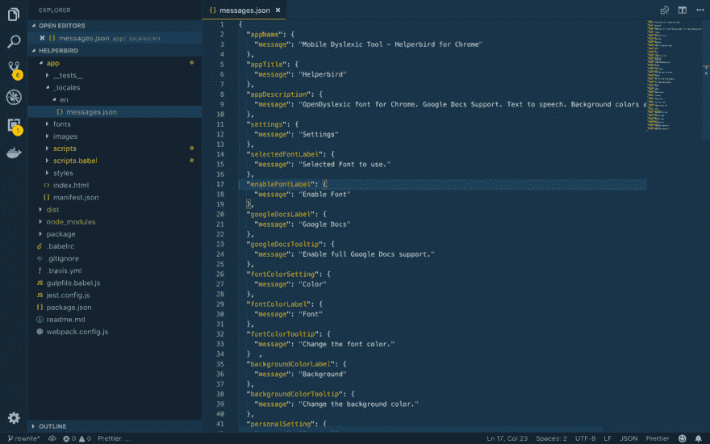
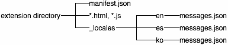

# 基于 Vue.js 的 Chrome 扩展中的本地化支持

> 原文：<https://dev.to/robertjgabriel/localization-support-in-your-vuejs-based-chrome-extension-436d>

当你想在其他市场发展你的应用或网站时，本地化是很重要的。最近，我给我的初创公司的产品 Helperbird 添加了本地化支持。如果你正在构建一个跨平台的 Chrome 应用程序，这是非常简单的。

### 入门

首先，要确保在项目目录中有一个名为 **"_locales"** 的文件夹。在这个文件夹中，你将有一个英语文件夹。要添加更多的语言，您将创建更多的文件夹，这些文件夹包含简写语言， **ES** 代表**西班牙语**等等。在每个语言文件夹中，您需要创建一个名为" **messages.json"** 的 JSON 文件

[](https://res.cloudinary.com/practicaldev/image/fetch/s--S3JUQHsj--/c_limit%2Cf_auto%2Cfl_progressive%2Cq_auto%2Cw_880/https://cdn-images-1.medium.com/max/1600/1%2AkqYYDL9TQSRggojq5xBDRQ.png)
messages . JSON 文件的内容。

正如你在上面的截图中看到的，我们有不同消息值的 JSON 对象。这些是我们将告诉浏览器在渲染时注入应用程序的英文字符串。因此，如果用户的浏览器和计算机设置为英语，它将使用这些字符串。密钥必须是唯一的。

### 设置您的应用

在 [Helperbird](https://www.helperbird.com) 中，我使用的是 Vue.js，我们将使用这个奇妙的 i18n Vue.js 插件，名为“[**vue-plugin-web extension-i18n**](https://www.npmjs.com/package/vue-plugin-webextension-i18n)”由~ [straybugs](https://www.npmjs.com/~straybugs) 。这将使我们能够完全支持所有浏览器，因为它使用 Chrome 原生 i18n 功能和 Firefox、IE 和 Safari 使用的 webExtension 功能。

#### 安装它

```
npm install vue-plugin-webextension-i18n — save_ 
```

#### 将它包含在你的应用程序中

```
import i18n from ‘vue-plugin-webextension-i18n’;  
Vue.use(i18n);_ 
```

#### 在 app 中使用

在您的 **messages.json** 文件中。你有了所有你想注入 app 的字符串。

```
{
"appName": {
"message": "Mobile Dyslexic Tool - Helperbird for Chrome"
},
"appTitle": {
"message": "Helperbird"
},
"appDescription": {
"message": "OpenDyslexic font for Chrome. Google Docs Support. Text to speech. Background colors and more."
}
} 
```

访问并将 **"appTitle"** 注入您的应用程序。对于在 javascript 函数或逻辑中，威尔会使用**这个。$i18n()** 来自我们安装的插件，这将为原生功能添加跨平台支持。

```
 enableDyslexica: function () {
  this.showSnackbar = true;
  this.popupMessage = this.i18n('appTitle');
  this.save('enabled', this.enable);
  this.reload();
} 
```

在模板部分，您必须执行以下操作。

```
<h3 class="md-title" style="flex: 1">{{ $i18n('appTitle') }}</h3> 
```

现在就这样，你只需要对应用程序中的所有字符串都这样做。现在，只需构建您的项目，它就可以工作，不需要任何其他东西。

### 整理完毕

一旦一个扩展或应用程序国际化了，翻译它就简单了。您复制 **messages.json** ，翻译它，并将副本放入 **_locales** 下的新目录中。例如，要支持西班牙语，只需将 **messages.json** 的翻译副本放在 **_locales/es** 下。下图显示了带有新西班牙语翻译的先前的扩展。

[](https://res.cloudinary.com/practicaldev/image/fetch/s--OuCt6lDA--/c_limit%2Cf_auto%2Cfl_progressive%2Cq_66%2Cw_880/https://cdn-images-1.medium.com/max/1600/1%2A1HTNimPBoRbVNIui8nE55w.gif)

同样需要注意的是，您可以使用任何受 [**支持的语言环境**](https://developer.chrome.com/extensions/i18n#overview-locales) 。如果您使用不支持的区域设置，浏览器将会忽略它。

我希望能得到这方面的反馈。你可以在 [Github](https://github.com/RobertJGabriel/) 和 [Twitter](https://www.twitter.com/RobertJGabriel) 关注我。