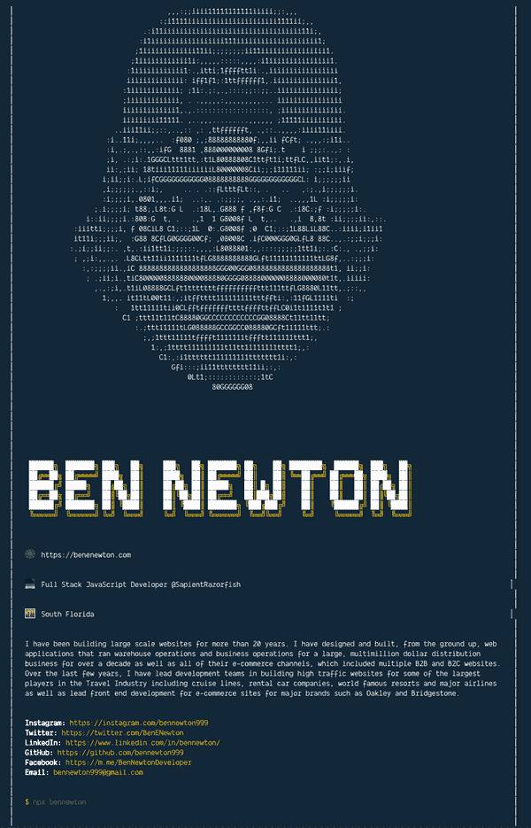

# 我对 NPM 名片的看法

> 原文：<https://dev.to/benenewton/my-take-on-the-npm-calling-card-3d74>

最初发布于[https://benenewton.com/npm-calling-card/](https://benenewton.com/npm-calling-card/)

我最近注意到一些 javascript 开发者的一个趋势，他们发布了一个简单的 [NPM](https://www.npmjs.com/) 包，用来分享他们的联系信息。我以前见过这个，但我不确定我先看到的是谁，我相信可能是[以利亚庄园](https://github.com/elijahmanor/elijahmanor)。在[上再次阅读了由](https://dev.to/wuz/setting-up-a-npx-username-card-1pip)[康林·德宾](https://dev.to/wuz)发布的之后，

[](/wuz) [## 设置“npx 用户名”卡！

### 康林·德宾 12 月 26 日 183 分钟阅读

#beginners #tutorial #javascript #node](/wuz/setting-up-a-npx-username-card-1pip)

我决定创造我自己的。

## 自己动手

你可以在 GitHub 上查看我的回购:

##  [本纽顿 999 ](https://github.com/bennewton999) / [本纽顿](https://github.com/bennewton999/bennewton)

### NPM 联系卡

<article class="markdown-body entry-content container-lg" itemprop="text">

# NPM 联系卡

[](https://camo.githubusercontent.com/f477de88fd823d8e3e0e26809736a29e7b364cf8/68747470733a2f2f696d672e736869656c64732e696f2f6e706d2f762f62656e6e6577746f6e2e7376673f7374796c653d666c61742d737175617265)

我对 NPX 我联系卡的看法。

跑- `npx bennewton`

要创建自己的库，请派生此 Repo 并更新 myData.js，将 ascii art 添加到 asciiArt.js，或将文件留空。更新后，作为您自己的新包发布到 npm。

</article>

[View on GitHub](https://github.com/bennewton999/bennewton)

要使它成为你自己的，你可以派生它，只需更新`myData.js`和`package.json`中的信息，然后作为新的 NPM 模块发布。或者你可以更进一步，用粉笔自定义文本输出，添加你自己的数据等等。我使用了带标签的模板文字，所以修改输出很容易。你可以在输出函数中添加一个类似`{red ${name}}`的修饰符来改变颜色和/或字体。

看在过去的份上，我还添加了一些 ascii 艺术(为什么不呢？？).我最初使用 [image-to-ascii](https://www.npmjs.com/package/image-to-ascii) 在我的网站上从一个. png 文件生成 ascii 艺术，然而它需要一个外部依赖 [GraphicsMagick](http://www.graphicsmagick.org/) 才能正常工作。所以我删除了它，并将输出复制到一个文件中。我不能保持这种发臭的颜色。我想知道如何保持文件中引用的颜色，我不知道是什么格式，如何输出，所以如果有人有任何想法，让我知道。

## 见其行动

要查看所有操作，请在命令提示符下运行以下命令:

```
npx bennewton 
```

在快速、临时安装之后，下载的 npm 模块将在您的终端上显示以下内容，不会在您的驱动器上留下任何内容。

[](https://res.cloudinary.com/practicaldev/image/fetch/s--RB9pPU_V--/c_limit%2Cf_auto%2Cfl_progressive%2Cq_auto%2Cw_880/https://benenewton.com/static/bennewton-output-f9dd415603c71b22621cd960af8dfa80-22704.png)

npx 命令在您的计算机上下载并运行 NPM 模块，而不是永久安装它。这非常适合这种类型的文本输出模块。

## 有什么用？

当然，这没什么用，只是为了好玩。看完这篇文章后，它让我想起了 80 年代的 Apple II 游戏。这些游戏被“破解”,在初始屏幕上有“盗版者”的名字，还有一些 BBS 电话号码，你可以在那里下载其他游戏。那些日子...

所以我的想法是，我们为什么不用这些作为名片，作为我们自己模块的签名。作为开发人员，我们下载了数百甚至数千个模块，大多数时候对作者一无所知，也很少或根本不尊重他们。一个简单的安装后脚本调用作者自己的 NPM 电话卡可能是让他们得到应有的认可的答案。我认为这很酷，至少让等待 NPM 装置变得更有趣。只是一个想法，你觉得呢？