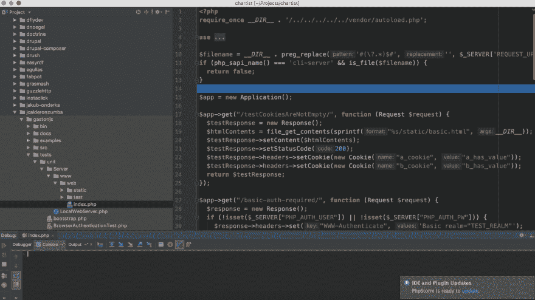
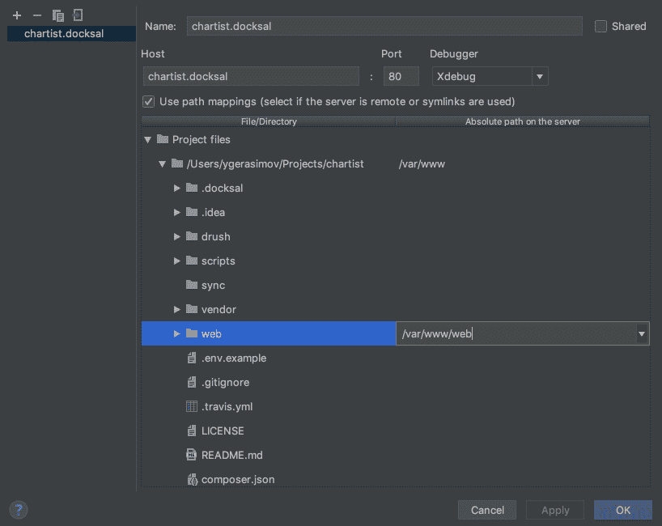
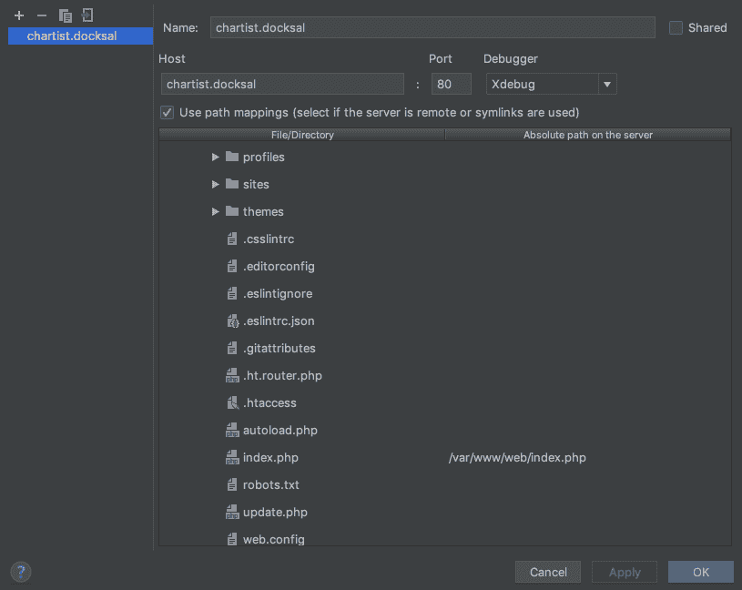
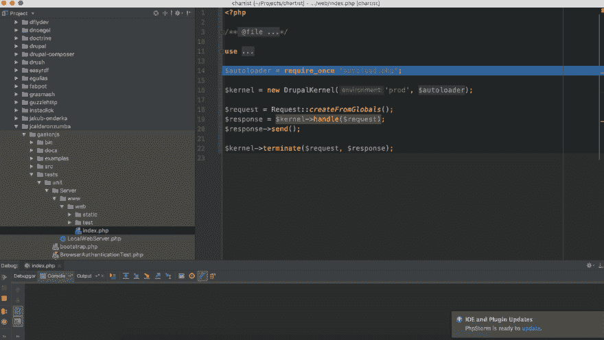

# PHPStorm 接错了 index.php

> 原文：<https://dev.to/ygerasimov/phpstorm-picking-up-wrong-indexphp-465l>

最近我在用 docksal 设置 Drupal 开发环境。我使用传统的 drupal composer 设置([https://github.com/drupal-composer/drupal-project](https://github.com/drupal-composer/drupal-project))，所以 drupal 位于服务器上的/web 文件夹中。

我已经在 PHP Storm 中映射了主根文件夹

因此，当我开始调试会话并发现一些奇怪的文件正在启动时，我真的很惊讶。

看起来 PHP Storm 试图找到它能找到的第一个 index.php，然后像被调试一样开始会话。

解决这个问题的方法是映射文件夹“web”和实际的 index.php，这样 PHP Storm 可以更容易地找到合适的文件。

因此，正确的 index.php 显示为正在调试。

调试愉快！