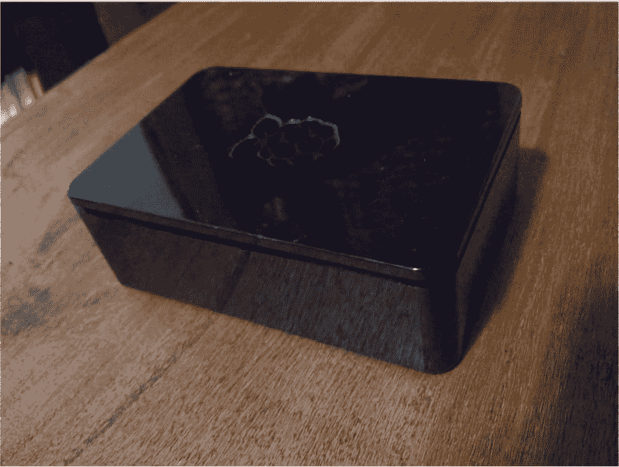

# 婴儿学步...

> 原文：<https://dev.to/michaeltharrington/baby-steps-44fd>

圣诞节我得到了一个覆盆子馅饼...两年前。从那以后，我再也没碰过它。🙈

<figure>

[](https://res.cloudinary.com/practicaldev/image/fetch/s--syE2KI_w--/c_limit%2Cf_auto%2Cfl_progressive%2Cq_auto%2Cw_880/https://cl.ly/2d0c86670d88/Image%25202019-01-02%2520at%25206.46.48%2520PM.png)

<figcaption>collecting dust.</figcaption>

</figure>

那时我渴望编码，但是失去了兴趣和毅力。只是不停地说，*我最终会得到那个*。

你猜怎么着？2019 年的🥳终于来了，我要严肃一点了！我要学习用 Python 为我的 pi 写点东西。🐍

但是...我可能需要帮忙。我是编程新手，不知道从哪里开始，只知道我*需要*开始。我选择 Python 是因为我有一个住在附近的朋友，他定期编写代码，并建议我这么做。我想我们可以做一些结对的工作，也许这有助于学习。

我还在这里偶然发现了最近这个有益的讨论:

[](/juliatorrejon) [## 有哪些最适合初学者的 Python 项目？

### Julia torrejón 12 月 9 日 181 分钟阅读

#discuss #python #beginners](/juliatorrejon/what-are-the-best-python-projects-for-beginners-1h57)
... which points to some great resources for beginner-level Python projects.

🐍 🐍 🐍

以及这里的这个帖子:

[](/jessicagarson) [## 学习 Python 的资源

### 杰西卡·加森 3 月 26 日 183 分钟阅读

#beginners #python #learning](/jessicagarson/resources-for-learning-python-hd6)
... that seems to scratch my itch for some basic "just getting started" with coding in Python information.

我在想这是正确的做法吗？如果我打算学习编码，我会选择阿郎并为之努力吗？我应该后退一点，多看看基本面吗？我想当我感到困惑的时候，我可以开始浏览这些资源，搜索一些东西，对吗？有没有一个完美的起点？

我的最终目标是为我的 pi 编写一个白噪音机器。我已经使用[这个非常棒的网站](https://mynoise.net/NoiseMachines/rainNoiseGenerator.php)很多年了，我很想重新创建这样的网站。

我还偶然发现了这个回购协议:

##  [视觉](https://github.com/scivision) / [舒缓的声音](https://github.com/scivision/soothing-sounds)

### 演示几种用 Python，white noise 从 Numpy 数组发出声音的方法

<article class="markdown-body entry-content container-lg" itemprop="text">

# 舒缓声音发生器

[ ](https://zenodo.org/badge/latestdoi/48785075) [ ](http://pepy.tech/project/soothingsounds)

一个听起来不错的 Python 代码，最初是针对 Raspberry Pi 的，但应该可以在任何地方运行。使用轻量级的纯 Python [SoundDevice](https://pypi.org/project/sounddevice/) 来生成声音。也可以选择使用其他声音回放 Python 包。

我已经将这个程序的输出写入 SD 卡，在多个地方的媒体播放器上播放了几年。

```
pip install -e .
```

Enter fullscreen mode Exit fullscreen mode

## 使用

噪声`color`选项是以下选项之一

> 白色粉色蓝色紫色棕色

示例将使用粉红噪声。

### 从扬声器播放声音

```
python soothing.py pink
```

Enter fullscreen mode Exit fullscreen mode

### 将声音保存到磁盘

1.  生成原始声音文件:`python soothing.py pink -o pink.raw`
2.  转换 raw 到无损 FLAC(可以在几乎所有的媒体播放器，电脑，手机等播放。)

    ```
    ffmpeg -f s16le -ar 16000 -ac 1 -i pink.raw pink.fla
    ```

    T5】进入全屏模式 退出全屏模式

## 笔记

核心噪声生成代码几乎完全来自 [Python Acoustics](https://github.com/python-acoustics/python-acoustics)

### 可选的高性能 Python FFTW 安装:

```
apt install libfftw3-dev
```

Enter fullscreen mode Exit fullscreen mode</article>

[View on GitHub](https://github.com/scivision/soothing-sounds)

... that looked quite promising.

但是现在，一步一步来。或者拖鞋。🐍

我写这篇文章的一个原因是，我真的致力于创造一些东西。如果我能把我的圆周率编码成一个造雨的噪音机器，我会非常高兴，而且一定会带你们一起去兜风。

任何智慧的话语、建议或推荐——请随意在评论中留下它们。

现在，请不要让我在这个决议上再次失误！🤞