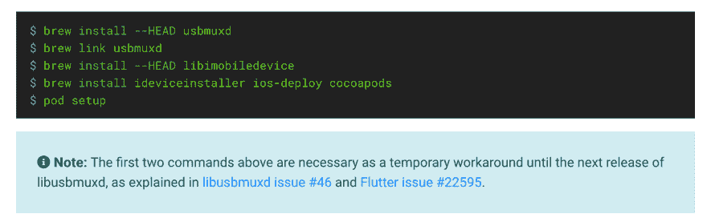
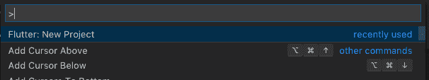
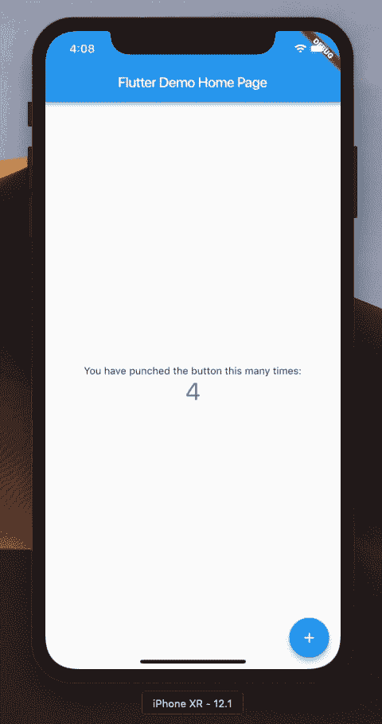

# 颤振发展:第 0 天

> 原文：<https://dev.to/irosthebeggar/flutter-development-day-0-4585>

## 目标

在 Flutter 中编写一个音乐播放器应用程序，并在 Android 和 iPhone 上发布

## 背故事

我是一个名为 [mStream](https://github.com/IrosTheBeggar/mStream) 的音乐流媒体服务器的所有者。mStream 的目标是成为一个任何人都可以使用的自托管音乐服务器。目前，mStream 服务器是稳定的，在一个很好的地方。

用户向我要求最多的是服务器的移动应用程序。理想的移动应用程序应该能够在服务器和手机之间自动同步音乐，并能够点播流媒体音乐。还应该有一个选择转码流，以避免使用太多的数据。

过去，我曾尝试制作一款安卓应用。该应用程序目前工作正常，但存在缺陷，用户界面也很笨拙。事实证明，为 Android 编写应用程序非常耗时。我甚至得到了一个朋友和专业 Android 开发者的帮助，这个项目仍然没有取得很大进展。不得不重做整个东西来制作 iOS 应用程序的想法只是让我暂时停止了应用程序开发。

## 计划

今天的目标是运行 Flutter 环境，并运行一个示例应用程序 iOS 和 Android。

长期计划是分几个步骤来开发这个应用程序

**第 0 步:**研究构建此应用程序所需的库。 [Dart 有一个包管理器，使得跨平台库的搜索变得容易](https://pub.dartlang.org/)

**第一步:**获取 app 连接服务器登录。然后连接文件浏览器、播放列表、专辑、艺术家和带星号的 API。

步骤 2: 在服务器和手机文件系统之间实现文件同步功能

**第三步:**在应用程序中添加音乐流。

## 今天的成绩

我能够按照[https://flutter.io/docs/get-started/install](https://flutter.io/docs/get-started/install)的说明启动并运行颤振环境

我对 OSX 安装指南的质量印象深刻。这些说明清晰、简洁、易于理解。当一些神秘的命令被剪切并粘贴到提示符中时，他们甚至给出了解释:

CLI 工具“flutter doctor”使安装 Android Studio 和 XCode 时调试问题变得很容易。安装过程中最困难的部分是为 Android Studio 安装所有必要的依赖项。

一旦安装了所有的依赖项，我打开 Visual Studio 代码并安装了他们的 Flutter 插件。Flutter 插件附带了一个构建示例项目的函数。

我能够立即在 iPhone 和 Android 模拟器上运行示例项目。

我花在安装上的时间比我想象的要少得多。几个小时之内，我从一个在 iOS 和 Android 上运行应用程序的干净系统。我希望剩下的开发周期像这样简单。