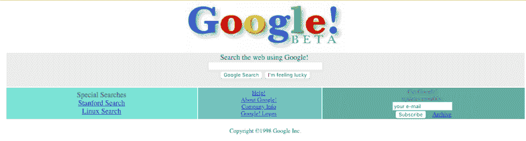

# 如何使用 Flexbox 轻松地将内容居中

> 原文：<https://dev.to/josemunoz/how-to-easily-center-stuff-with-flexbox-1gp3>

*Unsplash 拍摄的照片*

## CSS 斗争简史

将网页上的元素居中一直以来都很麻烦，也很难做到。在过去，表格至高无上，因为它们是唯一允许在某种程度上居中的 HTML 元素。

1994 年 11 月，在芝加哥的网络会议上宣布了一项 CSS 提案。正如我们所知，这是网络的开端，但要成为我们今天所知的网络，还有很长的路要走。

[](https://res.cloudinary.com/practicaldev/image/fetch/s--k-O2wXvn--/c_limit%2Cf_auto%2Cfl_progressive%2Cq_auto%2Cw_880/https://i.imgur.com/7n5rHG8.png)

如果你用[时光倒流机](https://web.archive.org/web/19981202230410/http://www.google.com:80/)去 1998 年的谷歌，你可以检查源代码，看到它只是一个`img`标签和一些表格。

在后来的 CSS 版本中，一旦引入了自动边距，在 web 上居中元素就容易多了。理论上，你可以在盒子模型中的任何元素上设置自动边距，它应该自动地在它们的范围内居中，然而，这只是部分地起作用，因为很难使用这个解决方案的垂直轴。在 21 世纪初，这是大多数 web 开发人员的一个主要痛点，如何在使用盒子模型时*垂直*居中元素。

直到 2013 年，W3C 才发布了 Flexbox 的工作草案，承诺解决这一问题和其他长期存在的痛点。

## 我们为什么会在这里

我知道你来这里不是为了上历史课，尤其是一堂发生在大约 30 年前的历史课，让我们用一些真实世界 2019 年的方法来弄脏我们的手，将元素放在你的网页上。

根据您的需要，水平居中非常简单。你可以在你的元素上设置自动边距，这在大多数情况下是可行的。

```
.item{
  margin: 0 auto;
} 
```

Enter fullscreen mode Exit fullscreen mode

如果你的雄心不仅仅是集中在一个单一的元素上，flexbox 将助你一臂之力。在这种情况下，您不会为想要居中的元素制定规则，而是为它的容器制定规则，里面的所有内容都将遵循这些规则。

### 横轴

```
.row{
  /* 
   * all children are automatically
   * considered columns
   */
  display: flex;
  flex-direction: row;
} 
```

Enter fullscreen mode Exit fullscreen mode

### 垂直轴

```
.column{
  /* 
   * all children are automatically
   * considered rows
   */
  display: flex;
  flex-direction: column;
} 
```

Enter fullscreen mode Exit fullscreen mode

一旦你的容器有了正确的方向，我们就可以通过设置`justify-content: center;`将项目沿着容器的主轴居中，这很酷，我们现在可以将内容沿着容器的任一轴居中，但是，为什么不两者都居中呢？
这可能有助于在全屏容器上显示居中的元素，或者创建一个网格系统，在这篇文章中我们不会深入 flexbox 的可能性，如果你想看看 flexbox 作为一个网格系统可以完成什么，我建议你查看一下[布尔玛 CSS 框架](https://bulma.io)，这是我的最爱之一。我们在这里尝试完成的事情要简单得多，将我们的元素放在它的两个轴的中心，我们只需要添加`align-items: center;`，这将改变垂直轴上的对齐。通过连接`justify-content`和`align-items`，我们可以让子元素同时位于 X 和 Y 平面的中心。

```
.centered{
  align-items: center;
  justify-content: center;
}; 
```

Enter fullscreen mode Exit fullscreen mode

如果你想在屏幕中央显示一些东西，你只需要添加`height: 100vh;`，你的内容就会出现在那里。

[https://codepen.io/Jdmg94/embed/dwJmvJ?height=600&default-tab=result&embed-version=2](https://codepen.io/Jdmg94/embed/dwJmvJ?height=600&default-tab=result&embed-version=2)

## 结论

几年前，将元素放在屏幕的正中央仅仅是非常狡猾的 web 开发人员通过复杂且通常很死板的解决方案创造出来的一种幻觉，现在你可以抛出 6 行 CSS 来实现它。

2019 快乐🎉你想继续阅读关于 CSS 的历史吗？
你可以看看 [W3 的 CSS](https://www.w3.org/Style/CSS20/history.html) 的历史，这是用来帮助写这篇文章的。欲了解更多关于 flexbox 的信息，请访问 [CSS-Tricks 的 Flexbox 完全指南](https://css-tricks.com/snippets/css/a-guide-to-flexbox/)，这是一个很好的资源。