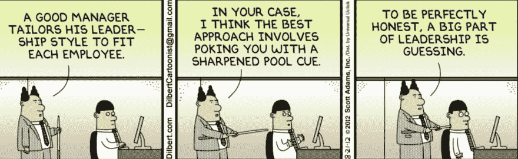
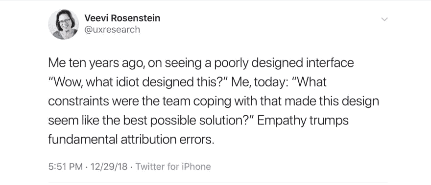

# 对开发团队领导的建议

> 原文：<https://dev.to/anastasiyaflynn/advice-for-development-team-leads-25m6>

这篇文章分享了我作为软件公司开发团队领导的经验。我的目标是让其他团队领导对他们的角色更有信心，并鼓励正在考虑进入这一职位的开发人员继续前进，实现飞跃。

## 我的经历

我作为 Sitecore 架构师和开发主管领导软件开发团队已经超过 3 年了。我上一个团队有 9 个后端。NET/Sitecore 开发人员和 2 名前端开发人员。我们分散在全球各地——最早的开始时间是格林尼治时间+2，最晚的是格林尼治时间-8。在一个大型的远程团队中工作极具挑战性，但是我们为一个企业客户完成了一个非常有雄心的最后期限，这导致了后续工作的大路线图的批准。

在一个典型的项目中，我被期望审查业务需求，编写技术需求，选择技术和框架，提供评估，指导实现，审查代码并给出反馈，编写文档，指导开发人员，决定哪些开发人员做哪些工作，让项目经理了解每个人的工作进度，管理部署，就未来工作的方向和策略咨询客户，参加(许多)会议，以及，哦，是的…编写代码。

我们总是朝着最后期限努力，所以所有的工作流都按计划进行是很重要的。如果有什么事情严重阻碍了我们的进展，无论是内部资源问题还是外部障碍，我都需要介入并帮助解决它，以保持事情的进展。

除了领导团队，我也是其他团队的成员，包括一些技术团队和一些非技术团队。

## 第 1 部分-内功

这一部分是关于塑造你的个性和行为，让你成为一名伟大的领导者——增加自信，了解反馈，寻找资源来学习更多关于领导力的知识，等等。

### 你不是冒名顶替

我承认，虽然我的团队非常成功，但不时会有那种卑鄙的冒名顶替综合症出现，踢我一脚。那是因为我和许多其他有我头衔的人一样，因为我是一个有能力的、自给自足的开发人员，一个快速的学习者，并且我擅长交流技术概念而被提升到领导位置。我有计算机科学学位，但我从未接受过如何管理或领导他人的正式培训。这是我必须要解决的问题。

你可能已经从上面的“我的经历”部分注意到，我作为团队领导所做的大部分事情都涉及到管理工作流和与团队进行口头或书面交流。然而写代码——让我得到提升的事情，我知道我擅长的事情——是我做得最少的。因此出现了冒名顶替综合症。

如果你是一个承担团队领导角色的开发人员，你发现自己感觉像一个冒名顶替者——这意味着你怀疑自己是否有资格管理人员，你担心自己做得是否正确——让我向你保证，你不是一个冒名顶替者。一般来说，团队在一个经验丰富的开发人员领导下比在一个有管理经验但不了解开发人员在做什么的领导下表现得更好。

所以我的建议是，不要对你的资历进行那些喋喋不休的内心攻击。提醒自己，提拔你的人知道他们在做什么，他们一定知道你有能力成长为一名领导者，即使你缺乏经验。这让我想到了下一部分…

### 领导力是一种习得的技能

 

没有人天生具有领导才能。你生命中所有让它看起来简单的伟大领袖都像你一样开始，并随着时间的推移而改进。改进来自于有意识地注意激励人们和提高绩效的行为，然后实践这些行为。如果你不认为自己是一个强有力的领导者，但你处于领导角色，不要担心。你可以提高，你可以练习特定的沟通技巧，这对于成为一名优秀的领导者至关重要。

理想的学习方式是通过一个导师，或者是你的公司，甚至是你的家庭。大多数领导技能都是与行业无关的，所以如果你的导师不是开发人员也没关系。如果你没有导师，或者你认为每周与导师会面是不够的，那么下一个最好的办法就是在亚马逊上查找这个话题并订购一些书籍。求同事推荐(布琳·布朗的 [*敢领导*](https://www.amazon.com/Dare-Lead-Brave-Conversations-Hearts/dp/0399592520) 太棒了)。

### 决定接受谁的反馈…

关于开发主管，我可以肯定的一点是，从来不缺少来自那些不像我一样参与游戏的人的批评和意见。作为团队的代言人，我是各种反馈的第一线，既有建设性的，也有居高临下的。

我的建议是弄清楚谁的观点重要。不可能让每个人都满意。你是一个必须站在实现背后的人，你的义务是对你的团队、你的老板和你的商业利益相关者。除此之外，将反馈视为建议。这将最小化所有(有时是冲突的)意见和要求给你带来的压力和困惑。

### …然后接受反馈

一旦你决定了你重视谁的意见，有意识地努力让自己接受反馈。

首先，这些人可能不知道你想要他们的意见，所以你可能需要去问他们。第二，不是每个人都擅长反馈。例如，我认识一个非常聪明的开发人员，他非常不擅长写拉请求注释。他挑战我团队代码的方式很刻薄，有时甚至很粗鲁。虽然他的交付肯定可以更好，但他提出了有益于项目的好建议。

我的建议是将反馈剥离到你头脑中的事实，这样你就可以理解信息，而不受信息传达者的情绪和态度的影响。那么就更容易确定是否需要对反馈采取行动。

需要说明的是，我并不是说你应该容忍人们像混蛋一样行事，这就引出了下一部分…

### 要勇敢

作为团队领导，你有权力为会议上可以接受的态度定下基调。如果你的团队和你的实现中的任何一个被否定了，要勇敢地站出来。最重要的是让向你汇报的人知道你是他们的后盾。你也有权力为你的团队设定标准。要有足够的勇气为估计辩护，并指出范围蔓延。

## 第二部分-外部技能

这一部分是关于人际交往技巧的，需要练习这些技巧来提高你与你的团队的互动质量和你领导的有效性——指导、沟通、加强团队纽带等。

### 师徒优先

如果编码是工作中最小的部分，那么那些让你升职的优秀开发人员技能会发生什么呢？答案是你通过将它们传播到你的团队来增加它们。作为团队领导，你的首要职责之一是指导你的开发人员——这是你为公司提供的最大价值。

我对指导的建议是:

1.  了解开发人员的优势和劣势，根据技能水平和成长目标分配工作。分配具有挑战性的工作，但不要让人觉得“力不从心”。让团队成员为成功做好准备，让他们觉得自己无所不能。为了衡量开发人员是否在他们的任务中取得成功，定期进行一对一的接触(目标是每天)。“事情进展如何？”
2.  不要等着开发人员来找你。相反，定期与你的开发人员联系，询问他们的进展，并表明你可以参与讨论。一句友好的“嘿，你在某某上过得怎么样？你有什么问题吗？”这是一个很好的方式，可以随意地登记入住，而不会让人觉得太琐碎。
3.  每个 sprint 至少召开一次专门针对开发人员的知识分享会议，每个人都讨论他们所做的工作，以及他们所面临的挑战。
4.  尽可能多地编写文档。指导的目标是传播知识，而文档是一种共享知识的协作方式，即使在您转到另一个项目后，这些知识仍会继续存在。

### 利用整个团队进行咨询

我曾经抱着这种不切实际的期望，认为我需要成为我的团队正在研究的所有课题的专家。这是出于好意——我只是想能够自己回答所有的问题，以避免让额外的人参加会议，这样团队就可以埋头工作了。此外，由于我的团队经常与我讨论实现策略，我喜欢在已经了解上下文的情况下进行对话。事实是，这种心态给我带来了大量额外的压力，因为我必须不断地做研究，为会议做额外的准备。更重要的是，它剥夺了我的团队成员练习解释技术主题的机会，而这是一项至关重要的技能。

因此，我的建议是尽可能地跟上你工作流程中的知识，但要认识到你的团队中有很多主题专家，并尽可能地利用他们。尝试在每次技术会议上至少有一个 dev 和你在一起。你可能需要向项目经理说明这一点，因为现在参加会议的开发人员数量将会翻倍，所以要明确这是对团队成长的投资。“共享”会议有一个额外的好处，因为它可以防止所有的知识都藏在一个人身上。所以，如果你离开这个项目，对团队来说不会有太大的打击。

### 知道何时倾听而不是解决问题

作为领导，我一直面临的一个问题是，当开发人员带着问题来找我时，我会立即进入“我该如何自己解决这个问题”的模式。这也是出于善意。我想提供帮助，我想让人们畅通无阻，这样他们就可以在冲刺中进步。这也是我对从事编码挑战感到兴奋的原因，因为我不经常编码。我不得不不断提醒自己，保持耐心，给人们自己解决问题的机会，是对团队最好的事情。

我的建议是让人们更明确地知道他们需要你做什么。例如，“阿纳斯塔西娅，我能向你透露一些关于某某的想法吗？”vs“阿纳斯塔西娅，我在某某上花了很长时间，还是不对。我需要你的帮助。”当请求被如此明确地表达出来时，我心里很清楚我是需要提供解决方案，还是闭嘴倾听。如果你收到的请求措辞含糊，简单地问:“我能帮什么忙？”弄清楚意图。

作为领导，您负责确保团队在实现目标以及需要遵循的任何技术约束上保持一致。但是让开发人员自由决定实现细节。告诉团队要构建什么，而不是如何构建。

### 记住错误是可以的

当您允许团队自由地对实现细节做出决策时，他们会尝试一些有时行不通的事情。永远不要因为某人尝试了以后需要重构的东西而感到羞耻，这是我们都学习的方式。

如果您怀疑有人在您的一次实现检入中走上了一条糟糕的道路，那么您很可能会大声说出这个问题，“哦，不，您不应该这样做，而应该这样做。”当然，在这种情况下，您并不是想故意刁难，您只是想让开发人员避免将来在故障排除上浪费时间。当然，如果这是一个会导致服务器停机的严重错误，那么就指出来，但这种情况很少发生。通常这是一个被忽视的边缘案例或者类似的事情。在这种情况下，我的建议是引导开发人员进行对话，让他或她思考问题，并把实际的问题解决留给他或她。例如，“你有没有想过如果用户试图只用键盘与这个组件交互会发生什么？”或者“你认为这个组件有什么安全漏洞吗？”教人们如何寻找他们需要的信息，而不直接告诉他们做错了。

### 总是假定积极的意图。

我最近看到一条推文，完美地概括了这个观念:

团队中的每个人总是根据当时掌握的信息尽最大努力完成工作。他们正在克服约束和挑战，这些约束和挑战在以后回顾他们的工作时可能并不明显。

这可能是本页唯一最重要的建议。这对两者都有很大的帮助，减少你在工作中的压力和挫败感，改善别人对你的看法。

### 表扬做好工作的人。

尤其是在别人面前。告诉你的老板你的员工做得很好。记住也要给跨部门的表扬。

### 不要急于假设

对我来说，每当开发人员达不到一致的期望时，比如满足 sprint 承诺，在线可用(对于远程工作人员)，或者遵守 pull request 清单，领导人员就会模糊地变成管理人员。

如果你不得不面对一个开发人员的表现，我的建议是避免做假设，在你的常规检查中简单地要求一个解释。开发人员可能只是遇到了你没有意识到的问题，它不会成为一个重复的问题。

但是如果你发现自己一次又一次地与一个开发人员争论同样的问题，并且你需要有一个更正式的会议，那么我的建议是向团队的其他成员解释这种分歧。不要威胁或告诉这个人如何解决问题。让他/她想出一个解决方案，“你打算做什么来确保你不会再有这样的一周？”让团队成员承诺解决方案并记录下来。然后在几个星期后举行一次后续会议，以确定这个人是否坚持到底。

### 做人

我不擅长领导和管理。有时候说错话，有时候情绪化，有时候得罪人。这一页上所有我说不要做的事情，我都做了，所以我知道最好避免它们。当我搞砸时，它发生在团队或客户面前，所以我对感到尴尬并不陌生。

我的最后一条建议是，坦然面对不舒服的感觉。当你犯了错误时，承认错误，从中吸取教训，必要时道歉。然后原谅自己，往前走。

祝你用餐愉快！