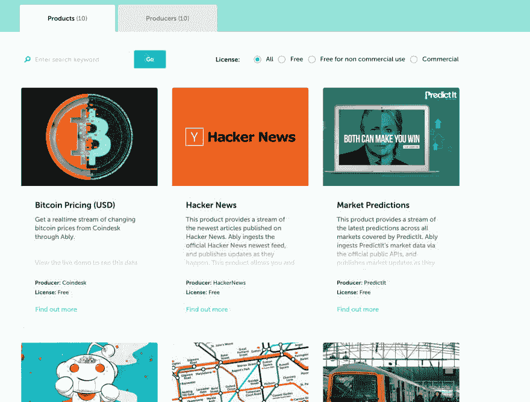

# 参与我们的开放式数据流计划，释放您的数据

> 原文：<https://dev.to/ably/set-your-data-free-by-participating-in-our-open-data-streaming-program-3jj3>

未来是敞开的！

在这个开放数据流计划(ODSP)下，任何人都可以在数据流交换( [DSX](https://ably.com/api-streamer) )平台上免费发布实时数据流，前提是这些数据免费提供给其他人使用，并遵守公平使用政策。

**开放数据流计划:填补关键空白**
当今可用的大部分开放数据都是静态或历史数据，可能是几分钟到多年前的数据。组织可以在很多地方发布这些静态数据供他人使用，而无需担心基础设施或人们如何访问它。因为数据是静态的，所以它通常只能通过拉机制获得，在拉机制中，数据消费者必须主动从数据源请求信息。

这一切都很棒，但它没有解决日益增长的实时数据需求，这些数据可以在创建后的几毫秒内交付到目的地。

当你看到开放的实时数据环境时，托管和交付机制的选择是非常有限的。这是开放数据流计划旨在填补的空白。

实质上，ODSP 通过提供以下手段，寻求解放世界各地的许多实时数据源:

1.  使开放实时数据的生产者能够发布他们的流，而不需要考虑基础设施、协议、API 或可能有多少消费者
2.  一旦这些实时数据可用，就使用消费者选择的交付方式将其推送给任意数量的消费者

**开放数据流程序如何工作**
如果你是一个数据制作者，你可以在[DSX](https://ably.com/api-streamer)上免费发布和分发开放的实时数据。这包括在 [Ably Hub](https://ably.com/hub) 中的一个列表，这是一个类似于应用商店的数据集门户，将在下面解释。

DSX 支持开放协议(包括 AMQP、STOMP 和 MQTT)，每个流行平台中的 SDK，您可以嵌入这些 SDK 来消费实时数据。此外，DSX 提供了一个统一的 API，使您能够通过一个单一的多路复用连接来组合多个源。而且还包括 Reactor，可以推送到第三方系统，比如无服务器功能，webhooks 或者 Kafka，RabbitMQ 或者 Kinesis。

**巧妙地枢纽**

Ably Hub 让开发者和其他数据消费者可以轻松找到你的数据流，并围绕它们构建创新应用。它已经包含了各种各样的实时数据，包括:

1.  来自伦敦交通局的伦敦交通信息
2.  公共体育博彩市场的博彩统计数据，以及一系列其他体育数据
3.  预测的预测
4.  来自 HackerNews 和 Reddit 的新闻文章
5.  来自比特币基地和 BitFlyer 的比特币价格和信息
6.  来自 IEX 贸易的财务信息
7.  来自打开的天气图的天气数据

…我们正在根据用户需求开发更多产品。[建议新的来源](//mailto:devrel@ably.io)。

**自由释放您的数据**
我们正在积极寻找新的开放实时数据源，在 [DSX](https://ably.com/api-streamer) 上托管，并通过 [Ably Hub](https://ably.com/hub) 展示。如果您有需要释放的数据，请[联系](//mailto:devrel@ably.io)。同样，如果你想消费免费的开放流数据，只需前往 Ably Hub 即可。

我们为什么要这么做？我们爱[开源](https://ably.com/open-policy)！:)