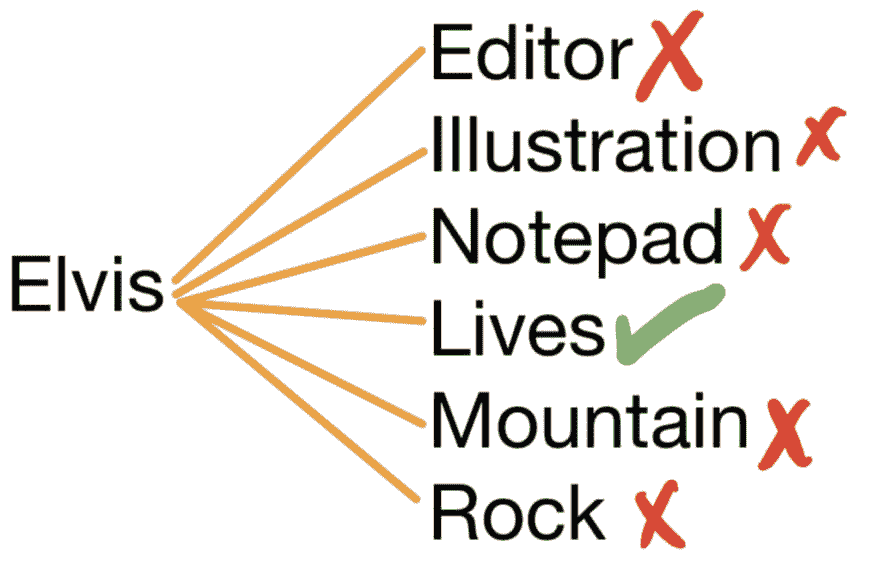

# 一种寻找字谜的算法

> 原文：<https://dev.to/brandonskerritt/an-algorithm-for-finding-anagrams-5dfh>

寻找单词的变位看起来并不是一个困难的问题，但有一个有趣的解决方案。

变位词是一个可以转化成另一个单词或句子的单词或句子。猫王和生命有相同的字母，所以猫王是生命的变位词。

大多数人会立即解决这个问题的方法是拿一个单词，在字典中检查每个单词，看看字母组合是否完全匹配。

这样做的方法将使用一个*多重集*。*集合*就像数组一样，顺序无关紧要，不允许重复。对于数组，[a，b]与[b，a]不同。但是用一个集合，(a，b)和(b，a)是一样的。

集合不允许重复。所以(a，a，a，a，a，b)和(b，a)是一样的——因为第一个集合会变成(a，b)。

多重集合是一个允许重复的集合，但是顺序无关紧要。对于这个例子，让我们从小处开始。