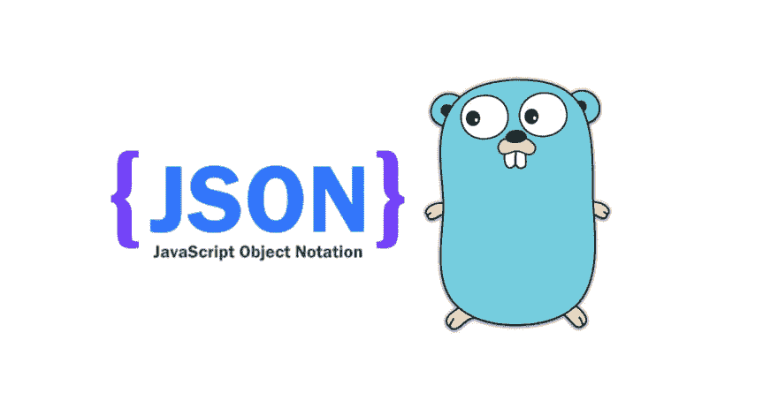

# 如何使用 Go (lang)访问深度嵌套的 JSON 数据？

> 原文：<https://dev.to/thedevsaddam/how-to-access-deeply-nested-json-data-using-go-lang-5560>

[](https://res.cloudinary.com/practicaldev/image/fetch/s--7Emfp-rk--/c_limit%2Cf_auto%2Cfl_progressive%2Cq_auto%2Cw_880/https://thepracticaldev.s3.amazonaws.com/i/y8gz394f3ye9131vz399.jpeg) 
大多数情况下，开发人员需要使用来自其他服务的 JSON 数据，并对它们进行查询。查询 JSON 文档花费的时间很少。在过去的几天里，我一直在为 Golang 开发一个可以轻松查询 JSON 数据的包。这个想法和灵感来自纳希德·本·阿兹哈尔的 PHP-JSONQ。

让我们从一个样本 JSON 数据开始:

```
{  "name":"computers",  "description":"List of computer products",  "vendor":{  "name":"Star Trek",  "email":"info@example.com",  "website":"www.example.com",  "items":[  {"id":1,  "name":"MacBook Pro 13 inch retina","price":1350},  {"id":2,  "name":"MacBook Pro 15 inch retina",  "price":1700},  {"id":3,  "name":"Sony VAIO",  "price":1200},  {"id":4,  "name":"Fujitsu",  "price":850},  {"id":5,  "name":"HP core i5",  "price":850,  "key":  2300},  {"id":6,  "name":"HP core i7",  "price":950},  {"id":null,  "name":"HP core i3 SSD",  "price":850}  ],  "prices":[  2400,  2100,  1200,  400.87,  89.90,  150.10  ]  }  } 
```

让我们找到一个深度嵌套的属性并正确处理错误，在这种情况下，我们将尝试从`items`数组的第二个元素访问`name`，注意:`items`是`vendor`对象的一个属性。请参见下面的示例:

```
package  main  import  (  "fmt"  "log"  "github.com/thedevsaddam/gojsonq"  )  func  main()  {  jq  :=  gojsonq.New().File("./sample-data.json")  res  :=  jq.Find("vendor.items.[1].name")  if  jq.Error()  !=  nil  {  log.Fatal(jq.Errors())  }  fmt.Println(res)  } 
```

耶呜！很简单吧？看起来像是在处理 JSON 数据的`ORM`。让我们看更多的例子来查询样本数据。

### 例 1

查询:`select * from vendor.items where price > 1200 or id null`

使用 [gojsonq](https://github.com/thedevsaddam/gojsonq) 我们可以进行如下查询:

```
package  main  import  (  "fmt"  "github.com/thedevsaddam/gojsonq"  )  func  main()  {  jq  :=  gojsonq.New().File("./sample-data.json")  res  :=  jq.From("vendor.items").Where("price",  ">",  1200).OrWhere("id",  "=",  nil).Get()  fmt.Println(res)  // output: [map[price:1350 id:1 name:MacBook Pro 13 inch retina] map[id:2 name:MacBook Pro 15 inch retina price:1700] map[id:<nil> name:HP core i3 SSD price:850]]  } 
```

### 例 2

查询:`select name, price from vendor.items where price > 1200 or id null`

使用 [gojsonq](https://github.com/thedevsaddam/gojsonq) ,我们可以进行如下查询:

```
package  main  import  (  "fmt"  "github.com/thedevsaddam/gojsonq"  )  func  main()  {  jq  :=  gojsonq.New().File("./sample-data.json")  res  :=  jq.From("vendor.items").Where("price",  ">",  1200).OrWhere("id",  "=",  nil).Only("name",  "price")  fmt.Println(res)  // output: [map[name:MacBook Pro 13 inch retina price:1350] map[name:MacBook Pro 15 inch retina price:1700] map[name:HP core i3 SSD price:850]]  } 
```

### 例 3

查询:`select sum(price) from vendor.items where price > 1200 or id null`

使用 [gojsonq](https://github.com/thedevsaddam/gojsonq) ,我们可以进行如下查询:

```
package  main  import  (  "fmt"  "github.com/thedevsaddam/gojsonq"  )  func  main()  {  jq  :=  gojsonq.New().File("./sample-data.json")  res  :=  jq.From("vendor.items").Where("price",  ">",  1200).OrWhere("id",  "=",  nil).Sum("price")  fmt.Println(res)  // output: 3900  } 
```

### 例 4

查询:`select price from vendor.items where price > 1200`

使用 [gojsonq](https://github.com/thedevsaddam/gojsonq) ,我们可以进行如下查询:

```
package  main  import  (  "fmt"  "github.com/thedevsaddam/gojsonq"  )  func  main()  {  jq  :=  gojsonq.New().File("./sample-data.json")  res  :=  jq.From("vendor.items").Where("price",  ">",  1200).Pluck("price")  fmt.Println(res)  // output: [1350 1700]  } 
```

### 例 5

查询:`select * from vendor.items order by price`

使用 [gojsonq](https://github.com/thedevsaddam/gojsonq) 我们可以进行如下查询:

```
package  main  import  (  "fmt"  "github.com/thedevsaddam/gojsonq"  )  func  main()  {  jq  :=  gojsonq.New().File("./sample-data.json")  res  :=  jq.From("vendor.items").SortBy("price").Get()  fmt.Println(res)  // output: [map[id:<nil> name:HP core i3 SSD price:850] map[id:4 name:Fujitsu price:850] map[id:5 name:HP core i5 price:850 key:2300] map[id:6 name:HP core i7 price:950] map[id:3 name:Sony VAIO price:1200] map[id:1 name:MacBook Pro 13 inch retina price:1350] map[id:2 name:MacBook Pro 15 inch retina price:1700]]  } 
```

### 例 6

使用 [gojsonq](https://github.com/thedevsaddam/gojsonq) 可以正确处理错误，参见下面的代码片段:

```
 package  main  import  (  "log"  "github.com/thedevsaddam/gojsonq"  )  func  main()  {  jq  :=  gojsonq.New().File("./invalid-file.xjsn")  err  :=  jq.Error()  if  err  !=  nil  {  log.Fatal(err)  // 2018/06/25 00:48:58 gojsonq: open ./invalid-file.xjsn: no such file or directory  // exit status 1  }  } 
```

### 例 7

让我们假设我们有一个像这样的 JSON 文档

```
{  "users":[  {  "id":1,  "name":{  "first":"John",  "last":"Ramboo"  }  },  {  "id":2,  "name":{  "first":"Ethan",  "last":"Hunt"  }  },  {  "id":3,  "name":{  "first":"John",  "last":"Doe"  }  }  ]  } 
```

我们想要运行这样的查询:

查询:`select * from users where name.first=John`

使用该包，您可以轻松地进行查询，请参见下面的代码片段:

```
package  main  import  (  "fmt"  "github.com/thedevsaddam/gojsonq"  )  func  main()  {  jq  :=  gojsonq.New().File("./data.json")  res  :=  jq.From("users").WhereEqual("name.first",  "John").Get()  fmt.Println(res)  //output: [map[id:1 name:map[first:John last:Ramboo]] map[id:3 name:map[first:John last:Doe]]]  } 
```

您可以使用点(.)对于像`Where/GroupBy/SortBy etc`这样的方法

#### 注意:还有一些其他有用的方法可以让生活更轻松！如果你喜欢这个包，不要忘记与你的社区分享，并启动这个库

## 回购环节: [gojsonq](https://github.com/thedevsaddam/gojsonq)

非常感谢您阅读本文，不要忘记在评论中给出您的反馈:)