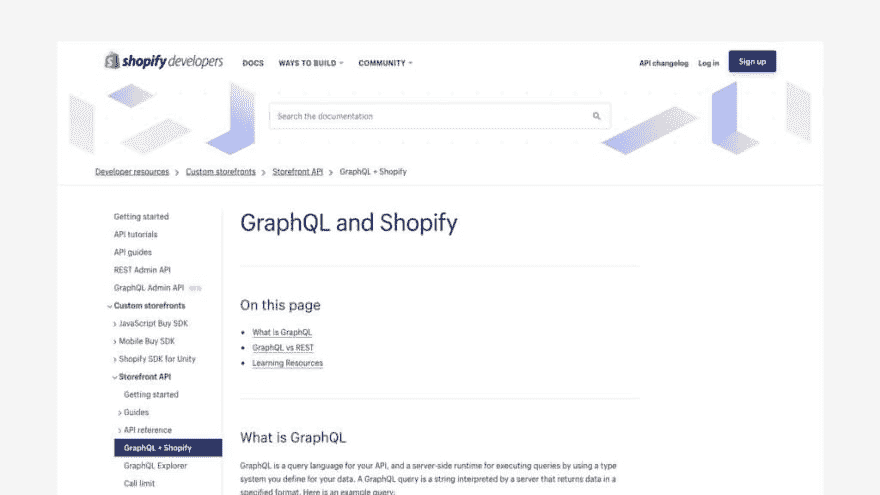
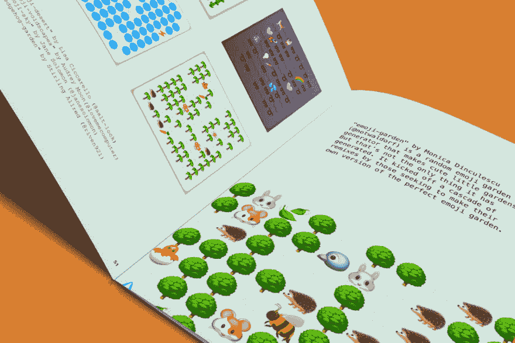
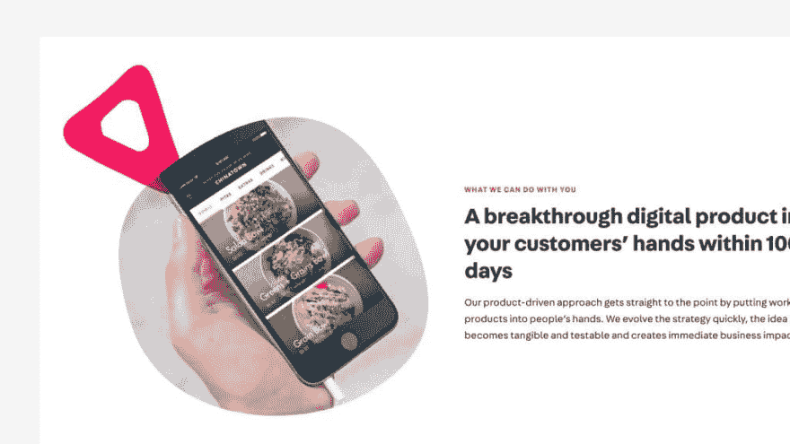

# 前端 2019:预测与期待

> 原文：<https://dev.to/browserlondon/front-end-2019-predictions-and-expectations-1pe>

2018 年对网络来说是非常稳定和具有回顾性的一年。框架和工具在不断变化，但是令人惊讶的是，几乎没有新的竞争者、模式和技术进入主流使用。今年会遵循同样的模板吗？以下是我对 2019 年前端开发世界的预期。

## 工装

React 不太可能去任何地方，2019 年将继续看到它的增长(尽管步伐更加宽松)。随着像[钩子](https://reactjs.org/docs/hooks-intro.html)这样的特性的增加，我们将会看到更多向功能方法的转变。

然而，最令人兴奋的发展可能是在数据传输/API 领域。GraphQL 已经开始占据主导地位，许多大玩家(如 [Shopify](https://www.shopify.co.uk/) )现在都提供了 [GraphQL API](https://help.shopify.com/en/api/custom-storefronts/storefront-api/graphql) 。我的预测是，我们将在 2019 年看到更好的 GraphQL 工具，包括 [Apollo](https://www.apollographql.com/) 的重大更新(或竞争对手)，提供一种 [Redux](https://redux.js.org/introduction/getting-started) 风格的检查器和更好的 IDE 集成。

函数式编程和反应式编程可能会有相似的增长，特别是由于它们与现代框架所采用的方法集成得非常好。

## 打破电网

如果运气好的话，2019 年也将是前端开发人员最终摆脱单调的 12 列网格并开始创建更具吸引力和动态布局的一年。

Jen Simmons 是一个网格的拥护者，在她的[布局实验室](https://labs.jensimmons.com/)中演示了各种可能性。

虽然 CSS 网格已经存在了一段时间，但它仍然经常被归入投资组合和代理网站。开发人员(和设计师)花了整整一年的时间！)尝试一下，感受一下什么是可能的，希望在 2019 年我们能看到一些创新的实现。

## 艺术与奇思妙想

也许是十年来第一次，网络开始重新点燃 Flash 时代网站的奇思妙想和艺术潜力。

像 [Glitch](https://glitch.com) 这样的社区和像 [XOXO](https://2018.xoxofest.com/) 这样的会议都在[积极鼓励](http://culture-zine.glitch.me/culture/looky-what-we-made/)艺术家、编码员、设计师和作家在网络上建立不是“网站”而是游乐场的东西。CodePen 是一个技术性的游戏围栏，而 Glitch 是一个艺术性的游戏围栏。

 

<figcaption>Glitch 最近整理了一本展示特色项目的电子书。</figcaption>

我相信我们将继续看到这种工作的发展，特别是随着许多新工具越来越受到支持并成为主流(如 CSS Grid 和 generative libs)。

在一个与发布一个完整的应用程序相关的问题令人望而生畏的时代(可访问性、性能、可用性、培训等)，我们比以往任何时候都更需要这样的逃避。

## 生成内容

我认为网络将会继续看到生产性作品和艺术的巨大增长，比如海登·皮克林的[可变](https://mutable.gallery/)。

然而，我怀疑我们也将在 2019 年开始以更微妙的方式看到它，例如在营销页面上制作伴随(或设置在后面)文案的图形。当我们在网络上达到平面插图的饱和点时，我们将需要转向更多的[创造性的方式](https://www.youtube.com/watch?v=eCHt8zsbCT4)来给页面添加特征和个性，生成独特的插图可能是一个有趣的解决方案。

 

<figcaption>多采用动态、生财的造型与静态相结合，创造出独特的美感。</figcaption>

## 新增全栈

在过去几年中，我们已经开始看到前端开发人员的角色发生了重大转变。随着应用程序变得越来越依赖 JavaScript，前端工程师有必要理解并实践传统上属于后端开发人员领域的架构原则，例如 API 设计和数据建模。

例如，实现 GraphQL API 最初可能会落到后端开发人员的头上，但是今天——由于他们对语言、生态系统和工具的熟悉——前端开发人员也同样有可能接手。同构应用程序设计的兴起也起到了一定的作用，它假定了对不同运行时环境([节点](https://nodejs.org/en/)和浏览器)、路由和认证的认识。

虽然前端和后端开发之间的区别在不久前还很明显，但我相信我们将在 2019 年继续看到这一点变得越来越模糊，甚至可能是([有些被诽谤的](http://www.heydonworks.com/article/reluctant-gatekeeping-the-problem-with-full-stack))“全栈”开发人员的复兴。

## 前端 2019，总结

我们正处于网络历史上的一个转折点，在这个转折点上，我们几乎无所不能。今天，几乎任何设计或功能都是可能的，我认为，这导致了我们在试图弄清楚我们到底想要 T1 做什么时的一点麻痹。

希望在 2019 年，我们将开始看到它开花结果。

* * *

帖子[前端 2019:预测和期望](https://www.browserlondon.com/blog/2019/01/02/front-end-2019-predictions/)首先出现在[浏览器伦敦](https://www.browserlondon.com)上。