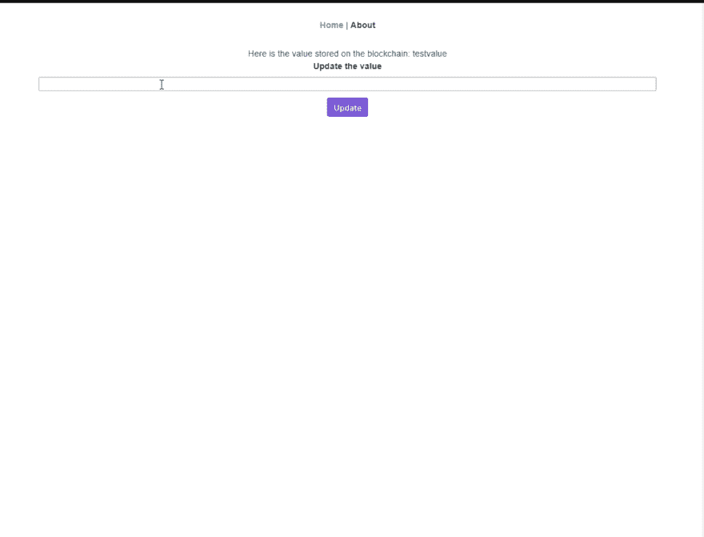
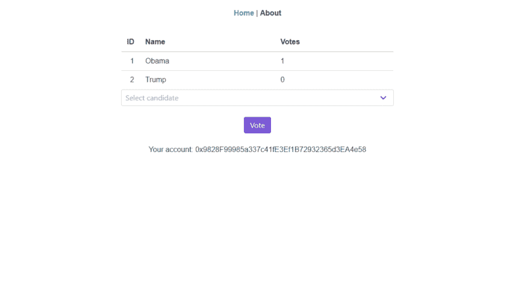
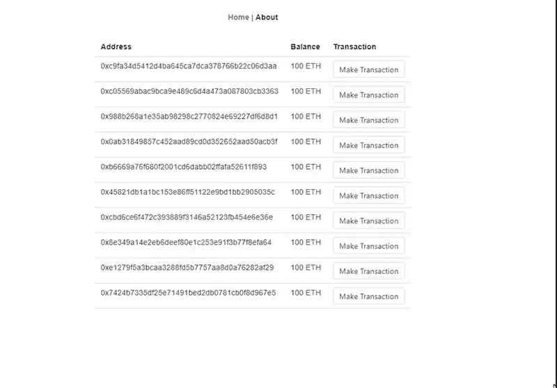
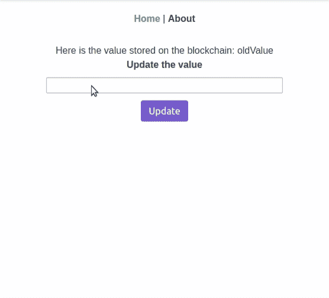
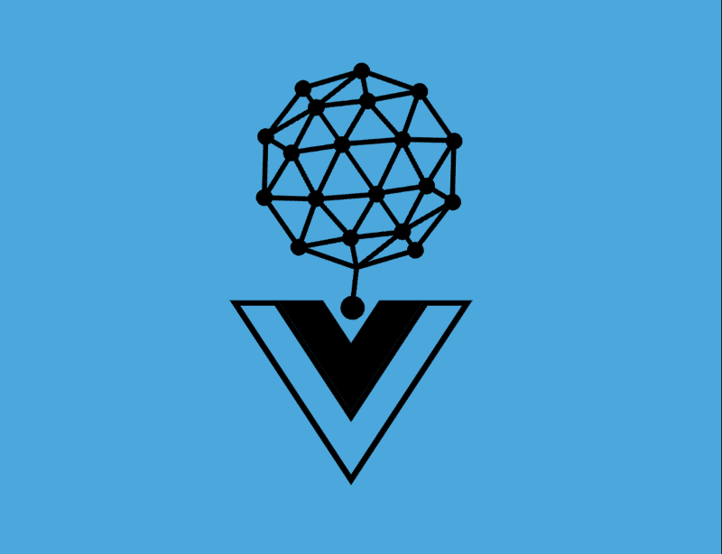
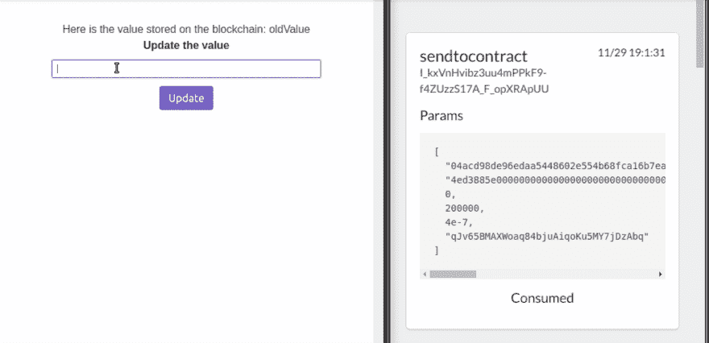

# 以太坊、Tron 和 Qtum 的基本 Vue dApp 示例

> 原文：<https://dev.to/marlowl/basic-vue-dapp-examples-with-ethereum-tron-and-qtum-16l7>

## 那么，什么是 dApp？

通常与以太坊项目相关联的是一个分散式应用程序(dApp ),它是一个运行在对等计算机网络上的应用程序，而不是一台单独的计算机。这样做的主要好处是，网络用户不需要依赖中央计算机来发送和接收信息。

## 例子

我没有找到很多 Vue dApp 的例子，所以作为一个小项目，我构建了一些初学者包，希望它们可以作为其他开发人员的例子、起点或灵感！

所有项目包括:

*   view-CLI 3 . 2 . 1
*   TypeScript(类样式组件)
*   端到端测试
*   单元测试
*   用 solidity 编写的智能合同示例

### 以太坊

## /[vue-truffle-starter-dapp](https://github.com/marlowl/vue-truffle-starter-dapp)

### Vue CLI Starter Dapp 包括 TypeScript、Truffle 5 和 Web3

<article class="markdown-body entry-content" itemprop="text">

# 块菌发酵剂

[](logo.PNG)

这个项目是用版本 3.2.1 的 vue-cli 生成的

块菌开胃菜 dApp。编写、编译&部署以太坊智能合约。

示例合同部署在 Ropsten testnetwork 上

# 演示

使用您的以太坊钱包地址更新智能合约的价值

[](screenshot.gif)

# 项目设置

元掩码和 Infura 帐户都是这个项目工作所必需的！

### MetaMask

我想参考这篇[文章](https://blog.bankex.org/how-to-buy-ethereum-using-metamask-ccea0703daec)来获得一个关于如何设置 MetaMask 的简单教程，并在你的 Ropsten 帐户上获得一些免费的测试以太网！然后你就有了你需要的 ETH 地址。环境文件

### Infura

Infura 是一个托管的以太坊节点集群，允许你运行你的应用程序，而不需要他们设置自己的以太坊节点或钱包。在此注册一个帐户[并要求您的 API 密钥。env 文件！](https://infura.io/register)

### 让 ganache-cli 和 truffle 在您的环境中运行

…</article>

[View on GitHub](https://github.com/marlowl/vue-truffle-starter-dapp)

## /[vue-voting-dapp](https://github.com/marlowl/vue-voting-dapp)

### 简单投票 dApp，使用 Vue CLI、Truffle 和 Web3

<article class="markdown-body entry-content" itemprop="text">

# 投票 dApp

[](https://github.com/marlowl/vue-truffle-starter-dapp/blob/master/logo.PNG)

这个项目是用版本 3.2.1 的 vue-cli 生成的

一种投票机制。

样本合同部署在 Kovan 测试网络上

# 演示

[](screenshot.gif)

# 项目设置

元掩码和 Infura 帐户都是这个项目工作所必需的！

### MetaMask

我想参考这篇[文章](https://medium.com/singapore-blockchain-dapps/how-to-get-testcoin-from-ethereum-kovan-testnetwork-85c466d5b869)来获得一个关于如何设置 MetaMask 的简单教程，并在你的 Kovan 帐户上获得一些免费的测试乙醚！然后你就有了你需要的 ETH 地址。环境文件

### Infura

Infura 是一个托管的以太坊节点集群，允许你运行你的应用程序，而不需要他们设置自己的以太坊节点或钱包。在此注册一个帐户[并要求您的 API 密钥。env 文件！](https://infura.io/register)

### 让 ganache-cli 和 truffle 在您的环境中运行

```
npm install -g truffle ganache-cli 
```

### 启动 ganache-cli

```
ganache-cli 
```

运行这个命令后，你应该能够找到你的助记符…

</article>

[View on GitHub](https://github.com/marlowl/vue-voting-dapp)

## [【marlwl】](https://github.com/marlowl)/[vista-web 3 钱包](https://github.com/marlowl/vue-web3-wallet)

### Vue ganache 入门级钱包。在本地区块链 RPC 服务器上的地址之间发送事务。

<article class="markdown-body entry-content" itemprop="text">

# web 视图 3 wallet

[](https://github.com/marlowl/vue-truffle-starter-dapp/blob/master/logo.PNG)

这个项目是用版本 3.2.1 的 vue-cli 生成的

一个 Vue [ganache](https://github.com/trufflesuite/ganache-cli) starter 钱包。在本地区块链 RPC 服务器上的地址之间发送事务。

# 演示

在 ganache-cli 帐户之间发送交易

[](screenshot.gif)

# 项目设置

### 安装 ganache-cli

```
npm install -g  ganache-cli 
```

### 启动 ganache-cli

```
ganache-cli -p 7545 
```

### 安装依赖项

```
npm install 
```

### 启动开发服务器

```
npm run serve 
```

</article>

[View on GitHub](https://github.com/marlowl/vue-web3-wallet)

### [王位](#tron)

##  [马洛](https://github.com/marlowl) / [创-启动器-dapp](https://github.com/marlowl/tron-starter-dapp)

### 基于 Vue 的 Tron 示例 dApp，包含 tronweb、tronlink、tronbox 和 vue-cli

<article class="markdown-body entry-content" itemprop="text">

# Tron 启动器 dApp

[](logo.PNG)

这个项目是用版本 3.2.1 的 vue-cli 生成的

基于 Vue 的 Tron 示例 dApp，包含 tronweb、tronlink、tronbox 和 vue-cli

# 演示

使用您的 Tronlink wallet 地址更新智能合约的价值

[](demo.gif)

# 项目设置

此 dApp 需要 TronLink 帐户才能运行！

点击下载 Tronlink

从[这里](https://www.trongrid.io/shasta/)获得一些免费的 TRX 硬币，让您的帐户保持平衡

### 安装依赖项

```
npm install 
```

### 更新。环境文件

```
VUE_APP_SHASTA_PRIVATE_KEY="Your key" 
```

### 运行开发服务器

```
npm run serve 
```

# 编译您自己的智能合同

将您的智能合同添加到/contracts 文件夹

### 安装 tronox

```
npm install -g tronbox 
```

### 编制合同

```
tronbox compile 
```

### 迁移合同

```
tronbox migrate --network shasta 
```

### 将当前地址更改为您部署的合同地址

```
 let contractInstance = await tronWeb
      .contract()
      .at("Your deployed contract address"); 
```

</article>

[View on GitHub](https://github.com/marlowl/tron-starter-dapp)

### Qtum

##  [马洛](https://github.com/marlowl) / [ qtum-starter-dapp](https://github.com/marlowl/qtum-starter-dapp)

### 一个基于 Vue 的 Qtum 示例 dApp，包含 qtumjs、qtumportal、solar 和 vue-cli

<article class="markdown-body entry-content" itemprop="text">

# QTUM 启动器 dApp

[](logo.png)

这个项目是用版本 3.2.1 的 vue-cli 生成的

一个 Vue [QTUM](https://github.com/qtumproject) 启动器 dApp。

# 演示

[](demo.gif)

# 项目设置

这个设置大部分来自于 QTUM 的[开发者指南](https://github.com/qtumproject/qtumbook)

请访问此报告，了解更多完整的 QTUM dApps 开发指南

## 安装 Docker 和节点

**https://www.docker.com/get-started**

[https://nodejs . org/en/](https://nodejs.org/en/)

## 下载最新的 qtumportal 图像

```
docker pull hayeah/qtumportal:latest 
```

## 部署智能合同

在 regtest 模式下启动 qtumd:

```
docker run -it --rm \
  --name myapp \
  -v `pwd`:/dapp \
  -p 9899:9899 \
  -p 9888:9888 \
  hayeah/qtumportal 
```

打开一个新的终端并进入容器:

```
docker exec -it myapp sh 
```

产生一些初始余额:

```
qcli generate 600 
```

让我们生成一个地址作为所有者。

```
qcli getnewaddress 
```

让我们为业主地址提供 10 QTUM 的资金，以便在以后部署我们的合同时支付天然气费用:

```
qcli sendtoaddress address_from_previous_command 10 
```

最后，我们需要配置部署工具`solar`来使用这个特殊的…

</article>

[View on GitHub](https://github.com/marlowl/qtum-starter-dapp)

尽情享受吧！