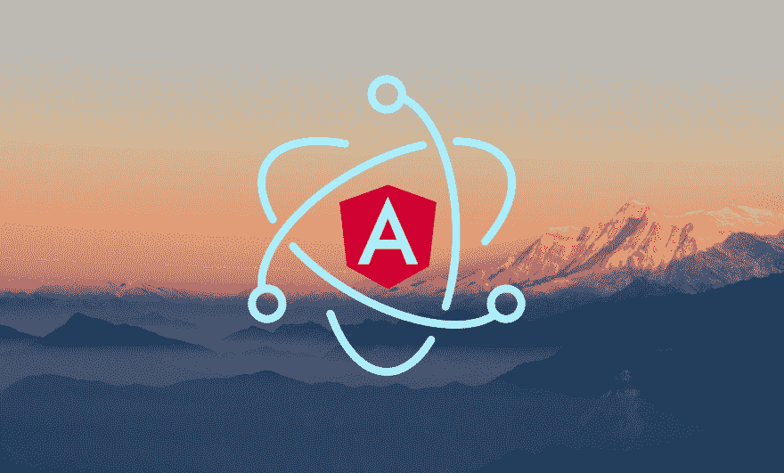

# 借助 Angular 的力量构建桌面应用

> 原文：<https://dev.to/ahmedmkamal/build-desktop-apps-with-the-power-of-angular-18g7>

[](https://res.cloudinary.com/practicaldev/image/fetch/s--6N2EVK1L--/c_limit%2Cf_auto%2Cfl_progressive%2Cq_auto%2Cw_880/https://thepracticaldev.s3.amazonaws.com/i/8nrdksll7i842jrkfckz.png)

> *能建网站就能建桌面 app。*

确实如此，如果你知道如何编写 Javascript 代码，你可以构建一个外观和行为都像本地应用程序的桌面应用程序。不仅如此，你还可以将 Angular 的力量带入桌面应用程序的世界，让你的 IU 看起来令人惊叹😍说够了，去喝杯咖啡，我们开始吧。

# 我们要做什么？！！

我们将使用[电子](https://electronjs.org/)和[角度](https://angular.io/)构建一个基本的桌面应用程序。

> 在我们开始之前，我希望你对 NodeJs 和 Angular 有一些基本的了解。

# 设置棱角分明

如果您尚未安装 Angular cli，请运行以下命令进行安装。

```
$ npm install -g @angular/cli 
```

Enter fullscreen mode Exit fullscreen mode

现在让我们开始一个新的角度应用。

```
$ ng new angular-electron 
```

Enter fullscreen mode Exit fullscreen mode

它会询问你想要使用的样式编译器，如果你想要使用角度路由器等等，这个配置一点也不重要选择你想要的。

您可以通过运行…
来查看您的应用程序现在的运行情况

```
$ cd angular-electron
$ ng serve 
```

Enter fullscreen mode Exit fullscreen mode

然后在[打开你的浏览器 http://localhost:4200/](http://localhost:4200/) ，反正那还不是最好笑的部分，我们继续前进。

我们需要修改项目的 src 文件夹中的 index.html 文件，给基本标签添加一个句点，这样我们的应用程序就可以找到静态文件，不要跳过这一步，这非常重要。

```
<base href="./"> 
```

Enter fullscreen mode Exit fullscreen mode

# 设置电子

现在，我们要添加电子到我们的应用程序。

```
$ npm install --save-dev electron 
```

Enter fullscreen mode Exit fullscreen mode

我们还需要一些依赖关系。

```
$ npm install --save-dev app-root-path 
```

Enter fullscreen mode Exit fullscreen mode

现在让我们为我们的电子应用程序创建一个新文件夹。

```
$ mkdir bin && cd bin && touch main.ts 
```

Enter fullscreen mode Exit fullscreen mode

正如你所看到的，我们创建了 bin 文件夹，里面有一个`main.ts`文件，我们创建主文件的扩展名是`ts`而不是`js`，是因为我们已经为 Angular 应用程序使用了 Typescript，那么为什么不为整个项目使用 Typescript 呢？！！

现在让我们添加一些代码到我们的`main.ts`文件中(最后我们写一些代码😅)

```
import { app, BrowserWindow } from 'electron';
import { resolve } from 'app-root-path';

// Keep a global reference of the window object, if you don't, the window will
// be closed automatically when the JavaScript object is garbage collected.
let win: BrowserWindow;

function createWindow () {
  // Create the browser window.
  win = new BrowserWindow({
    width: 800,
    height: 600
  });

  // Load the angular app.
  // Make sure that this path targets the index.html of the
  // angular application (the distribution).
  win.loadFile(resolve('dist/angular-electron/index.html'));

  // Emitted when the window is closed.
  win.on('closed', () => {
    // Dereference the window object, usually you would store windows
    // in an array if your app supports multi-windows, this is the time
    // when you should delete the corresponding element.
    win = null;
  });
}

// This method will be called when the Electron has finished
// initialization and is ready to create browser windows.
// Some APIs can only be used after this event occurs.
app.on('ready', createWindow);

// Quit when all windows are closed.
app.on('window-all-closed', () => {
  // On macOS it is common for applications and their menu bar
  // to stay active until the user quits explicitly with Cmd + Q
  if (process.platform !== 'darwin') {
    app.quit();
  }
});

app.on('activate', () => {
  // On macOS, it's common to re-create a window in the app when the
  // dock icon is clicked and there are no other windows open.
  if (win === null) {
    createWindow();
  }
});

// In this file, you can include the rest of your app's specific main process
// code. You can also put them in separate files and require them here. 
```

Enter fullscreen mode Exit fullscreen mode

上面的代码和在[官网](https://electronjs.org/docs/tutorial/first-app)提到的完全一样但是在 Typescript 语法中，还要注意链接到 Angular 应用入口文件的`win.loadFile`函数“我们还没有构建它”。

好吧，我们需要检查我们所做的是否有效，对吧！！

让我们向我们的`package.json`文件添加一个脚本，这样我们就可以构建并运行这个应用程序。

```
"main" : "bin/main.js",
"scripts": {
 ...
   “electron”: “tsc bin/main.ts && ng build && electron bin/main.js”
} 
```

Enter fullscreen mode Exit fullscreen mode

现在让我们来看看它的运行情况。

```
$ npm run electron 
```

Enter fullscreen mode Exit fullscreen mode

现在，您应该看到应用程序已经启动并运行，其中带有 angular 徽标，到目前为止一切顺利😉。

好了，现在我们已经运行了我们的应用程序，但是谁可以在 Angular 应用程序本身中使用电子 API 呢？！！

不要惊慌，这就像跑步一样容易……

```
$ npm install --save-dev ngx-electron 
```

Enter fullscreen mode Exit fullscreen mode

# 从 Angular 应用程序内访问电子 API。

我们刚刚安装了 [ngx-electron](https://github.com/ThorstenHans/ngx-electron) ，这将使我们的生活变得更加轻松，所以让我们来看看如何使用它。

我们需要像以前在`app.module.ts`文件中使用 Angular 一样导入这个模块。

```
import { NgxElectronModule } from 'ngx-electron';
@NgModule({
imports: [
  ...
  NgxElectronModule
]
})
export class AppModule {} 
```

Enter fullscreen mode Exit fullscreen mode

就是这样，现在我们可以在我们的组件中使用它，例如…

```
import { ElectronService } from 'ngx-electron';
export class AppComponent {
   constructor(private _electronService: ElectronService) {
   // now we have access to electron api through this service
   }
} 
```

Enter fullscreen mode Exit fullscreen mode

让我们看看我们是否真的可以访问电子 API。

用以下内容替换您的`app.component.ts`文件的内容。

```
import { Component } from '@angular/core';
import { ElectronService } from 'ngx-electron';

@Component({
  selector: 'app-root',
  templateUrl: './app.component.html',
  styleUrls: ['./app.component.scss']
})
export class AppComponent {
  title = 'angular-electron';

  versions = { node: '', chrome: '', electron: '' };

  constructor(private _electronService: ElectronService) {
    // Make sure that app is being executed inside of electron.
    if (this._electronService.isElectronApp) {
      // We have access to node process.
      this.versions.node = this._electronService.process.versions.node;
      this.versions.chrome = this._electronService.process.versions.chrome;
      this.versions.electron = this._electronService.process.versions.electron;
    }
  }
} 
```

Enter fullscreen mode Exit fullscreen mode

并用下面的
替换`app.component.html`文件的内容

```
<!--The content below is only a placeholder and can be replaced.-->

<div style="text-align:center">

  <h1>Welcome to {{ title }}!</h1>

  <ul>
    <li>Node version {{ versions.node }}</li>
    <li>Chrome version {{ versions.chrome }}</li>
    <li>Electron version {{ versions.electron }}</li>
  </ul>

</div> 
```

Enter fullscreen mode Exit fullscreen mode

你觉得怎么样？不要想太多，让我们看看实际情况😅。

```
$ npm run electron 
```

Enter fullscreen mode Exit fullscreen mode

现在，你应该看到我们使用的代码、chrome 和电子版本的应用程序启动并运行了，嗯，我们做到了😉。

# 结论

构建桌面应用程序并不困难，我们可以使用一些强大的工具，如 node、angular、electronic 和 typescript 来完成令人敬畏的工作，你知道吗？即使你是 web 开发人员，在空闲时间尝试一些新技术也不错，我很确定你会从尝试新技术中学到一些新东西😉。

如果我有时间，我可能会添加一个新帖子来为我们的应用程序编写一些单元测试。

如果你卡住了，你可以随时参考这个应用程序的 [Github repo](https://github.com/AhmedMKamal/angular-electron) 。

这篇文章最初发表在[媒体](https://medium.com/@en.ahmed.mk/build-desktop-apps-with-the-power-of-angular-1e44d13d77a4)