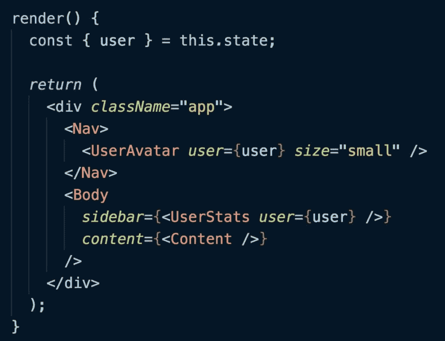

# 有限战争

> 原文：<https://dev.to/thekashey/infinite-war-995>

## 我们有一个问题

测试 React 组件的问题非常基本。讲的是`unit testing`和`integration testing`的区别。这是关于我们称之为单元测试和我们称之为集成测试的区别，规模和范围。

不是测试本身，而是组件架构。关于测试**组件**，独立库，和最终**应用**的区别。

> 你可以通过阅读[测试有限反应组件](https://hackernoon.com/testing-the-finite-react-components-d08ca74eb8c1)或者[为什么我总是使用浅层渲染](https://hackernoon.com/why-i-always-use-shallow-rendering-a3a50da60942)来更深入地研究这个问题，但是这里让我们跳过所有的糖。

## 定义问题

有两种不同的方法来测试 React 组件- `shallow`和所有其他组件，包括`mount`、`react-testing-library`、`webdriver`等等。只有`shallow`是特殊的——其余的都以同样的方式行事。

这种差异是关于*的大小，和*的范围——关于什么将被测试，只是部分*如何*。

简而言之——`shallow`只会记录对 React.createElement 的调用，但不会运行任何副作用，包括渲染 DOM 元素——这是 React.createElement 的一个副作用(代数)。

任何其他命令都将运行您提供的代码，同时也会执行每一个副作用。就像在现实中一样，这就是目标。

而**问题**是这样的:`you can NOT run each and every side effect`。

### 有何不可？

功能纯度？纯洁和永恒-今天的神圣奶牛。你正在屠杀他们中的一个。单元测试的原则——没有副作用，隔离，嘲笑，一切尽在掌握。

*   但那对 T2 来说不是问题...`dumb components`。它们是哑的，只包含表示层，但没有“副作用”。

*   但那是*给`Containers`的一个问题*。只要他们不是哑巴，包含他们想要的任何东西，并充分考虑副作用。他们就是问题所在！

很可能，如果我们定义了“正确组件”的规则，我们就可以很容易地进行测试——它将指导我们，并帮助我们。

> TRDL:有限成分

## 智能和非智能组件

根据[丹·阿布拉莫夫的文章](https://medium.com/@dan_abramov/smart-and-dumb-components-7ca2f9a7c7d0)演示组件有:

*   关心事物的外观。
*   可能包含表示和容器组件`**`,并且通常有一些自己的 DOM 标记和样式。
*   通常允许通过 this.props.children 进行遏制
*   不依赖于应用程序的其他部分，如 Flux 操作或商店。
*   不要指定数据是如何加载或变异的。
*   通过 props 专门接收数据和回调。
*   很少有自己的状态(即使有，也是 UI 状态而不是数据)。
*   被编写为功能组件，除非它们需要状态、生命周期挂钩或性能优化。
*   例子:页面，侧边栏，故事，用户信息，列表。
*   ....
*   而容器只是这些组件的数据/道具提供者。

根据起源:**在理想应用中…
容器是树。组件是树叶。**

#### 在黑暗的房间里找到黑猫

这里的秘方，一个我们不得不修改的定义，隐藏在*里面“可能包含表象和容器成分`**`”*，让我引用原文:

> 在本文的早期版本中，我声称表示组件应该只包含其他表示组件。我不再认为这是事实。组件是表示性组件还是容器是它的实现细节。您应该能够在不修改任何调用点的情况下用容器替换表示组件。因此，表示组件和容器组件都可以包含其他表示组件或容器组件。

好吧，但是让表示组件单元可测试的规则是什么呢？

不幸的是，通过将容器包含到表示组件中，你正在制造第二个**无限的**，并将依赖性注入到应用程序的其余部分。

或许这不是你想要做的事。所以，我别无选择，只能使哑分量有限:

**演示组件应该只包含其他演示组件**

而你唯一的问题，应该是:*如何？*

#### 溶液 1 - DI

解决方案 1 很简单——不要在哑组件中包含嵌套容器——包含`slots`。只要接受“内容”(孩子)，作为道具，那就解决问题了:

*   您可以在没有“应用程序的其余部分”的情况下测试哑组件
*   您可以用冒烟/集成/e2e 测试来测试集成，而不是测试。

```
// Test me with mount, with "slots emty".
const PageChrome = ({children, aside}) => (
  <section>
    <aside>{aside}</aside>
    {children}
  </section> );

// test me with shallow, or real integration test
const PageChromeContainer = () => (
  <PageChrome aside={<ASideContainer />}>
    <Page />
  </PageChrome>  ); 
```

丹本人认可:

> 丹阿布拉莫夫[@丹 _ 阿布拉莫夫](https://dev.to/dan_abramov)[@ dceddia](https://twitter.com/dceddia)我觉得这是对 React 最大的误解之一。如果能更加突出这种模式就太好了。请注意，通过让< Nav >和< Body >接受任何元素作为子元素，我消除了通过它们向下传递“用户”属性的需要。20:11PM-2018 年 7 月 24 日[](https://twitter.com/intent/tweet?in_reply_to=1021850499618955272)[](https://twitter.com/intent/retweet?tweet_id=1021850499618955272)217[](https://twitter.com/intent/like?tweet_id=1021850499618955272)790

DI(T0 和 T1)可能是这里最可重复使用的技术，能够使你的生活变得非常非常容易。

> 这里指出——愚蠢的组件是愚蠢的！

#### 解 2 -边界

这是一个相当声明性的解决方案，可以扩展`Solution 1`——只需声明所有的*扩展*点。用...把它们包起来..`Boundary`

```
const Boundary = ({children}) => (
  process.env.NODE_ENV === 'test' ? null : children
  // or `jest.mock`
);

const PageChrome = () => (
  <section>
    <aside><Boundary><ASideContainer /></Boundary></aside>
    <Boundary><Page /></Boundary>
  </section> ); 
```

然后——你可以禁用，只需归零，`Boundary`以缩小组件范围，并使其*有限*。

> 这里的要点是——边界在哑组件级别上。哑组件控制它有多笨。

### 解决方案 3 层

与解决方案 2 相同，但是具有更智能的边界，能够模仿*层*，或者*层*，或者随便你怎么说:

```
const checkTier = tier => tier === currentTier;
const withTier = tier => WrapperComponent => (props) => (
  (process.env.NODE_ENV !== ‘test’ || checkTier(tier))
   && <WrapperComponent{...props} /> );
const PageChrome = () => (
  <section>
    <aside><ASideContainer /></aside>
    <Page />
  </section> );
const ASideContainer = withTier('UI')(...)
const Page = withTier('Page')(...)
const PageChromeContainer = withTier('UI')(PageChrome); 
```

> 即使这几乎类似于边界示例——哑组件是哑的，并且容器控制其他容器的可见性。

#### 解决方案 4 -单独关注

另一个解决方案就是分离关注点！我的意思是-你已经做到了，也许是时候利用它了。

> 通过`connect`将组件还原或 GQL，你正在生产*众所周知的*集装箱。我的意思是——用*知名的*名字——`Container(WrapperComponent)`。你可以用他们的名字来嘲笑他们

```
const PageChrome = () => (
  <section>
    <aside><ASideContainer /></aside>
    <Page />
  </section> );

// remove all components matching react-redux pattern
reactRemock.mock(/Connect\(\w\)/)
// all any other container
reactRemock.mock(/Container/) 
```

这种方法有点粗鲁——它会删除所有的内容，使容器本身更难测试，而且你可能会使用更复杂的模仿来保留“第一个”:

```
import {createElement, remock} from 'react-remock';

// initially "open"
const ContainerCondition = React.createContext(true);

reactRemock.mock(/Connect\(\w\)/, (type, props, children) => (
  <ContainerCondition.Consumer>
   { opened => (
      opened
       ? (
         // "close" and render real component
         <ContainerCondition.Provider value={false}>
          {createElement(type, props, ...children)}
         <ContainerCondition.Provider>
         )      
       // it's "closed"
       : null
   )}
  </ContainerCondition.Consumer> ) 
```

> 这里的要点是:没有逻辑在里面，也没有表示，没有容器——所有的逻辑都在外面。

#### 奖金解决方案-单独关注

您可以使用`defaultProps`保持*紧耦合*，并在测试中取消这些道具...

```
const PageChrome = ({Content = Page, Aside = ASideContainer}) => (
  <section>
    <aside><Aside/></aside>
    <Content/>
  </section> ); 
```

## 所以？

所以我刚刚发布了一些方法来缩小任何组件的范围，并使它们更具可测试性。从`gearbox`中取出一个`gear`的简单方法。一个简单的模式，让你的生活更轻松。

E2E 测试很棒，但是很难模拟一些条件，这些条件可能发生在深度嵌套的特性中，并且要为它们做好准备。你必须有单元测试来模拟不同的场景。您必须进行集成测试，以确保一切都正确连接。

正如丹在他的另一篇文章中所写的:

> 例如，如果按钮可以处于 5 种不同状态(正常、活动、悬停、危险、禁用)中的一种，则更新按钮的代码必须对 5×4=20 种可能的转换保持正确，或者禁止其中一些转换。我们如何驯服可能状态的组合爆炸，并使视觉输出可预测？

虽然这里正确的解决方案是状态机，但是能够挑选单个原子或分子并使用它是基本要求。

### 这篇文章的要点

1.  表示组件应该只包含其他表示组件。
2.  容器就是树。组件是树叶。
3.  你不必*总是*不包含表象中的容器，但是*只在测试中不包含它们*。

PS:我会推荐阅读这个帖子的(自动翻译) [habr 版本](https://habr.com/post/434830/)。