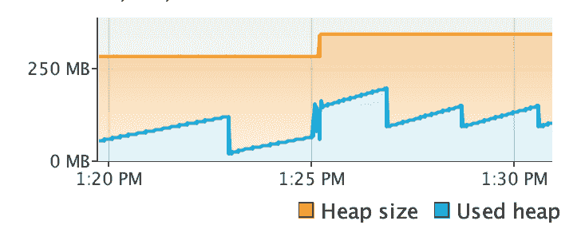
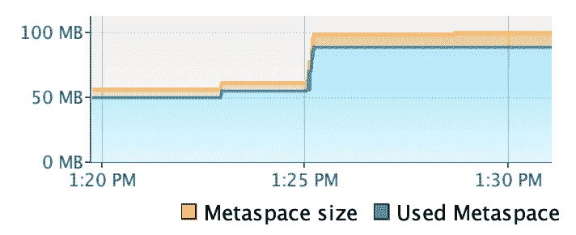
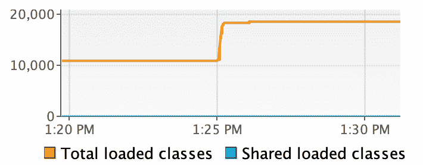

# JBOSS EAP 7.1+Spring boot hello world & visual VM 观察

> 原文：<https://dev.to/peysal/jboss-eap-71--spring-boot-hello-world--visualvm-observation-2e1i>

# 简介

在我之前的帖子中，我们已经知道 jboss-eap-7.1 在默认情况下(没有部署)会消耗你多少内存。现在来看看 spring boot hello world 的简单部署将如何消耗 JBOSS 中的内存。

## 涉及的工具

1.  jboss eap 7.1(咄)
2.  visualVm

## 我们是如何做到的

1.  创建一个简单的 hello world spring mvc
2.  将它部署到已经运行的 jboss eap 中
3.  监控虚拟虚拟机的内存使用增加情况

### 输出

部署后的堆大小:

部署后的元空间:

类加载后部署:

### 对刚刚发生的事情有些理论？

1.  嘿，这场战争有一堆库和类需要加载
2.  对象创建导致堆大小增加

### 事情要深思

1.  如果我们在同一个 jboss 实例中部署另一个 war 会怎么样？
2.  如果这场新战争与之前的战争共享同一个库会怎么样？