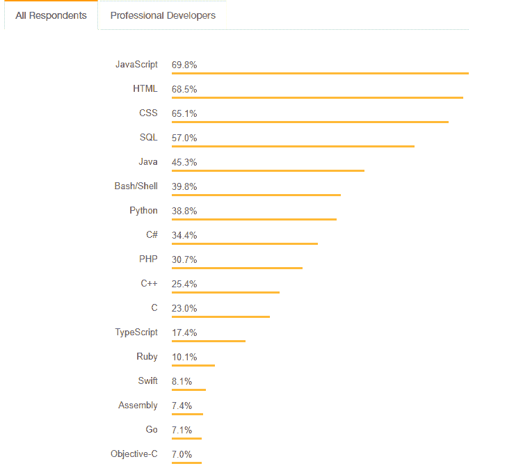
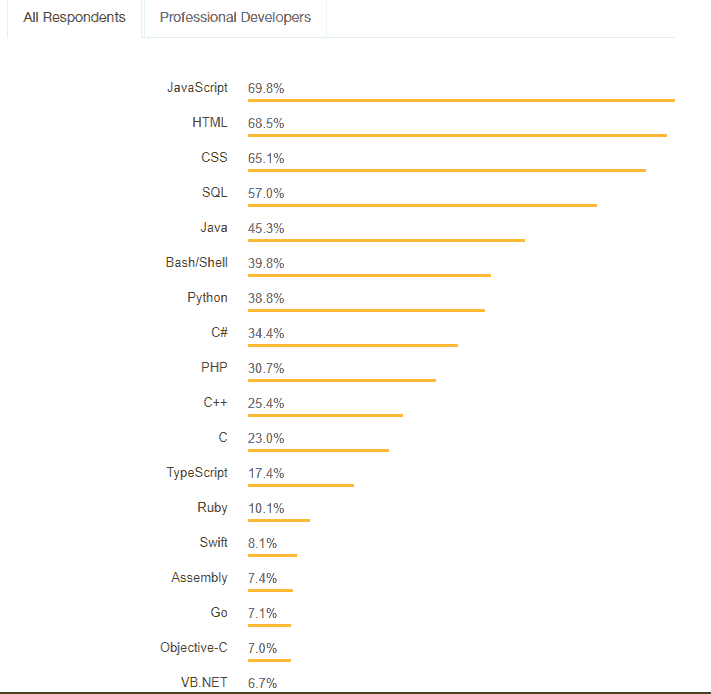
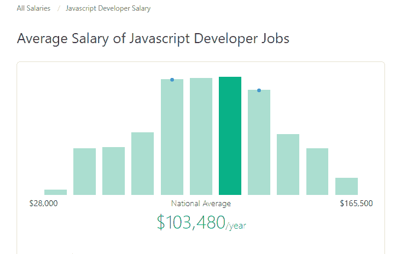

# 2019 年的 JavaScript

> 原文：<https://dev.to/sovit123/javascript-in-2019-3ggi>

这篇文章最初发表在我的博客上。检查一下 **[这里](https://debuggercafe.com/javascript-in-2019/)** 。

2019 年即将到来，没有比这更好的时间成为一名程序员了。所以，我们来看看 2019 年为什么要学习 JavaScript 及其应用。

有些人可能会问，为什么我现在要写 JavaScript？毕竟，JavaScript 不是一种未知的语言，需要学习它的人最终会学习它。首先，我需要一个话题来写，因为我每周都会发一篇文章。其次，有很多想在 2019 年开始学习编码，但又对应该选择什么语言感到困惑。最后，即使你对编程有所了解，你也可以从这篇文章中学到一些东西(或者可以在评论区提供你的想法来补充一些东西)。

## JavaScript 在 2018 年表现如何

在进入 2019 年 JavaScript 分析的状态之前，我们先来大致了解一下 JavaScript 在 2018 年的表现。

你们中对 JavaScript 稍微熟悉一点的人一定都经历过它的变化有多快。最显著的变化发生在 2015 年发布的 **[ES6](http://es6-features.org/#Constants)** 上，从此没有回头路。截至目前，当前版本是 **[ECMAScript 2018](https://www.ecma-international.org/ecma-262/9.0/index.html)** ，我敢肯定，每个开发人员都在猜测 **[ESNext](https://en.wikipedia.org/wiki/ECMAScript#ES.Next)** 将在 2019 年带来的所有变化。

来看看 **[栈溢出开发者调查 2018](https://insights.stackoverflow.com/survey/2018/)** 。

<figure> 

<figcaption>**[最热门技术](https://insights.stackoverflow.com/survey/2018/#most-popular-technologies)**</figcaption>

</figure>

<figure> 

<figcaption>
**[最热门技术](https://insights.stackoverflow.com/survey/2018/#most-popular-technologies)**</figcaption>

</figure>

上面两张图片清楚地表明，JavaScript 是 2018 年开发者中最受欢迎的技术，对于所有受访者和专业开发者来说也是如此。这只意味着 JavaScript 在 2019 年将会有更大的增长。

另外据 **[ZipRecruiter](https://www.ziprecruiter.com/Salaries/Javascript-Developer-Salary)** 美国一个 JavaScript 开发者的平均工资是 103480 美元/年，这无论如何都不是一个小数目。

<figure>

<figcaption>
**[Javascript 开发人员岗位平均工资](https://www.ziprecruiter.com/Salaries/Javascript-Developer-Salary)**
</figcaption>

</figure>

你还可以看到一个 JavaScript 开发人员的工资可以高达 165，500 美元。我认为这是成为 JavaScript 开发人员的一个很好的理由，尽管你必须有相当多的经验才能得到这样的工作。

关于 2018 年 JavaScript 的运行，已经说得够多了。不过，如果你想分析得更多一点，你可以随时访问这个很棒的网站，**[JS](https://2018.stateofjs.com/introduction)[的状态。](https://2018.stateofjs.com/introduction)** 这个网站会让你非常清晰地了解 JavaScript 在 2018 年的表现。

现在让我们继续来看看 2019 年你为什么要学习 JavaScript。

## 2019 年学 JavaScript

第一个问题是，2019 年应该让哪些人学习 JavaScript？好吧，如果你是一名开发人员，以前从未尝试过 JavaScript，那么你真的应该尝试一下 JavaScript。如果你以前从未编写过代码，并且想开始你的编程之旅，那么你也会喜欢 JavaScript。

第二个问题是为什么要学习 JavaScript？简而言之，如今 JavaScript 几乎可以用来构建任何东西。显然，我们首先想到的是 Web 开发，但这不是唯一的用途。你可能会问，其他用途是什么？好问题。嗯...，让我们看看，

### Web 开发

我知道这是 JavaScript 最常见的用例，但我仍然觉得不提到这一点将很难向前推进。

在 Web 开发中，可以与 JavaScript 一起使用的前端和后端框架非常多。正因为如此，在过去的几年中，我们看到了 web 行业的巨大增长，一些最令人惊叹的 web 应用程序是用 JavaScript 构建的。

对于前端部分，HTML 和 CSS 是非常基础的技能。除此之外，还有许多框架。 **[React](https://reactjs.org/)** 、 **[Vue](https://vuejs.org/)** 和 **[Angular](https://angular.io/)** 是最受欢迎的三种。你可以选择并从其中任何一个开始，但是每次坚持精通一个。如果你想探索，也有许多其他前端框架。请随意查看。

如果你对 web 开发的后端部分更感兴趣，它主要处理服务器，而不是节点。Js 是你最好的选择。在你潜入 Node 之后。Js 你会发现它也有框架。 **[快车](https://expressjs.com/)** 是现在最流行的一种。随意探索你所有感兴趣的领域，花时间为自己选择正确的道路。

### 移动开发

JavaScript 让开发人员无需迁移到另一种语言就能轻松构建高质量的原生移动应用。在这种情况下 **[反应原生](https://facebook.github.io/react-native/)** 是最好的选择。React Native 可以帮助构建真正高质量的 Android 和 iOS 应用程序。如果你打算学习 React，那么你也可以用 React Native 将大部分知识转移到移动开发中。

### 桌面应用程序

JavaScript 也借助**[electronijs 这样的框架涉足桌面应用开发。](https://electronjs.org/)** 还有其他不错的选择。如果你有兴趣，你可以阅读 **[这篇](https://brainhub.eu/blog/javascript-frameworks-for-desktop-apps/)** 精彩的文章，了解一些桌面应用开发的主要参与者。

### 游戏开发

是的，游戏开发也是如此。看来 JavaScript 没有止点。有了像 **[Phaser](https://phaser.io/)** 这样的框架和像 **[PixiJs](http://www.pixijs.com/)** 这样的渲染器，你就能创造出真正令人敬畏的基于网络的游戏。显然 Unity 和 Unreal 是游戏开发的行业标准，但是当你开始学习 JavaScript 的时候尝试新事物有什么坏处呢？你可以在这篇 **[中的文章](https://medium.com/@VadimBrodsky/javascript-game-development-where-to-start-5bdc097cbd6e)** 中阅读由**[Vadim Brodsky](https://medium.com/@VadimBrodsky?source=post_header_lockup)**撰写的关于使用 JavaScript 进行游戏开发的内容。

### 物联网和机器人

JavaScript 还能让你给机器人编程，构建和控制物联网设备。随意查阅以下， **[Johnny-Five](http://johnny-five.io/)** ， **[Nodebots](http://nodebots.io/)** ， **[Cyclon.js](https://cylonjs.com/)** 。

### 机器学习

***终于有话要说了。对吗？*** 现在机器学习也可以用 JavaScript 了。像 **[TensorFlow.js](https://js.tensorflow.org/)** 这样的库也使得在浏览器中训练模型成为可能。我认为，如果您自己探索这一部分将是最好的，因为这需要专门的文章。首先，你可以阅读这篇文章，然后下定决心从哪里开始。

## 最后的话

我认为以上是足够的理由来获得一些学习 JavaScript 的动力，如果有人想从这个新年开始编程的话。那都是我这边的。现在轮到你开始学习和建造一些令人惊奇的东西了。

如果你喜欢这篇文章，那就和你认为能从中获益的人分享吧。也评论分享一下。如有疑问，请点击 **[此处](https://debuggercafe.com/contact-us/)** 联系 。是的，还有一件事，新年快乐，并有一个美好的 2019 年。