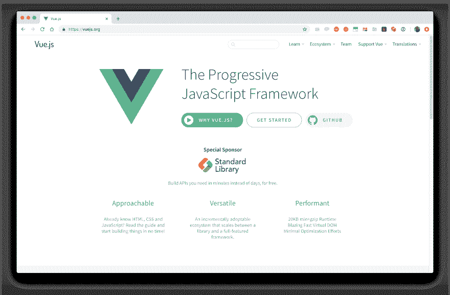

# 2019 年学习 Vue.js 的七大理由

> 原文：<https://dev.to/rossta/seven-reasons-learn-vuejs-in-2019-2n9o>

我喜欢在 Vue.js 中构建应用程序，这就是为什么我认为框架及其社区的未来是光明的。

### 1。不需要构建步骤

Vue 哲学的一个重要方面是易于开始。与其他一些流行的框架不同，没有必要使用复杂的构建工具(如 Webpack)来构建应用程序。只需包含一个指向用于开发或生产的最新版本的脚本标签，就可以访问 Vue 运行时。

```
<script src="https://cdn.jsdelivr.net/npm/vue@2.5.21/dist/vue.js"></script> 
```

进入门槛低使得 Vue 成为值得考虑的第一个学习的 JS 框架。

### 2。世界级的命令行界面

当然，许多开发人员正在寻找高级开发特性，如 es 或 TypeScript transpilation、热模块替换和树抖动，这些都是通过构建工具实现的。Vue 也帮你搞定了。

```
npm install -g @vue/cli
vue create my-project 
```

在过去的一年里，Vue 核心团队从头开始重新编写了他们的命令行界面，最终推出了 Vue CLI 3。它旨在推广最佳实践和全功能默认 Webpack 配置，这种配置应该更容易扩展，而不会增加升级难度，即“无需退出”Vue CLI 提供了大量有用的附加功能，包括交互式项目初始化向导(可通过终端或基于 web 的 UI 获得)、支持社区附加组件的生成器和配置的插件系统，以及指定替代构建目标(如 web 组件或库)的能力。

### 3。友好学习曲线

我听到的关于 Vue 的一个常见批评是，它的 API 比其他一些流行的框架有更大的表面积，我在某种程度上同意这一点(取决于框架)。具有讽刺意味的是，我听到的另一件事是[比](https://hackernoon.com/should-you-learn-react-or-vue-first-7dc0d4dd8c04)和[比](https://www.quora.com/How-does-Vue-js-compare-to-React-js)更容易学。尽管是主观的和轶事的，但这适用于我听说过的人，不管他们以前是否有 JavaScript 框架和一般 JavaScript 的经验。

我认为，一个原因是 Vue 是一个“渐进式 JavaScript 框架”

[](https://res.cloudinary.com/practicaldev/image/fetch/s--Ao7M8RNa--/c_limit%2Cf_auto%2Cfl_progressive%2Cq_auto%2Cw_880/https://thepracticaldev.s3.amazonaws.com/i/jlme30ylv1zzv9vo9mr0.png)

不需要学习整个 API 就能上手 Vue，不需要像 JSX 一样学习新的语法；入门只需要基本的 HTML、CSS、JS 知识。

### 4。坚实的生态系统

在 Vue 之前，我对学习基础知识之外的最佳实践的分裂性感到沮丧。应该用什么客户端路由器？我应该使用哪种数据管理/流量实现？我如何测试我的组件？我应该如何配置我的构建系统？随着时间的推移，回答这些问题变得越来越容易，这取决于社区，但我从一开始就喜欢 Vue 的方法。

Vue 为几个重要的附加组件提供官方支持，包括用于客户端路由的`vue-router`、用于管理状态的`vuex`、用于单元测试组件的`vue-test-utils`、用于调试的`vue-devtools`浏览器扩展、如前所述的 Vue CLI。这些工具都不是必需的，Vue 可以很好地使用这些库的替代品，比如用`redux`或`mobx`代替`vuex`，或者另一个路由器。关键的一点是，社区通过支持一组非常好的推荐默认值来帮助开发人员，这是像 Ruby on Rails 这样的后端框架传统上做得非常好的事情。

### 5。Vue 实例

Vue 最有力的方面是它的[反应系统](https://codingexplained.com/coding/front-end/vue-js/understanding-vue-js-reactivity)。我们可以通过[的`Vue`实例](https://vuejs.org/v2/guide/instance.html)来挖掘它。

```
new Vue({
  el: "#app",
}) 
```

这种调用是每个 Vue 应用程序初始化的方式。它还创建了应用程序的完全反应性的根组件。Vue 实例也可以用作事件总线，或者独立于应用程序组件树跟踪依赖关系的变化，比如说，作为 Vue 插件的实现细节。

Vue 的反应系统简洁美观。使用 Vue 实例是理解反应系统如何工作以及提高一个人的 Vue 和 JavaScript 技能的一个很好的方式。

### 6。Vue 3 今年登陆

说到 Vue 的反应系统， [Vue 3 预计今年出货](https://medium.com/the-vue-point/plans-for-the-next-iteration-of-vue-js-777ffea6fabf)。在一些架构和性能改进以及微小的 API 变化中，Vue 3 提供了一个新的基于代理的反应系统实现。

基于代理的系统通过 Vue 变化检测解决了一些已知的问题:

在 Vue 2 中，Vue 不能:

1.  检测属性添加，例如`vm.b = 2`
2.  通过索引或修改长度来检测数组修改，例如`arr[0] = 2`

*   工作区:使用`Vue.set`，例如`Vue.set(vm, 'b', 2)`

Vue 3 基于代理的反应使得这些恼人的问题消失了。

### 7。一个了不起的社区

自从我开始使用 Vue 以来，我很幸运地通过论坛、在 Twitter 和 GitHub 上以及在当地的聚会上向各种各样的 Vue 开发者学习。Vue 有一个分散的、努力工作的核心团队，他们不断改进框架，而不会给开发人员带来过多的附加功能或痛苦的升级负担。Vue 论坛是从专家那里获得关于棘手问题的见解的好方法。Vue 会议，如 [VueConf.us](https://vueconf.us/) 和 [Vue Amsterdam](https://www.vuejs.amsterdam/) ，是联系社区其他成员和参加更深入研讨会的好方法，已经在世界各地举行。还有 [Vue Vixens](https://vuevixens.org/) ，这是一个为自称女性的人提供安全环境来学习 Vue.js 的组织。

### 奖金。这只是单纯的乐趣

我开始从事 web 开发的时候，Ruby 和 Rails 框架刚刚起步。我一直喜欢 Ruby 的一点是它的创造者 Yukihiro Matsumoto 明确的(并且，我敢说，大胆的)目标是发明一种为开发人员的快乐而优化的语言。

当我用 Vue.js 构建界面时，我也有同样的感觉。我花在配置和 API 上的时间更少了，而花在构建和享受其中的时间更多了。

虽然我不知道 Vue.js 是以开发人员快乐的名义如此明确地创建的，但它已经并将继续为此而努力。这是我从许多花时间学习该框架的其他人那里听到的，可能也是我将在 2019 年推荐 Vue.js 的最重要原因。

* * *

你还在等什么？祝你来年的 Vue.js 之旅好运。

你喜欢这个帖子吗？订阅我在[rossta.net](https://rossta.net)的时事通讯，我会给你发一封关于 vue . jsweb 开发的邮件