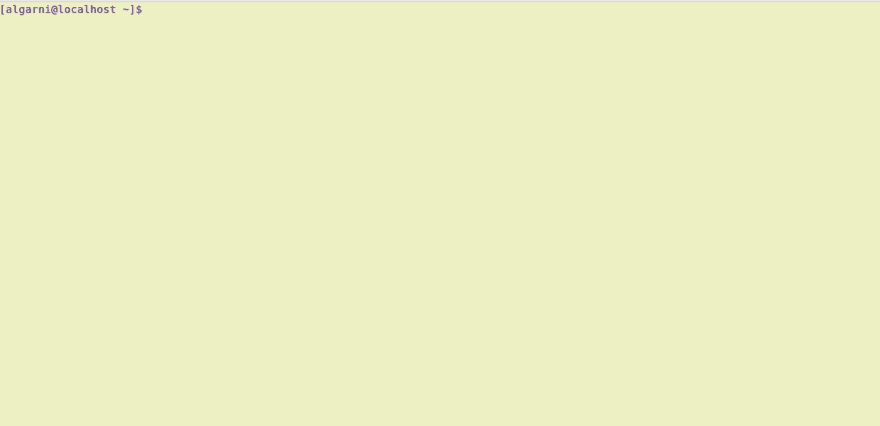

# 带有 Docker & Go 的艺术终端

> 原文：<https://dev.to/elgarni/artistic-terminal-with-docker--go-2h8b>

我不是一个使用*终端*的粉丝，我总是喜欢看到一些东西，然后点击它们。但是很多时候我发现自己不得不在终端上写命令。有时因为这样更快，有时这是完成我的工作的唯一方法。

就像生活中的任何事情一样，有时事情并不如意。有了终端，错误会令人望而生畏，你会像..

[](https://i.giphy.com/media/13xHqoOQOdFu5a/giphy.gif)

因为我喜欢插图，所以我在想一些我可以在终端上看的东西，这样无论我在做什么都可以转移我的注意力。因此，我想到了以下几点:

[](https://res.cloudinary.com/practicaldev/image/fetch/s--hFlCszFE--/c_limit%2Cf_auto%2Cfl_progressive%2Cq_66%2Cw_880/https://raw.githubusercontent.com/Elgarni/Ascii-Art-with-Docker-and-Go/master/docs/result-on-terminal.gif)

所以我创建了一个 Docker 映像，它包装了一个在终端上显示艺术文本的 Go 应用程序。要尝试一下，您可以运行下面的代码:

```
docker run --rm -e text="Your favorite word" elqarni/hala 
```

更进一步，您可能想要发送*“Docker run ..”*向朋友发送命令，但隐藏了文本。你可以通过用 *base64* 编码来隐藏文本。

例如，文本*“Hello there”*用 base64 编码为*“SGVsbG8gdGhlcmU = "*。然后你运行命令:

```
docker run --rm -e text="SGVsbG8gdGhlcmU=" -e hidden=true elqarni/hala 
```

在我的情况下，我会鼓励你运行下面的:)

```
docker run --rm -e text="SGFwcHkgTmV3IFllYXI=" -e hidden=true elqarni/hala 
```

最后，如果你有兴趣，你可以在 [Github](https://github.com/Elgarni/Ascii-Art-with-Docker-and-Go) 上找到 *Dockerfile* 和 *Go 源代码*