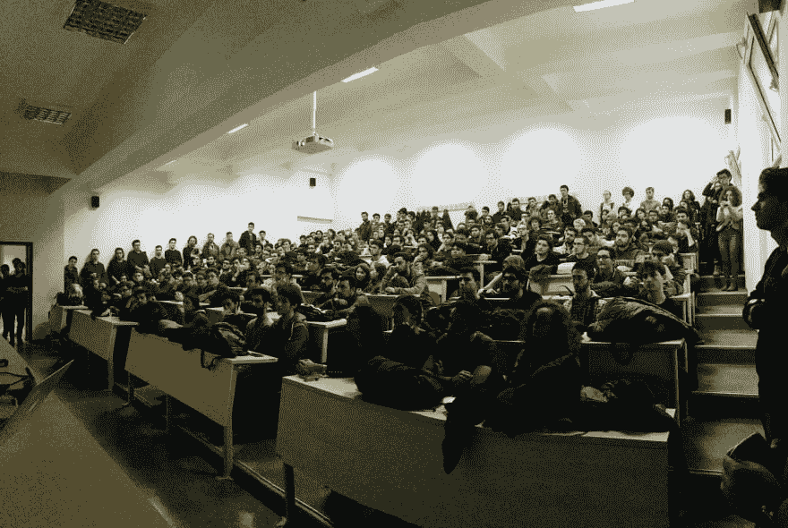

# 📣伊尔迪兹理工大学的职业讲座

> 原文：<https://dev.to/sezginege/career-talk-at-yildiz-technical-university-4blk>

几个月前，我有机会作为一名伊尔迪兹技术大学的学生谈论我如何在毕业后建立我的职业生涯，以及几年前我想学习的一些东西。非常感谢[巴努·迪里博士教授](https://www.ce.yildiz.edu.tr/personal/banud)和[天空实验室](https://www.facebook.com/ytuskylab)团队组织了这次精彩的活动！

我真的很喜欢呆在那里，尽我所能回答人们的问题，✌️，我希望我们能更多地参加这种组织。看起来我们应该，在所有这些[伟大的反馈之后。](https://blog.sezginege.com/assets/2019-01-01-Career-Talk-Yildiz-Technical-University/doc/Feedback.pdf)T3】

## [从谈话中强调的几件事](#few-things-to-emphasize-from-talk)

分享演讲的记录而不是做一个非常简短的总结会很棒，但是我们没有安排摄像机。

### *经验是我们从生活中得到的，而不是我们期待的*

不能保证你的梦想一定会实现。你需要努力去实现它们，但是有时候，这还不够。此外，你不应该忘记决策本身没有好坏之分。我们作为决策者，让他们变好或变坏，取决于我们做出决定后的行动。无论你做什么或者你决定什么，全心全意去做，这将是一个好的决定。

### *有计划*

有一个计划会让你专注于实现你的最终目标。不要让计划给你带来压力。你不可能对每件事都有计划，但是考虑你的职业或健康是一件值得担心的事情。

### *做自己喜欢的事情*

我知道这听起来很老套，我也同意。几乎不可能一直享受我们正在做的事情。我们做的每件事都有积极或消极的一面。这里重要的是你如何感受一天的结束。你开心吗？如果是，那就继续，如果不是，考虑一下可能是个好主意。

## [常见问题](#faq)

*   你关注哪些博客？
    *   大多数时候，讨论发生在 Twitter 上。但是，我相信博客仍然是一个东西，有好的作者/公司可以效仿。我不能列出所有的，但这些至少是我最喜欢的。
    *   杰夫·阿特伍德的《http://blog.codinghorror.com/》
    *   马丁·福勒的《https://martinfowler.com/》
    *   [https://medium.com/netflix-techblog](https://medium.com/netflix-techblog)网飞
    *   [https://medium.com/airbnb-engineering](https://medium.com/airbnb-engineering)通过 Airbnb
    *   泰德·卡明斯基的《https://www.tedinski.com/》
    *   斯科特·汉瑟曼的《https://www.hanselman.com/》
    *   [https://ahmet.im/blog/](https://ahmet.im/blog/)由艾哈迈德·阿尔普·巴尔干
*   你建议参加哪些会谈？
    *   请看这份回购:[https://github.com/hellerve/programming-talks](https://github.com/hellerve/programming-talks)
*   我们应该寻找哪些资源来提高我们的技能？
    *   解决同样的问题有不同的方法。看看是否有人已经发明了轮子是很好的。所以，我强烈建议寻找那些`"simply a generalized, reusable solution to a commonly occurring problem."`的设计模式
    *   [为人类设计模式](https://github.com/kamranahmedse/design-patterns-for-humans)
    *   试着理解大规模系统是如何工作的:
    *   [系统设计入门](https://github.com/donnemartin/system-design-primer/blob/master/README.md)
    *   我不能创造的东西，我不明白——理查德·费曼
    *   [打造自己的 x](https://github.com/danistefanovic/build-your-own-x/blob/master/README.md)
*   你加入亚马逊的时候英语水平如何，现在如何？
    *   当我加入亚马逊的时候，我相信它是 B1。我能够很容易地理解人们。但我的问题是要流利地说话。所以，我太害怕与人交谈。我仍然犯很多语法错误，但至少现在，我可以毫无困难地交流了。
*   你建议去国外生活吗？
    *   绝对的。我很高兴与世界各地的人们见面并一起工作，倾听他们的故事并向他们学习。

## [结论](#conclusion)

我真的很感谢邀请，我真的很喜欢在那里！非常感谢大家！