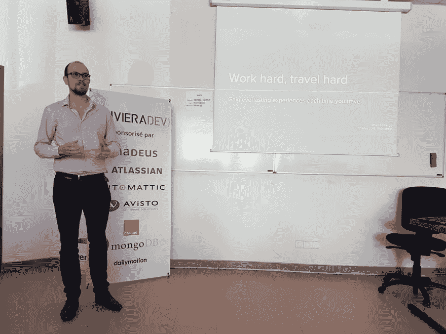
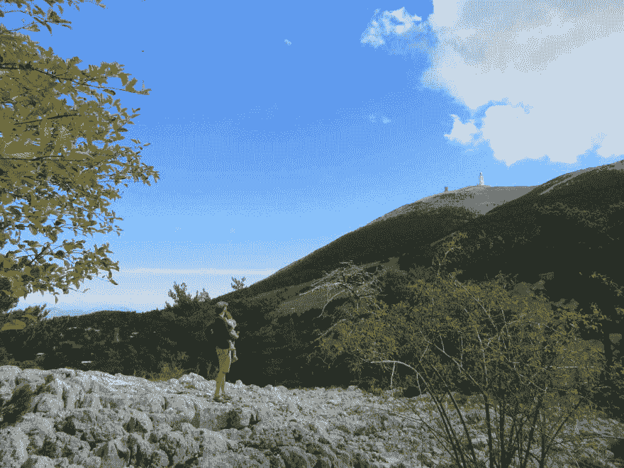

# 2018 年回顾

> 原文：<https://dev.to/sandordargo/review-of-2018-28cn>

又来了？年底了？我几乎忘了冷静地坐下来回头看。

这是硕果累累的一年，充满了乐趣和挑战。

简而言之:

*   我的第二个孩子，我的儿子丹尼尔出生了
*   我换了队
*   我在 Riviera Dev 展示了
*   我们又去了很多地方
*   我兼职赚了第一百美元

## 新来的小鬼在拦着

当我寻找我的新团队时，我有一个非常精确的问题。我可以在第二个孩子出生后马上休假一个月吗(所以在日期上有一些弹性)？这是一个破坏交易的问题，但它没有被打破，它受到了尊重。感谢我的管理团队！

我儿子出生于 6 月 1 日，差不多 7 个月前。

他对我很好。当我在里维埃拉的时候，他没有敲门。谢谢你，丹尼尔！

分娩期间，我和妻子在医院，我们解决了把女儿留在哪里的难题。我们找到了一些临时保姆，但我妻子在一些妈妈聚会上认识的人说他们已经有 3 个孩子了，多一个晚上不成问题。他们住在离医院 15 分钟路程的地方。谢谢你，温迪！我们的女儿在那里玩得很开心，我们已经见过一次面了。希望春天能再见到他们。

我觉得和丹尼尔在一起比和达尔玛在一起更困难。他已经住进了医院，因为他有一些严重的发烧，但他幸运地康复了。他睡不好，但至少晚上和我在一起时，他哭得越来越少了。

尽管困难重重，他还是很高大，很强壮。他有时已经站了起来，但他马上就摔倒了。目前为止做得很好！

## 也不全是休闲。

我在今年的第一天就加入了 Amadeus 的汽车和休闲服务公司。一年后我能说什么？

我从一个队友那里收到的第一个评论是，他们不明白为什么会有人来这个团队。多好的开始啊！再说一次，一年后我能说什么呢？这是很好的一年，虽然我知道有一些困难，现在仍然有，但他们越来越少，球队通过学习和招募变得越来越强。

有时我认为我的日常工作中涉及的编码不够多，但我有足够的自由来为自己找到足够多的自动化和安全测试形式的有趣任务。是的，安全测试。我被要求承担白帽子的责任。嗯，我们公司的 WH 更像是项目协调员，但是和 WH 的一些同事一起，我们试图赋予这个角色更强的技术含量。

我仍然可以说我的工作是有趣的，我们有很多技术债务要解决，慢慢地但肯定地，我看到越来越多的人对解决这些问题感兴趣，并采取行动。

我们有定期的知识分享会议和编码道场，帮助我们变得更好。如果事情继续这样发展下去，我会更开心地待下去。

## 桑多？在场！

我正在更加认真地打造我的个人品牌。一个标志是这个博客和一些比以前更专业的文章。

建立我的品牌的另一个方法是，我不断寻找新的展示可能性。

我提交了参加里维埃拉发展会议的申请，并被接受了！事实上，我提交了三个，他们接受了非技术性的，但这没关系。我认为可能性很大。的确如此。我在*“我们不仅仅是开发者”*赛道上发表了一篇关于我们如何组织假期的演讲。

我在那里遇到了一些有趣的人，一些来自我的公司，这帮助我在我们内部的全球技术论坛上获得了一席之地，在那里我可以谈论编码指南的重要性。多好的一年啊！

但我也在我的部门发表了一些知识分享演讲。

明年会带来什么？谁知道呢！

我参加了当地演讲会小组的几次会议，但是由于我们在最初几年的家长时间表，我不能加入这个小组。过一会儿我肯定会的。

## 努力工作，努力旅行

这是我的演讲和 RivieraDev 的标题。我是认真的。

一月份，我们进行了一次愉快的往返旅行。我们飞到了葡萄牙南部，在那里我们参观了一些可爱的村庄和迷人的海岸！一切都是那么空旷，食物也很美味！

我们开车去了里斯本，在那里又花了几天时间，不仅参观了这座城市，还参观了辛特拉及其色彩斑斓的宫殿。

从那里，我们没有飞回法国尼斯的家，而是飞到了另一个家，回到匈牙利布达佩斯，在那里与家人和朋友度过了几天美好的时光。

随着预产期的临近，我们暂停了旅行，和我们四个月大的新宝宝一起度过了我们的第一个假期。我们没走多远，只有几百公里。我们参观了罗纳河三角洲，也就是众所周知的自然美景卡马格。它是如此平静。有些地方我什么都听不到，只有我们的脚步声、风声和动物的叫声。远处没有汽车，没有飞机从我们头顶飞过，没有火车，什么都没有。

从那里我们去了阿维尼翁，去了教皇的城市，我们甚至参观了最好的葡萄酒之一——Pape 酒庄。大部分的酒确实很贵，但有可能品尝其中的一些，甚至发现了一些我认为隐藏的宝石。

我们在普罗旺斯群山之间的小村庄里又呆了几天，我的一个梦想实现了。我们去了——暂时只能坐汽车去文图山。天哪，天气真的很冷，风也很大，但是很值得！

没有家人，我也去了巴黎两天，尽管只是因为官僚主义，但我总是把它与拜访朋友结合起来，当然，还有我在巴黎最喜欢的地方。圣安妮街、圣母院和圣心教堂，我不能不去。

我也有机会回到布达佩斯的家住几个晚上，在我父亲 60 岁生日的时候给他一个惊喜。感谢我的妻子，她在这近 4 天里独自照顾孩子们，让这一切成为现实！

我们已经在计划 2019 年的两次大型巡演，在那里更多的梦想将成为现实！

## 即使在我睡觉的时候，钱也会进来

好吧。没有那么多，但仍然。一开始我有点怀疑，但我赚了第一百美元，即使只是亚马逊代金券的形式。我读了很多书，既有兴趣也有专业原因，我倾向于分享我对我喜欢的书的想法。我几乎总是使用推荐链接。对于点击链接的人来说，它们不需要任何费用，但它可能会给我带来一些钱。耶！

## 结论

这是一个充满欢乐和幸福的好年头，但也有疲劳。那很好。我们永远不会像我们在匈牙利常说的那样糟糕！

圣诞快乐，新年快乐！

*本文最初发表在[我的博客上。](http://sandordargo.com/blog/2018/12/30/review-of-2018)T3】*