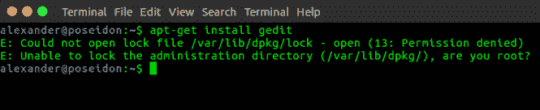

# 使用 sudo 命令获得 root 权限。

> 原文：<https://dev.to/xeroxism/get-root-privileges-using-the-sudo-command-4l3n>

## [T4】](https://i0.wp.com/fossnaija.com/wp-content/uploads/2018/12/ass.png?ssl=1)

## sudo 命令

Linux 中的 sudo (super do) [命令](https://fossnaija.com/the-anatomy-of-the-linux-command-line/)用于授予某些用户少量的[超级](https://fossnaija.com/the-linux-user/) (root/administrator)权限。有了这些被授予的权限，普通用户就可以发出 root 命令，在系统上执行任何管理任务。

如果您想以普通用户的身份使用 sudo 来运行命令，您可以使用以下格式将 sudo 命令添加到您要执行的命令前面:

```
sudo <command> 
```

Enter fullscreen mode Exit fullscreen mode

例如，试图[安装任何应用程序](https://fossnaija.com/installing-software-on-linux-using-gui/)(没有 sudo 命令)将会返回一个错误，因为这样的特权留给了[根用户](https://fossnaija.com/the-linux-user/)；

[](https://i1.wp.com/fossnaija.com/wp-content/uploads/2018/12/sudo_command_1.png?ssl=1)

当用户在终端中输入 sudo 命令时，他必须提供一个可信的密码，之后他就可以在一段特定的时间内(默认为 5 分钟)不用输入密码就可以重用该命令。

当未经授权的用户试图使用 sudo 命令时，终端会返回一个错误，并由系统记录下来。这个日志可以帮助 Linux 系统管理员监控系统上的 it 使用情况。

快乐的 Linux！

post [使用 sudo 命令获得 root 权限。](https://fossnaija.com/get-root-privileges-using-the-sudo-command/)最早出现在[福斯奈亚](https://fossnaija.com)上。