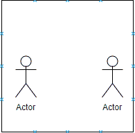
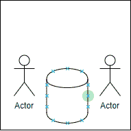
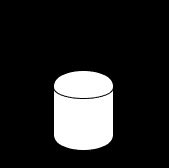
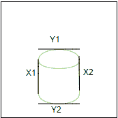

# 如何在 python 中跟踪 Rubric 的立方体对象

> 原文：<https://dev.to/mkhy19/christmas-tracking---how-to-track-rubrics-cube-object-in-python-4me4>

一个月前，我在考虑 12 月份要写些什么，我决定今年最好的结尾是我学到的最后一件事。这就是计算机视觉。

# 目标跟踪是计算机视觉和机器学习众多应用中最重要的组成部分之一。

### 物体跟踪就像你在侦察或跟踪一个物体或人或汽车，以了解物体的位置和这个物体是如何移动的，它的速度，它要去哪里等等。

但是在我们开始讨论理论和实现之前。我想告诉你，在你看完这个博客之后，我们将会制作这个视频。[https://www.youtube.com/embed/8Bk_I_H8GlQ](https://www.youtube.com/embed/8Bk_I_H8GlQ)

首先，有跟踪对象的步骤或阶段:

1.  **背景:**是指除了我们要跟踪的对象之外，所有背景都存在的图像或帧。
    例如，如果我们想跟踪街道上的汽车或废纸篓，我们必须为没有汽车或废纸篓的街道拍照。
    [T6】](https://res.cloudinary.com/practicaldev/image/fetch/s--YbJMBjTW--/c_limit%2Cf_auto%2Cfl_progressive%2Cq_auto%2Cw_880/https://i.imgur.com/cBlGhJq.png)

2.  **当前帧:**是有背景和我们的对象的图像或帧
    [](https://res.cloudinary.com/practicaldev/image/fetch/s--CaiHOJt_--/c_limit%2Cf_auto%2Cfl_progressive%2Cq_auto%2Cw_880/https://i.imgur.com/GjCQiho.png)

3.  **数学减法:** sub(Background，Frame)
    例如，如果我们有两个像 prev 一样的图像，我们对这两个图像进行数学减法，结果将是对象。
    **注意我们减去的像素:**

    *   如果两个像素相同，结果是 0，这给了我们黑色像素
    *   如果两个像素不相同，我们不能说结果是 1 是白色的，它可以是另一个值。但不一定是白人。
4.  **滤波器:**上一步的数学减法在此应用阈值滤波器，以获得两幅图像之间的差异。
    比如我们做一个条件，让所有小于 100 的像素等于零，所有大于等于 100 的像素等于 255。这里我们可以看到我们的对象
    [](https://res.cloudinary.com/practicaldev/image/fetch/s--61FphWoK--/c_limit%2Cf_auto%2Cfl_progressive%2Cq_auto%2Cw_880/https://i.imgur.com/7WvXxjZ.png)

5.  **遮蔽& & :** 在我们的数学减法的结果和当前帧之间有物体。
    **你还记得:**

    *   0 &&任何值=> 0
    *   255 &&任意值！=0 = >任意值！=0

    这里我们只从框架中得到物体的颜色。

6.  **斑点检测:**斑点是帧中共享一些共同属性的一组连接的像素。比如物体周围的黑色连接区域。斑点检测的目标是识别和标记这些区域。
    斑点检测是从过滤阶段开始扫描图像，直到物体周围的白色发生颜色变化(称为边缘)。然后在物体周围画出要计算的包含盒或包含矩形(X1，X2，Y1，Y2)即高度和宽度。然后我们可以得到容器盒的中心
    [](https://res.cloudinary.com/practicaldev/image/fetch/s--jzrMHykf--/c_limit%2Cf_auto%2Cfl_progressive%2Cq_auto%2Cw_880/https://i.imgur.com/okoqgC6.png)

## **这是关于物体检测的概念，现在让我们检测红色立方体的绿色，并跟踪它在帧中的移动**

首先，我们导入必要的包。我们将使用 deque，一种类似列表的数据结构，它允许我们绘制标题的尾部或轨迹。

```
import cv2
import imutils
import numpy as np
from collections import deque
from imutils.video import VideoStream
import argparse
import time 
```

要访问网络摄像头，我们使用- buffer，这是我们的队列的最大大小，用于维护我们正在跟踪的对象的先前(x，y)坐标列表。所以默认值是我们缓冲区的值。这个队列允许我们聚集点并跟踪它，这样队列就可以画出红色标记的尾部或轨迹。

```
ap = argparse.ArgumentParser()
ap.add_argument("-b", "--buffer", type=int, default=50)
args = vars(ap.parse_args()) 
```

我们必须定义 HSV 颜色中绿色的上下边界，以检测我们帧中的绿色边界。

```
greenLower = (29, 86, 6)
greenUpper = (64, 255, 255) 
```

然后使用提供的最大缓冲区大小初始化跟踪点列表，默认为 50

```
pts = deque(maxlen=args["buffer"]) 
```

预热并访问摄像机流

```
vs = VideoStream(src=0).start()
time.sleep(2.0) 
```

然后，我们调整框架的宽度为 700 像素。然后模糊画面，以减少高频噪声，让我们专注于画面内的红色标记。最后，我们将帧转换到 HSV 颜色空间。

```
frame = imutils.resize(frame, width=700)
blurred = cv2.GaussianBlur(frame, (11, 11), 0)
hsv = cv2.cvtColor(blurred, cv2.COLOR_BGR2HSV) 
```

然后，我们为颜色“绿色”构建一个遮罩，然后执行一系列的扩张和腐蚀来移除任何留在遮罩中的小斑点，这样我们就可以获得并检测绿色红色标记在帧中的实际位置

```
mask = cv2.inRange(hsv, greenLower, greenUpper)
mask = cv2.erode(mask, None, iterations=2)
mask = cv2.dilate(mask, None, iterations=2) 
```

然后，我们可以通过计算掩模中物体的轮廓来找到红色标记的中心。
同样，我们将标题(x，y)坐标的中心初始化为无

```
cnts = cv2.findContours(mask.copy(), cv2.RETR_EXTERNAL,cv2.CHAIN_APPROX_SIMPLE) 
cnts = imutils.grab_contours(cnts)
center = None 
```

然后，我们必须进行检查，以确保在遮罩中至少找到一个轮廓。因此，我们在 cnts 列表中找到最大的轮廓，计算斑点的最小封闭圆，然后计算中心(x，y)坐标(质心)

```
if len(cnts) > 0:
    c = max(cnts, key=cv2.contourArea)
    ((x, y), radius) = cv2.minEnclosingCircle(c)
    M = cv2.moments(c)
    center = (int(M["m10"] / M["m00"]), int(M["m01"] / M["m00"])) 
```

然后我们再做一次检查，以确保最小外接圆的半径足够大。所以我们接着画出围绕标题的轮廓。然后更新我们的新点。

```
 if radius > 10:
        cv2.drawContours(frame, [c], -1, (0, 255, 0), 2)

    pts.appendleft(center) 
```

最后，我们必须画出标题的尾部或轨迹。我们开始在一组被跟踪的点上循环。如果当前点或前一个点都不是，这意味着在给定帧中没有成功检测到该规则，那么我们忽略当前索引，并继续在被跟踪的点的集合上循环。

```
 for i in range(1, len(pts)):
        if pts[i - 1] is None or pts[i] is None:
            continue 
```

否则，如果两个点都有效，这意味着在给定的帧中成功地检测到红色标记，所以我们计算轨迹的厚度，然后在帧上绘制它。

```
 thickness = int(np.sqrt(args["buffer"] / float(i + 1)) * 4.5)
        cv2.line(frame, pts[i - 1], pts[i], (0, 255, 250), thickness) 
```

最后，显示和显示帧到我们的屏幕上，检测任何按键和中断，如果你输入 q

```
 cv2.imshow("Rubik's cube tracking", frame)
    key = cv2.waitKey(1) & 0xFF

    if key == ord("q"):
        break 
```

编码的最后一件事是释放相机

```
vs.release()
cv2.destroyAllWindows() 
```

最后要说的是，新年快乐，感谢您的阅读，我希望它会有所帮助，请不要犹豫发送您的反馈和建议:)

### [这里的](https://github.com/mohamedkhaledyousef/Crash-courses/tree/master/Computer%20vision/Rubik's%20cube%20tracking)是回购，可以在 python 中找到源代码。