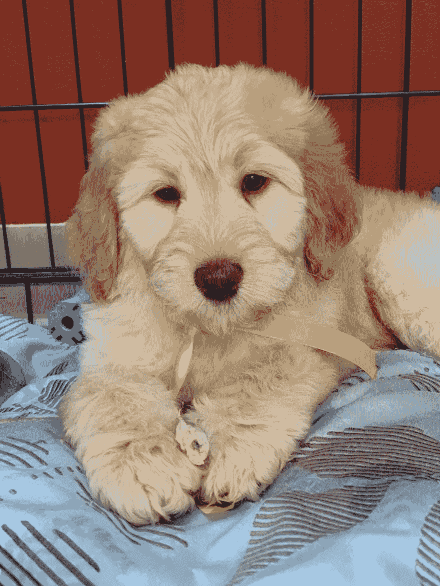

# 对 2018 年的反思

> 原文：<https://dev.to/aspittel/reflections-on-2018-1nk7>

2018 年对我来说真的是很重要的一年，想到我一年前才刚刚开始写作和说话，真是太奇怪了。这肯定是一场旋风！今年我尝试了很多，有些事情成功了，有些没有，我想在进入 2019 年之前反思一下！

## 教书(我的日常工作)

一年半前，我作为首席讲师开始在大会的 Web 开发沉浸式项目中教授人们编码。2018 年，我教了两个传统的校园项目，然后被提升为他们的企业项目工作。该项目将 GA 的学习项目引入公司，以便向员工传授新技能。

今年 5 月，我搬到了康涅狄格州的哈特福德，在那里的一家保险公司教书——他们为一些长期从事非技术工作的员工提供机会，让他们学习如何编程，并转到开发人员的岗位上。成为这样一个不同项目的一部分真的很酷，学生们超级鼓舞人心，与我以前教过的学生不同。

然后，在夏天结束时，我搬回 DC，以便在北弗吉尼亚州为首都一中教书。他们为想成为软件工程师的应届大学毕业生开设了一个项目。在那种环境下教书也很棒，在这些大型机构的现场工作给了我一个与在较小、较新的公司工作的人完全不同的视角。

我喜欢成为所有这些项目的一部分，看到我的学生在工作中付出的努力。在他们的同伴之后看到他们的成功也是令人敬畏的。

我也是开发新课程的一个重要部分，这样 DC 校区就可以从教授 Ruby 转向 Python，这样我们就可以为需要的项目教授更详细的基础知识。

除了教授全职程序，我还为 GA 做了很多一次性的课程和研讨会——主要是“代码入门”和“一天内编写代码”程序，向以前从未编写过代码的人教授基本的 HTML、CSS 和 JavaScript。我在教这些的过程中得到了很多乐趣——当人们第一次看到网站是如何建立的时候，他们变得兴奋起来，这真是太酷了。

我还为“姜戈女孩”和“T2 听我说代码”社区团体做志愿者教学，这是一次非常有益和不可思议的经历。

## 说话之间

除了更传统的教学形式，去年我还在几次会议和聚会上发言。快速概括一下:

### 会议

*   印第。Codes() - [通过艺术创作学习 CSS 全天工作坊](https://alispit.tel/css-art-fullday-presentation)
*   印第。JavaScript 代码()- [增强现实](https://www.alispit.tel/ar-javascript/#/intro)
*   北弗吉尼亚代码营 JavaScript 中的增强现实
*   中大西洋开发者大会 JavaScript 中的增强现实
*   妈妈们可以编写虚拟峰会教学代码

### 聚会

*   NoVa React - [用 Gatsby.js 创建 PWA](https://www.alispit.tel/gatsby-blog/#/intro)
*   CodePen DC - [用 P5.js 生成艺术](https://www.alispit.tel/generative-art-talk/)
*   ForeFront - [在怪异的 JavaScript 世界中导航](https://www.alispit.tel/javascript-world-2018/#/intro)
*   JavaScript 中的增强现实(15 分钟)
*   DC 黑客&告诉-我的投资组合网站-闪电谈话
*   DC 黑客&告诉-用 JavaScript 重新创建 SnapChat 的过滤器-闪电谈话
*   给 DC 编码的女人- [让我们写一篇博文吧！](https://www.alispit.tel/blogging-workshop/#/intro)
*   艺术代码集合- [通过艺术创作学习 CSS](https://www.alispit.tel/css-art-presentation/#/intro)

### 其他

*   开发工作坊- [通过艺术创作学习 CSS](https://dev.to/aspittel/learning-css-through-creating-art-54c0)(两次！)
*   Pivotal Labs 午餐和学习-通过艺术创作学习 CSS

不幸的是，我不得不拒绝我无法接受的事情，因为我的全职工作不允许我有太多的时间去旅行，而且我一年中的大部分时间都住在一个非科技城市，然后又有很大一部分时间在通勤上度过。我明年最大的目标之一是在更多的活动中发言，特别是在会议上做更多的研讨会。我喜欢更互动的形式，我觉得在这种环境下我能做得最好。

## 编码

尽管编写产品代码不是我今年的全职工作，但我仍然几乎每天都在尝试编写代码。

我最大的项目是[向我们学习代码](https://learncodefrom.us)，这是一个突出技术内容创作者的网站，他们是技术领域中代表性不足的群体的成员。这是我第一次向贡献者开放我的一个项目，尝试一下也很酷。我认为代码库是一个非常好的地方，我很乐意在那里展示更多的人。有一些开放的问题，如果你想作出贡献！

我还使用 Gatsby.js 和 Netlify 为我的[博客](https://zen-of-programming.com)的站点编写了代码——我从这个堆栈中获得了很多乐趣，并且很容易地添加了很多很酷的功能。

最重要的是，我写了很多代码放在博客帖子里——我今年开始仍然致力于我的“学习新事物”项目，在这个项目中，我每周学习一项新技术，用它写一些代码，然后写关于它的博客。我还写了关于写一个和我的的文章，这是相当繁重的代码。

在过去的几年里，我几乎每天的第一件事就是解决一个代码挑战，以此来唤醒自己并让我的大脑工作。今年，我开始在 Twitter 上公开这么做，并在 T2 的 dev.to 上也尝试了一下。老实说，这是我最喜欢做的事情之一，明年我肯定会继续做下去。由于旅行和需要一段时间的问题，在[代码](https://adventofcode.com/)出现后的第一个 14 天，我确实休息了一段时间，但是一旦我回到正常的日常生活中，我肯定会每天再次开始解决它们！

总的来说，GitHub 说我贡献了 672 次，GitHub enterprise 说贡献了 559 次——总共 1231 次！

## 写作

就我今年的成就而言，最突出的是我的写作。今年年初，我仍然致力于我的“学习新事物”项目，但它太多了，工作、社交生活和演讲让我无法跟上。当我搬到康涅狄格的时候，我几乎不认识任何人，工作之外也没有什么事情。所以，我决定重新开始写博客。我有了一个混合生活方式和代码博客的概念，所以我在 7 月份我 24 岁生日后建立了一个网站并开始写作。我的想法是写一些对以前的我真的有帮助的帖子——那个认为我不能成为程序员的大学生。帖子以一种我事先无法想象的方式炸开了锅。

发生了几件很酷的事情:我用我的[投资组合建议](https://zen-of-programming.com/kickass-portfolio)登上了 HackerNews 的第一名，我用我的[给新开发者的建议](https://dev.to/aspittel/25-tips-for-new-developers-advice-from-a-mostly-self-taught-software-engineer-1ff1)登上了/r/programming 的首页，我用我的[给开发者的设计建议](https://zen-of-programming.com/design)登上了 HackerNews 的首页。我认为这些事情对我来说很突出，主要是因为这些网站远远超出了我认为我的目标受众，看到我的内容在那里做得很好真的很酷，尽管在成功的同时也有一些负面影响。我的帖子在 dev.to 上也多次进入前 7 名，我的文章也在社交媒体上被很多我非常欣赏的人分享。

我交叉发布了我的大多数博客帖子，这导致了相当多的读者。我会发布到我自己的网站 dev.to 上，然后也会在媒体上发布相关内容到 FreeCodeCamp。在这三个网站上，我今年的博客帖子获得了 **566k** 的浏览量，我在 Dev.to 上获得的浏览量最多，在我自己的网站上获得的浏览量第二多，第三多的是 Medium。

今年我写了 23 篇真实的帖子，还有一些关于 Dev.to 的讨论问题。

我最自豪的帖子是:

 [## 给新开发人员的 25 个建议:来自一个(大部分)自学成才的软件工程师的建议

### 阿里·斯皮特尔 8 月 7 日 189 分钟阅读

#beginners #career #learning #tips](/aspittel/25-tips-for-new-developers-advice-from-a-mostly-self-taught-software-engineer-1ff1)

这篇文章确实借鉴了我的教学和自学经验，我真的希望它能帮助一些刚开始写代码的人。

 [## 反应完全初学者指南

### 阿里·斯皮特尔 8 月 28 日 1815 分钟阅读

#beginners #react #javascript #frontend](/aspittel/a-complete-beginners-guide-to-react-2cl6)

这是我写的最耗时的一篇文章，在 Medium 上表现得特别好。我喜欢写教程，这可能是我迄今为止最有深度的一篇了。

 [## 程序员最重要的非编程技能

### 阿里·斯皮特尔 10 月 15 日 1810 分钟阅读

#career #leadership #tips #culture](/aspittel/the-most-important-non-programming-skills-for-programmers-iii)

我认为这篇文章让我可以用更长的篇幅来表达我通常在 Twitter 上分享的关于编程之外的技能有多重要的许多观点。

 [## 谢谢你，下一篇:链表介绍

### 阿里·斯皮特尔 12 月 5 日 185 分钟阅读

#datastructures #beginners #programming #javascript](/aspittel/thank-u-next-an-introduction-to-linked-lists-4pph)

我真的很喜欢第一次用幽默的方式写作。此外，它似乎在一个与我的普通观众非常不同的人群中做得很好，这真的很酷。更好地展现科技是我热衷的事情，我认为制作有趣的、非刻板主题的学习资源对此是有建设性的。

## 其他一切

### 播客

我和昆西·拉森一起录制了一集 [FreeCodeCamp 播客](https://www.freecodecamp.org/news/quincylarson/ali-spittel-creator-of-zen-of-programming--krk00lk24)，那真是太棒了。我还录制了另一个将于本周发行的专辑，所以请保持关注！我真的想明年做更多这些，并且做得更好！

### YouTube

我今年创建了一个 YouTube 频道，尽管我还没怎么做过。我想做更多的视频内容，因为我知道很多人真的从他们那里学到了很多东西，我只是没有带宽来编辑视频！也许明年吧！

### ArtTechChat

今年， [Dominic Duffin](https://twitter.com/DominicDuffin1) 联系我共同主持一个关于艺术和技术交叉的 [Twitter 聊天](https://twitter.com/ArtTechChat)——我很高兴能参与其中并尝试它！我们将在新的一年重新开始！

### 聚会

今年我参加了 Meetup 组织！我和我的朋友詹姆斯一起创办了艺术+代码集体。不幸的是，我在第一次聚会后搬走了，但他在那之后又招待了几次。我们计划明年做季度调查，我们的第一次调查将在一月份进行！今年年底，我开始担任 DC 女性编码的技术总监，并被要求在 DC 成立 Vue Vixens 分会。我们在 2019 年初也为这两者举办了活动！

### 通迅

我开始增加电子邮件列表，以便发送一份时事通讯，其中包含我本周最喜欢的资源以及我自己的写作。老实说，我不喜欢写它(经过几个月的尝试)，它感觉有点片面，而不是社交，我觉得我没有接触到足够多的人，使它值得。也许我以后会再尝试简讯，也许不会！

### DC 女性科技奖

今年春天，我赢得了 DC 女性程序员奖。得到社区的认可真的很酷，我真的很感激被提名。

## 布莱尔！

我通常不会在网上分享太多我的个人生活，但我也刚刚养了一只小狗！我一直在推特上发图片(我在她打盹的时候润色这篇文章)！

> 阿里·斯皮特💁[@ aspittel](https://dev.to/aspittel)布莱尔说“你好，世界！”2018 年 12 月 30 日 23 点 38 分1251

* * *

回顾过去，这是相当多事的一年！能够更多地参与到社区中，学习如何有效地与观众沟通，这真是太棒了。我也喜欢我尝试了很多，没有让自己太沮丧或强迫自己做一些我不喜欢的事情——特别是因为我做的所有额外工作都不是我的日常工作，所以我工作了很长时间。我并不觉得我在荒谬地努力工作或类似的事情，我仍然有大量的时间和我的朋友们一周出去几次，去纽约、墨西哥、查尔斯顿和洛杉矶度假。总的来说，2018 年对我来说是重要的一年，我认为 2019 年也是如此！