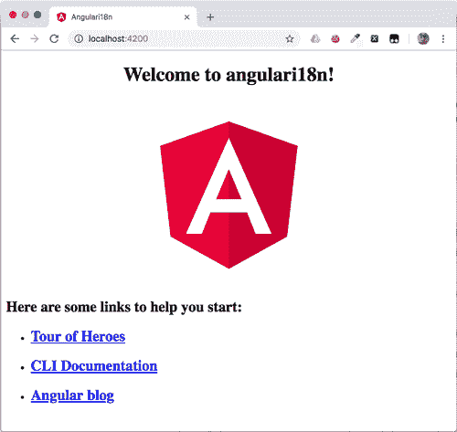
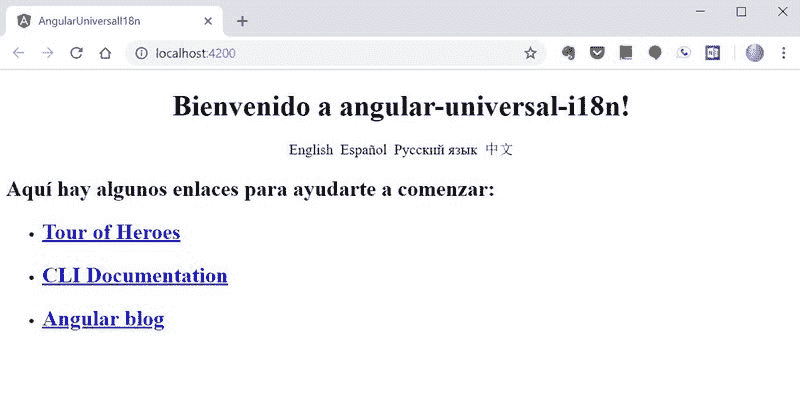
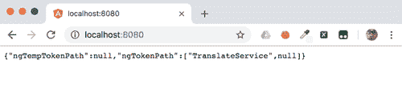

# 如何使用 Angular Universal 和 ngx-translate 创建搜索引擎友好的国际化 Web 应用程序

> 原文：<https://dev.to/twilio/how-to-create-search-engine-friendly-internationalized-web-apps-with-angular-universal-and-ngx-translate-50gc>

*原载于 [Twilio 博客](https://www.twilio.com/blog/create-search-engine-friendly-internationalized-web-apps-angular-universal-ngx-translate)T3】*

搜索引擎优化(SEO)对于许多有角度的单页应用程序(spa)是很重要的。你可以用 Angular Universal 建立 SEO 友好的 Angular 网站，但是你如何让你的应用程序在你的网站支持的每一种语言中都 SEO 友好呢？Google、Yandex 和百度可能会请求您的页面使用英语、西班牙语、俄语或中文:如何让您的服务器端呈现返回正确的语言？

答案是 [ngx-translate](http://www.ngx-translate.com/) ，Angular 的国际化( [i18n](https://en.wikipedia.org/wiki/Internationalization_and_localization) )和本地化库。这个模块使得使用翻译文件变得容易，这些文件为客户端和服务器端的渲染提供了正确的语言。这篇文章将告诉你如何使用它。

在本帖中，我们将:

*   用一个组件——主页——创建一个角度应用程序
*   使用 [Angular Universal](https://angular.io/guide/universal) 添加用于 SEO 目的的服务器端渲染
*   使用 [ngx-translate](https://github.com/ngx-translate/core) 设置四种语言的国际化

要完成本文中的任务，您需要安装以下软件:

*   [Node.js 和 npm](https://nodejs.org/)(node . js 安装也会安装 NPM。)
*   [角度 CLI](https://cli.angular.io/)

## 设置 Angular 项目，运行 Hello World！

每个 Angular 项目都是从软件包的安装和初始化开始的。在命令提示符下键入以下内容:

```
ng new angular-universal-i18n --style css --routing false 
```

当项目初始化时，导航到它的目录:

```
cd angular-universal-i18n 
```

并通过键入
来运行应用程序

```
ng serve -o 
```

您应该在控制台中看到以下输出:

```
** Angular Live Development Server is listening on localhost:4200, open your browser on http://localhost:4200/ ** 
Date: 2018-10-29T08:58:37.685Z
Hash: cb54e4608cfb1115882b
Time: 7682mschunk {main} main.js, main.js.map (main) 10.7 kB [initial] [rendered]
chunk {polyfills} polyfills.js, polyfills.js.map (polyfills) 227 kB [initial] [rendered]
chunk {runtime} runtime.js, runtime.js.map (runtime) 5.22 kB [entry] [rendered]
chunk {styles} styles.js, styles.js.map (styles) 15.9 kB [initial] [rendered]
chunk {vendor} vendor.js, vendor.js.map (vendor) 3.29 MB [initial] [rendered] 
```

`-o`标志将在您的默认浏览器中打开应用程序。(在 Chrome 版本 63 或更高版本中，您必须设置标志来打开没有有效安全证书的 HTTP 链接和站点，如 localhost)。您可以手动导航到命令输出中提供的 URL。

您应该会在浏览器中看到以下屏幕:

[](https://res.cloudinary.com/practicaldev/image/fetch/s---ZZKMSJG--/c_limit%2Cf_auto%2Cfl_progressive%2Cq_auto%2Cw_880/https://s3.amazonaws.com/com.twilio.prod.twilio-doimg/3tQS0V1Pj7Fqi6dCvBukm0lzpwZDyPUyQKChzWzYREw0ng.width-500.png)

## 用 Angular Universal 实现服务器端渲染

现在，我们已经准备好使用 [Angular Universal](https://angular.io/guide/universal) 将服务器端渲染添加到我们的应用程序中，这是一种在服务器上渲染网页的技术，因此搜索引擎爬虫可以快速轻松地读取您网站的页面。要安装它，执行这个命令:

```
ng add @ng-toolkit/universal 
```

## 验证服务器端渲染工作正常

通过运行应用程序并对其执行卷曲请求，检查 Angular Universal 是否正常工作:

```
npm run build:prod;npm run server

curl http://localhost:8080 
```

如果您不想使用 curl，您可以在浏览器中打开 url 并检查页面源代码。如下所示，结果应该是相同的:

```
<!DOCTYPE html><html lang="en"><head>
  <meta charset="utf-8">
  angular-universal-i18n
  <base href="/">

  <meta name="viewport" content="width=device-width, initial-scale=1">
  <link rel="icon" type="image/x-icon" href="favicon.ico">
  <link rel="stylesheet" href="styles.3bb2a9d4949b7dc120a9.css">
  <style ng-transition="app-root">
/*# sourceMappingURL=data:application/json;
base64,eyJ2ZXJzaW9uIjozLCJzb3VyY2VzIjpbXSwibmFtZXMiOltdLCJtYXBwaW5ncyI6IiIsImZpbGUiOiJzcmMvYXBwL2FwcC5jb21wb25lbnQuY3NzIn0= */
  </style></head>
<body>
  <app-root _nghost-sc0="" ng-version="7.0.4"><div _ngcontent-sc0="" style="text-align:center"><h1 _ngcontent-sc0=""> Welcome to angular-universal-i18n! </h1>
...
    </div>
    <h2 _ngcontent-sc0="">Here are some links to help you start: </h2>
    <ul _ngcontent-sc0="">
      <li _ngcontent-sc0="">
        <h2 _ngcontent-sc0=""><a _ngcontent-sc0="" href="https://angular.io/tutorial" rel="noopener" target="_blank">Tour of Heroes</a></h2>
      </li>
      <li _ngcontent-sc0="">
        <h2 _ngcontent-sc0=""><a _ngcontent-sc0="" href="https://github.com/angular/angular-cli/wiki" rel="noopener" target="_blank">CLI Documentation</a></h2>
      </li><li _ngcontent-sc0="">
        <h2 _ngcontent-sc0=""><a _ngcontent-sc0="" href="https://blog.angular.io/" rel="noopener" target="_blank">Angular blog</a></h2>
      </li></ul></app-root>

<script type="text/javascript" src="runtime.ec2944dd8b20ec099bf3.js"></script><script type="text/javascript" src="polyfills.c6871e56cb80756a5498.js"></script>
<script type="text/javascript" src="main.f27bf40180c4a8476e2e.js"></script>

<script id="app-root-state" type="application/json">{}</script>
</body></html> 
```

如果你想赶上这一步:

```
git clone https://github.com/maciejtreder/angular-universal-i18n.git
cd angular-universal-i18n
git checkout step1
npm install 
ng serve -o 
```

## 用 ngx-translate 给 app 添加国际化

让我们让我们的应用程序对世界各地的用户更加友好。为了实现这一点，我们将通过 [ngx-translate 库](https://github.com/ngx-translate/core)为其添加国际化(i18n)。我们将为网站访问者提供可点击的链接，他们可以使用这些链接在不同的翻译之间进行切换。这些翻译将从。每种语言的 json 文件由`ngx-translate`提供。对于我们的`app.component.html`模板中的每个`translate`键，一个翻译后的值将被注入。

第一步是安装依赖项:

```
npm install @ngx-translate/core @ngx-translate/http-loader 
```

为翻译创建以下文件结构:

```
src/assets/i18n/en.json
src/assets/i18n/es.json
src/assets/i18n/ru.json
src/assets/i18n/zh.json 
```

在每个文件中放置下列键值对。对于`src/assets/i18n/en.json` :

```
{  "Welcome to":  "Welcome to",  "Here are some links to help you start":  "Here are some links to help you start"  } 
```

`src/assets/i18n/es.json` :

```
{  "Welcome to":  "Bienvenido a",  "Here are some links to help you start":  "Aquí hay algunos enlaces para ayudarte a comenzar"  } 
```

`src/assets/i18n/ru.json` :

```
{  "Welcome to":  "Добро пожаловать в",  "Here are some links to help you start":  "Вот несколько ссылок, которые помогут вам начать"  } 
```

`src/assets/i18n/zh.json` :

```
{  "Welcome to":  "欢迎来到",  "Here are some links to help you start":  "以下是一些可帮助您入门的链接"  } 
```

我们提供了四种语言的翻译。现在我们将在应用程序中实现翻译机制。通过用以下代码替换`src/app/app.browser.module.ts`的内容来导入`ngx-translate`模块和翻译加载器:

```
import { AppComponent } from './app.component';
import { AppModule } from './app.module';
import { NgModule } from '@angular/core';
import { BrowserModule } from '@angular/platform-browser';
import { HttpClient, HttpClientModule } from '@angular/common/http';
import { TranslateLoader, TranslateModule } from '@ngx-translate/core';
import { TranslateHttpLoader } from '@ngx-translate/http-loader';

export function HttpLoaderFactory(http: HttpClient) {
      return new TranslateHttpLoader(http);
}

@NgModule({
      bootstrap: [AppComponent],
      imports: [
             BrowserModule.withServerTransition({appId: 'app-root'}),
             AppModule,
             HttpClientModule,
             TranslateModule.forRoot({
                    loader: {provide: TranslateLoader, useFactory: HttpLoaderFactory, deps: [HttpClient]}
             })
      ]
})
export class AppBrowserModule {} 
```

我们在这里做的是从`@angular/common/http`库中导入`HttpClientModule`。我们需要它提供一个`HttpClient`，它是[注入](https://en.wikipedia.org/wiki/Dependency_injection)到工厂方法中，用于使用 HTTP 请求加载翻译文件:

```
export function HttpLoaderFactory(http: HttpClient) {
      return new TranslateHttpLoader(http);
} 
```

最后，我们导入 TranslateModule 并在其中提供我们的加载器:

```
TranslateModule.forRoot({
      loader: {provide: TranslateLoader, useFactory: HttpLoaderFactory, deps: [HttpClient]}
}) 
```

我们还需要将`TranslateModule`导入到`src/app/app.module.ts`文件中:

```
import { NgtUniversalModule } from '@ng-toolkit/universal';
import { CommonModule } from '@angular/common';
import { NgModule } from '@angular/core';

import { AppComponent } from './app.component';
import { TranslateModule } from '@ngx-translate/core';

@NgModule({
 declarations: [
   AppComponent
 ],
 imports: [
   CommonModule,
   NgtUniversalModule,
   TranslateModule.forChild(),
 ]
})
export class AppModule { } 
```

用下面的代码替换`src/app/app.component.html`模板中的代码，以提供用于语言间切换的翻译键和链接:

```
<div style="text-align:center">
    <h1>
        {{'Welcome to' | translate}} {{ title }}!
    </h1>
    <div>
        <span (click)="switchLanguage('en')">English</span>&nbsp;
        <span (click)="switchLanguage('es')">Español</span>&nbsp;
        <span (click)="switchLanguage('ru')">Pусский язык</span>&nbsp;
        <span (click)="switchLanguage('zh')">中文</span>
    </div>

</div>
<h2>{{'Here are some links to help you start' | translate}}: </h2>
<ul>
    <li>
        <h2><a target="_blank" rel="noopener" href="https://angular.io/tutorial">Tour of Heroes</a></h2>
    </li>
    <li>
        <h2><a target="_blank" rel="noopener" href="https://github.com/angular/angular-cli/wiki">CLI Documentation</a></h2>
    </li>
    <li>
        <h2><a target="_blank" rel="noopener" href="https://blog.angular.io/">Angular blog</a></h2>
    </li>
</ul> 
```

在浏览器端代码中提供国际化的最后一步是在我们的组件中实现`switchLanguage`方法，并为活动区域提供默认翻译。在`src/app/app.component.ts`中做如下修改:

```
import { Component, OnInit, Inject, PLATFORM_ID, Optional } from '@angular/core';
import { TranslateService } from '@ngx-translate/core';

@Component({
 selector: 'app-root',
 templateUrl: './app.component.html',
 styleUrls: ['./app.component.css']
})
export class AppComponent implements OnInit {
 title = 'angular-universal-i18n';

 constructor(private translate: TranslateService) {}

 public ngOnInit(): void {
   this.setDefaultTranslation();
 }

 private setDefaultTranslation(): void {
   if (['en', 'es', 'zh', 'ru'].indexOf(this.translate.getBrowserLang()) > -1) {
     this.translate.setDefaultLang(this.translate.getBrowserLang());
   } else {
     this.translate.setDefaultLang('en');
   }
 }

 public switchLanguage(lang: string): void {
   this.translate.setDefaultLang(lang);
 }
} 
```

我们拿到了。浏览器端实现国际化！我们来看看:

```
ng serve -o 
```

导航到 [http://localhost:4200](http://localhost:4200) 并将所选语言更改为西班牙语后，我们可以看到:

[](https://res.cloudinary.com/practicaldev/image/fetch/s--vwO7hf9I--/c_limit%2Cf_auto%2Cfl_progressive%2Cq_auto%2Cw_880/https://s3.amazonaws.com/com.twilio.prod.twilio-doimg/i18n-spanish-1600w.width-800.jpg)

如果你想赶上这一步:

```
git clone https://github.com/maciejtreder/angular-universal-i18n.git
cd angular-universal-i18n
git checkout step2
npm install 
ng serve -o 
```

## 添加服务器端国际化

查看我们的客户端实现是否破坏了服务器端的任何东西。通过运行以下命令在服务器模式下启动应用:

```
npm run build:prod
npm run server 
```

导航到 [http://localhost:8080](http://localhost:8080) 后，我们可以看到我们的应用程序不再工作:

[](https://res.cloudinary.com/practicaldev/image/fetch/s--ojeEKGXd--/c_limit%2Cf_auto%2Cfl_progressive%2Cq_auto%2Cw_880/https://s3.amazonaws.com/com.twilio.prod.twilio-doimg/-n8T67Y_qGCTW3j_eGJEHujp2eff-nqypYBE4HULq1VR_s.width-500.png)

更多错误信息可以在控制台中看到:

```
ERROR { Error: StaticInjectorError(AppServerModule)[TranslateService -> TranslateStore]: 
  StaticInjectorError(Platform: core)[TranslateService -> TranslateStore]: 
    NullInjectorError: No provider for TranslateStore!
    at NullInjector.module.exports.NullInjector.get (/Users/mtreder/angular-universal-i18n/dist/server.js:1361:19)
    at resolveToken (/Users/mtreder/angular-universal-i18n/dist/server.js:1598:24)
    at tryResolveToken (/Users/mtreder/angular-universal-i18n/dist/server.js:1542:16)
    at StaticInjector.module.exports.StaticInjector.get (/Users/mtreder/angular-universal-i18n/dist/server.js:1439:20)
    at resolveToken (/Users/mtreder/angular-universal-i18n/dist/server.js:1598:24)
    at tryResolveToken (/Users/mtreder/angular-universal-i18n/dist/server.js:1542:16)
    at StaticInjector.module.exports.StaticInjector.get (/Users/mtreder/angular-universal-i18n/dist/server.js:1439:20)
    at resolveNgModuleDep (/Users/mtreder/angular-universal-i18n/dist/server.js:18300:29)
    at _createClass (/Users/mtreder/angular-universal-i18n/dist/server.js:18353:32)
    at _createProviderInstance (/Users/mtreder/angular-universal-i18n/dist/server.js:18317:26)
  ngTempTokenPath: null,
  ngTokenPath: [ 'TranslateService', [Function: TranslateStore] ] } 
```

为了解决这个问题，我们也需要在服务器模块中提供`TranslateModule`。在`src/app/app.server.module.ts`中做如下修改:

```
import { AppComponent } from './app.component';
import { AppModule } from './app.module';
import { NgModule } from '@angular/core';
import { ServerModule, ServerTransferStateModule } from '@angular/platform-server';
import { ModuleMapLoaderModule } from '@nguniversal/module-map-ngfactory-loader';
import { BrowserModule } from '@angular/platform-browser';
import { NoopAnimationsModule } from '@angular/platform-browser/animations';
import { TranslateLoader, TranslateModule } from '@ngx-translate/core';
import { Observable, Observer } from 'rxjs';
import { readFileSync } from 'fs';

export function universalLoader(): TranslateLoader {
   return {
       getTranslation: (lang: string) => {
           return Observable.create((observer: Observer<any>) => {
               observer.next(JSON.parse(readFileSync(`./dist/browser/assets/i18n/${lang}.json`, 'utf8')));
               observer.complete();
           });
       }
   } as TranslateLoader;
}

@NgModule({
   bootstrap: [AppComponent],
   imports: [
       BrowserModule.withServerTransition({appId: 'app-root'}),
       AppModule,
       ServerModule,
       NoopAnimationsModule,
       ModuleMapLoaderModule,
       ServerTransferStateModule,
       TranslateModule.forRoot({
           loader: {provide: TranslateLoader, useFactory: universalLoader}
       })
   ]
})
export class AppServerModule {} 
```

我们还需要对`src/app/app.component.ts`进行修改，以便在服务器端实现 i18n。将内容替换为以下代码:

```
import { Component, OnInit, Inject, PLATFORM_ID, Optional } from '@angular/core';
import { TranslateService } from '@ngx-translate/core';
import { REQUEST } from '@nguniversal/express-engine/tokens';
import { isPlatformBrowser } from '@angular/common';

@Component({
 selector: 'app-root',
 templateUrl: './app.component.html',
 styleUrls: ['./app.component.css']
})
export class AppComponent implements OnInit {
 title = 'angular-universal-i18n';

 constructor(
   private translate: TranslateService,
   @Optional()
   @Inject(REQUEST) private request: Request,
   @Inject(PLATFORM_ID) private platformId: any
 ) {}

 public ngOnInit(): void {
   const language = this.getLang();
   if (['en', 'es', 'zh', 'ru'].indexOf(language) > -1) {
     this.translate.setDefaultLang(language);
   } else {
     this.translate.setDefaultLang('en');
   }
 }

 public getLang(): string {
   let lang: string;
   if (isPlatformBrowser(this.platformId)) {
     lang = this.translate.getBrowserLang();
   } else {
     lang = (this.request.headers['accept-language'] || '').substring(0, 2);
   }
   return lang;
 }

 public switchLanguage(lang: string): void {
   this.translate.setDefaultLang(lang);
 }
} 
```

当以用户代理指定的 URI 请求页面时，附加代码通过读取用户代理(浏览器或网络爬虫)发送的 HTTP `accept-language`头来确定用户代理的当前语言。为了检索这个头，我们需要注入一个在`@nguniversal/express-engine/tokens`中提供的`@REQUEST`。

之后，我们通过使用`isPlatformBrowser`方法和`@PLATFORM_ID`令牌来确定我们是在浏览器端还是在服务器端执行代码。如果我们在浏览器端，我们用和以前一样的方式设置语言，通过从翻译服务中检索它。如果我们在服务器端，我们从带有
的头中读取它

```
lang = (this.request.headers['accept-language'] || '').substring(0, 2); 
```

我们还需要对 typescript 配置文件`src/tsconfig.app.json` :
做一些小的改动

```
{
 "extends": "../tsconfig.json",
 "compilerOptions": {
   "outDir": "../out-tsc/app",
   "types": ["node"]
 },
 "exclude": [
   "test.ts",
   "**/*.spec.ts"
 ]
} 
```

我们将`node`值添加到了`types`部分。我们需要它，因为当我们执行服务器端渲染时，我们使用`fs`直接从文件系统加载翻译文件。

## 测试服务器端国际化渲染

我们已经完成了服务器端的翻译。通过运行应用程序并使用定制的头执行 curl 请求来检查它。构建并运行应用程序，如下所示:

```
npm run build:prod
npm run server 
```

然后发出 curl 请求，将俄语(ru_RU)指定为当前用户代理语言:

```
curl http://localhost:8080 --header "accept-language: ru_RU" 
```

或者，您可以在主页上点击 pусскиязык后，在浏览器的*开发工具*中检查页面源代码。但是，请注意，使用“查看页面源代码”将重新加载页面，并显示英语(或您的默认)语言版本。

结果应该是这样的:

```
<!DOCTYPE html><html lang="en"><head>
<meta charset="utf-8">
angular-universal-i18n
<base href="/">

<meta name="viewport" content="width=device-width, initial-scale=1">
<link rel="icon" type="image/x-icon" href="favicon.ico">
<link rel="stylesheet" href="styles.3bb2a9d4949b7dc120a9.css"><style ng-transition="app-root">
/*# sourceMappingURL=data:application/json;
base64,eyJ2ZXJzaW9uIjozLCJzb3VyY2VzIjpbXSwibmFtZXMiOltdLCJtYXBwaW5ncyI6IiIsImZpbGUiOiJzcmMvYXBwL2FwcC5jb21wb25lbnQuY3NzIn0= */
</style></head>
<body>
<app-root _nghost-sc0="" ng-version="7.0.4"><div _ngcontent-sc0="" style="text-align:center"><h1 _ngcontent-sc0=""> Добро пожаловать в angular-universal-i18n! </h1><div _ngcontent-sc0=""><span _ngcontent-sc0="">English</span>&nbsp; <span _ngcontent-sc0="">Español</span>&nbsp; <span _ngcontent-sc0="">Pусский язык</span>&nbsp; <span _ngcontent-sc0="">中文</span></div></div><h2 _ngcontent-sc0="">Вот несколько ссылок, которые помогут вам начать: </h2><ul _ngcontent-sc0=""><li _ngcontent-sc0=""><h2 _ngcontent-sc0=""><a _ngcontent-sc0="" href="https://angular.io/tutorial" rel="noopener" target="_blank">Tour of Heroes</a></h2></li><li _ngcontent-sc0=""><h2 _ngcontent-sc0=""><a _ngcontent-sc0="" href="https://github.com/angular/angular-cli/wiki" rel="noopener" target="_blank">CLI Documentation</a></h2></li><li _ngcontent-sc0=""><h2 _ngcontent-sc0=""><a _ngcontent-sc0="" href="https://blog.angular.io/" rel="noopener" target="_blank">Angular blog</a></h2></li></ul></app-root>
<script type="text/javascript" src="runtime.ec2944dd8b20ec099bf3.js"></script><script type="text/javascript" src="polyfills.c6871e56cb80756a5498.js"></script><script type="text/javascript" src="main.3d5a73b9ae1f4de7b2c1.js"></script>

<script id="app-root-state" type="application/json">{}</script></body></html> 
```

耶！正如我们所料，我们的网站呈现在服务器端，俄语翻译已经应用！

如果你想赶上这一步:

```
git clone https://github.com/maciejtreder/angular-universal-i18n.git
cd angular-universal-i18n
git checkout step3
npm install 
npm run build:prod
npm run server 
```

## 总结

今天，我们讨论了所有成熟应用程序面临的一个重要挑战:国际化。如你所见；您可以为服务器端呈现带来国际化，使您的应用程序搜索引擎在您支持的每种语言中都得到优化。

如果你想了解更多关于 Angular Universal 的技术，请查看我在 Twilio 博客上的帖子:[在 AWS Lambda 上开始使用无服务器 Angular Universal](https://www.twilio.com/blog/angular-universal-javascript-node-js-aws-lambda)。

这篇文章中使用的代码可以在 GitHub 知识库中找到:[https://github.com/maciejtreder/angular-universal-i18n](https://github.com/maciejtreder/angular-universal-i18n)。
也可以通过[contact@maciejtreder.com](//mailto:contact@maciejtreder.com)、[https://www.maciejtreder.com](https://www.maciejtreder.com)或[@ maciejtreder](https://dev.to/maciejtreder)([GitHub](https://github.com/maciejtreder)、 [Twitter](https://twitter.com/MaciejTreder) 、 [LinkedIn](https://www.linkedin.com/in/maciej-treder/) )联系我。