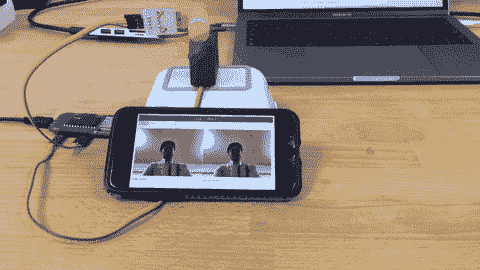
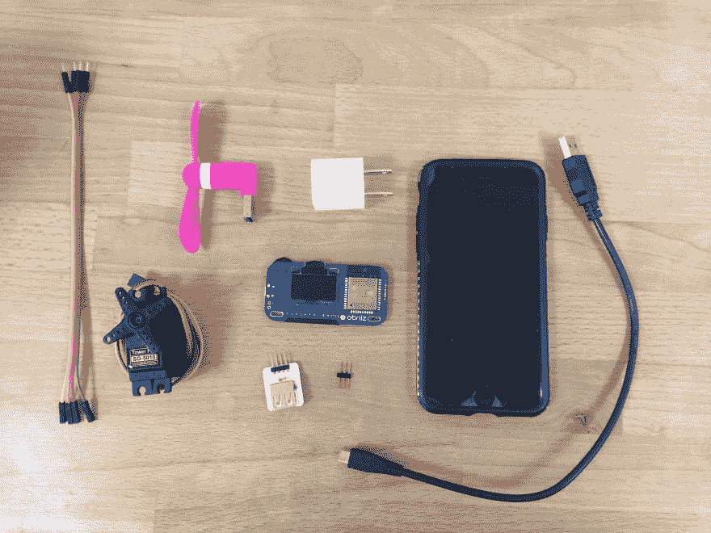
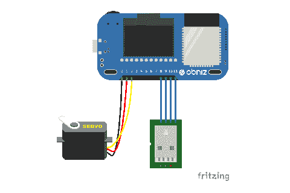

# 面部跟随风扇

> 原文：<https://dev.to/obniz_io/face-following-fan-1n8k>

[](https://res.cloudinary.com/practicaldev/image/fetch/s--FUHBRtMK--/c_limit%2Cf_auto%2Cfl_progressive%2Cq_66%2Cw_880/https://thepracticaldev.s3.amazonaws.com/i/r83cl3me0umaetovm8uc.gif)

有了 iPhone 摄像头，它可以检测你的脸，并向你转动风扇。

## 工作原理

它使用 html5 多媒体来使用 iphone 相机。

## 材料

[](https://res.cloudinary.com/practicaldev/image/fetch/s--ED_1mmVZ--/c_limit%2Cf_auto%2Cfl_progressive%2Cq_auto%2Cw_880/https://thepracticaldev.s3.amazonaws.com/i/ga5t2m9wprp5jiyjq62z.jpeg)

智能手机(我们使用 iPhone，但也可以使用 Android)

*   [奥布尼兹](https://obniz.io/)
*   伺服电动机
*   小型 USB 风扇
*   USB 引脚接头
*   引脚接头
*   电缆
*   USB 电缆
*   USB 适配器

## 制造硬件

这里只有 3 步。
[T3】](https://res.cloudinary.com/practicaldev/image/fetch/s--Lu396dzP--/c_limit%2Cf_auto%2Cfl_progressive%2Cq_auto%2Cw_880/https://storage.obniz.img/face_fan_wired.png)

## 制作软件

1.  使用 HTML5 多媒体，获取您的相机数据。
2.  基于相机数据和 OpenCV 的人脸检测。
3.  检测您面部的 x 位置，并旋转伺服电机。

```
<!-- HTML Example -->

<!DOCTYPE html>
<html>
<head>
  <meta charset="utf-8">
  Video Capture Example
  <meta name="viewport" content="width=device-width,initial-scale=1">
  <script src="https://docs.opencv.org/3.4/opencv.js"></script>
  <script src="https://obniz.io/js/jquery-3.2.1.min.js"></script>
  <script src="https://unpkg.com/obniz@1.4.1/obniz.js"></script>
  <style>
    .refrect-lr {
      -webkit-transform: scaleX(-1);
      -o-transform: scaleX(-1);
      -moz-transform: scaleX(-1);
      transform: scaleX(-1);
      filter: FlipH;
      -ms-filter: "FlipH";
    }
  </style>
</head>
<body>

<div id="obniz-debug"></div>

<div>
  <div class="control">
    <button id="startAndStop">Start</button>
  </div>
</div>
<p class="err" id="errorMessage"></p>
<div>
  <table cellpadding="0" cellspacing="0" width="0" border="0">
    <tr>
      <td>
        <video id="videoInput" autoplay playsinline width=320 height=240 class="refrect-lr"></video>
      </td>
      <td>
        <canvas id="canvasOutput" width=320 height=240 style="-webkit-font-smoothing:none"

                class="refrect-lr"></canvas>
      </td>
      <td></td>
      <td></td>
    </tr>
    <tr>
      <td>
        <div class="caption">videoInput</div>
      </td>
      <td>
        <div class="caption">canvasOutput</div>
      </td>
      <td></td>
      <td></td>
    </tr>
  </table>
</div>

<script src="https://webrtc.github.io/adapter/adapter-5.0.4.js" type="text/javascript"></script>
<script src="https://docs.opencv.org/3.4/utils.js" type="text/javascript"></script>
<script type="text/javascript">

  let servo;

  obniz = new Obniz("OBNIZ_ID_HERE");

  obniz.onconnect = async () => {
    obniz.display.print("ready")

    let usb = obniz.wired("USB", {gnd: 11, vcc: 8});
    usb.on();

    servo = obniz.wired("ServoMotor", {signal: 0, vcc: 1, gnd: 2});

  }

  let utils = new Utils('errorMessage');

  let faceCascadeFile = 'haarcascade_frontalface_default.xml';
  utils.createFileFromUrl(faceCascadeFile, 'https://raw.githubusercontent.com/opencv/opencv/master/data/haarcascades/haarcascade_frontalface_default.xml', () => {
    startAndStop.removeAttribute('disabled');
  });

  let streaming = false;
  let videoInput = document.getElementById('videoInput');
  let startAndStop = document.getElementById('startAndStop');
  let canvasOutput = document.getElementById('canvasOutput');
  let canvasContext = canvasOutput.getContext('2d');

  startAndStop.addEventListener('click', () => {

    if (!streaming) {
      utils.clearError();

      navigator.mediaDevices = navigator.mediaDevices || ((navigator.mozGetUserMedia || navigator.webkitGetUserMedia) ? {
        getUserMedia: function (c) {
          return new Promise(function (y, n) {
            (navigator.mozGetUserMedia ||
                navigator.webkitGetUserMedia).call(navigator, c, y, n);
          });
        }
      } : null);

      if (!navigator.mediaDevices) {
        console.log("getUserMedia() not supported.");
        return;
      }

      const medias = {
        audio: false,
        video: {
          facingMode: "user"
        }
      };

      navigator.mediaDevices.getUserMedia(medias)
          .then(function (stream) {
            streaming = true;
            var video = document.getElementById("videoInput");
            video.src = window.URL.createObjectURL(stream);
            video.onloadedmetadata = function (e) {
              video.play();
              onVideoStarted();
            };
          })
          .catch(function (err) {
            console.error('mediaDevice.getUserMedia() error:' + (error.message || error));
          });

    } else {
      utils.stopCamera();
      onVideoStopped();
    }

  });

  function onVideoStarted() {
    startAndStop.innerText = 'Stop';
    start();
  }
  function onVideoStopped() {
    streaming = false;
    canvasContext.clearRect(0, 0, canvasOutput.width, canvasOutput.height);
    startAndStop.innerText = 'Start';
  }

  async function start() {
    let video = document.getElementById('videoInput');
    let src = new cv.Mat(video.height, video.width, cv.CV_8UC4);
    let dst = new cv.Mat(video.height, video.width, cv.CV_8UC4);
    let gray = new cv.Mat();
    let cap = new cv.VideoCapture(video);
    let faces = new cv.RectVector();
    let classifier = new cv.CascadeClassifier();

    let result = classifier.load("haarcascade_frontalface_default.xml");

    const FPS = 30;

    function processVideo() {
      try {
        if (!streaming) {
          // clean and stop.
          src.delete();
          dst.delete();
          gray.delete();
          faces.delete();
          classifier.delete();
          return;
        }
        let begin = Date.now();
        // start processing.
        cap.read(src);
        src.copyTo(dst);
        cv.cvtColor(dst, gray, cv.COLOR_RGBA2GRAY, 0);
        // detect faces.
        classifier.detectMultiScale(gray, faces, 1.1, 3, 0);
        // draw faces.
        for (let i = 0; i < faces.size(); ++i) {
          let face = faces.get(i);
          let point1 = new cv.Point(face.x, face.y);
          let point2 = new cv.Point(face.x + face.width, face.y + face.height);
          cv.rectangle(dst, point1, point2, [255, 0, 0, 255]);
        }
        cv.imshow('canvasOutput', dst);
        if (servo && faces.size() > 0) {
          let face = faces.get(0);
          servo.angle((320 - (face.x + face.width / 2)) * 180 / 320);
        }

        // schedule the next one.
        let delay = 1000 / FPS - (Date.now() - begin);
        setTimeout(processVideo, delay);
      } catch (err) {
        console.error(err);
      }
    };

    // schedule the first one.
    setTimeout(processVideo, 0);

  }
</script>
</body>
</html> 
```