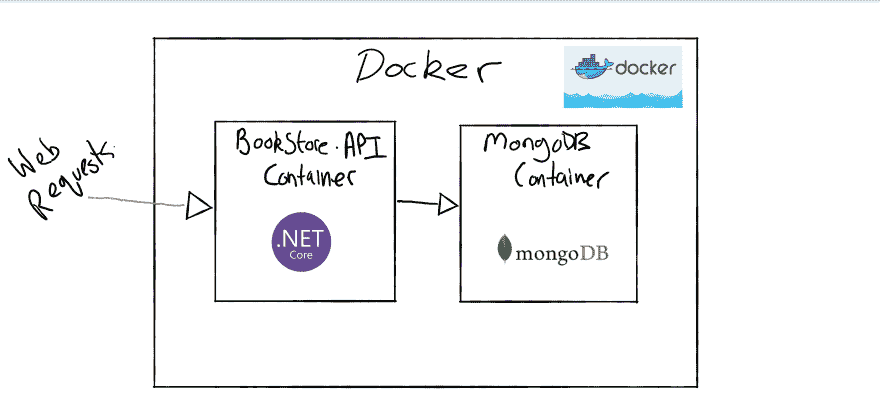
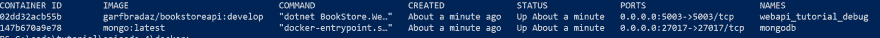

# 第 4 集- JSON API 使用 ASP。NET Core，docker & mongbor docker part ii 复合坞站

> 原文:# t0]https://dev . to/garfbradaz/epi-4-JSON API-using-aspnet-core docker-amp-mongdb docker-part-ii-docker-compose-53j1

## 前情提要

在[第 3 集](https://dev.to/garfbradaz/episode-2---json-api-using-aspnet-core-docker--mongodb-docker-part-i-dockerfiles-2o8i)中，我建立了我们的 Docker 文件，为我们的书店应用程序创建我们的 *Docker 图像*。这将允许我们在后面的章节中快速测试我们的应用程序。今天的剧集是 **Docker Part 2:对接作曲**。<！-更多- >

## Docker 作曲是什么？

[官方文件](https://docs.docker.com/compose/)很好的解释:

> Compose 是一个定义和运行多容器 Docker 应用程序的工具。

Docker compose 允许您定义构建和运行完整应用程序所需的*服务*。想一想，你需要的不仅仅是你的应用。根据您可能需要的应用类型:

*   某种数据库。

*   负载平衡器。

*   Web 服务器。

*   其他应用程序/API。

您甚至可能想要在您的持续集成管道(CI)中运行您的单元/集成测试。你可以用 Docker 和 Compose 来做。

## 书店。WebApi 设置

如果我们看一下我们申请的*书店。WebApi* ，我们可以看到以下内容:

[](https://res.cloudinary.com/practicaldev/image/fetch/s--eSKcc7vs--/c_limit%2Cf_auto%2Cfl_progressive%2Cq_auto%2Cw_880/https://garfbradaz.github.io/assets/img/posts/docker-arch.png)

正如你从我快速绘制的图表中看到的(使用了[微软白板](https://www.microsoft.com/en-gb/p/microsoft-whiteboard/9mspc6mp8fm4?activetab=pivot:overviewtab)，我们有两个*服务*运行在容器中，一个用于应用程序，另一个用于数据库( *MongoDB* )，所以我们可以使用`docker-compose`将它们组合在一起。

## 码头工-堆肥. dev.yml

所以在[第 2 集](https://dev.to/garfbradaz/episode-2-json-api-dotnet-core-docker-project-structure-3i0c)中我们设置了项目结构，所以把目录改为`./docker`目录。

```
.
    ├── src
    | ├── api
    | |
    | ├── BookStore.WebApi.csproj
    | ├── Dockerfile
    ├── tests
    | ├── integration
    | ├── unit
    | ├── BookStore.Tests.csproj
    ├── docker 
```

在该目录中，您应该有两个空的 YAML 文件:

*   **码头-化合物. dev.yml**
*   **码头-化合物. yml**

我们首先关注的是*开发*环境，所以在`docker-compose.dev.yml`中添加以下内容。这些文件有助于我们定义服务的形式以及它们所具有的依赖性:

```
version: "3"
services:
  webapi:
    image: garfbradaz/bookstoreapi:develop
    container_name: webapi_tutorial_debug
    build:
      args:
        buildconfig: Debug
      context: ../src/api
      dockerfile: Dockerfile
    environment:
      - ASPNETCORE_ENVIRONMENT=Development
      - ASPNETCORE_URLS=http://+:5003
    ports:
      - "5003:5003"
    depends_on:
      - mongodb
  mongodb:
    image: mongo:latest
    container_name: mongodb
    ports:
      - "27017:27017" 
```

另外，只需将下面一行添加到`docker-compose.yml`文件中，这样当我们运行`docker-compose up`时就不会失败:

```
version: "3" 
```

就像在第三集第三集第一集一样，让我们把这个 *YAML* 的文件分解一下，看看我们在声明什么。这些文件是 *YAML* 和遵循正常的 *YAML* 语法规则的缩进等。

### `version:`

这真的很重要。目前发布的版本(截止 2018 年 12 月)是 **3(.7)** 。您只需在 YAML 文件的`version`数字字段中输入整数。每次*重大的*升级(从 1.x，到 2.x，到 3.x)都会带来可能的突破性变化，包括 YAML 结构本身的语法变化。

此外，Compose 的版本与发布的 *Docker 引擎*的版本相关，因此请仔细阅读[兼容性列表](https://docs.docker.com/compose/compose-file/compose-versioning/#compatibility-matrix)，但通常您会选择最新版本。

### `services:`

Docker services 是您定义每个应用程序的地方。因此，我们定义了两个服务:

*   哪家是我们 ASP.NET 的核心书店。WebApi 应用程序。
*   `mongodb:`哪个是后端数据存储， *MongoDB* 。

### `image:`

每个服务都定义了一个`image`。蒙哥的 [`mongo:latest`](https://hub.docker.com/_/mongo) 会直接从 hub.docker.com 的*拉过来。*

我们自己的将暂时在本地构建(直到我们稍后发布)，它被简单地称为`garfbradaz/bookstoreapi:develop`。注意**开发**的*标签*。我们现在已经标记了我们的调试映像，我们可以添加符号等用于调试目的的东西。

### `container_name:`

这只是我们的容器的一个友好的名字。运行完一个容器后，运行`docker ps`就可以看到名字了。

## 运行您的应用程序

Docker compose 有一个命令`docker compose up`，它允许您为服务(重新)构建、(重新)创建和附加容器。使用以下命令运行该命令(确保您在`./docker`目录中):

```
docker-compose -f docker-compose.dev.yml up -d --build 
```

该命令覆盖文件(`-f`)到`docker-compose.dev.yml`，并运行`up`。容器将以分离模式(`-d`)运行，并在后台运行。我们也将(重新)建立图像(`--build`)。因为在我们的`docker-compose.dev.yml`文件中有一个`build`部分用于我们的代码，所以将使用这些值。我们设置上下文(`../src/api`)，它是我们正在构建的源代码的相对目录(相对于`./docker`目录)，并告诉`docker-compose`docker 文件名。

我们还将一些`args` *发送到*docker 文件中。目前我们忽略了这些，但是我们会在这篇文章的后面回到它们。

最后，我们为我们的应用程序/ASP 设置了一些`environment`变量。要使用的 NET Core。特别是关于设置一个`Development`环境和 HTTP URLs。

**注意:**如果我们不设置这些，我们的应用程序将尝试使用 HTTPS，因为这是现在的默认设置(这是一件好事)。因为我们还没有设置任何自签名的开发者证书，这将会有点麻烦。我们会这样做，但为了启动和运行，我们现在关闭 HTTPS。

我们还下载了一个 **MongoDB** 映像并启动了一个新的数据库，监听端口 27017。这是 MongoDB 的标准端口映射。

此命令还将为您的应用程序创建一个默认网络。通常以目录`docker-compose`命名，运行时使用后缀**默认为**。所以我的是`docker_default`。

## 检查容器是否正在运行

您现在可以在您选择的命令行上运行一个`docker ps`。你应该看到你的`webapi_tutorial_debug`和`mongodb` ( **提示:** `container_name`你在`docker-compose.dev.yml`文件中设置)。

[](https://res.cloudinary.com/practicaldev/image/fetch/s--fU79EJa8--/c_limit%2Cf_auto%2Cfl_progressive%2Cq_auto%2Cw_880/https://garfbradaz.github.io/assets/img/posts/docker-ps.png)

## 停止容器

完成后，您可以通过运行以下命令来清理容器，这将停止并删除为此服务创建的容器网络:

```
docker-compose -f docker-compose.dev.yml down 
```

## Powershell 脚本(可选)

我已经创建了两个 powershell 脚本来实现这一点。您只需要在项目的根目录下运行它们:

### 运行容器

```
.\run.ps1 
```

### 关闭并清洁容器

```
.\clean.ps1 
```

Powershell Core 现在也是跨平台的，所以如果你愿意，你可以安装 Powershell Core 并在 Mac 和 Linux 机器上使用这些脚本。

## 调试参数

之前我提到过，我们将一个名为`buildconfig`的`arg`设置为`Debug`。到目前为止我们还没用过这个。但我们现在会的。我用它来构建我们的 ASP.NET 核心*书店的调试版本。WebApi* 应用，所以我们可以使用 *vsdbg* 调试到容器中。

请阅读我的文章[调试。NET Core 在 Docker](https://dev.to/garfbradaz/debug-dotnet-core-in-docker-5c66) 中讲述这是什么。对于本文，将目录更改为`./src/api`，并确保您的`Dockerfile`如下所示:

```
FROM microsoft/dotnet:2.2-sdk AS build-env
ARG buildconfig
WORKDIR /app
COPY BookStore.WebApi.csproj .
COPY . .
RUN env
RUN if ["${buildconfig}" = "Debug"]; then \
        dotnet publish -o /publish -c Debug; \
    else \
        dotnet publish -o /publish -c Release; \
    fi 

FROM microsoft/dotnet:2.2-aspnetcore-runtime AS runtime-env
ARG buildconfig
ENV DEBIAN_FRONTEND noninteractive
WORKDIR /publish
COPY --from=build-env /publish .
RUN if ["${buildconfig}" = "Debug"]; then \
        apt-get update && \
        apt-get install -y --no-install-recommends apt-utils && \
        apt-get install curl unzip procps mongodb -y && \
        curl -sSL https://aka.ms/getvsdbgsh | bash /dev/stdin -v latest -l /publish/vsdbg; \
     else \ 
        echo "*Whistling*"; \
    fi 
ENV DEBIAN_FRONTEND teletype
ENTRYPOINT ["dotnet","BookStore.WebApi.dll"] 
```

## 下次

今天到此为止。如果你想要的话，记住所有的代码都在 Github 上。

现在我们的架构已经启动并准备好了，我们可以开始构建一些 ASP.NET 核心代码(使用 C#)来开始为我们的*书店创建模型。WebApi* 。我们还将开始创建一些单元测试，并创建我们的 API 的形状。