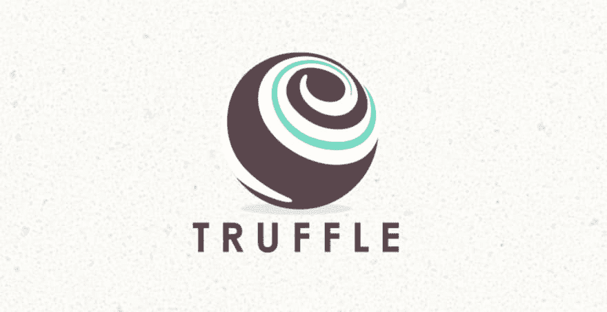
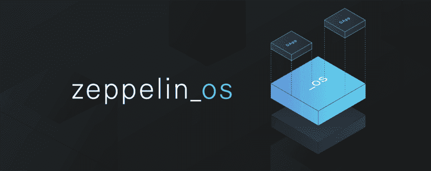
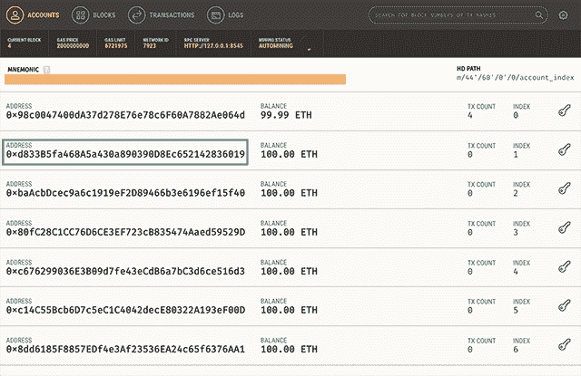

# 如何与松露^5.0 和齐柏林^2.0 签订可升级智能合约

> 原文：<https://dev.to/paulrberg/how-to-write-upgradeable-smart-contracts-with-truffle-50-and-zeppelinos-20-4d6k>

## 上下文

在本帖中，我们将学习如何用最新版本的 Truffle 和 ZeppelinOS 编写可升级的智能合同。特别是，松露的^5.0 版本引入了过多的更新，其中最突出的是与 with web3 的集成让我们打开这些更新，并介绍与最先进的 ZeppelinOS 的可升级智能合约。

这不是一篇以太坊开发的介绍性文章，如果你想了解，可以看看下面的资源:

*   以太坊智能合约的搭便车指南
*   [以太坊编程入门](https://blog.zeppelin.solutions/a-gentle-introduction-to-ethereum-programming-part-1-783cc7796094)

请注意，区块链世界的发展速度非常快，几乎没有时间让标准深入人心。这意味着上面文章中的许多代码片段可能不会像预期的那样工作，但是发生这种情况时不要惊慌并返回这里。

## 先决条件

确保您配备了以下物品:

*   node.js 和 npm
*   ganache-cli 或 [Ganache](https://truffleframework.com/ganache) 桌面应用程序
*   想了解更多的好奇心

## 松露^5.0

[](https://res.cloudinary.com/practicaldev/image/fetch/s--ab8nSDg_--/c_limit%2Cf_auto%2Cfl_progressive%2Cq_auto%2Cw_880/https://paulrberg.com/post/upgradeable-smart-contracts/truffle.png)

要全球安装 truffle，请在您的终端上写下:

```
$ npm install truffle@^5.0.0 --global 
```

Enter fullscreen mode Exit fullscreen mode

让我们创建我们的项目:

```
$ mkdir MyProject
$ cd myProject
$ npm init -y
$ truffle init 
```

Enter fullscreen mode Exit fullscreen mode

这将初始化一堆文件。如果您使用的是旧版本的 Truffle，您可能会注意到“truffle-config.js”现在更加冗长，并且有更多可配置的选项。让我们看一下重要的变化。

### Web3 ^1.0

这是一个主要的 API 变化，但也是一个好的变化，因为新的库使用起来更加优雅和直观。当然，如果你已经用旧版本编写了你的块菌测试，那么会有转换成本，所以为了以防万一，把 web3 ^1.0 [文档](https://web3js.readthedocs.io/en/1.0/)加入书签。

### 高清钱包提供商

如果你之前使用的是“truffle-HD wallet-provider”NPM 模块，你**必须**升级到“truffle-HD wallet-provider @ web 3-one”以使其与 Truffle ^5.0:
一起工作

```
$ npm install truffle-hdwallet-provider@web3-one --save-dev 
```

Enter fullscreen mode Exit fullscreen mode

要加载助记符，可以使用 node 自带的“fs”模块，也可以安装“dotenv”。千万不要用 JavaScript 硬编码！

### 自带编译器

当用 Truffle 编译时，改变 Solidity 编译器曾经是一件非常令人头疼的事情，但是现在不用担心了！你可以这样定义你想要的任何(远程)版本:

```
compilers: {
  solc: {
    optimizer: {
      enabled: true,
      runs: 200,
    },
    version: "0.4.25",
  },
} 
```

Enter fullscreen mode Exit fullscreen mode

在这个特定的例子中，我们将编译器版本设置为“0.4.25”，但是如果您愿意，也可以选择“0.4.24”或“0.4.18”。列出所有可用版本:

```
$ truffle compile --list 
```

Enter fullscreen mode Exit fullscreen mode

### 支持异步，Await

如果你是 JavaScript ES8 超级酷的“async”和“await”的粉丝，现在你可以在运行`$ truffle develop`或`$ truffle console`时好好利用它们。

### 其他

还有一些其他的新特性，比如增加了对插件的支持，但是它们超出了本教程的范围。如果你正在寻找一个详尽的列表，请查看[变更日志](https://github.com/trufflesuite/truffle/releases/tag/v5.0.0)。

## 部署智能合同

[](https://res.cloudinary.com/practicaldev/image/fetch/s--1E54vMvy--/c_limit%2Cf_auto%2Cfl_progressive%2Cq_auto%2Cw_880/https://paulrberg.com/post/upgradeable-smart-contracts/smart-contract.png)

这是我们将要使用的实体合同模型:

```
// Note.sol
pragma solidity ^0.4.25;

contract Note  {
  uint256 private number;

  constructor(uint256 _number) public {
    number = _number;
  }

  function getNumber() public view returns (uint256 _number) {
    return number;
  }
} 
```

Enter fullscreen mode Exit fullscreen mode

在“contracts”文件夹中创建一个名为“Note.sol”的新文件，将上面的代码复制并粘贴到那里。现在，通过编辑合同，确保您已经正确完成了所有步骤:

```
$ truffle compile 
```

Enter fullscreen mode Exit fullscreen mode

您应该不会收到错误和以下日志:

> 正在编译。/合同/迁移. sol...
> 
> 编译。/contracts/notes . sol...
> 
> 书写神器来。/构建/合同

现在，让我们编写迁移文件。

```
// 2_migrate_note.js

var Note = artifacts.require("./Note.sol");

module.exports = function (deployer) {
  deployer.deploy(Note, 64);
}; 
```

Enter fullscreen mode Exit fullscreen mode

在“migrations”文件夹中，创建一个名为“2_migrate_note.js”的新文件，复制并粘贴上面的代码。为了验证设置，你必须首先旋转以太坊节点，但是不要担心，对于本地开发有像 [Ganache](https://truffleframework.com/ganache) 这样的工具。你可以通过打开一个新的终端窗口并执行`$ ganache-cli`或者启动桌面应用程序来运行它。然后:

```
$ truffle migrate 
```

Enter fullscreen mode Exit fullscreen mode

如果您遇到问题，请确保您的“truffle-config.js”文件如下所示(为了简洁起见，我去掉了注释):

```
// truffle-config.js

module.exports = {
  compilers: {
    solc: {
      version: "0.4.25",
      settings: {
        optimizer: {
          enabled: false,
          runs: 200
        }
      }
    }
  },
  networks: {
    development: {
      host: "127.0.0.1",
      port: 8545,
      network_id: "*",
    }
  }
}; 
```

Enter fullscreen mode Exit fullscreen mode

如果成功的话，你会得到一份漂亮的报告，就像这里的一样。厉害！现在，您已经知道如何编译和部署与松露^5.0 的合同，但您还没有接触到更酷的部分:使智能合同可升级。

## 齐柏林飞船

[](https://res.cloudinary.com/practicaldev/image/fetch/s--FEL7RSDA--/c_limit%2Cf_auto%2Cfl_progressive%2Cq_auto%2Cw_880/https://paulrberg.com/post/upgradeable-smart-contracts/zeppelinOS.png)

### 设置

如果你对可升级智能合约完全不熟悉，去看看 Elena Nadolinski 关于这个话题的[演讲](https://www.youtube.com/watch?v=FzmzUHLiutg)。这是完全值得的，它可以做得比别人在博客上做得更好。

其要点是，我们的目标是将传统的开发实践与智能合约相协调:

1.  当对真实用户进行 A/B 测试时，如果出现了 bug，我们应该尽快修补代码并修复它。
2.  可升级性流程应该保持完全透明，不要将全部权力授予开发人员。

第二点目前正在研究中，许多人积极地[提出](https://blog.zeppelinos.org/exploring-upgradeability-governance-in-zeppelinos-with-a-gnosis-multisig/)透明的治理模式。然而，我们现在不介意分散自治组织(Dao ),并专注于故事的技术部分。

让我们安装 ZeppelinOS 及其库依赖:

```
npm install zos --global
npm install zos-lib --save-dev 
```

Enter fullscreen mode Exit fullscreen mode

然后在我们的 Truffle 项目中初始化它:

```
zos init MyProject 
```

Enter fullscreen mode Exit fullscreen mode

名为“zos.json”的文件应该已经初始化:

```
{  "zosversion":  "2",  "name":  "MyProject",  "version":  "0.1.0",  "contracts":  {}  } 
```

Enter fullscreen mode Exit fullscreen mode

重要的是，确保**按如下方式更新票据合同**:

```
// Note.sol
pragma solidity ^0.4.25;

import "zos-lib/contracts/Initializable.sol";

contract Note is Initializable {
  uint256 private number;

  function initialize(uint256 _number) public initializer {
    number = _number;
  }

  function getNumber() public view returns (uint256 _number) {
    return number;
  }
} 
```

Enter fullscreen mode Exit fullscreen mode

ZeppelinOS 契约不使用普通的 Solidity 构造函数，而是依赖于一个“可初始化的”基础契约，该契约需要覆盖它的“初始化”函数。让我们继续将编辑过的合同添加到 ZeppelinOS:

```
$ zos add Note 
```

Enter fullscreen mode Exit fullscreen mode

以下 JavaScript 对象应该已经添加到“zos.json”中:

```
"contracts":  {  "Note":  "Note"  } 
```

Enter fullscreen mode Exit fullscreen mode

在部署之前，ZeppelinOS 要求您创建一个会话:

```
$ zos session --network development --from YOUR_DEPLOYMENT_ACCOUNT --expires 7200 
```

Enter fullscreen mode Exit fullscreen mode

解释每个参数:

*   网络:在“truffle-config.js”下定义的网络之一
*   发件人:由于已知的[透明代理问题](https://docs.zeppelinos.org/docs/pattern.html)，部署帐户不能是 truffle 或 ganache 指定的默认地址
*   expires:会话的生存时间，以秒为单位

现在，澄清一些事情:

1.  该会话是一种“行为糖”——在部署时，您不必指定“网络”和“来自”参数。
2.  您可能想知道要设置什么“from”参数。简单来说，任何账号**除了**第一个。在下面的图片中找到 Ganache 桌面应用程序的示例:

[](https://res.cloudinary.com/practicaldev/image/fetch/s--J4gA8vYZ--/c_limit%2Cf_auto%2Cfl_progressive%2Cq_auto%2Cw_880/https://paulrberg.com/post/upgradeable-smart-contracts/ganache-account.png)

准备好黄金时间了吗？

```
$ zos push 
```

Enter fullscreen mode Exit fullscreen mode

如果成功了，您应该得到这样的结果:

> 编制合同
> 
> 编制。/合同/迁移. sol...
> 
> 编制。/contracts/notes . sol...
> 
> 编译 zos-lib/contracts/initializable . sol...
> 
> 书写神器来。/构建/合同
> 
> 验证合同注解
> 
> 上传注解合同为注解
> 
> 为注解
> 
> 部署逻辑合同创建 zos.dev-7923.json

这个命令最终会将您的智能合约部署到区块链，它还会创建一个名为“zos.dev- <network_id>的文件。json”，其中“<network_id>”是你以太坊网络的 id。在这里，您可以找到关于您的项目的重要信息，例如您的已部署合同的地址。</network_id></network_id>

### [T1】可升级性](#upgradeability)

理解 ZeppelinOS 在引擎盖下通过创建两个合同工作是非常重要的:

1.  代理人
2.  逻辑

问题是代理将最终用户重定向到逻辑，但是代理“保留”存储。也就是说，即使您更新了逻辑，智能合约的状态也保持不变。

之前，您创建并部署了一个逻辑契约。让我们创建一个代理实例:

```
$ zos create Note --init initialize --args 64 
```

Enter fullscreen mode Exit fullscreen mode

这将部署并记录新代理契约的地址。打开一个新的终端窗口并初始化松露控制台:

```
truffle console --network development
let abi = require("./build/contracts/Note.json").abi
let contract = new web3.eth.Contract(abi, "your-proxy-address")
contract.methods.getNumber().call(); 
```

Enter fullscreen mode Exit fullscreen mode

它应该打印“64”。

前往 web3 ^1.0 [文档](https://web3js.readthedocs.io/en/1.0/web3-eth-contract.html)获取更多关于如何使用新合同 API 的信息。

想换号怎么办？幸运的是，您可以对契约的逻辑进行升级，同时保留存储。

首先，通过添加一个新功能来更新合同:

```
// Note.sol
pragma solidity ^0.4.25;

import "zos-lib/contracts/Initializable.sol";

contract Note is Initializable {
  uint256 private number;

  function initialize(uint256 _number) public initializer {
    number = _number;
  }

  function getNumber() public view returns (uint256 _number) {
    return number;
  }

  function setNumber(uint256 _number) public {
    number = _number;
  }
} 
```

Enter fullscreen mode Exit fullscreen mode

然后:

```
$ zos push
$ zos update Note 
```

Enter fullscreen mode Exit fullscreen mode

日志应该是这样的:

> 使用带网络开发的会话，发送方地址 0x d 833 b5 fa 468 a5a 430 a 890390 D8 EC 652142836019
> 
> 升级代理到逻辑契约 0x e 6 D6 D1 CD 339 f 129275 e5b 5 e 7 ab 39d 85 BC 5642010
> 
> 实例 0x 746 bb 4a 872 bdfd 861 C4 af 5d 9391 B3 FB 5b 22 FB 7a 升级到
> 0x

现在，启动一个新的 Truffle 控制台，调用新的“setNumber”函数:

```
$ truffle console --network development
let abi = require("./build/contracts/Note.json").abi;
let contract = new web3.eth.Contract(abi, "your-proxy-address");
contract.methods.getNumber().call();
contract.methods.setNumber(65).send({ from: YOUR_OTHER_ACCOUNT });
contract.methods.getNumber().call(); 
```

Enter fullscreen mode Exit fullscreen mode

它应该打印“65”。

瞧啊。您刚刚编写、部署并升级了一份以太坊智能合约。

### 告诫

*   “YOUR_DEPLOYMENT_ACCOUNT”必须仅在设置会话时使用，对于与合同的任何其他交互，您必须使用其他帐户。
*   如果你得到了一个`A network name must be provided to execute the requested action`错误，就开始一个新的会话，旧的已经过期了。
*   您可能已经注意到，我们没有使用 TruffleContract 来与部署的合同进行交互，而是依赖于 web3 ^1.0 实现。这是因为我发现前者令人困惑，而且在很多情况下甚至不起作用。
*   除了我们在这里讨论的，还有更多可升级的智能合约。前往 Zeppelin 的令人敬畏的[文档](https://docs.zeppelinos.org/docs/start.html)以了解全貌。特别是，我建议查看升级存储变量的[限制](https://docs.zeppelinos.org/docs/start.html)。
*   ~~如果你计划迁移到 Solidity ^0.5.0，很抱歉让你失望的是，ZeppelinOS 截至 2018 年 12 月还不支持它。有一个选项叫做“- skip-compile”，但是我觉得它增加了太多的复杂性，不值得。Zeppelin 的 Santiago Palladino 在推特上宣布他们现在支持^0.5.0 版本的 Solidity。如果你想测试一下，就做`npm install zos-lib@2.1.0-rc.0 --global`。~~

## 总结

我希望你喜欢这篇教程，并且和我一样对区块链开发感到兴奋，尽管偶尔会有版本和协调问题。

我在这个 GitHub [repo](https://github.com/PaulRBerg/truffle-zos-tutorial) 中编译了贯穿本文的代码。有三个分支(master、zos、zos-upgraded ),对应于我们经历的每个阶段的 Note 契约代码。

如果你想聊天，可以在推特或者 T2 上找到我。