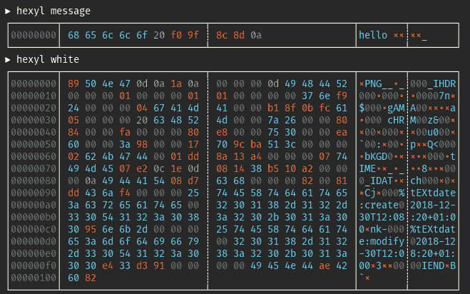
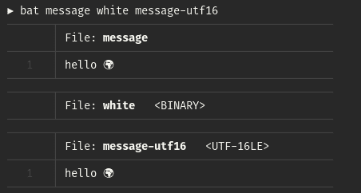

# 二进制文件“二进制”和“文本”文件的区别

> 原文：<https://dev.to/sharkdp/what-is-a-binary-file-2cf5>

本文探讨了“二进制”和“文本”文件的主题。两者有什么区别(如果有的话)？对于什么是“二进制”或“文本”文件有明确的定义吗？

我们从两个候选文件开始我们的旅程，我们可以直观地将它们的内容分别归类为“文本”和“二进制”数据:

```
echo "hello 🌍" > message
convert -size 1x1 xc:white png:white 
```

Enter fullscreen mode Exit fullscreen mode

我们已经创建了两个文件:一个名为`message`的文件，其文本内容为*“你好🌍"*(包括 Unicode 符号["地球地球欧洲非洲"](https://unicode-table.com/en/1F30D/))和一个带有单个白色像素的 PNG 图像，称为`white`。文件扩展名被故意忽略。

为了演示一些程序区分“文本”和“二进制”文件，看看`grep`如何改变它的行为:

```
▶ grep -R hello            
message:hello 🌍

▶ grep -R PNG
Binary file white matches 
```

Enter fullscreen mode Exit fullscreen mode

`diff`做类似的事情:

```
▶ echo "hello world" > other-message
▶ diff other-message message 
1c1
< hello world
--------
> hello 🌍

▶ convert -size 1x1 xc:black png:black
▶ diff black white
Binary files black and white differ 
```

Enter fullscreen mode Exit fullscreen mode

这些程序如何区分“文本”和“二进制”文件？

在回答这个问题之前，让我们先试着给出一个定义。显然，在基本的文件系统级别上，每个文件都只是字节的集合，因此可以被视为二进制数据。另一方面，区分“文本”和“非文本”(以下称为“二进制”)数据似乎对像`grep`或`diff`这样的程序很有帮助，只要不弄乱终端仿真器的输出。

所以也许我们可以从定义“文本”数据开始。从文本的抽象概念开始似乎是合理的，它是一系列的 [Unicode 码位](https://en.wikipedia.org/wiki/Unicode)。代码点的例子有像`k`、`ä`或`א`这样的字符，以及像`%`、`☢`或`🙈`这样的特殊符号。为了将给定的文本存储为一个字节序列，我们需要选择一个*编码*。如果我们希望能够表示整个 Unicode 范围，我们通常选择 UTF-8，有时选择 UTF-16 或 UTF-32。从历史上看，只支持当今 Unicode 的一部分的编码也很重要。最突出的是 US-ASCII 和 Latin1 (ISO 8859-1)，但还有更多。所有这些在字节级别上都有所不同。

给定一个文件的内容(而不是它是如何被创建的历史)，我们可以尝试下面的定义:

> 如果文件的内容由 Unicode 码位的编码序列组成，则该文件称为“文本文件”。

这个定义有两个实际问题。首先，我们需要一个所有可能的编码的列表。第二，为了测试一个文件的内容是否以给定的编码方式编码，我们必须解码文件的*全部*内容，看看是否成功。整个过程会非常缓慢。

事实证明，有一种更快的方法来区分文本和二进制文件，但这是以精度为代价的。

为了了解这是如何工作的，让我们回到我们的两个候选文件，探索它们的字节级内容。我使用 [`hexyl`](https://github.com/sharkdp/hexyl) 作为十六进制浏览器，但是你也可以使用`hexdump -C`:

[](https://res.cloudinary.com/practicaldev/image/fetch/s--TyxBK_wi--/c_limit%2Cf_auto%2Cfl_progressive%2Cq_auto%2Cw_880/https://thepracticaldev.s3.amazonaws.com/i/gk85n9eha0m5pjt3dthj.png)

请注意，这两个文件都包含 ASCII 范围内外的字节(`00` … `7f`)。例如，`message`文件中的四个字节`f0 9f 8c 8d`是 Unicode 码位`U+1F30D`(🌍).另一方面，`white`图像开头的字节`50 4e 47`是字符`PNG`的简单 ASCII 编码版本。

所以很明显，查看 ASCII 范围之外的字节不能作为检测“二进制”文件的方法。但是，这里的*是*两个文件的区别。图像文件包含大量空字节(`00`)，而短文本消息则不包含。事实证明，这可以变成一个简单的*启发式*方法来检测二进制文件，因为许多编码的文本数据不包含任何空字节(即使它可能是合法的)。

事实上，这正是`diff`和`grep`用来检测“二进制”文件的。以下宏包含在 [`diff`的源代码中(`src/io.c` )](https://github.com/Distrotech/diffutils/blob/9e70e1ce7aaeff0f9c428d1abc9821589ea054f1/src/io.c#L85-L88) :

```
#define binary_file_p(buf, size) (memchr (buf, 0, size) != 0) 
```

Enter fullscreen mode Exit fullscreen mode

这里， [`memchr(const void *s, int c, size_t n)`](https://linux.die.net/man/3/memchr) 函数用于在从`buf`开始的存储区的初始`size`字节中搜索字符`0`。为了进一步加速这个过程，通常只有文件的前几个字节被读入缓冲区`buf`(例如 1024 字节)。总而言之，`grep`和`diff`使用以下启发式方法:

> 如果文件内容的前 1024 个字节不包含任何空字节，则该文件很可能是“文本文件”。

请注意，这里有一些失败的反例。例如，即使不太可能，UTF 8 编码的文本可以合法地包含空字节。相反，一些特定的二进制格式(如 binary [PGM](https://en.wikipedia.org/wiki/Netpbm_format) )不包含空字节。这种方法通常也会将 UTF-16 和 UTF-32 编码的文本归类为“二进制”，因为它们用空字节对常见的 Latin-1 代码点进行编码:

```
▶ iconv -f UTF-8 -t UTF-16 message > message-utf16
▶ hexdump -C message-utf16 
00000000  ff fe 68 00 65 00 6c 00  6c 00 6f 00 20 00 3c d8  |..h.e.l.l.o. .<.|
00000010  0d df 0a 00                                       |....|
00000014
▶ grep . message-utf16                            
Binary file message-utf16 matches 
```

Enter fullscreen mode Exit fullscreen mode

然而，这种启发式方法非常有用。我在 Rust 中写了一个[小库](https://github.com/sharkdp/content_inspector),它使用这个方法的一个稍微改进的版本来快速确定一个给定的文件是包含“二进制”还是“文本”数据。在我的程序 [`bat`](https://github.com/sharkdp/bat) 中使用它来防止“二进制”文件被转储到终端:

[](https://res.cloudinary.com/practicaldev/image/fetch/s--10FKVT3K--/c_limit%2Cf_auto%2Cfl_progressive%2Cq_auto%2Cw_880/https://thepracticaldev.s3.amazonaws.com/i/6cvzc0jcupyp5ex1ainm.png)

#### 脚注

 <small>注意，有一些编码在文件的开头写所谓的[字节顺序标记](https://en.wikipedia.org/wiki/Byte_order_mark) (BOM)来表示编码的类型。例如，UTF-32 的 little-endian 变体使用`ff fe 00 00`。这些 BOM 将有助于第二点，因为我们不需要解码文件的整个内容。不幸的是，添加 BOM 是可选的，很多编码都没有指定。</small> 

 <small>`50 4e 47`是 PNG 格式的[幻数](https://en.wikipedia.org/wiki/List_of_file_signatures)的一部分。幻数类似于 BOM，许多二进制格式在文件开头使用幻数来表示它们的类型。使用幻数来检测某些类型的“二进制”文件是一种由`file`工具使用的方法。</small>