# 从零开始在 Windows 10 上创建 React 应用程序

> 原文：<https://dev.to/spences10/from-scratch-to-create-react-app-on-windows-2b8h>

###### 照片由 Unsplash 上的 Luana De Marco 拍摄

**关于在 Windows 10 上建立网络开发环境的有见解的指南**

我已经做了 10 个月的专业网页开发人员，在这段时间里我同时使用了 MacOs 和 Windows。我最喜欢使用的操作系统是 Windows，没有别的原因，只是因为我更喜欢键盘布局。

对于 Windows/Linux，我喜欢用 Ctrl 键作为复制粘贴操作的按键，我可以用左手的小手指代替大拇指。无论如何，让我们把弱推理抛在脑后，因为这不是这篇文章的目的！

如果你没有 Windows 系统的机器，那么这篇文章可能不适合你，如果这和你用的不一样，也不会使它变坏。

让我们看看肯对此有什么看法:

> 棉花头傻子[@ ken _ wheeler](https://dev.to/ken_wheeler)所以我在工作中全职使用 Windows 大约有 4 个月，而且还不错。2018 年 12 月 20 日上午 00:59[](https://twitter.com/intent/tweet?in_reply_to=1075556283795824640)[](https://twitter.com/intent/retweet?tweet_id=1075556283795824640)[](https://twitter.com/intent/like?tweet_id=1075556283795824640)

这是 2018 年开始的 [my guide 关于在 Windows 机器上设置 web 开发环境的更新。](https://blog.scottspence.me/wsl-setup/)

本指南将介绍如何安装 Ubuntu，但是你也可以使用 Windows 商店中的其他版本的 Linux，Debian 的安装与 Ubuntu 非常相似。

## 本岗位目标

从 Windows 10 的一个新实例到你可以用来开发网络应用的东西。

这些说明是针对 **Windows 10 秋季 Creators 更新及以后的。**

我们将要讨论的内容:

*   [安装 WSL](#install-wsl)
*   [在您的机器上启用 WSL](#enable-wsl-on-your-machine)
*   [更新、升级和自动删除](#update-upgrade-and-autoremove)
*   [安装节点(带`n` )](#install-node-with-n)
*   [安装 Visual Studio 代码](#install-visual-studio-code)
*   [安装 Windows Git](#install-windows-git)
*   [安装一个终端(Hyper)](#install-a-terminal-hyper)
*   [装鱼壳！](#install-fish-shell)
    *   [安装我的鱼](#install-oh-my-fish)
    *   [OMF 的鱼主题](#fish-themes-with-omf)
*   [配置](#configure)
*   [Git 配置](#git-config)
*   [创建 React 应用](#create-react-app)
*   [配合 GitHub 使用 SSH](#use-ssh-with-github)
    *   [WSL SSH 配置](#wsl-ssh-config)
    *   [Windows Git Bash SSH 配置](#windows-git-bash-ssh-config)
*   [更改 WSL 版本](#change-wsl-version)
*   [收工！](#wrap-up)

## 安装 WSL

你可以从微软商店安装 Ubuntu，这将是安装的前半部分，第二部分是 ypu 打开应用的时候。

## 在机器上启用 WSL

官方指南很好地涵盖了这一点，但如果你不想用鼠标四处点击，我将在这里添加快捷键。

但是，在此之前，如果您还没有选择 PowerShell 作为您的默认命令提示符，您可以从任务栏设置页面(位于设置的个性化部分)中选择它，我建议您现在就选择:

[](https://res.cloudinary.com/practicaldev/image/fetch/s--MG37TNki--/c_limit%2Cf_auto%2Cfl_progressive%2Cq_66%2Cw_880/https://thepracticaldev.s3.amazonaws.com/i/dbt2lrp8dmt123stt56j.gif)

同时，我们还应该启用隐藏文件夹，并在 Windows 文件资源管理器中为已知的文件类型添加文件扩展名。

使用 Windows 键+e 打开 Windows 文件资源管理器，然后从功能区中选择“查看”。然后单击最右边的选项按钮，这将打开文件夹选项对话框，从这里我们要选择查看选项卡，并选择“显示隐藏文件，文件夹和驱动器”的隐藏文件和文件夹的单选按钮，取消选中“隐藏已知文件类型的扩展名”选项。单击应用和确定。

我们这样做的原因是，我们可以在项目结构中看到`.git`文件夹，它也是用于环境配置的`.env`文件等文件所需要的。

[https://player.vimeo.com/video/308779717](https://player.vimeo.com/video/308779717)

使用 windows 键+x，这等同于右击桌面上的 Windows 图标，这将打开快速链接菜单。从这里你需要选择 Windows PowerShell(<u>A</u>dmin)选项，你可以通过按键盘上的 **a** 来完成。因此，Windows 键+x，然后 a，将打开用户帐户控制(管理)提示，假设您在您的机器上有管理权限，您需要单击是继续。

将这里的代码复制粘贴到 PowerShell 窗口中，Ctrl+v 将在 PowerShell 中工作，按 enter 执行命令。

```
Enable-WindowsOptionalFeature -Online -FeatureName Microsoft-Windows-Subsystem-Linux 
```

Enter fullscreen mode Exit fullscreen mode

之后，系统会提示您重启机器，这是您应该做的。

> 查看链接以获得完整的 [windows 键盘快捷键](https://support.microsoft.com/en-gb/help/12445/windows-keyboard-shortcuts)列表。

重启后，你可以从开始菜单打开 Ubuntu 程序，第二次安装(WSL 在你的系统上)应该会发生。等待此操作完成，然后系统会提示您为该帐户创建用户和密码。您需要记住为用户创建的密码，因为系统会提示您使用`sudo`权限。

## 更新、升级和自动删除

在写这篇文章的时候，我链接的 Ubuntu 版本是 18.04.1

链接的应用程序将在 Windows 上安装最新稳定的 Ubuntu 版本。

你可以用
查看你安装了什么版本的 Ubuntu

```
lsb_release -a 
```

Enter fullscreen mode Exit fullscreen mode

[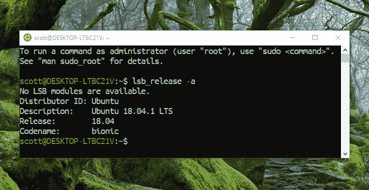](https://res.cloudinary.com/practicaldev/image/fetch/s--o53-kaDV--/c_limit%2Cf_auto%2Cfl_progressive%2Cq_auto%2Cw_880/https://thepracticaldev.s3.amazonaws.com/i/flvjitn6am1cifs9xb5z.png)

如果你想使用特定的 LTS 版本的 Ubuntu，你可以从 Windows Store 获得，这里是:

*   Ubuntu 16.04 lt
*   [Ubuntu 18.04 lt](https://www.microsoft.com/en-gb/p/ubuntu-1804-lts/9n9tngvndl3q?activetab=pivot:overviewtab)

现在，我们将继续更新和升级所有的东西，这里的三个命令将更新和升级 Ubuntu 安装中附带的所有预装软件。

下面的代码是用`&&`连接在一起的三个命令。`-y`标志用于自动接受将随升级一起执行的更改。自动删除将删除升级后留下的未使用的软件包。

将以下命令复制到你的 Ubuntu 终端，并运行命令:

```
sudo apt update && sudo apt -y upgrade && sudo apt autoremove 
```

Enter fullscreen mode Exit fullscreen mode

> 要从 16.04 转到 18.04，请在终端中尝试`do-release-upgrade`。请注意，这比删除当前安装的 Ubuntu 并重新启动花费的时间要长得多。

既然已经安装并更新了基础包，我们需要安装 [build-essential](https://packages.ubuntu.com/bionic/build-essential) 包来编译和构建其他包，下面我们将要安装的包都需要它。

```
sudo apt install -y build-essential 
```

Enter fullscreen mode Exit fullscreen mode

从现在开始，我建议使用两个 bash 窗口，一个启用 sudo，另一个启用标准权限。

> 即打开一个终端，不要在那里输入`sudo`，而是使用被授予该权限的终端。

这样做的原因是，我发现如果你以 sudo 的身份安装 node，那么每次你想运行一个`npm install`命令时，你都需要授予 sudo 权限，这可能会有点乏味。你真的不应该用 sudo 权限安装 npm 包。

## 安装节点(带`n`)

让我们开始运行吧！如果你使用 Node.js，你最终会遇到需要切换节点版本的情况，为此你可能听说过 nvm ( [节点版本管理器](https://github.com/creationix/nvm))，顺便说一下，你仍然可以在 WSL 中使用它。

我选择 n 而不是 nvm 的原因是，过去我在使用 nvm 时，bash 启动速度很慢。看看这个 [WSL GitHub 问题详细说明了它](https://github.com/Microsoft/WSL/issues/776)和对使用 n 的[支持者的具体评论。](https://github.com/Microsoft/WSL/issues/776#issuecomment-266112578)

好的，让我们安装 n，用 [n-install](https://github.com/mklement0/n-install) ，这个命令不是以 sudo 开始的，所以在没有 sudo 权限的 bash 窗口中使用它。🧐

```
curl -L https://git.io/n-install | bash 
```

Enter fullscreen mode Exit fullscreen mode

这将为我们安装最新版本的 Node，按照终端屏幕上的提示重新加载 bash:

```
# mine looks like this
. /home/scott/.bashrc 
```

Enter fullscreen mode Exit fullscreen mode

现在检查我们在终端中安装的带有`node -v && npm -v`的 Node 和 npm 的版本。

## 安装 Visual Studio 代码

安装 VSCode？什么？这个帖子是要设置 WSL？好了，我们将假设这是从无到有的网络开发，所以我们需要一个文本编辑器，目前还没有接近 VSCode 的东西，如果你已经安装了文本编辑器，那么跳到下一部分。

从[下载部分](https://code.visualstudio.com/download)安装 Windows 版本的 VSCode。安装后，我们可以在设置中启用 WSL，最快的方法是使用快捷键 Ctrl+'在 VSCode 中打开集成终端👈那是省略号。系统将提示您选择默认终端，选择 WSL Bash。

[](https://res.cloudinary.com/practicaldev/image/fetch/s--nY1AeP61--/c_limit%2Cf_auto%2Cfl_progressive%2Cq_66%2Cw_880/https://thepracticaldev.s3.amazonaws.com/i/xiiv0zyatpiogbqm1sl6.gif)

## 安装 Windows Git

为 VSCode 获得 [Git 支持有一点障碍，这在链接问题中提到的各种问题中都有很好的记录。](https://github.com/Microsoft/vscode/issues/9502)

对于像 [WSLGit](https://github.com/andy-5/wslgit) 这样有自己一套问题的东西也有解决办法，这都源于用户(包括我)不想为 Git 安装另一个二进制文件。

我已经尝试了几种变体，当谈到使用带有 VSCode 的 Git 时，阻力最小的方法是咬紧牙关安装额外的二进制文件，这是一种开销，因为必须为 Windows 和 WSL Git 维护和配置 SSH 密钥，但这是一次性的设置。

在 VSCode 团队将 [WSLGit](https://github.com/andy-5/wslgit) 并入 VSCode 之前，我认为这是最好的选择。

从[git-scm.com](https://git-scm.com/download/win)安装该链接将开始下载安装二进制文件，然后您可以打开它并完成安装，您可以在安装过程中继续单击“下一步”,我已经选择了一些我希望启用的选项。

[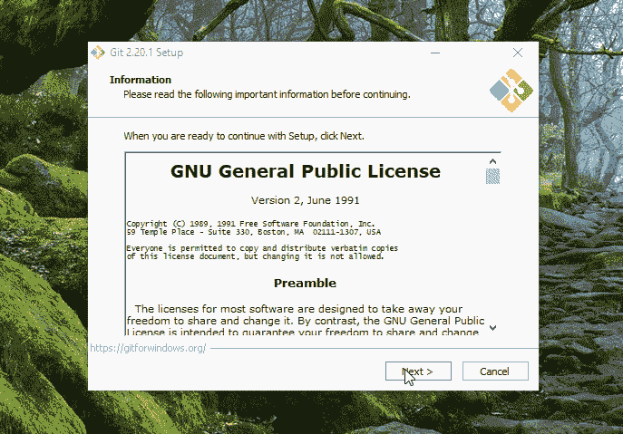](https://res.cloudinary.com/practicaldev/image/fetch/s--djnF_brU--/c_limit%2Cf_auto%2Cfl_progressive%2Cq_66%2Cw_880/https://thepracticaldev.s3.amazonaws.com/i/1g28jysxr50c9lfbu4p3.gif)

现在，这就是我们需要做的，当涉及到使用 SSH 通过 GitHub 进行身份验证时，我们将使用 Git Bash 命令行来配置 Windows 端的东西。

## 安装一个终端(Hyper)

现在我们在 Windows 上有了 bash，是时候安装一个好的终端应用程序了，因为，让我们面对它，标准的有点基础。

进入 [Hyper](http://hyper.is) 一个基于电子的终端应用程序，它是超级主题化和可配置的。

下载并安装 hyper for Windows，这将是最基本的版本，看起来像这样:

[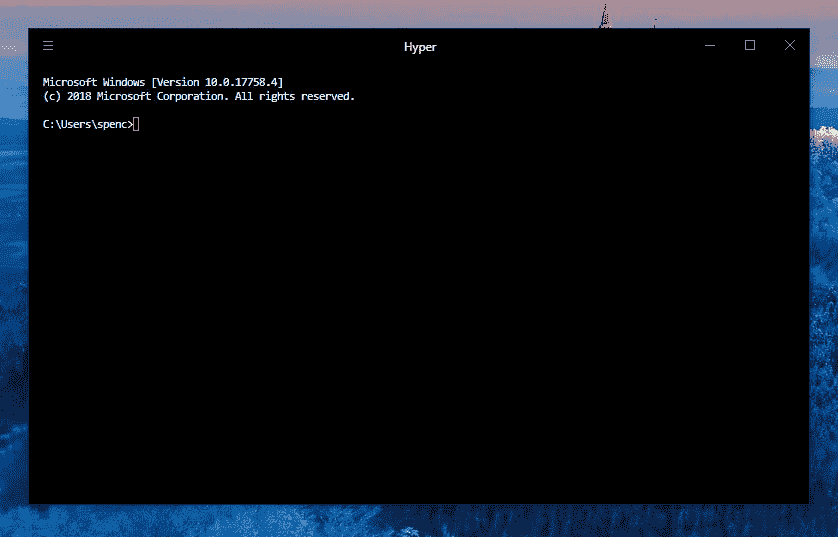](https://res.cloudinary.com/practicaldev/image/fetch/s--lnG7XozY--/c_limit%2Cf_auto%2Cfl_progressive%2Cq_auto%2Cw_880/https://thepracticaldev.s3.amazonaws.com/i/8s68jy17r31rp31kqxir.png)

您可能会注意到，这也是 Windows 命令提示符，别担心，我们现在就要配置它。

打开位于用户文件夹根目录下的`.hyper.js`文件，或者从 Hyper 本身使用快捷键 Ctrl+弹出打开设置。

如果设置文件(`.hyper.js`)在记事本中打开，那么您可以将默认值设置为 VSCode。在文件资源管理器中(使用 Windows 键+e 打开它)导航到该文件，它将在您的用户文件夹中，右键单击该文件并选择属性，然后更改为“打开方式:”并从列表中选择 VSCode。

[](https://res.cloudinary.com/practicaldev/image/fetch/s--jUkupMK7--/c_limit%2Cf_auto%2Cfl_progressive%2Cq_66%2Cw_880/https://thepracticaldev.s3.amazonaws.com/i/09s8cb1zjact18m81d76.gif)

现在我们可以在 Hyper 中将 WSL 设置为 shell 路径，打开`.hyper.js`设置文件并搜索(Ctrl+f)bash，我们希望将 WSL shell 的路径添加到文件中定义的`shell`属性中。

```
// amend shell path
// WSL Bash
shell: 'C:\\Windows\\System32\\bash.exe', 
```

Enter fullscreen mode Exit fullscreen mode

我们还可以通过指定字体大小和字体系列以及预定义的主题来改变 Hyper 的外观，让我们快速将`hyper-adventure-time`主题添加到插件部分。

用 Ctrl+Shift+t 打开另一个 Hyper 选项卡，这将显示 WSL 的 bash 终端。

[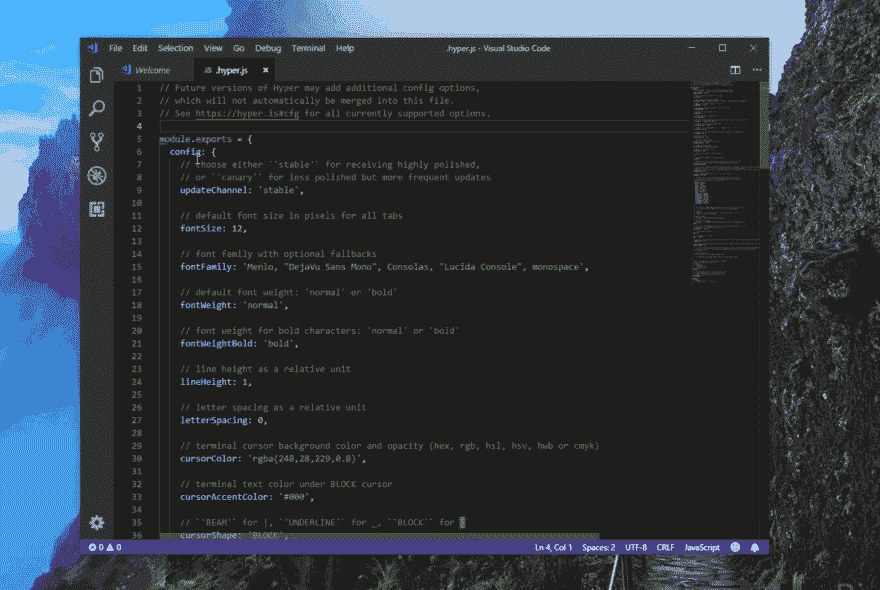](https://res.cloudinary.com/practicaldev/image/fetch/s--czp3FDGK--/c_limit%2Cf_auto%2Cfl_progressive%2Cq_66%2Cw_880/https://thepracticaldev.s3.amazonaws.com/i/4mmkgczkna40pw5htswk.gif)

使用超级终端键盘快捷键快速定位:

*   新标签= Ctrl+Shift+t
*   关闭当前选项卡= Ctrl+Shift+w
*   向右循环切换制表符= Ctrl+Shift+右箭头键
*   向左循环切换制表符= Ctrl+Shift+向左箭头

现在，我将为 Hyper 配置一些额外的属性，并将主题更改为更微妙的东西。

我购买了 Dank Mono，如果你想要一个类似 OSS 的字体，请查看 FiraCode。

下面是我改的:

```
module.exports = {
  config: {
    fontSize: 18,
    fontFamily: '"Dank Mono",...',
    cursorShape: 'BEAM',
    cursorBlink: true,
    copyOnSelect: true,
    plugins: ['hyper-altair']
  }
} 
```

Enter fullscreen mode Exit fullscreen mode

[https://player.vimeo.com/video/308151261](https://player.vimeo.com/video/308151261)

## 装鱼壳！

好了，该装鱼壳了！这是一个完全可选的步骤，我喜欢使用 fish 来获得导航文件结构时的智能感知，也有一些你可以用 Oh My Fish
获得的简洁主题

```
sudo apt -y install fish 
```

Enter fullscreen mode Exit fullscreen mode

[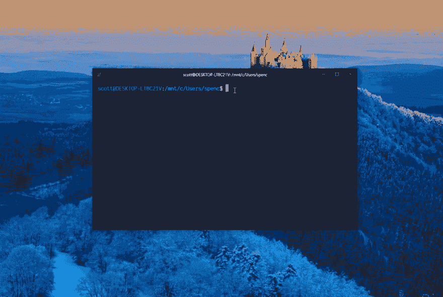](https://res.cloudinary.com/practicaldev/image/fetch/s--XM8hQSUn--/c_limit%2Cf_auto%2Cfl_progressive%2Cq_66%2Cw_880/https://thepracticaldev.s3.amazonaws.com/i/ghpni0arfb0uolc58phf.gif)

### 安装我的鱼哦

现在我们可以安装“哦，我的鱼”( OMF ),并获得一个不错的终端主题，还记得我们讨论过使用正确的权限运行命令吗？这是其中的一种情况，首先打开一个新标签，然后粘贴以下内容:

```
curl -L https://get.oh-my.fish | fish 
```

Enter fullscreen mode Exit fullscreen mode

[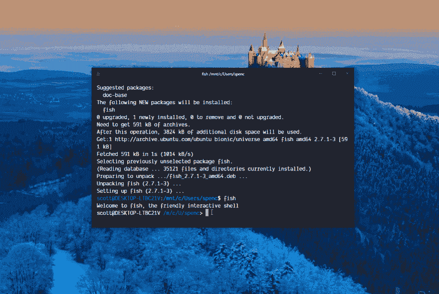](https://res.cloudinary.com/practicaldev/image/fetch/s--2ZXPvxaM--/c_limit%2Cf_auto%2Cfl_progressive%2Cq_66%2Cw_880/https://thepracticaldev.s3.amazonaws.com/i/i30rxzvyz075rmuxvjn9.gif)

#### 以 OMF 为题材的鱼

安装 OMF 后，你可以选择一个主题，这里你可能会注意到文本不适合在 Hyper 的屏幕上，一个快速重置它的方法是最大化窗口，然后再返回，我用 Windows 键+向上箭头最大化窗口键+向下箭头恢复它。

安装 omf 后，我选择了主题 agnoster，安装了`omf install agnoster`你可以通过选择`omf theme`列出可用的和你已经安装的，让我们再次改变为`one`主题，首先调整窗口的大小，因为事情变得有点拥挤。

[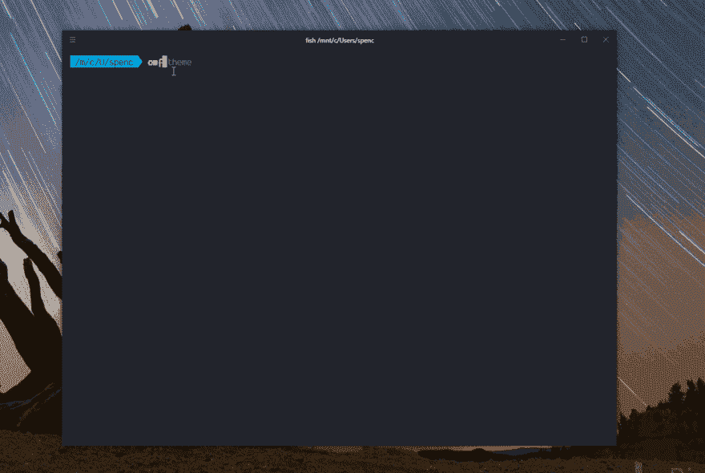](https://res.cloudinary.com/practicaldev/image/fetch/s---MsplIVn--/c_limit%2Cf_auto%2Cfl_progressive%2Cq_66%2Cw_880/https://thepracticaldev.s3.amazonaws.com/i/tz0lrrybbzdhxinuwlib.gif)

这里有很多，我更喜欢一个主题，因为你可以在最右边看到你正在运行的节点的版本。在这里，您还可以看到 fish 的智能感知，它将 agnoster 显示为之前的选择，如果我想选择 agnoster，我可以按 tab 键来完成命令的其余部分。

## 配置

因此，现在我们有了一个外观华丽的新终端和一个基本的 VSCode 安装，是时候让事情动起来了。

我有一个[备忘单](https://github.com/spences10/cheat-sheets)回购，详细说明了我们在这里将要经历的许多配置，如果你在这个过程中发现了一些有用的东西，请留下建议。

首先，代替每次我打开一个新的终端时键入`fish`,并且不替换 bash，你可以这样做，但是我更喜欢使用一个别名。所以我们要做的是打开`.bashrc`文件并编辑它。

从`nano ~/.bashrc`中的新终端类型来看，nano 是一个 bash 文本编辑器。向下滚动(或翻页)到文件底部，添加 fish 的别名，`alias f=fish`，然后退出 nano Ctrl+x，用`y`确认更改。重新加载`.bashrc`文件，就像我们在使用 n 安装节点`. /home/scott/.bashrc`后所做的那样，但是用你的用户名代替我的用户名😄，现在可以用 f 代替鱼了！干得好，你省去了多打三个字符的麻烦！！！。

[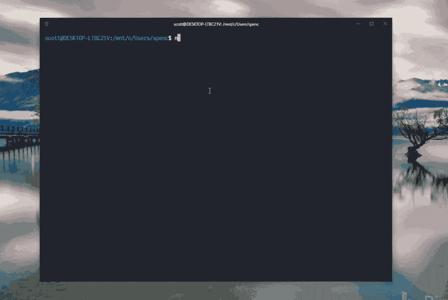](https://res.cloudinary.com/practicaldev/image/fetch/s--94SjY8fT--/c_limit%2Cf_auto%2Cfl_progressive%2Cq_66%2Cw_880/https://thepracticaldev.s3.amazonaws.com/i/vcrobbsjfzttckuej6f4.gif)

## Git 配置

在我们着手创建一个 Create React 应用程序实例之前，我们需要通过`.gitconfig`文件配置 Git。

我们将使用 nano 为 Git 添加一些设置，包括在 WSL 和 Windows 中，这是我之前提到的额外配置，抱歉！

首先，我们将配置 bash 环境，然后转移到 Windows 上的 Git bash。

```
# open up the .gitconfig file in WSL bash
# nano will create one if it doesn't exist
nano ~/.gitconfig 
```

Enter fullscreen mode Exit fullscreen mode

除了 Windows 使用凭证助手之外，这两种环境的配置几乎相同。我个人两种环境都有。

```
# not needed in WSL
[credential]
  helper = manager
[color]
  ui = true

[user]
  name = yourGitHubUserName
  email = yourGitHub@email.com

[core]
  editor = code --wait 
```

Enter fullscreen mode Exit fullscreen mode

进行更改，然后按 Ctrl+x 退出并按 y 确认，这是 Git 配置完成的第一部分。

在 Git Bash for Windows 中，在终端中做同样的事情，使用 nano 创建一个`.gitconfig`文件，并将设置添加到其中。

## 创建 React App

好的，我们将开始创建 react 应用程序，这样我们就可以使用 SSH 通过 GitHub 配置 Git，并开始进行更改以提交 GitHub repo。

我们将使用 [npx](https://medium.com/@maybekatz/introducing-npx-an-npm-package-runner-55f7d4bd282b) 通过 Create React App 创建一个 starter React 项目。如果你想把你的项目放在别的地方，现在是时候导航到那个目录了。

从终端输入:

```
# this will create a starter react project
# called create-react-app
npx create-react-app create-react-app 
```

Enter fullscreen mode Exit fullscreen mode

这是在我的 home ( `~`)文件夹中创建项目，我不得不将 gif 文件的速度提高 20 倍，这确实需要一些时间。🙃

wheeeeeeeeeeeeeeeeeeeeeeeeee！

[https://player.vimeo.com/video/308151465](https://player.vimeo.com/video/308151465)

因此，现在我们已经开发了一个 React 应用程序，我们应该做一些改变，然后将它添加到 GitHub 中。

导航到终端中的 create-react-app 文件夹并打开项目。您可以使用`code .`命令打开 VSCode，`.`表示终端中的当前文件夹。

这将在 create-react-app 项目的根目录下打开 VSCode，通过运行 npm 中的启动脚本确保一切正常。

```
npm run start 
```

Enter fullscreen mode Exit fullscreen mode

如果您想查看当前项目中有哪些可用的脚本，您也可以使用`npm run`，它将列出从`package.json`文件中定义的 npm 命令。

将会打开一个窗口，显示基本的 Create React App 登录页面，我们将向`App.js`模块添加一个 h1，然后通过 VSCode 中的源代码控制菜单提交它。

> 请记住，这是一个开发环境的启动和运行指南，我不打算在 React 中详述开发

当终端忙于启动 create-react-page 时，我们可以用 Ctrl+Shift+t 在 Hyper 中打开另一个标签，用`code .`命令打开 VSCode，导航到`App.js`组件，在带有`<h1>Hello React!</h1>`的``标签上方添加一个`<h1>`标签。

现在，登录页面应该显示新添加的 h1，我们可以通过从终端执行`git status`来确认文件在 Git 中被更改。然后，我们可以从终端或 IDE (VSCode)提交它。我的首选是使用 VSCode，因为文件的视觉差异很大。

使用 Ctrl+Enter 提交更改如果您尚未选择要提交的文件，您将得到一个对话框，告诉您没有要提交的分阶段更改，您可以通过单击文件旁边的加号来选择文件(在本例中只有`App.js`文件)。再次按 Ctrl+Enter 将提交带有消息的更改，您可以从终端或从 VSCode 中的源代码控制部分查看是否有要提交的更改。

[https://player.vimeo.com/video/308151753](https://player.vimeo.com/video/308151753)

好了，是时候把我们超级棒的代码修改添加到 GitHub 上的一个库中，让全世界都看到了！

接下来，我们将向 GitHub 库添加我们所做的本地更改。如果你还没有一个 GitHub 账户，现在是时候注册一个了。

## 配合 GitHub 使用 SSH

首先，我们将在 GitHub 上创建一个存储库，并推送我们对其所做的更改，在这里，我们将单击 GitHub 主页右上角的+按钮，输入存储库名称，GitHub 将为您提供一些默认值供您选择。由于我们已经在本地进行了更改，我们可以忽略前几个命令，但我们确实需要添加遥控器的命令:

```
git remote add origin git@github.com:spences10/cra.git 
```

Enter fullscreen mode Exit fullscreen mode

并将更改上传到 GitHub `git push -u origin master`但是我们会得到一个错误，因为我们还没有设置 SSH。

[https://player.vimeo.com/video/308151976](https://player.vimeo.com/video/308151976)

### WSL SSH 配置

在 Hyper 中打开一个新的 bash 标签，输入`ls -al ~/.ssh`在执行此操作之前，检查是否没有`rsa`文件。

> 您会注意到我们是在 bash 而不是 Fish 中这样做的。

如果什么都没有，那么用
生成新的密钥

```
# add your email address 👍
ssh-keygen -t rsa -b 4096 -C yourGitHub@email.com 
```

Enter fullscreen mode Exit fullscreen mode

现在`ls -al ~/.ssh`将显示两个附加文件:

```
# there should be a private and public key-pair
id_rsa
id_rsa.pub 
```

Enter fullscreen mode Exit fullscreen mode

启动 SSH 代理:

```
eval "$(ssh-agent -s)" 
```

Enter fullscreen mode Exit fullscreen mode

使用:
将 RSA 密钥添加到 SSH

```
ssh-add ~/.ssh/id_rsa 
```

Enter fullscreen mode Exit fullscreen mode

现在是时候将公共 SSH 密钥添加到 GitHub 中了，在 WSL 中我们将复制 pasta 的公共 SSH 密钥和 Hyper 中的`cat ~/.ssh/id_rsa.pub`，然后我们可以从 Hyper 复制到一个[新的 SSH 密钥](https://github.com/settings/ssh/new)。

最后用 GitHub 认证:

```
ssh -T git@github.com 
```

Enter fullscreen mode Exit fullscreen mode

[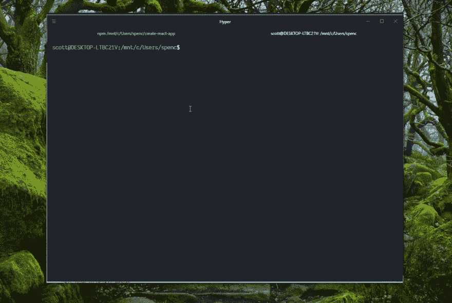](https://res.cloudinary.com/practicaldev/image/fetch/s--OX-KndjO--/c_limit%2Cf_auto%2Cfl_progressive%2Cq_66%2Cw_880/https://thepracticaldev.s3.amazonaws.com/i/gboeyexnsif1j8iwcq4p.gif)

### Windows Git Bash SSH 配置

对于 Windows Git Bash，我们将把刚才在 WSL 中生成的 SSH 密钥复制到 Windows Git Bash，在使用 Windows Git Bash 进行身份验证时，会有一些细微的差别。

在 Hyper 中，将 SSH 文件从 Linux 复制到 Windows:

```
cp ~/.ssh/* /c/Users/spenc/.ssh/ 
```

Enter fullscreen mode Exit fullscreen mode

启动 SSH 代理:

```
eval `ssh-agent -s` 
```

Enter fullscreen mode Exit fullscreen mode

将密钥添加到 SSH 代理:

```
ssh-add ~/.ssh/id_rsa 
```

Enter fullscreen mode Exit fullscreen mode

认证:

```
ssh -T git@github.com 
```

Enter fullscreen mode Exit fullscreen mode

[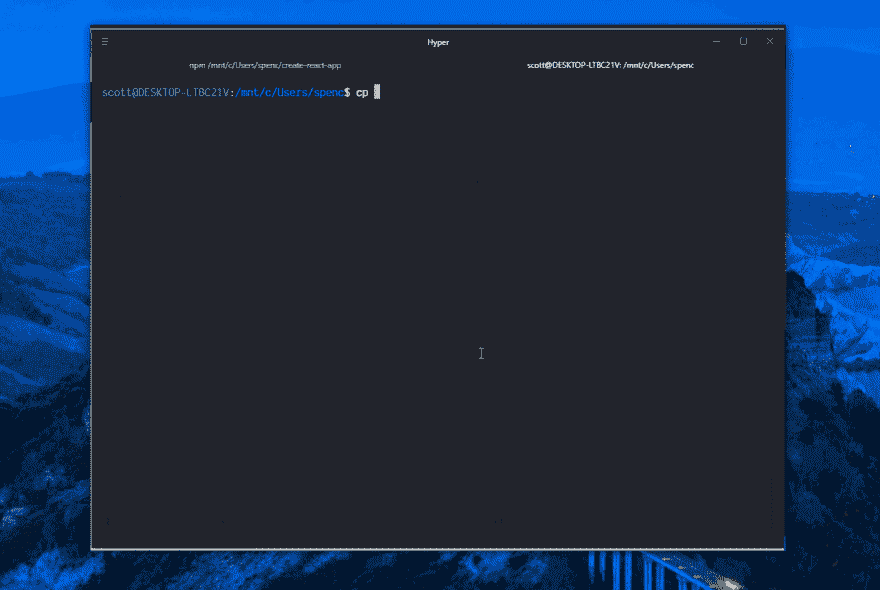](https://res.cloudinary.com/practicaldev/image/fetch/s--S7zsRg_C--/c_limit%2Cf_auto%2Cfl_progressive%2Cq_66%2Cw_880/https://thepracticaldev.s3.amazonaws.com/i/abbz2m9l2b3c5r4ad7r6.gif)

现在 SSH 的附加设置已经完成，我们应该能够返回 Hyper，并将我们的更改推送到 GitHub。

[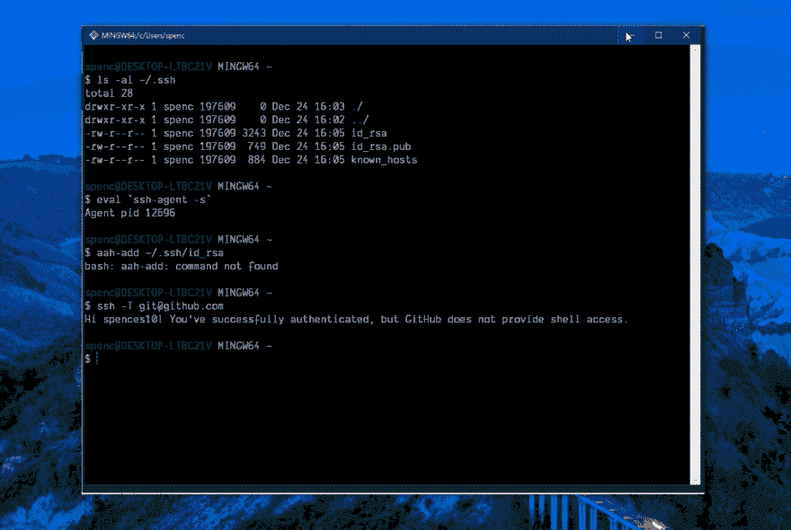](https://res.cloudinary.com/practicaldev/image/fetch/s--azusvapH--/c_limit%2Cf_auto%2Cfl_progressive%2Cq_66%2Cw_880/https://thepracticaldev.s3.amazonaws.com/i/4t10jo2hnvvlifu29zph.gif)

您可能还注意到了 SSH 键🔑令牌在设置屏幕上从黑色变为绿色，这表明您已经通过身份验证。

## 更改 WSL 版本

如果你想使用不同版本的 Ubuntu、Debian 或任何其他可用的 Linux 发行版本，你需要从 PowerShell:

```
# list available versions
wslconfig /l
# set default
wslconfig /setdefault Debian 
```

Enter fullscreen mode Exit fullscreen mode

## 总结一下！

就是这样！我们已经从无到有，发展成为一个功能完善的 web 开发环境。现在，我将在我的 install now 中添加几个其他个人的东西，它们是 Git 和 Fish shell 的别名。如果你对它们感兴趣，我有一张[鱼](https://github.com/spences10/cheat-sheets/blob/master/fish.md)的小抄，上面列有我使用的所有化名，我的`.gitconfig`也一样，你可以在我的[网络文件](https://github.com/spences10/dotfiles)回购中找到

**感谢阅读**🙏

这篇文章最初发布在[我的盖茨比博客](https://blog.scottspence.me)上，你可以在这里[查看它](https://blog.scottspence.me/wsl-bootstrap-2019)如果你喜欢这篇文章，请看看我的其他内容。

在 Twitter 上关注我，或者在 GitHub 上关注 T2 问我任何问题。