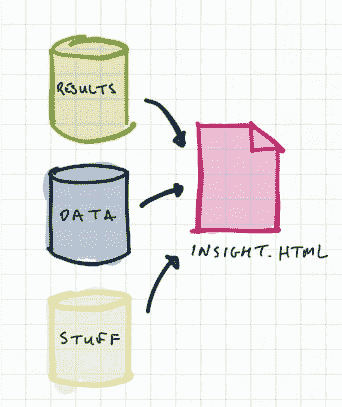
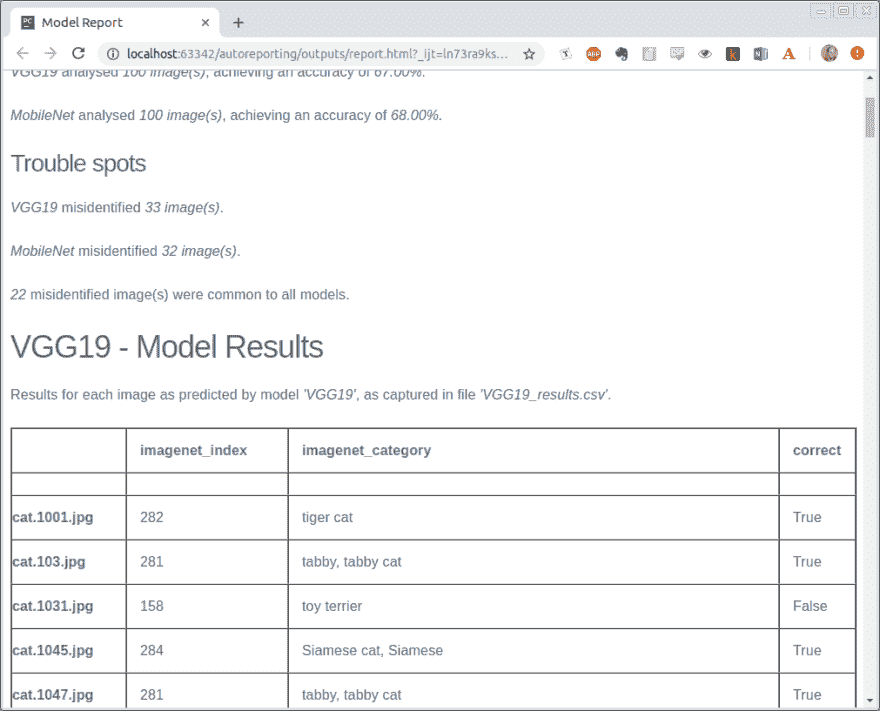
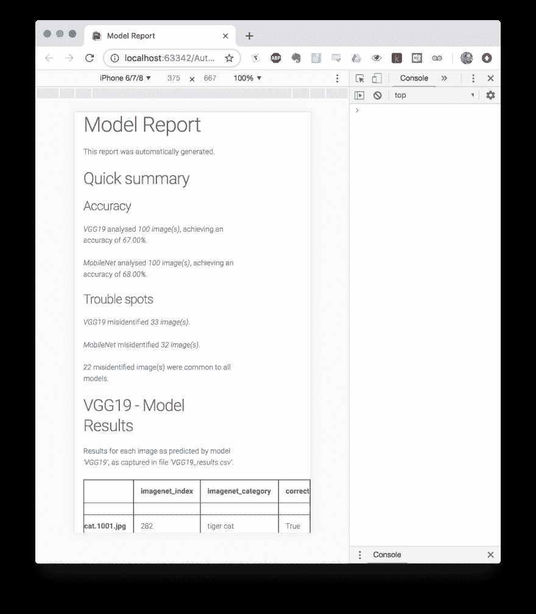
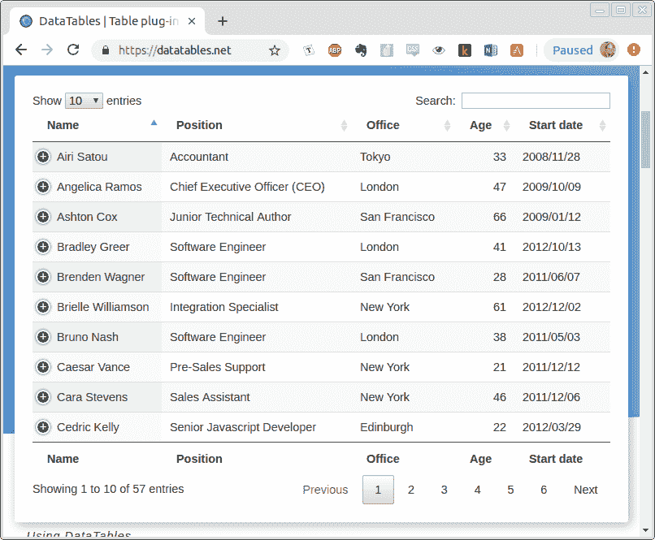
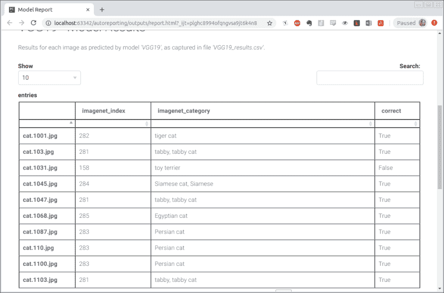

# Python 中的自动报告——第 3 部分:打包

> 原文：<https://dev.to/goyder/automatic-reporting-in-python---part-3-packaging-it-up-1185>

正如我在以前的文章中概述的那样(在这个优秀的网站上可以找到第一部分和第二部分的[，这个项目的目标是制作一个自动报告工具。](https://dev.to/goyder/automatic-reporting-in-python---part-1-from-planning-to-hello-world-32n1)

在这一系列指南中，我追求的结果是一个单一的 HTML 页面，它允许我询问和比较机器学习模型的输出。

[](https://res.cloudinary.com/practicaldev/image/fetch/s--FswGSC1Z--/c_limit%2Cf_auto%2Cfl_progressive%2Cq_auto%2Cw_880/https://thepracticaldev.s3.amazonaws.com/i/9nu22hxwy0qhyhh51bgp.png)

在上一个教程的[结尾，报告工具实际上展示了一些真正的用途！它可以接受大量机器学习摘要文件的`.csv`摘要，并输出一个单独的`.html`页面，该页面以...功能性。](https://dev.to/goyder/automatic-reporting-in-python---part-2-from-hello-world-to-real-insights-8p3)

现在，我想向该工具添加三个主要特性:

1.  这份报告看起来极其乏味。可读性很重要！我们需要改进 *`a e s t h e t i c s`* 的报告。
2.  很难深入到表中——目前只有 100 行，没有工具可以搜索。一些基本的搜索功能可能会有问题。
3.  我们希望用来运行报告的数据集目前被硬编码到脚本中。这需要分离出来，使工具稍微灵活一些。

### 简短的评论

与之前的帖子相比，这篇帖子更像是一次探索性的学习经历——这篇帖子代表了一个新手构建一个工作工具的尝试，而不是对所有可能情况的美好描绘。如果你能看到一个更好的方法来解决这篇文章中列出的任何问题，请随时与我和所有其他读者分享！

但是事不宜迟，让我们试着改善一下美感。

* * *

## 第七步——提高审美

对 HTML 页面有所了解的人可能知道接下来会发生什么:级联样式表，通常被称为 CSS。

### 迈出人生道路上的第一步

如上所述，本教程的挑战在于这是一个巨大的领域，我个人实际上并不十分精通，只涉足和涉足过这个领域。然而，我*是*熟悉学习新事物。

所以，如果这是你第一次真正接触 CSS，让我带你走上我建议你学习任何新技术的道路:

*   做一些关于 CSS 基础的背景阅读。点击[维基百科](https://en.wikipedia.org/wiki/Cascading_Style_Sheets)。如果你感兴趣，点击[的 CSS 标准！](https://www.w3.org/TR/2011/REC-CSS2-20110607/intro.html#html-tutorial)不要害怕谷歌“简单介绍[主题]。”
*   当你阅读和探索时，记下未来信息的潜在好资源。我鼓励每个人看一看与你的主题相关的[“牛逼列表”](https://github.com/sindresorhus/awesome)——以防万一，牛逼 CSS 列表在这里是。
*   有了基本的了解之后，就可以尽情地使用本地文件，并尽可能多地在本地暂存文件中实现。在这种情况下，创建小(或大？)HTML 页面，并弄清楚如何巧妙地组织 CSS。我发现在我开始钻研框架之前，这确实有助于了解使用这种语言的一些实际情况和挑战。

[](https://res.cloudinary.com/practicaldev/image/fetch/s--tzYh59ax--/c_limit%2Cf_auto%2Cfl_progressive%2Cq_auto%2Cw_880/https://thepracticaldev.s3.amazonaws.com/i/qd69w9m656yttbcdtupa.png)

### 变得更加唯利是图

对于自我提高，我发现没有什么比花时间从零开始制定解决方案更好的了。当然，如果您试图为业务需求拼凑一个解决方案，那么从一开始就花费数小时甚至数天的时间来设计一个优雅的 CSS 框架可能是不合理的。

相反，我们可能喜欢快速跳出别人的 CSS 框架。幸运的是，有很多这样的方法，其中很多都强调“最小化”。一个快速的[谷歌搜索](https://www.google.com/search?q=minimal+css+framework)应该会让你开始走这条路。

### 整合

如何将 CSS 文件整合到我们的报告中？有几个典型的选择:

*   *下载 CSS 文件并将其保存为外部文件。*好处是我们有自己的`.html`和`.css`文件，我们可以完全控制这两个文件；更大的缺点是，现在如果我们想移动我们的报告，我们必须带着一堆`.css`文件到处走。
*   *使用一个[内容交付网络](https://www.webopedia.com/TERM/C/CDN.html)CSS 文件的副本*。大多数框架都会为它们的文件提供一个 CDN 链接:这本质上是一个到一个有效的、随时可用的数据副本的链接。这样做的好处是，你只需在你的`.html`的`<head>`部分放下一个链接，就可以让一个 CSS 在你的页面上运行起来，而不会弄乱和搅乱本地文件。缺点是你没有对文件的控制权，需要互联网连接。
*   一个稍微复杂一点的选择是拥有 CSS 文件的本地副本，然后将它们*写入*的`.html`文件。如果我们聪明地使用模板，这可能会相对容易且可持续地完成。好处是我们将报告放在一个文件中，*和*它不需要互联网连接；缺点是设置起来需要更多的努力。(这是创建独立版本的交互式页面时常用的方法。写一个 到`.html`，检查文件，你会发现所有的 CSS 和 JavaScript 魔法都打包在`<head>`部分。)

在原型开发的早期阶段，如果可能的话，我更喜欢使用 cdn。仅仅通过改变一行代码就可以交换 CSS 框架，而不必为本地文件而烦恼，这种优势是值得的，因为它不能使用和编辑框架。优化(以能够自动将 CSS 集成到`.html`文件中的形式)可以晚一点实现。

首先，我将使用[毫克](https://milligram.io/)，一个轻量级的小框架。要开始使用 CDN 方法，我只需按照提供的说明集成到 CDN 中。在我们的`templates/report.html`文件下，我将把必要的链接添加到`<head>`部分:

**`report.html`**T3】

```
<!DOCTYPE html>
<html lang="en">
<head>
    <meta charset="UTF-8">
    {{ title }}
    <link rel="stylesheet" href="//fonts.googleapis.com/css?family=Roboto:300,300italic,700,700italic">
    <link rel="stylesheet" href="//cdn.rawgit.com/necolas/normalize.css/master/normalize.css">
    <link rel="stylesheet" href="//cdn.rawgit.com/milligram/milligram/master/dist/milligram.min.css">
</head>
<!-- body section continues below... --> 
```

Enter fullscreen mode Exit fullscreen mode

突然间，我们 90 年代早期的普通网页变得更加赏心悦目:

[](https://res.cloudinary.com/practicaldev/image/fetch/s--JBUPBlJ8--/c_limit%2Cf_auto%2Cfl_progressive%2Cq_auto%2Cw_880/https://thepracticaldev.s3.amazonaws.com/i/hiynq39nr7j4vu6yddc9.png)

但是我们注意到这里还有一些不太对的地方——首先，为什么页面(尤其是表格)总是占据整个窗口的宽度？为什么这个在手机上看起来不太对？

事实证明，仅仅添加一堆`.css`文件是不够的。我们需要确保我们的`.html`页面的布局符合`.css`页面的预期。

### HTML 布局

像这个领域的大多数主题一样，你的 HTML 页面的布局是一个合理的直观概念，同时也是一个你花费数年时间钻研的问题。更具挑战性的是，尽管有许多[有点](https://www.w3schools.com/css/css_website_layout.asp) [零碎的](https://www.beginnersguidetohtml.com/guides/css/layout/div-tags) ，我一直在努力寻找该领域的简单和/或整体的解释(尽管[这个解释](https://openclassrooms.com/en/courses/2479876-build-your-website-with-html5-and-css3/2491630-structuring-your-page)是我目前最喜欢的温和介绍，而 [Mozilla 指南](https://developer.mozilla.org/en-US/docs/Learn/CSS/CSS_layout/Introduction)似乎相当全面)。

为了简洁起见，我将把大部分的进一步阅读留给你，读者(抱歉！)，而转而关注毫克所期待的。

如果我们[检查](https://developers.google.com/web/tools/chrome-devtools/open)[毫克页面](https://milligram.io/)的代码，我们会看到在`<body>`中，我们可以看到该网站的 HTML 结构大致如下:

```
<body>
    <main class="wrapper">
        <header class="header">
            <section class="container">
        <section class="container"> 
```

Enter fullscreen mode Exit fullscreen mode

现在，根据上述链接中的一些阅读材料，并假设这是毫克预期的结构，我们可以将相同的结构应用到我们自己的报告中，得到如下所示:

**`report.html`**T3】

```
<!DOCTYPE html>
<html lang="en">
<head>
    <meta charset="UTF-8">
    <!-- Note the addition of the viewport! --> 
    <meta name="viewport" content="width=device-width, initial-scale=1.0, minimal-ui">
    {{ title }}
    <link rel="stylesheet" href="//fonts.googleapis.com/css?family=Roboto:300,300italic,700,700italic">
    <link rel="stylesheet" href="//cdn.rawgit.com/necolas/normalize.css/master/normalize.css">
    <link rel="stylesheet" href="//cdn.rawgit.com/milligram/milligram/master/dist/milligram.min.css">
</head>
<body>
    <main class="wrapper">
        <header class="header">
            <section class="container">
                <h1>{{ title }}</h1>
                <p>This report was automatically generated.</p>
            </section>
        </header>
        
        {{ section }}
        
    </main>
</body>
</html> 
```

Enter fullscreen mode Exit fullscreen mode

**`summary_section.html`**T3】

```
<section class="container" id="summary">
    <h2>Quick summary</h2>
    <h3>Accuracy</h3>
    
    <p><em>{{ model_results.model_name }}</em> analysed <em>{{ model_results.number_of_images }} image(s)</em>, achieving an
        accuracy of <em>{{ "{:.2%}".format(model_results.accuracy) }}.</em></p>
    
    <h3>Trouble spots</h3>
    
    <p><em>{{ model_results.model_name }}</em> misidentified <em>{{ model_results.number_misidentified }} image(s)</em>.</p>
    
    <p><em>{{ number_misidentified }}</em> misidentified image(s) were common to all models.</p>
</section> 
```

Enter fullscreen mode Exit fullscreen mode

**`table_section.html`**T3】

```
<section class="container" id="{{ model }}">
    <h2>{{ model }} - Model Results</h2>
    <p>Results for each image as predicted by model <i>'{{ model }}'</i>, as captured in file <i>'{{ dataset }}'</i>.</p>
    {{ table }}
</section> 
```

Enter fullscreen mode Exit fullscreen mode

我们已经将这份报告组织成一个很大程度上独立的部分集合——我们甚至使用了这个术语！-所以给系统添加`<section>`标签并不是什么大事。

### 证明这行得通

运行`autoreporting.py`并检查报告——在全屏和[模拟移动屏幕](https://developers.google.com/web/tools/chrome-devtools/device-mode/)下尝试。

[](https://res.cloudinary.com/practicaldev/image/fetch/s--eg7DMKdR--/c_limit%2Cf_auto%2Cfl_progressive%2Cq_auto%2Cw_880/https://thepracticaldev.s3.amazonaws.com/i/cjgumoiu4xixcf26st13.png)

进步！这就是使用制作精良的响应式布局的好处。

### GitHub 状态

Oooft。对于不多的代码来说，这是大量的背景阅读。尽管如此，这个项目应该看起来像[这个](https://github.com/goyder/autoreporting/commit/bb86833aef81847f09cea687a47273e64341fc68)。

* * *

## 第八步——让我们的桌子互动

好吧。所以现在我们有了自己的桌子，它们看起来相当不错——挑战在于它们不是交互式的。例如，如果有按类别过滤或深入特定图像的功能就太好了。

现在，和探索 CSS 一样，我们有几个选择。当然，我们可以探索自己创造这一切的选择——这里有很多例子，而且它们也不是很难。但是，如果我们是务实的(或者受到业务需求的压力！)我们大概可以找到一个我们需要的预建包。

谷歌了一下，我发现了[数据表](https://datatables.net/)——这是 [JQuery](https://jquery.com/) 的插件，一个非常常见的 JavaScript 框架。数据表看起来涵盖了我们需要的大部分功能，并为我们没有的任何功能提供了丰富的[扩展](https://datatables.net/extensions/index)和[插件](https://datatables.net/plug-ins/index)。总而言之，很有前途的候选人。

[](https://res.cloudinary.com/practicaldev/image/fetch/s--a3ueuhNM--/c_limit%2Cf_auto%2Cfl_progressive%2Cq_auto%2Cw_880/https://thepracticaldev.s3.amazonaws.com/i/1sssls51ujht3gjulihl.png)

### 实现数据表

幸运的是，事实证明实现数据表相对简单。从[数据表](https://datatables.net/)站点的首页，我们可以看到一般原则是我们需要:

*   *虽然没有明确说明*——数据表是一个 JQuery 插件——所以首先我们需要加载 Jquery `.js`文件。
*   然后我们将加载数据表`.js`和`.css`文件。
*   最后，我们调用 DataTables 函数，将它指向我们想要添加功能的表的 [HTML `id`](https://www.w3schools.com/html/html_id.asp) 。

这一切都相对简单，只有一些非常容易解决的问题:

1.  我们的表没有`id`标签来引用。
2.  我们需要一种方法来调用 DataTables 函数，并将其指向表的`id`,以一种适合我们的模板系统的方式。

让我们逐一解决这些问题。

#### 导入相关文件

在我们开始皱纹之前，让我们先从基本开始。正如我们之前从 CDNs 导入文件一样，我们将为 JQuery 做同样的事情。

让我们更新`templates/report.html`的`<head>`部分并添加链接:

**`report.html`**T3】

```
<!-- More above! -->
<head>
    <meta charset="UTF-8">
    <meta name="viewport" content="width=device-width, initial-scale=1.0">
    {{ title }}
    <link rel="stylesheet" href="//fonts.googleapis.com/css?family=Roboto:300,300italic,700,700italic">
    <link rel="stylesheet" href="//cdn.rawgit.com/necolas/normalize.css/master/normalize.css">
    <link rel="stylesheet" href="//cdn.rawgit.com/milligram/milligram/master/dist/milligram.min.css">
    <link rel="stylesheet" href="//cdn.datatables.net/1.10.19/css/jquery.dataTables.min.css">
    <script src="https://code.jquery.com/jquery-3.3.1.slim.min.js"></script>
    <script src="//cdn.datatables.net/1.10.19/js/jquery.dataTables.min.js"></script>
</head>
<!-- More below! --> 
```

Enter fullscreen mode Exit fullscreen mode

#### 给表格添加`id`标签

我们需要给报表中的`<table>`对象添加一个`id`标签。我们如何做到这一点？

好吧，让我们从`templates/table_section.html`文件开始往回看。在该文件中，我们注意到我们通过`{{ table }}` insert 插入了完整的 HTML 表格。

当我们调用`ModelResults`类的`get_results_df_as_html`方法时，在`autoreporting.py`中生成`{{ table }}`插入。这个方法使用 [`DataFrame.to_html`函数](https://pandas.pydata.org/pandas-docs/stable/generated/pandas.DataFrame.to_html.html)将`pandas`数据帧转换成一个 HTML 字符串。

如果我们检查该函数的文档，我们会看到有一个可选参数`table_id`。啊耶，酷哥！如果我们将模型名作为参数传递，HTML 表将会生成我们想要的`id`。`ModelResults`类已经有了`model_name`作为属性，所以我们可以包括:

```
class ModelResults:

    # ... 
    def get_results_df_as_html(self):
        """
        Return the results DataFrame as an HTML object.
        :return: String of HTML.
        """
        html = self.df_results.to_html(table_id=self.model_name)
        return html 
```

Enter fullscreen mode Exit fullscreen mode

您可以运行`autoreporting.py`并检查生成的表，以确认它们确实具有作为`id`的模型名称。

轻松点。只是从 HTML 的最终结果追溯到代码中的实际源代码。

#### 调用数据表函数

我们需要调用上面列出的 DataTables 函数，指向我们刚刚生成的适当的`id`。调用该函数的实际代码非常简单。问题是:我们把它放在哪里？

这个挑战有几个约束条件。

*   我们需要调用函数来使用模型名生成数据表——就像这样:

```
$(document).ready( function () {
    $('#VGG19').DataTable();
} ); 
```

Enter fullscreen mode Exit fullscreen mode

*   传统上，JavaScript 要么放在`<head>`部分，尽管这是一个[有点](https://stackoverflow.com/questions/1213281/does-javascript-have-to-be-in-the-head-tags)争议的讨论。注意，这是*传统*——它实际上会在任何地方运行。

这是一个挑战，因为我们的模板的结构。我们希望将对数据表的 JavaScript 调用放在`<head>`中，它在`templates/report.html`中。现在，当在`autoreporting.py`中的`main()`函数下呈现`report.html`时，它不知道任何关于模型名称的信息:`render()`调用只有`title`和`sections`的参数，前者是报告的总标题，后者是准备插入到文档中的 HTML 的预呈现字符串列表。我们只需要修改`autoreporting.py`来传递模型名称，并相应地调整`report.html`。我们这样调整我们的文件:

**`autoreporting.py`**T3】

```
def main():

    # ... 
    # Production and write the report to file
    f.write(base_template.render(
        title=title,
        sections=sections,
        model_results_list=[vgg19_results, mobilenet_results]
    )) 
```

Enter fullscreen mode Exit fullscreen mode

**`report.html`**T3】

```
<head>
    <!-- Lots of calls above... -->
    <script>
        
            $(document).ready(function() {
                $('#{{ model_results.model_name }}').DataTable();
            } );
        
    </script>
</head> 
```

Enter fullscreen mode Exit fullscreen mode

Bingo-bango:当我们呈现`report.html`时，包含了为每个现有表呈现 DataTable 功能的调用。不错！

现在，如果我们运行`autoreporting.py`并检查输出，我们会得到如下结果:

[](https://res.cloudinary.com/practicaldev/image/fetch/s--6IRrqIDm--/c_limit%2Cf_auto%2Cfl_progressive%2Cq_auto%2Cw_880/https://thepracticaldev.s3.amazonaws.com/i/djq67ud0lfhs6wxv0ao4.png)

我们现在可以对表格进行排序，搜索类别，根据图片名称进行过滤——我们有一些丰富的可用功能，通过扩展可以获得更多的[。](https://datatables.net/extensions/index)

这对于一个报表来说是一个巨大的优势！想象一下，如果你只想检查错误图像分类的常见主题，或者快速缩小特定图像的范围。

### GitHub 状态

你的回购应该看起来有点像[这个](https://github.com/goyder/autoreporting/tree/bb86833aef81847f09cea687a47273e64341fc68)。

* * *

## 第九步——打包

*又名最后一步。*

好消息是:我们拥有我们想要和需要的功能。我们可以拿一两个`.csv`文件，打出一份交互式报告。

坏消息是:我们将它硬编码到两个文件中，`VGG19_results.csv`和`MobileNet_results.csv`，这限制了它的功能。

因此，这个探索的最后一步是将这个硬编码的脚本转换成一个可以从命令行调用的工具。我们希望能够调用报告和任意数量的`.csv`文件，并将报告分离出来。因此，如果我们调用我们的脚本并指定相关的`.csv`文件，我们将得到一个成功写入`/outputs`文件夹的报告——在命令行上看起来有点像这样:

```
$ python autoreporting.py VGG19_results.csv MobileNet_results.csv
Successfully wrote "report.html" to folder "outputs". 
```

Enter fullscreen mode Exit fullscreen mode

这可以通过使用命令行参数来实现——或者更简单地说，就是调用 Python 之后的命令。(在上面的例子中，第一个参数是`autoreporting.py`，我们的脚本。第二个和第三个命令行参数分别是`VGG19_results.csv`和`MobileNet_results.csv`。)我们有几个主要的方法可以解决这个问题:

*   我们可以用 [`sys.argv`](https://docs.python.org/3.6/library/sys.html#sys.argv) 手动压缩论点。这种方法绝对没有错，`sys.argv`用起来真的相当简单。
*   我们可以使用像 [`argparse`](https://docs.python.org/3.3/library/argparse.html#) 这样的解析器，主要用于帮助生成帮助和错误消息。

因为我以前没有使用过`argparse`，所以我有兴趣尝试一下，并为这些目的进行测试。

[](https://res.cloudinary.com/practicaldev/image/fetch/s--767vByDW--/c_limit%2Cf_auto%2Cfl_progressive%2Cq_auto%2Cw_880/https://thepracticaldev.s3.amazonaws.com/i/ma484b0jm9oxskzryoh7.png)

### 实施`argparse`

我们想在 argparse 中使用的几乎所有东西都在`autoreporting.py`中的`main()`调用中处理。为了实现这一目标，我们将:

*   使用`argparse`定义并解析我们感兴趣的参数(特别是结果`.csv`文件的文件路径)；
*   将这些文件路径转换成我们可以用来生成报告的`ModelResults`对象；
*   使用这些`ModelResults`对象修改我们现有的代码以输出报告。

所以，首先我们需要确定`argparse`是导入的。从 Python 3.2 开始，它就是标准库的一部分。

**`autoreporting.py`**T3】

```
import argparse
# ... 
```

Enter fullscreen mode Exit fullscreen mode

接下来，在`main()`中，我们将定义解析器——我们说我们希望命令行参数如何被解释。这段代码改编自`argparse`文档中的[演示。我们实际上只有一个参数，根据`argparse`如何定义它——只有结果`.csv`文件的文件路径。需要注意的关键是，我们将`nargs`参数设置为`"+"`，这表明我们可以有一个*未定义的*数量的此类参数，但是我们确实需要*至少一个*。](https://docs.python.org/3.6/library/argparse.html)

当我们调用`parser.parse_args()`时，所有的参数都作为一个[命名空间](https://docs.python.org/dev/library/argparse.html#argparse.Namespace)对象整齐地返回，这使得输入非常容易访问，正如我们将在下面的步骤中看到的。

```
 # ... 
def main():
    """
    Entry point for the script.
    Render a template and write it to file.
    :return:
    """
    # Define and parse our arguments
    parser = argparse.ArgumentParser(description="Convert results .csv files into an interactive report.")
    parser.add_argument(
        "results_filepaths",
        nargs="+",
        help="Path(s) to results file(s) with filename(s) '<model_name>_results.csv'."
    )
    args = parser.parse_args() 
```

Enter fullscreen mode Exit fullscreen mode

从`args`、`Namespace`对象中，我们可以取出文件路径，并用它们来生成`ModelResults`对象。

`args.result_filepaths`保存了我们的文件路径列表，我们已经指出它应该指向格式为`<model_name>_results.csv`的文件名。我们使用`os.path`模块来操作这个文件路径，提取模型名称，并生成`ModelResults`对象，在我们进行的过程中，将它添加到名为`model_results`的列表中。

这个文件名操作看起来有点复杂，但是[检查一下`os.path`](https://docs.python.org/3.6/library/os.path.html) 的文档，你会发现它基本上是聪明的字符串操作。`os.path`充满了非常非常有用的函数，可以为您节省大量的普通路径操作时间，并帮助您的代码跨平台工作！

```
 # Create the model_results list, which holds the relevant information
    model_results = []
    for results_filepath in args.results_filepaths:
        results_root_name = os.path.splitext(os.path.basename(results_filepath))[0]
        model_name = results_root_name.split("_results")[0]
        model_results.append(
            ModelResults(model_name, results_filepath)) 
```

Enter fullscreen mode Exit fullscreen mode

集合交集的逻辑——我们如何确定哪些图像在所有结果文件中是公共的——已经改变，以考虑到我们现在在一个列表中有任意数量的`ModelResults`对象这一事实。

为了完成这项工作，我们使用一个[列表理解](https://www.programiz.com/python-programming/list-comprehension)快速提取每个对象的`misidentified_images`属性，然后基于这个结果列表计算集合的交集。(注意，当我们调用`set.intersection()`时，我们必须使用一个前导星号(`*`)，以便列表中的每个成员都作为一个单独的参数传入)。

```
 # Create some more content to be published as part of this analysis
    title = "Model Report"
    misidentified_images = [set(results.misidentified_images) for results in model_results]
    number_misidentified = len(set.intersection(*misidentified_images)) 
```

Enter fullscreen mode Exit fullscreen mode

这一点之下的一切都与我们之前的版本相对一致，但现在我们利用了这样一个事实，即我们已经将`ModelResults`对象打包到了`model_results`列表中。

```
 # Produce our section blocks
    sections = list()
    sections.append(summary_section_template.render(
        model_results_list=model_results,
        number_misidentified=number_misidentified
    ))
    for model_result in model_results:
        sections.append(table_section_template.render(
            model=model_result.model_name,
            dataset=model_result.dataset,
            table=model_result.get_results_df_as_html())
        )

    # Produce and write the report to file
    with open("outputs/report.html", "w") as f:
        f.write(base_template.render(
            title=title,
            sections=sections,
            model_results_list=model_results
        ))
    print('Successfully wrote "report.html" to folder "outputs".') 
```

Enter fullscreen mode Exit fullscreen mode

呜哇！有了所有的解释，这看起来有点复杂。然而，当您将这段代码与之前的提交代码进行比较时，您会发现实际上并没有太大的不同——我们实际上保持了核心原则不变，只是对包装做了一点改动。

### GitHub 状态

你的项目应该看起来有点像这个。

* * *

## 结束？

在[第一篇文章](https://dev.to/goyder/automatic-reporting-in-python---part-1-from-planning-to-hello-world-32n1)的开始，我指出这个项目的目标是创建一个自动的 HTML 报告工具，其结果是一个独立的 HTML 文件，具有信息和交互性。

好了，搞定了！我们有一个工具，可以接受任意数量的标准结果文件，并生成一个报告，将它们压缩成一种交互式格式。

休息一下，把你的椅子推离你的办公桌，拍拍自己的后背。我们已经完成了我们计划要做的！

[](https://res.cloudinary.com/practicaldev/image/fetch/s--mlxNq1ox--/c_limit%2Cf_auto%2Cfl_progressive%2Cq_auto%2Cw_880/https://thepracticaldev.s3.amazonaws.com/i/gpweb7hcoobs1m3w7afl.png)

这是不是意味着我们结束了？那得看情况，真的。

### 接下来是什么？

在这一点上，我们有一个为非常狭窄的用例工作的工具，并且假设来自用户的*完美输入*和*完美操作*。现在，如果你只是为自己使用这样的工具，并且工具的输入相当一致，那么实际上这可能是完全令人满意的——所以没有更多的工作要做，你已经得到了适合目的的东西。

但是当然，我们有很多方法可以扩展和强化这个工具。当我在写这篇教程的时候，我对其中的一些做了笔记。从简单到复杂，这里有一些注意事项和想法:

*   我们可以添加一个默认的命令行参数`argparse`来指定报告的标题吗？
*   我们的`.csv`输入需要以完全一致的格式命名。我们如何重新构造我们的输入，以便我们可以定义模型名称，而不是从文件名中读取它？
*   我们如何使这个命令行脚本可以在我们机器上的任何地方运行——而不仅仅是在脚本所在的文件夹中？如果我们的数据是在其他地方生成和存储的，那么在终端上调用`autoreport`肯定会更有用，而不是追溯到脚本存储的地方。
*   在目前的形式下，我们正在分析图像——我们能添加功能给*显示*我们正在分析的图像吗？这对于为*为什么*一个模型失败产生假设来说是很棒的。
*   我们的报告每次打开时都需要互联网连接。作为模板化过程的一部分，我们能把 JavaScript 和 CSS 文件下载下来并嵌入到我们的文件中吗？

这只是可能扩展的一小部分——更不用说在整个项目中还有大量的重构和整理工作要做。改进工作的工作永远不会结束！

### 一句感谢和一个行动号召

这是我写的第一个这方面的教程。我从这样做中获得了很多乐趣，用 Sigur Rós 的话来说，这是一个好的开始。

但是我真的很想听听作为教程读者的你喜欢这*的哪些部分，以及哪些部分具有挑战性或晦涩难懂。请随意发表评论或给我发消息，告诉我什么有效，什么无效。*

下次见！