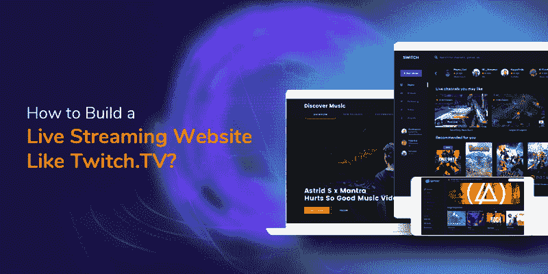
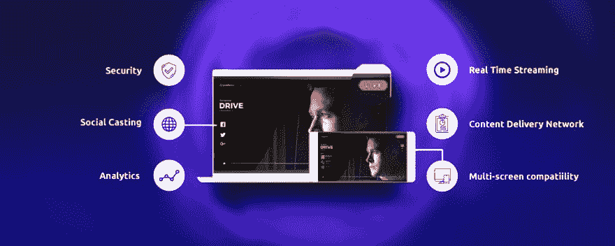

# 如何建立一个像 Twitch 这样的视频直播网站？电视？

> 原文：<https://dev.to/lianakailey/how-to-build-a-live-video-streaming-website-like-twitchtv-4c3b>

如果你打算拥有一家像 Twitch 这样价值约 300 万美元、利润丰厚的企业，那又如何？

是的，像 Twitch 的市值这样的视频直播网站正在以惊人的速度前进。

自 Twitch 在 2020 年 2 月产生 380 万个独立广播公司以来，直播视频流媒体平台的需求正在上升。Twitch 希望看到 5 亿至 6 亿美元的广告收入，但实际上它在 2020 年创造了近 10 亿美元的收入。

视频流媒体网站的流行为多个行业带来了新的资源，而不仅仅是娱乐。在线会议、现场研讨会、网络研讨会和现场活动正成为企业通过视频直播平台将实体活动转化为数字活动的高峰。Twitch 充满希望的统计数据和收入模式促使企业建立了像 Twitch 这样的直播视频流媒体平台，产生了数十亿美元的收入。

**视频直播是视频内容的新未来，在未来几年内只会越来越多。**

让我们面对现实吧。视频是新的博客。

可能会有很多关于如何创建像 Twitch 这样的直播网站的文章，但在开始直播业务之前，你需要了解你的直播目标和行业。

# 搭建流媒体直播网站前要了解的基本因素

创建一个具备所有基本功能和盈利模式的有效直播网站只有在你拥有专家团队和基础设施的情况下才有可能。市场上有许多视频直播平台提供商来构建一个，但选择一个适合您业务需求的正确平台非常重要。

**遵循这些因素，为您的直播业务模式选择合适的提供商。**

1.  灵活性
2.  可量测性
3.  安全性

**1。灵活性:**

直播解决方案提供商的灵活性定义了几个方面，即根据您的业务需求进行定制，符合您的功能集，以及有望扩展您的直播视频流业务的基础设施。除了定制因素，直播网站必须在多种平台和设备上完美无缺，如桌面、移动和所有类型的屏幕尺寸。

**2。可扩展性:**

无论用户数量或设备如何，可扩展的直播网站都可以同时承受超过数十亿的直播视频流。在线流媒体平台可以在任何平台上播放直播内容，没有任何延迟，与带宽无关。

**3。安全性:**

像 Twitch 这样有效的视频直播网站必须拥有针对直播内容的企业级安全和隐私协议。使用多种数字管理权限、访问控制和隐私水印可以保护内容免受版权问题的影响。

# 一些对视频直播平台有效的垂直业务

**媒体&转播商**

今天，广播公司正在竞相与 OTT 和其他新兴的基于互联网的内容保持一致。电视网络、电视频道凭借 VOD 空间和直播内容在市场上遥遥领先，获得了大量观众。直播视频流网站是广播公司在旅途中增加潜在观众的最佳机会。

**现场事件**

直播会议、研讨会和其他商业活动的流媒体直播有了直播视频网站成为可能。为了将信息传递给大量的观众群，直播事件流已经成为接触虚拟的数百万观众和物理体育场中的数千观众的工具。

**教育**

继疫情之后，远程教育已经成为新的师范教育体系。直播已成为在线学习的宝贵资产，为学生提供了课堂般的感受，并增强了整体学习体验。

**健康&健身**

保持在线健康是新策略。有了[在线健身平台](https://www.vplayed.com/fitness-streaming-solution.php)，实时训练让你的课程变得真实，你的观众可以跟上你的活动。你可以和你的健身爱好者进行现场互动，让他们参与进来，按时上课。

**宗教&信仰**

有了在线视频流媒体平台，通过屏幕向全球观众传播信仰。直播平台可以是宗教社区的一部分，用于直播聚会和任何其他崇拜活动。

**内部&企业沟通**

直播增强了企业员工的参与度。企业和组织可以通过实时视频流提供员工培训，提高员工入职率并制定战略以提高工作效率。

**体育**

通过实时表演视频流，扩大全球观众的覆盖范围。借助体育直播，为不同地理位置的球迷带来广播般的体验。直播使得大量体育内容的分发成为可能，因为每一个体育赛事的直播都增加了观众群。

## v played——高度可扩展的&可靠的直播解决方案

VPlayed 是市场上领先的视频流平台提供商。VPlayed 是一个自托管视频解决方案，旨在为企业业务建立一个像 Twitch 一样的直播网站，提供比 Twitch 更有效的功能和货币化模式。

VPlayed 是一个完全定制的直播平台，可帮助内容创建者、内容所有者、发布者、直播活动主持人在多种设备和屏幕上播放直播内容。VPlayed 直播解决方案确保提供可扩展的内容管理和分发系统，将总部直播内容传送到所需的地理位置。

## 有效放大视频直播平台性能的特性

**以下是使直播成为可能的功能:**

**1。100%定制**

VPlayed 根据您的直播业务模式需求，在特性、功能、盈利模式、内容分发、安全性等方面提供完整的定制服务。直播网站的定制涉及设计、应用程序开发以及与您的品牌相一致的直观设计。

**2。直播视频点播**

使用 VPlayed 的 Live，一旦实现了直播活动的广播，您就可以通过订阅模式将直播内容转换为多个用户的 VOD 内容，从而增加收入。Live to VoD apis 获得代码转换，快速发布剪辑以提供额外的覆盖范围。

**3。互动流媒体**

在向不同地理位置的多个受众提供直播内容时，吸引他们是不可能的。但有了现场投票，快速问答和实时聊天可以帮助吸引观众并推动决策。

**4。直播货币化**

随着视频直播比以往任何时候都更受欢迎，通过视频货币化模式产生更多收入的机会据说是天价。广泛的货币化模式可触发你的创收机会。

一)广告:

广告模块可让您在直播活动或网站内视频内容流期间的任何时候播放广告。中间滚动广告或初始广告让用户观看广告，比其他盈利模式的表现好 90%左右。

ii)赞助:

赞助模式是内容创作者创收的一个相当可观的来源。Contus Vplay 支持的赞助盈利模式通过优化更具吸引力的视频内容中的广告而变得简单。

iii)按次付费模式:

这相当于内容创作者的虚拟票房。这些功能使内容所有者能够通过活动的直播产生可观的收入，每个用户观看的内容将直接反映在内容所有者收入的地图上。

**5。联播**

在不同的设备上通过多种媒体或服务同时广播实况事件或节目，以获得更广泛的受众。向多个网站或平台(如 YouTube、LinkedIn、Mixer、脸书、Instagram 或任何平台)联播任何活动或直播节目，以实现额外的内容覆盖和可能的 revenu 机会。

**6。自适应比特率流**

无论连接和网络范围如何，自适应比特率流都可以优化设备间实时内容的观看体验。企业实时视频流平台支持低延迟，有助于通过您的实时内容与用户保持联系，无论他们使用哪种屏幕设备。

**7。HLS 内置播放器**

企业级 [HLS 视频播放器](https://www.vplayed.com/hls-html-player.php)可以创建令人印象深刻的内容观看体验，具有最快的播放速度、360 度视频支持、第三方交互功能、UI/UX 扩展、时尚栏、离线观看等等。播放器还包括皮肤资产、缩略图、描述、搜索词和其他回放工具，以实现流畅的直播内容观看体验。

**8。内容交付网络**

借助一流的内容交付系统，您可以为全球受众提供卓越的用户体验。通过强大的 CDN 将正确的内容交付给正确的受众，这有助于处理、管理和保护大规模媒体内容的每个直播流的交付。

**9。DRM &安全**

使用多层安全系统保护您的实时视频流网站或应用，包括 AES 加密、DRM 和基于 IP 的访问控制，帮助您防止视频资产数据泄露。还涉及实况内容的水印以防止内容的价格上涨，并且基于安全令牌的回放保护提供了强大的安全性。

10。实时分析

有效地跟踪、监控和报告直播平台中观众的一举一动。实时分析有助于识别最佳观看内容，从而做出行动决策。通过分析工具监控观众层面的分析、观众行为、流量来源和每个观众的地理位置。

## 结论:

VPlayed' [直播解决方案](https://www.vplayed.com/live-streaming-solution.php?utm_source=Build%20Live%20Streaming%20Website&utm_medium=CTA1&utm_campaign=Dev)帮助企业、媒体专业人士、视频发布者构建一个直播网站，从一个仪表板上完成发布、广播、管理和测量视频性能的功能。