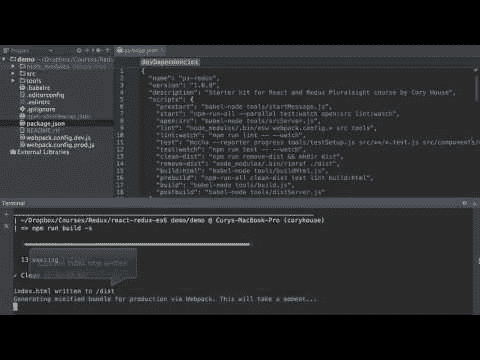

# 我的 2018 年回顾

> 原文：<https://dev.to/nickytonline/my-2018-year-in-review-2f0k>

以下是我的 2018 年决心。

 [## 2018 年决议

### 尼克·泰勒(他/他)1 月 4 日 181 分钟阅读

#newyear #books #personaldevelopment](/nickytonline/2018-resolutions-1deo)Did I complete them all? No, but honestly it’s not a big deal.

*   *继续为开源做出贡献*:任务完成🚀。我继续作为[反应弹弓](https://github.com/coryhouse/react-slingshot)的合作者，今年在那里贡献了一些工作，解决了一些问题等等。

##  [科里豪斯](https://github.com/coryhouse) / [反应——弹弓](https://github.com/coryhouse/react-slingshot)

### 反应+ Redux 初学者工具包/样板与巴别塔，热重装，测试，林挺和一个内置的工作示例应用程序

<article class="markdown-body entry-content container-lg" itemprop="text">

* * *

[T11】](https://coveralls.io/github/coryhouse/react-slingshot?branch=master)

使用 React 快速开发应用程序的全面入门套件。

为什么用弹弓？

1.  **一个命令开始**——键入`npm start`在你的默认浏览器中开始开发。
2.  **快速反馈**——每次点击保存，修改热重装和林挺，自动测试运行。
3.  **一个命令行检查** -所有反馈都显示在一个命令行上。
4.  **不再有 JavaScript 疲劳** - Slingshot 使用[最流行和最强大的库](https://github.com/coryhouse/react-slingshot#technologies)与 React 一起工作。
5.  工作示例应用程序 -包含的示例应用程序显示了所有这些如何一起工作。
6.  **自动化生产构建** - Type `npm run build`完成这一切:

# 开始

1.  **初始机器设置**

    第一次运行初学者工具包？然后完成[初始机器设置](https://github.com/coryhouse/react-slingshot#initial-machine-setup)。

2.  **点击“使用此模板”**

    点击此页面顶部的绿色“使用此模板”按钮，并输入您的回购的名称和描述。

3.  **运行设置** …

</article>

[View on GitHub](https://github.com/coryhouse/react-slingshot)

我的另一个关注点是开发到存储库。

##  [ forem ](https://github.com/forem) / [ forem](https://github.com/forem/forem)

### 为社区赋权🌱

<article class="markdown-body entry-content container-lg" itemprop="text">

# Forem <g-emoji class="g-emoji" alias="seedling" fallback-src="https://github.githubassets.cimg/icons/emoji/unicode/1f331.png">🌱</g-emoji>

**For Empowering Community**

[T11】](https://gitpod.io/#https://github.com/forem/forem)

欢迎来到 [Forem](https://forem.com) 代码库，这个平台为[开发到](https://dev.to)提供动力。我们很高兴你能来。在你们的帮助下，我们可以增强 Forem 的可用性、可伸缩性和稳定性，从而更好地为我们的社区服务。

## 什么是 Forem？

Forem 是用于构建社区的开源软件。为你的同行、客户、粉丝、家人、朋友以及任何其他需要聚集在一起成为集体一员的时间和空间的社区[参见我们的公告帖子](https://dev.to/devteam/for-empowering-community-2k6h)以获得 Forem 是什么的高级概述。

[dev.to](https://dev.to) (或者只是 dev)由 Forem 托管。这是一个软件开发人员的社区，他们撰写文章，参与讨论，并建立自己的专业档案。我们重视支持性和建设性的对话，为所有成员追求伟大的准则和职业发展。该生态系统涵盖从初学者到高级开发人员，欢迎所有人找到自己的位置…

</article>

[View on GitHub](https://github.com/forem/forem)

在[项目开源](https://dev.to/ben/devto-is-now-open-source-5n1)之前，我被接受为早期贡献者，并在项目公开后继续贡献。成为核心团队之外的[第一个贡献者来合并公关，感觉真好。](https://dev.to/jess/dev-monthly-report--march-2018-579p)

 [## 开发月报—2018 年 3 月

### 李佳薇 4 月 2 日 182 分钟读数

#meta](/jess/dev-monthly-report--march-2018-579p)
Although I didn’t contribute to TypeScript or VS Code, I’m still very happy with this year’s contributions.

*   *继续写博客*:我继续在 dev.to 上写了几篇博文和更多的短文/评论。人们似乎喜欢“我的 Mac 设置”，这是 dev.to 上一月中旬最受欢迎的帖子之一。

     [## 我的 Mac 设置

    ### 尼克·泰勒(他/他)1 月 12 日 189 分钟阅读

    #productivity #developertools #webdev](/nickytonline/my-mac-setup-2m05) [## 过去一周最受欢迎的 7 篇开发人员帖子

    ### 开发人员至员工 1 月 15 日 182 分钟读取

    #icymi](/thepracticaldev/the-7-most-popular-dev-posts-from-the-past-week-4pno)Work and life got busy so not as much blogging as I’d had hoped.
*   *开始在 [codepen.io](https://codepen.io)* 上做东西:2018 年之前，我从来没有做过。我做了几个来找点乐子，但是没有维持这个。

     [## 快速浩克密码笔

    ### 尼克·泰勒(他/他)1 月 13 日 181 分钟阅读

    #css #codepen](/nickytonline/quick-hulk-code-pen-18i1) [## 一个简单的⭐评级代码笔

    ### 尼克·泰勒(他/他)1 月 19 日 181 分钟阅读

    #css #codepen](/nickytonline/quick-simple-rating-code-pen-3ecp) [## 可能是另一个战舰上的密码笔

    ### 尼克·泰勒(他/他)2 月 9 日 181 分钟阅读

    #css #codepen](/nickytonline/probably-another-battleship-board-on-codepenio-coverimage-httpsc1staticflickrcom7609963333175677fc467e409ojpg--4n7m) [## A💩通知代码笔

    ### 尼克·泰勒(他/他)1 月 27 日 181 分钟阅读

    #css #codepen](/nickytonline/a--notification-code-pen-4o0n)[https://codepen.io/nickytonline/embed/ppMmyZ?height=600&default-tab=result&embed-version=2](https://codepen.io/nickytonline/embed/ppMmyZ?height=600&default-tab=result&embed-version=2)
*   *读完我口袋里的所有东西*:这只是没发生。事实上，在我写下 2018 年的决心后不久，我就完全停止了阅读 Pocket。它与产品无关，只是变得很忙，当你添加到口袋中时，它就像是刚刚被发送到以太中。

    > 尼克·泰勒[@ Nicky tonline](https://dev.to/nickytonline)[@ rich Burroughs](https://twitter.com/richburroughs)[@ EmmaWedekind](https://twitter.com/EmmaWedekind)我在决议#4 上惨败。🙃2018 年 12 月 28 日下午 17:27

    Having said that, I highly recommend this tool for offline reading. I’m gonna try and catch up on some reading while I head away to a chalet for a few days.
*   *阅读[功能性轻量级 JavaScript](https://leanpub.com/fljs)* :我完成了大约三分之一，嗯，没有借口🙃。我想今年必须完成这个😉

制定计划很有趣，但是说实话，我并没有因为没有完成其中一些而失眠。除了决心之外，这是工作繁忙的一年。秋天，我决定去 Autodesk，在散弹枪团队中担任一个令人惊奇的角色。

> 尼克泰勒[@尼克在线](https://dev.to/nickytonline)-仍然活蹦乱跳
> -为 OSS 做出了坚实的贡献
> -在[@ Autodesk](https://twitter.com/autodesk)[@ shotgun software](https://twitter.com/shotgunsoftware)团队工作[twitter.com/adamjk/status/…](https://t.co/jMpiZ7Vdio)00:51am-2018 年 12 月 28 日

在开始工作之前，我和整个团队参加了为期一周的会议。我们是分散的，所以他们试着每两年开一次团队会议。作为一名还没有开始工作的新员工，能和我未来的同事见面、喝酒/吃饭，并一起研究改进产品的方法，真是太棒了。从第一天开始，我就爱上了它。很好的工作/生活平衡，以及你在工作中寻找的所有优点。💯

除了新的演出，我将在 dev.to 上拥有 12000 名粉丝！🔥

因此，在我们结束 2018 年之际，我只想感谢 dev.to 核心团队和社区。你们都很棒。

卡尔·劳在 [Unsplash](https://unsplash.com) 上的照片