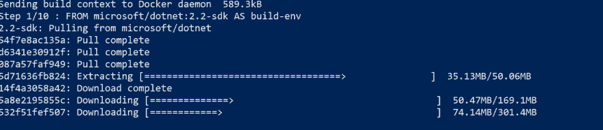
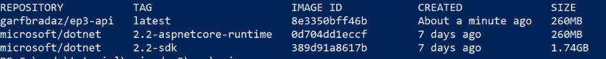

# 第 3 集-使用 ASP.NET 核心的 JSON API，Docker & MongoDB: Docker 第一部分，Dockerfiles

> 原文：<https://dev.to/garfbradaz/episode-2---json-api-using-aspnet-core-docker--mongodb-docker-part-i-dockerfiles-2o8i>

## 前情提要

在第 2 集中，我建立了项目目录结构。今天的节目是 **Docker Part 1: DockerFiles** 。

## 我们来说说 Docker

首先，在我们进入如何设置 Docker 之前，我想进入 bigging the big D up！除了 *Visual Studio Code* 和 *WSL* ，2018 年没有其他技术改变了我开发代码的方式。是的，有一些痛点，但是一旦你克服了这些，那么你的开发经历开始(我敢说)变得更加幸福。

我现在可以下载预先开发的应用程序、数据库、负载平衡器、web 服务器、SDK 构建工具、pixie dust (nic: testing 你还在读！)，并像使用乐高积木一样使用它们来构建一个系统，*而不需要在我的机器上安装二进制文件。*

以本教程为例，除了。为 IDE 安装的. NET SDK、 *MongoDB* 、 *nginx* 和 *dotnet runtime* 都是通过镜像安装的，我可以为其构建，完成后扔掉。在我的本地开发(主机)机器上不需要安装。现在连 SQL Server 都在 Linux 上运行，有镜像下拉。

这种构建软件的乐高积木方法现在意味着我不需要担心在我的机器上安装所有的工具，配置这些工具，并在完成后卸载。我可以将它们打包到一个 Dockerfile 中，以便现在、以后甚至在另一台机器上使用，而不会污染我的主机并降低它的速度。

### Docker 是什么？

Docker 是一款利用了容器技术的产品，这种技术在 Linux 中已经存在了一段时间。容器是隔离的/沙箱化的进程，它只使用在容器内运行应用程序*所需的最少的二进制文件，包括文件系统。不像*虚拟机*运行一个完整的操作系统，以及围绕它的膨胀。*

现在当我写这篇文章的时候， [Dave Swersky](https://twitter.com/dswersky) ，在[上写了一篇很棒的文章什么是 Docker，为什么它这么受欢迎？](https://dev.to/raygun/what-is-docker-and-why-is-it-so-popular-45c7)。看看这个。

## Dockerfile

如果这是你第一次使用 Docker，或者你没有安装它，请查看 dockers [getting started](https://www.docker.com/get-started) 开始你的旅程。你还需要注册 Docker Hub(【https://hub.docker.com/】T2)。将 hub 视为您可以访问的容器图像的存储库。不仅仅是码头工人，而是整个社区。你也可以在这里使用术语*容器注册中心*(例如，你可以在 Azure 上建立你自己的私有注册中心)。

因此，我们需要弄清楚几个命令和术语，它们在继续之前很有用。

### 帮助

所以`docker`命令有一个很好的帮助工具，所以如果你想查看 docker 命令的列表:

```
docker --help 
```

### 图像

映像是一个包，其中包含运行应用程序所需的一切，包括环境、代码和配置。你通常使用其他公司/社区/开发者从 hub 中预先构建的映像或*基础映像*，但是你可以[同样容易地创建你自己的](https://docs.docker.com/develop/develop-images/baseimages/)。

如果您想查看您的主机(您的开发 PC/Mac)上有哪些映像，请运行以下命令:

```
docker images ls 
```

如果这都是新的，那么目前不会列出任何内容，但是当我们开始构建我们的 *Dockerfile* 时，我们将回到输出中，看看这意味着什么。

### 容器

容器是您的映像*在一个离散的进程中运行*。您可以在您的主机上运行多个容器。还有一个命令可以查看哪些容器正在运行:

```
docker container ls 
```

你也可以使用捷径(我个人常用的一种):

```
docker ps 
```

## 开发第一个 Dockerfile

那么什么是 Dockerfile 文件呢？以下是 Docker [自己](https://docs.docker.com/engine/reference/builder/#usage)的一段很好的描述:

> Docker 可以通过读取 docker 文件中的指令来自动构建映像。Dockerfile 是一个文本文档，它包含用户可以在命令行上调用的所有命令来组合一个图像。使用 docker build，用户可以创建一个连续执行几个命令行指令的自动化构建。

首先，我们将构建第一个 docker 文件来:

*   编译我们的。书店的 NET 核心 Web API。
*   运行我们的。NET 核心 Web API。

我们称做多件事的 *Dockerfiles* ，*多阶段*构建。它们允许我们*构建*和*运行*，而无需维护单独的 docker 文件(从前就是这样)。因为我不是自学这些东西的，所以让我链接到亚历克斯·埃利斯[的链接上，他会对此进行更多的讨论。](https://blog.alexellis.io/mutli-stage-docker-builds/)

未来邮报:当我在聊 Alex 的时候，未来我会重构这家**书店。App** 使用 [OpenFaaS](https://www.openfaas.com/) 一个开源的无服务器架构，它*不*耦合到一个特定的云。我对此很兴奋，因为我想使用这项技术已经有一段时间了，我甚至有树莓 pi 来集群…..

所以，回到手头的事情。首先我们需要*将目录*更改为我们在[第二集](/blog/2018/12/19/Episode-2-JSON-API-Dotnet-Core-Docker-Project-Structure.html)中设置的`src/api`目录。简单回顾一下，我们设置了以下内容:

```
.
    ├── src
    | ├── api
    | |
    | ├── BookStore.WebApi.csproj
    ├── tests
    | ├── integration
    | ├── unit
    | ├── BookStore.Tests.csproj
    ├── docker 
```

然后在`api`的根目录下创建一个名为`Dockerfile`的文件:

```
.
    ├── src
    | ├── api
    | |
    | ├── BookStore.WebApi.csproj
    | ├── Dockerfile
    ├── tests
    | ├── integration
    | ├── unit
    | ├── BookStore.Tests.csproj
    ├── docker 
```

将以下内容添加到文件中:

```
FROM microsoft/dotnet:2.2-sdk AS build-env
WORKDIR /app
COPY BookStore.WebApi.csproj .
COPY . .
RUN dotnet publish -c Release -o /publish

FROM microsoft/dotnet:2.2-aspnetcore-runtime AS runtime-env
WORKDIR /publish
EXPOSE 5000
COPY --from=build-env /publish .
ENTRYPOINT ["dotnet","BookStore.WebApi.dll"] 
```

如果这对你来说是新的，那么让我解释一下这个文件的格式和它的含义。

### 从

该语句设置由微软(或任何创建了基础映像的组织)创建的*基础映像*，并创建一个新的构建阶段(每个`FROM`创建一个新阶段)。这些图像将保存在像 hub.docker.com T4 这样的公共存储库中。因此，请确保您已经通过 *Docker Desktop* 登录，否则第一个构建步骤将会失败。

具有多个`FROM`表示多级 Dockerfile 文件。

*   [微软/dotnet:2.2-sdk](https://hub.docker.com/r/microsoft/dotnet/) - SDK 镜像。这个基础映像旨在允许您使用 *dotnet CLI* 进行构建/发布。如你所见，我使用的是 2.2 版本。NET Core 版本(表示为**的常用标签名:2.2-sdk** )。

*   [微软/dot net:2.2-aspnetcore-运行时](https://hub.docker.com/r/microsoft/dotnet/) -运行时镜像。这个基础映像被设计成使用 *dotnet 运行时*来运行 ASP.NET 核心应用程序。同样，它遵循相同的格式，用**的公共标签表示. net 版本:2.2-aspnetcore-runtime** 。

### WORKDIR

该语句将为下面的语句创建一个工作目录。如果该目录存在，那么该目录就被设置为`WORKDIR`中的值。在我们的例子中，`/app`是由命令创建的，`/publish`被设置为(因为发布是在`dotnet publish`中创建的)。

### 复制

该语句将把指定的*文件从 Dockerfile 所在目录的主机复制到*containers 文件系统(通常复制到`WORKDIR`中指定的文件系统)。因此，在我们的实例中，`../src/api`目录。

**注意:**在 Dockerfile 上下文的构建阶段，我们有两个`COPY`命令。我们为**书店做这个。WebApi.csproj** 这样我们就有了这个文件的构建缓存条目，所以如果它没有改变，我们就不会在每次构建时复制它(减少构建时间)。另外`COPY . .`会复制其他的东西。

```
COPY BookStore.WebApi.csproj .
COPY . . 
```

我们的第二阶段实际上是将来自`build-env` **/publish** 目录的输出复制到下一阶段。

### 运行

该语句将运行一组命令，这些命令将在您的图像中创建另一个层并提交结果，这些结果将形成容器的一部分。它允许您在运行容器之前设置它。

我们的例子是`dotnet publish`将`RUN`作为`docker build`指令集的一部分，创建当我们`dotnet`使用已发布的`.dll`时使用的二进制文件。

### 输入类型

这个语句定义了当你启动容器时运行什么。我们的`ENTRYPOINT`使用我们发布的`.dll`运行`dotnet`命令。您可以通过`docker run`向`ENTRYPOINT`命令传递更多参数。

我们的多阶段 Dockerfile 在第一阶段构建我们的源代码，并复制发布的输出，以便使用*运行它。网芯 Runetime* 。

## 建立形象

现在我们有了一个 docker 文件，我们可以将这个文件构建成一个*映像*，它将存储在我们的主机上。确保您在选择的命令行上，将目录更改为`../src/api`并运行以下命令:

```
docker build -t garfbradaz/ep3-api . 
```

该命令将运行一个`docker build`。的“.”表示您想要使用当前目录中的*docker file*,`-t garfbradaz/ep3-api`是一个参数，它将构建一个带有 **[-]t** ag 名称的图像 *garfbradaz/ep3-api* 。你可以用任何你想要的东西替换这个字符串。

第一次运行这个需要一段时间，因为你的层没有来自以前构建的*缓存条目*。您还可以看到由微软*基础映像*构建的所有层，这些基础映像也由层组成:

[](https://res.cloudinary.com/practicaldev/image/fetch/s--l-fp-q6G--/c_limit%2Cf_auto%2Cfl_progressive%2Cq_auto%2Cw_880/https://garfbradaz.github.io/assets/img/posts/docker-net-layers.PNG)

如果您再次运行`docker images`，您将会看到您的映像已经构建好了(加上。网络核心图像):

[](https://res.cloudinary.com/practicaldev/image/fetch/s--Qesfcd7y--/c_limit%2Cf_auto%2Cfl_progressive%2Cq_auto%2Cw_880/https://garfbradaz.github.io/assets/img/posts/dotnet-net-images.PNG)

### 将图像作为容器运行

因此，我们创建了一个包含构建映像步骤的 *Dockerfile* ，其中包含在*容器*中运行应用程序所需的资源。这就是神奇之处，因为我们可以在任何支持 Docker 本身的操作系统上运行这个映像(如果我们正在构建 *Linux* 容器的话)。

因此，下面将把您的容器作为隔离/沙盒进程运行:

```
docker run --env ASPNETCORE_ENVIRONMENT=Development --env ASPNETCORE_URLS=http://+:5000 -p 5000:5000 -t --rm -it garfbradaz/ep3-api 
```

这个命令将交互地运行您的容器(`-it`)，并覆盖一些环境变量(`--env`)；将端口映射覆盖为 5000 ( `-p`)，并使用 finished ( `--rm`)清理容器。

我使用 Powershell 来验证容器运行良好，但是您可以使用 *postman* (我们将在另一章中探讨如何设置)。

```
Invoke-RestMethod -Uri http://localhost:5000/api/values -Method 'Get' 
```

这应该会以 401 状态失败，因为我们针对`ValuesController.cs`设置了`[Authorize]`属性。但至少这证明了我们正在容器进程中使用 Kestrel 运行 Web API。

### 下次

我们将探索`docker compose`允许我们运行和编织多个容器，这样我们就可以与 MongoDB 交互。