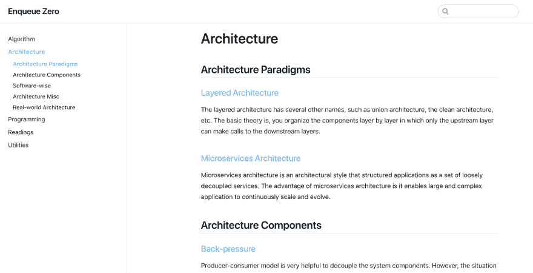
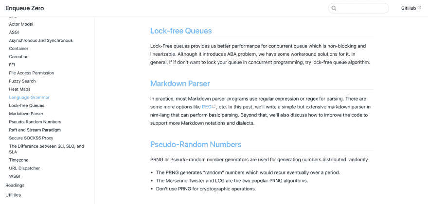
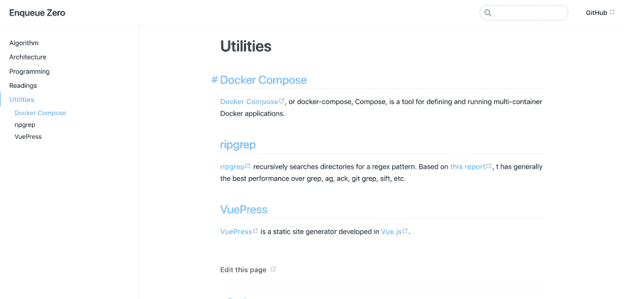
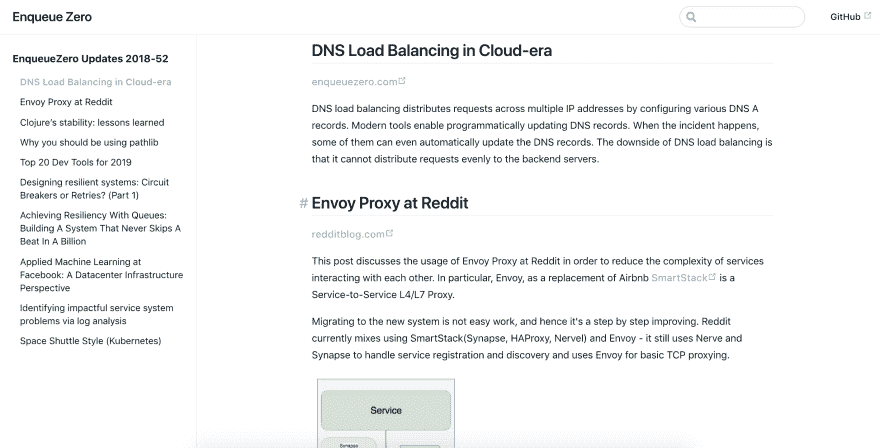

# enqueuezero.com 2018 #年度回顾

> 原文：<https://dev.to/soasme/2018-of-enqueuezerocom-yearinreview-5c1h>

我的 2018 年是围绕这个项目度过的:[enqueuezero.com](https://enqueuezero.com/)。我在 Ma 结束后推出了它，令人惊讶的是，它仍然很热！该项目即将汇集我所有的建筑学、计算机科学、阅读等知识。到目前为止，我已经添加了 60 多个帖子，对我来说这是一次旅程！以下是该项目的一些截图。

 
建筑

 
编程

 
实用程序

 
读数

我想对我现在的 [Patreon](https://www.patreon.com/enqueuezero) 资助人说一声“谢谢”!！！！没有你的支持，我不可能走这么远！每次我想退出并关闭它，是你的捐赠帮助我度过了那些时刻。我也想对 hacker news 和 Reddit 的用户说谢谢，不管是正面的还是负面的，无论是谁阅读或贡献了他们善意的评论。

对于那些没有听说过 enqueuezero.com 的人，如果你认为它对你有用，请向这个项目捐款！捐款链接在这里:【https://www.patreon.com/join/enqueuezero】T2。你每月可能只给我 1 美元，但对我来说却意味着一切！

