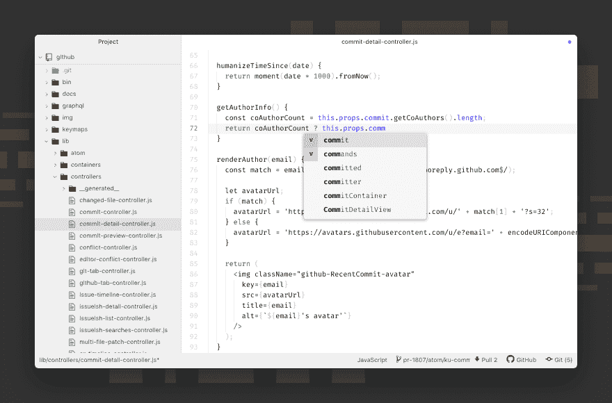

# 关于社区管理和节制的有益报告

> 原文：<https://dev.to/michaeltharrington/a-helpful-repo-on-community-management--moderation-5fcf>

很多人都知道并喜欢 Atom，对吗？

##  [ atom ](https://github.com/atom) / [ atom](https://github.com/atom/atom)

### :atom:可破解的文本编辑器

<article class="markdown-body entry-content container-lg" itemprop="text">

# 原子

> Atom 和 Atom 下的所有仓库将于 2022 年 12 月 15 日存档。在我们的[官方公告](https://github.blog/2022-06-08-sunsetting-atom/)中了解更多信息

Atom 是 21 世纪的一款可破解的文本编辑器，建立在[electronic](https://github.com/electron/electron)之上，基于我们喜欢的编辑器的一切。我们把它设计成可深度定制的，但是使用默认配置仍然是可接近的。

访问 [atom.io](https://atom.io) 了解更多信息或访问 [Atom 论坛](https://github.com/atom/atom/discussions)。

在 Twitter 上关注 [@AtomEditor](https://twitter.com/atomeditor) 发布重要公告。

该项目遵守贡献者契约[行为准则](https://github.com/atom/atomCODE_OF_CONDUCT.md)通过参与，您应该遵守该准则。请向 atom@github.com 的[报告不可接受的行为。](https://github.com/atom/atommailto:atom@github.com)

## 证明文件

如果你想阅读关于使用 Atom 或在 Atom 中开发包的内容，Atom 飞行手册是免费的，可以在网上找到。你可以在[atom/flight-manual . atom . io](https://github.com/atom/flight-manual.atom.io)中找到手册的出处。

Atom.io 上还记录了用于开发包的 [API 引用](https://atom.io/docs/api)。

## 安装

### 先决条件

*   …

</article>

[View on GitHub](https://github.com/atom/atom)

嗯，您还应该了解一下 Atom 社区经理， [Lee Dohm](https://www.lee-dohm.com/) ...或者至少他写的和收集的社区管理资源&适度。

##  [李多姆](https://github.com/lee-dohm) / [社区经理](https://github.com/lee-dohm/community-manager)

### 关于社区管理的思考和著述

<article class="markdown-body entry-content container-lg" itemprop="text">

# 社区管理和调节

这个知识库包含了我关于社区管理和管理的想法、经验、指导方针和心得。

## 经验法则

*   并非所有事情都值得回应
*   在那些值得回应的事情中，几乎没有一件需要马上回应

## 文章

### 一般通信

*   会话式合气道 -引导对话的流程
*   [不响应时](https://github.com/lee-dohm/community-managerwhen-not-to-respond.md) -消失
*   [Up with that I not put](https://github.com/lee-dohm/community-managertaking-care.md)-在照顾社区的同时照顾好自己
*   谦逊有礼 -如何做一个好主人
*   [开源](https://github.com/lee-dohm/community-manageropen-source-support.md) -它与普通客户支持有何不同
*   [X/Y 问题](https://github.com/lee-dohm/community-managerthe-x-y-problem.md) -如何找到隐藏在背后的真正问题
*   [设定期望](https://github.com/lee-dohm/community-managersetting-expectations.md) -传达愿望、希望、计划和事实之间的差异
*   [投票系统缺陷](https://github.com/lee-dohm/community-managervoting-system-flaws.md) -为什么 Atom 没有议题或公关投票系统

### 适度

*   [真理部](https://github.com/lee-dohm/community-managerthe-ministry-of-truth.md) -何时编辑…

</article>

[View on GitHub](https://github.com/lee-dohm/community-manager)

无论您是在 GitHub 上维护自己的项目，还是在寻找如何最好地指导您的社区的技巧，这些文档都非常有用...或者你正打算加入一个在线社区，想更好地了解他们是如何运作的。

希望你和我一样喜欢李的作品！