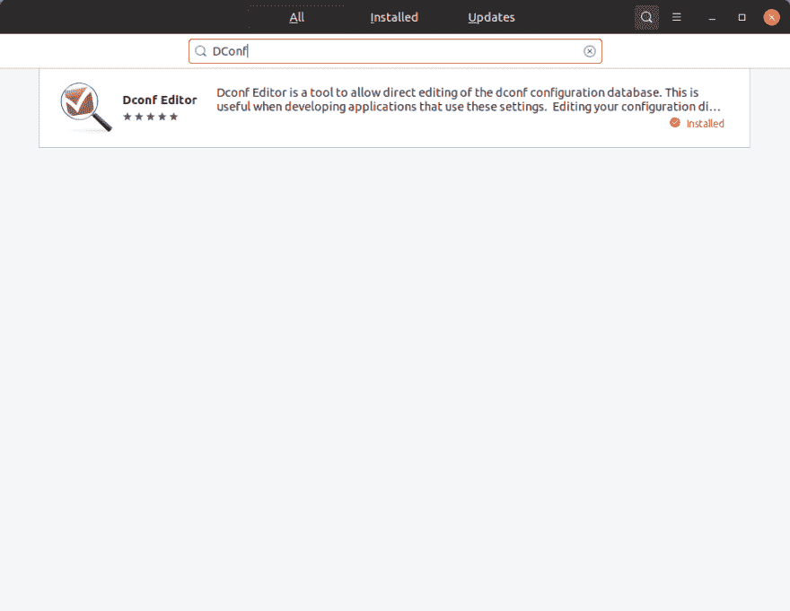
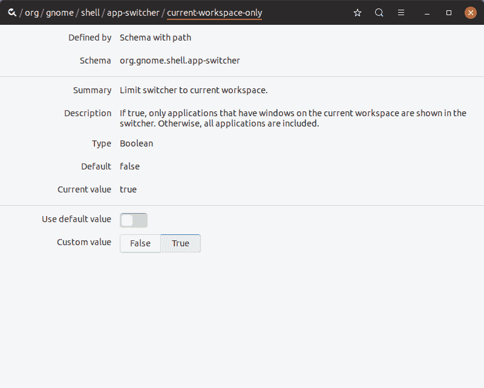
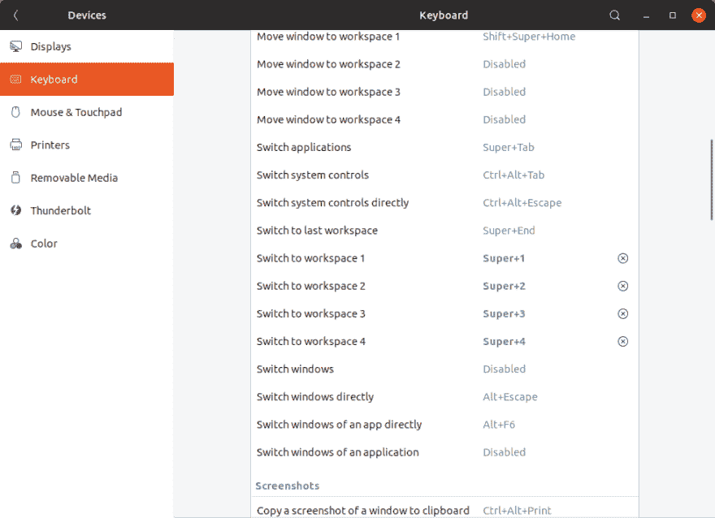
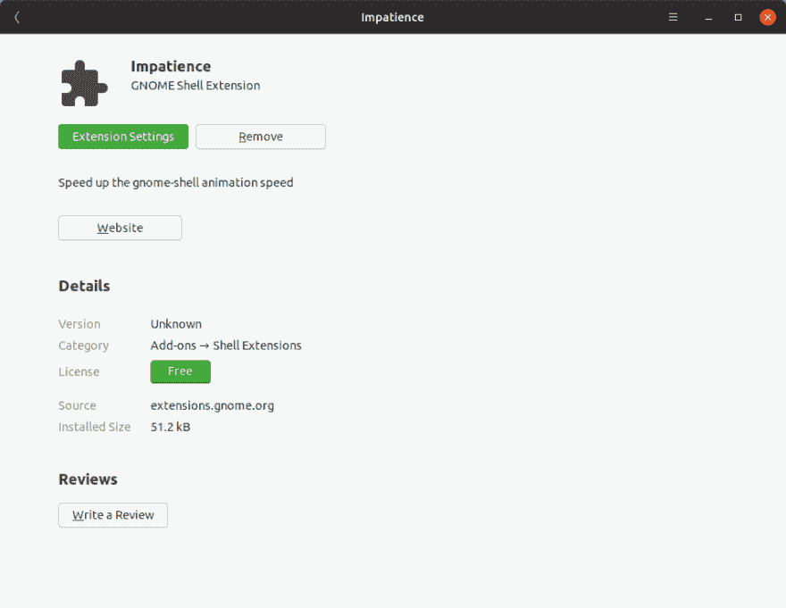
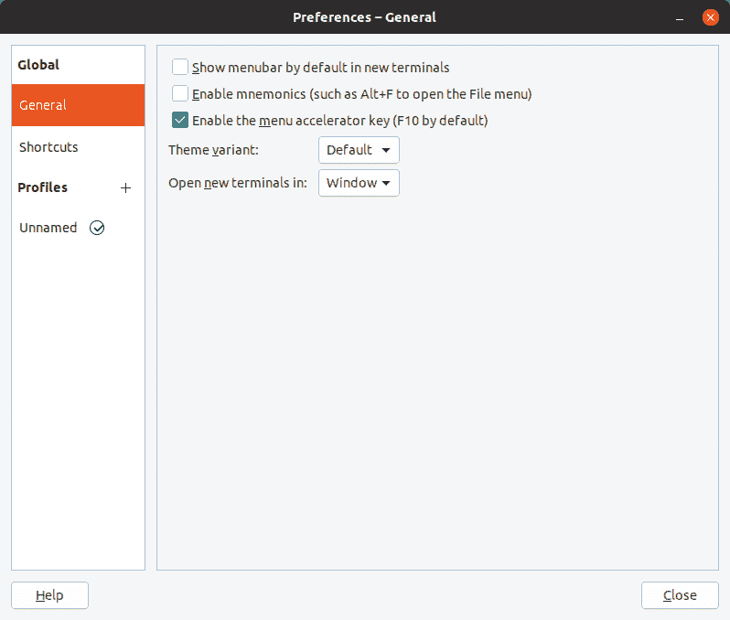
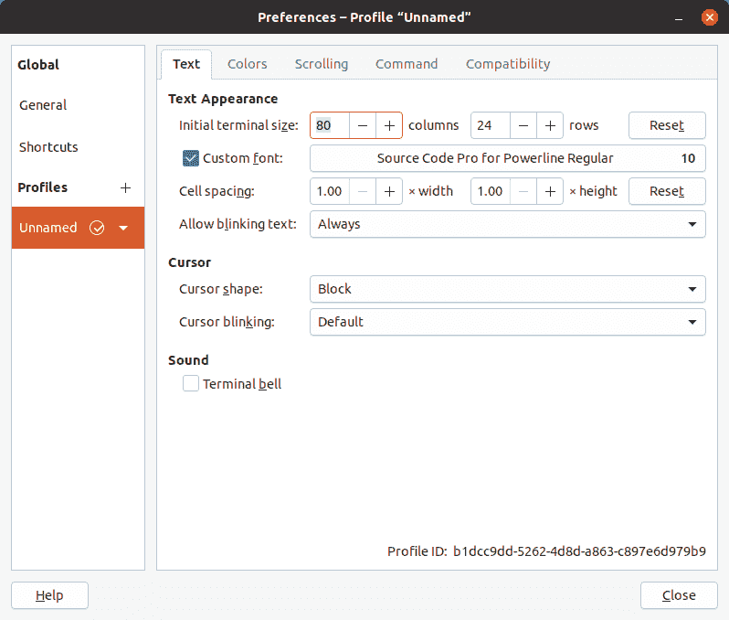

# 我的 Ubuntu 桌面

> 原文：<https://dev.to/aghost7/my-ubuntu-desktop-4boa>

我最近在我的个人笔记本电脑上重新安装了 Ubuntu。在这样做的过程中，我发现了一些惊喜，我想分享一下我所做的事情。

注意:这是我目前对 Ubuntu 18.10 的设置。如果在 LTS，您的里程可能会有所不同。

## 热键

GNOME 中的默认热键开箱即用非常好。以下是我经常使用的一些方法:

*   alt + tab:程序切换。
*   切换到属于同一个程序的窗口。
*   ctrl + alt + arrow:移动到不同的工作区。GNOME 中的工作区只能上下移动。
*   ctrl + alt + shift +箭头键:将当前窗口移动到不同的工作区。
*   打开 gnome 终端
*   meta (windows 按钮):打开全局菜单，我用它来搜索程序，而不是依靠鼠标。
*   meta +向左或向右:向左或向右移动窗口。
*   meta + up:让窗口占据整个视口。
*   shift + printscr:选择一个区域进行截屏。
*   alt + printscr:对整个聚焦窗口进行屏幕截图。

默认热键有两个问题困扰着我。首先，程序切换适用于跨工作区的所有程序。如果你通常不打开很多程序，这不是问题，但我倾向于多任务处理，更喜欢在工作空间之间保持隔离。第二，我喜欢使用 using 索引来切换工作区(例如，`super+2`切换到 2 号工作区)。当 i3wm 作为我的主桌面环境的一部分时，我已经习惯了这一点。

### 限制应用程序切换到工作区

为了进行定制，我们需要 DConf 编辑器。可以通过 Ubuntu 软件程序安装。只需打开“Ubuntu 软件”，搜索“Dconf”并安装“Dconf 编辑器”:

[](https://res.cloudinary.com/practicaldev/image/fetch/s--omqkV3VA--/c_limit%2Cf_auto%2Cfl_progressive%2Cq_auto%2Cw_880/https://thepracticaldev.s3.amazonaws.com/i/zfn5q5rnu5ojhnk8a6qc.png)

打开 DConf 编辑器后，导航到路径`org -> gnome -> shell -> app-switcher -> current-workspace-only`。禁用“使用默认值”选项，并将“自定义值”设置为“真”。

[](https://res.cloudinary.com/practicaldev/image/fetch/s--TOMPDIWB--/c_limit%2Cf_auto%2Cfl_progressive%2Cq_auto%2Cw_880/https://thepracticaldev.s3.amazonaws.com/i/zcuohdcgk32guli4by2o.png)

#### 使用索引改变工作空间

这一步比较容易，因为它只是一个常规设置。打开“设置”应用程序，选择“设备”，然后单击“键盘”选项。将“切换到工作区”选项更改为所需的按键绑定。

[](https://res.cloudinary.com/practicaldev/image/fetch/s--82tmAXV5--/c_limit%2Cf_auto%2Cfl_progressive%2Cq_auto%2Cw_880/https://thepracticaldev.s3.amazonaws.com/i/v3zwl8q4k0b7kflppiip.png)

## 观感

在 Ubuntu 18.10 中，[默认主题](https://github.com/ubuntu/yaru)其实开箱即用还是相当不错的。我个人这次没有改变它，但对于那些寻找替代品的人来说，有相当多的可靠选项，如 [arc](https://github.com/horst3180/arc-theme) 和 [adapta](https://github.com/adapta-project/adapta-gtk-theme) 主题。

我对开箱即用的外观和感觉只有几个问题:

*   Dock 碍事(如果您有键盘驱动的工作流)
*   有些动画太慢了
*   不需要终端菜单栏(可以通过右键单击获得菜单)

### 移除码头

不幸的是，你不能从 Tweaks 程序中禁用 dock。相反，我们需要完全卸载它。在终端中键入以下内容:

```
sudo apt remove gnome-shell-extension-ubuntu-dock 
```

Enter fullscreen mode Exit fullscreen mode

要使更改生效，您需要重新登录您的计算机。

如果您想恢复 dock，只需运行:

```
sudo apt install gnome-shell-extension-ubuntu-dock 
```

Enter fullscreen mode Exit fullscreen mode

### 加速动画

为了减少动画的时间，我们所需要的就是从 Ubuntu 软件程序中抓取一个扩展。简单地搜索“不耐烦”，它应该会弹出来。

[](https://res.cloudinary.com/practicaldev/image/fetch/s--Pt3TKzeS--/c_limit%2Cf_auto%2Cfl_progressive%2Cq_auto%2Cw_880/https://thepracticaldev.s3.amazonaws.com/i/t0kkz9cs0bo8hf1jv71v.png)

安装扩展并打开它的设置。我个人已经把动画时间减少了一半。

### 禁用终端菜单栏

打开 gnome 终端，右击，选择首选项。转到常规部分，您应该取消勾选“在新终端中默认显示菜单栏”复选框。

[](https://res.cloudinary.com/practicaldev/image/fetch/s--o9McuVj_--/c_limit%2Cf_auto%2Cfl_progressive%2Cq_auto%2Cw_880/https://thepracticaldev.s3.amazonaws.com/i/o0u7tfxm4iocnrn7h0k4.png)

## 附加软件

当安装额外的软件时，最好通过软件存储库而不是依靠档案(`.deb`文件)来完成。通过存储库安装程序意味着操作系统将为您处理升级程序。

我需要的所有附加软件都可以通过“Ubuntu 软件”程序轻松安装:

*   Spotify
*   不调和
*   蒸汽

因为这是我的个人笔记本电脑，所以我没有安装太多的办公软件。对我来说，大部分都是基于浏览器的。

## 发展

我已经写了一篇关于我如何从容器开发的文章。但是，我仍然需要安装自定义字体和配置终端配置文件。

要安装电力线修补字体:

```
git clone https://github.com/powerline/fonts /tmp/fonts
cd /tmp/fonts
./install.sh 
```

Enter fullscreen mode Exit fullscreen mode

转到终端首选项并选择正确的配置文件。如果您没有更改终端配置文件，这将是“未命名”的配置文件。选择“自定义字体”复选框，点击旁边的文本框选择不同的字体。字体中应该有“电力线”，否则一些字形将会丢失。

[](https://res.cloudinary.com/practicaldev/image/fetch/s--CfSvrPJ4--/c_limit%2Cf_auto%2Cfl_progressive%2Cq_auto%2Cw_880/https://thepracticaldev.s3.amazonaws.com/i/mvrb90u36hiixbrcq7ci.png)

## 结论

设置一台新机器非常简单，令人惊讶的是不需要我使用终端那么多。虽然我在终端( *caugh* ，NeoVIM 用户；令人鼓舞的是，人们已经朝着更易接近的桌面方向取得了进展。希望有一天我能在工作中使用 Linux。