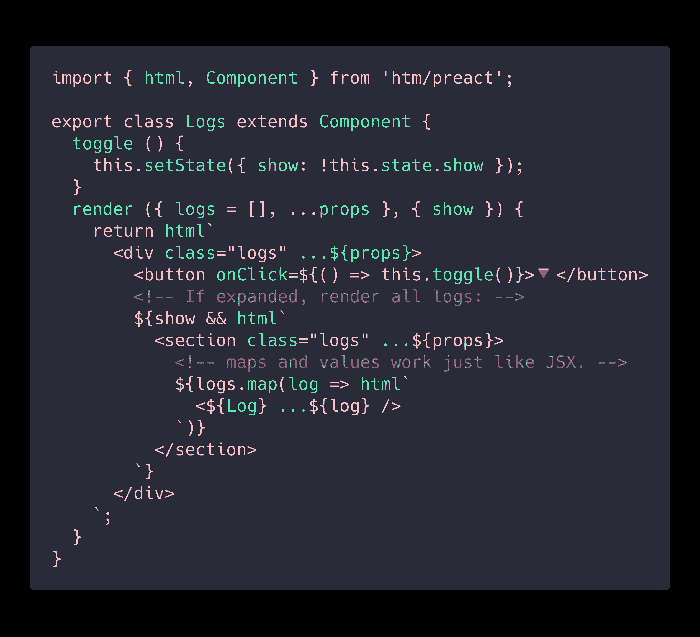

# Hyperscript 标记标记(HTM):使用标准标记模板的 JSX 替代方案，具有编译器支持。

> 原文：<https://dev.to/ben/hyperscript-tagged-markup-htm-jsx-alternative-using-standard-tagged-templates-with-compiler-support-4nc8>

这是 Preact 的创建者 [@_developit](https://dev.to/_developit) 的一个有趣的库。

## [develoit](https://github.com/developit)/[htm](https://github.com/developit/htm)

### Hyperscript 标记标记:使用标准标记模板的 JSX 替代方案，具有编译器支持。

<article class="markdown-body entry-content container-lg" itemprop="text">

# HTM

`htm`是普通 JavaScript 中类似 JSX 的语法——不需要 transpiler。

直接在浏览器中用 React/Preact 开发，然后编译`htm`离开生产。

它使用标准的 JavaScript 标签模板，并能在所有现代浏览器中工作。

## `htm`按数字:

<g-emoji class="g-emoji" alias="hatching_chick" fallback-src="https://github.githubassets.cimg/icons/emoji/unicode/1f423.png">🐣</g-emoji> **< 600 字节**在浏览器中直接使用时

<g-emoji class="g-emoji" alias="atom_symbol" fallback-src="https://github.githubassets.cimg/icons/emoji/unicode/269b.png">⚛️</g-emoji> **< 500 字节**与 Preact *一起使用(感谢 gzip <g-emoji class="g-emoji" alias="rainbow" fallback-src="https://github.githubassets.cimg/icons/emoji/unicode/1f308.png">🌈</g-emoji> )*

<g-emoji class="g-emoji" alias="egg" fallback-src="https://github.githubassets.cimg/icons/emoji/unicode/1f95a.png">🥚</g-emoji> **< 450 字节** `htm/mini`版本

<g-emoji class="g-emoji" alias="medal_sports" fallback-src="https://github.githubassets.cimg/icons/emoji/unicode/1f3c5.png">🏅</g-emoji> **0 字节**如果使用 [babel-plugin-htm](https://github.com/developit/htm/tree/master/packages/babel-plugin-htm) 编译

## 语法:像 JSX，但也文学

使用 HTM 时，您编写的语法尽可能接近 JSX:

*   传播道具:`
`而不是`
`
*   自结束标签:`
`
*   组件:`<${Foo}>`代替`<Foo>` *(其中`Foo`为组件引用)*
*   布尔属性:`
`

## JSX 的改进

实际上将 JSX 风格的语法向前推进了几步！

这里有一些你可以免费获得的人体工程学特性…

</article>

[View on GitHub](https://github.com/developit/htm)

与 JSX 相比:

*   不需要运输工具
*   HTML 的可选引用:
*   组件结束标记:页脚内容/>
*   通过 lit-html VSCode 扩展和 vim-jsx-pretty 插件提供语法高亮和语言支持。

> 从 2.0.0 开始，htm 是稳定的，经过良好的测试，可以投入生产使用。