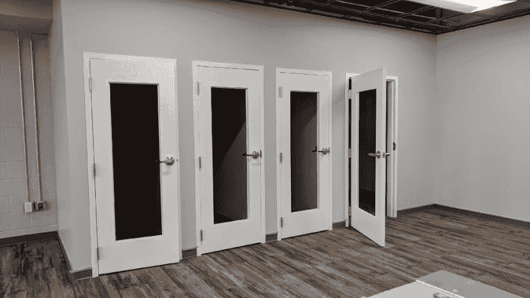

# 远程员工并不遥远

> 原文：<https://dev.to/dealeron/remote-workers-are-not-that-far-away-57fk>

随着公司的发展，你可能会发现自己在努力填补当地就业市场的空缺职位。如果你在其他地区已经有办公室，雇佣远程员工在这些办公室工作会是一个巨大的胜利。让它运转的关键是拥有正确的*文化*和*沟通结构*。我是 DealerOn 在密歇根州大急流城办事处的一名开发人员，而我团队的大部分成员都在马里兰州的总部工作。我将概述 DealerOn 作为一家公司采取了哪些步骤来搭建舞台，不久我们将了解成为一名远程工作者需要具备哪些条件。

<figure> 

<figcaption>DealerOn 在得克萨斯州和密歇根州设有分支机构，并在世界各地拥有远程办公人员。</figcaption>

</figure>

### 拥抱聊天客户端

远程工作人员面临的一大障碍是感觉自己被排除在外。他们不在人们的办公桌前进行任何非正式的讨论，也不在解决问题时突然出现的临时会议上。古老的格言仍然适用于此——眼不见，心不烦。

幸运的是，你可以先发制人，将像 [Slack](https://slack.com/) 这样的聊天客户端整合到你的日常运营中。Slack 将您的讨论和协作转移到数字受众，而不仅仅是当时听得见的人。它还消除了某人亲自到场回答问题或提供反馈的必要性。如果你的员工习惯了在团队专用的聊天室里进行讨论，那么整个团队都是平等的。远程工作人员可以观察和评论，而不会有电话摩擦或中断。

> Slack 将您的讨论和协作转移到数字受众，而不仅仅是当时听得见的人。

大多数人都知道，当他们看到两个人在谈话时，他们不应该打断，应该等待谈话结束或稍后回来。这里的问题是这对每个参与的人来说都是低效的。如果你真的需要一个答案，你会因为打断别人而感觉糟糕，或者你被卡住了，需要在等待的时候找点别的事情做。有了 Slack，1 对 1 的对话可能是我同时进行的 4 或 5 个对话中的一个。如果有人需要知道我当前的票什么时候完成，我可以给他们一个快速的回答，而不会有别人“插嘴”的社会耻辱这听起来有点吓人，但实际上非常自由。如果有人走到你的办公桌前，他们正在要求你的注意。如果有人给我发了一个关于 Slack 的直接消息，我可以在处理他们之前完成我的思考。

另一个好处是，你会自然而然地减少自己认为“这可以用电子邮件代替”的会议次数团队领导可以在他们频道中用@标签说些什么，列表中的每个人都会收到通知。如果有人对此进行了跟进，所有人都会立即看到。

此时你可能会想，“我们已经有了电子邮件，这还不够好吗？”电子邮件和聊天是你工作台上的两个工具，但它们不能互换。电子邮件更正式的方式是有一个主题行，通常是一个签名，每一个在你的收件箱里的权重都是一样的。聊天通常是非正式的，我可以添加一个👍只需点击一次即可回复，不会向您的收件箱添加任何内容。也没有必要管理你的聊天，而我的血压随着我在 Outlook 中看到的数字成比例上升。

### 视频会议

<figure> 

<figcaption>一股上镜人的形象</figcaption>

</figure>

虽然聊天可以减少你的会议次数，但你永远不会完全摆脱它们。有时候你需要把人们召集到一个房间，面对面地讨论一些事情。这就是本地员工和远程员工之间的明显差异，但是您可以做一些事情来消除这些毛刺。

**#1:尽可能使用视频** —人类是视觉动物，如果你能看到他们说话时的面部表情，就更容易理解他们。有时点头或竖起大拇指也更容易，不会破坏说话者的势头。

**#2:摇动话筒** —根据会议室的大小，每个会议室都需要不同的话筒策略。一个好的起点是包含无线卫星麦克风的会议电话。这些可以放在桌子周围，但只能拿起真正坐在桌子旁边的人。任何离开桌子的人听起来都像《花生》卡通片里的成年人。将话筒递给他们，或者考虑在房间周围安装悬挂式话筒。桌上话筒也特别擅长拾取敲击声和碰撞声，因此有抱负的鼓手必须控制住它。

**#3:限制背景噪音**—如果远程工作人员从他们的办公桌拨入电话，每当他们取消麦克风静音时，都会带来许多额外的噪音。耳机/麦克风组合有所帮助，但不能完全消除它。我们在全新的密歇根办公室中构建的一个解决方案是包含单人“电话亭”当您与团队开会，想要消除任何背景噪音时，这些隔音房间非常适合携带您的笔记本电脑。当你不想把自己的事情告诉所有人时，这也是和你的老板进行一对一谈话的绝佳方式。

<figure> 

<figcaption>我们在密歇根州的新办公室正在建设中，考虑到了私人视频会议</figcaption>

</figure>

### 改变是艰难的

如果您已经通读了所有这些内容，但仍然担心这听起来像是一次大的破坏，请不要担心！重复会让一切变得更容易。一段时间后，拨入网络会议、学习麦克风规则、适应在不同时区工作的人都将成为习惯。你也可以从几个假会议开始，这样每个人都可以发挥自己的声音水平，没有压力地去讨论与工作相关的事情。

这种设置和准备的额外好处是，如果您的任何本地员工需要在家工作，您现在可以做好准备。只要您适当地将远程员工包括进来，他们会成为您团队的巨大财富。他们仍然不能参加公司的家常便饭，但我相信有一个研究团队正在致力于实现这一目标。

* * *