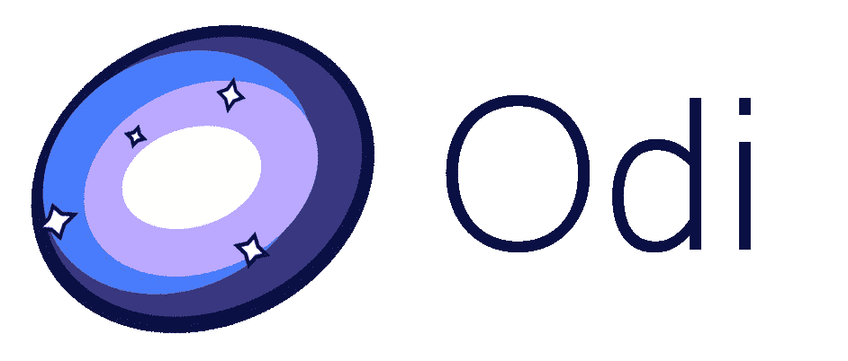

# Odi -服务器端框架

> 原文：<https://dev.to/dantsk/odi---server-side-framework-2ep7>

## 简介

嗨伙计们！

我目前在做服务器端的 TypeScript 框架。我的团队已经在各种电子商务和 ERP 项目中广泛使用了这个框架。结构和语义受到了其他流行框架的启发，如 [Spring](https://spring.io/) 和【ASP.NET[的](https://asp.net/)[。](https://ASP.NET)

主要目标列表:

1.  可测试、可支持、可扩展
2.  简约、习惯、清晰
3.  直观、易读、易懂
4.  强大的

目前，有很多可能性:

1.  使用控制器和装饰器描述路由
2.  强大的全类型依赖注入
3.  使用各种装饰器对传入数据进行验证(使用 AJV)
4.  类型集成(存储库注入，使用 CLS 的事务支持)
5.  可扩展的基于 JWT 的认证

框架的所有部分都是完全类型化的，并与整个基础设施集成在一起。

为了获得最佳性能，在发动机罩下，使用了 [Fastify](https://www.fastify.io/) 。该框架是声明性的，但也避免了尽可能使用 decorators。所以，保持一切简单，干净和简约。

## 概述

### 控制器

控制器以极简风格充当简单而强大的路由机制。

```
 @Controller('foo') 
    export class FooController extends IController {      

        @RoutePatch('{id}')     
        bar(id: string, payload: FooDTO) {         
            ...some updates..          
            return Ok();     
        } 

        @Get index() {
            return 'Foo';
        }
    } 
```

因此，如您所见，不需要为来自 HTTP 请求的注入数据提供任何额外的参数装饰器。这只是一个小的控制器概述，还有很多其他的可能性。你可以在[文档](https://odi.gitbook.io/core/basics/controller)中了解更多。

### 依赖注入

Odi 有强大的开箱即用的依赖注入机制。
(假设我们已经有了`FooRepository` )

```
 //foo.service.ts
    @Service()
    export class FooService {
​
        @Autowired()
        repository: FooRepository;
​
        public getFoo(id: string) {
            return this.repository.findOne(id);
        }​
    }

    //foo.controller.ts
    @Controller('foo')
    export class OrderController extends IController {
​
        @Autowired()
        fooService: OrderService;
​
        @Get async '{id}' (id: string) {
            const foo = this.fooService.getFoo(id);

            if(!foo)
                return NotFound();

            return foo;
        }​
    } 
```

如您所见，所有的依赖项都将自动提供给所有的应用程序组件。

目前，Odi 支持 3 种注射方式:

*   由构造者
*   按属性
*   通过方法

不是 Odi 组件的类可以参与 di。您可以简单地用预设的属性和构造函数参数定义行为。

```
 class Pet {
        ...
    }

​
    define(Pet)
        .set('default', {
            constructorArgs: [...],        
            props: {...},
            type: 'singleton'
        })
        .set('special', {
            constructorArgs: [...],        
            props: {...},
            type: 'scoped'
        }); 
```

### DTO

web 服务器应该在处理数据之前验证数据，这是一种常见的情况。DTO 可以优化和自动化这一过程。

```
 @Data()
    export class TodoDTO {
​
        @MaxLength(80)
        title: string;
​
        @IsOptional()
        @MaxLength(255)
        desctiption: string;

} 
```

然后，应该添加 DTO 类作为控制器方法的参数

```
 @Controller('todo')
    export class TodoController extends IController {

        @Autowired()
        todoService: TodoService;   

        @Post async index(payload: TodoDTO) {
            ...
        }​
    } 
```

而且都是！Odi 将自动在该参数中注入经过验证的请求体。如果在验证过程中出现错误，将发送 400 状态代码和错误描述。

Odi 提供了广泛的 DTO 描述集，支持嵌套 dto、数组、枚举等。

### 总而言之

这是一些功能的一个小概述。如果你对更多感兴趣，请查看[文档](https://odi.gitbook.io/core/)。

## 即将到来

1.  面向切面编程
2.  [GRPC](https://grpc.io/) 整合
3.  GraphQL
4.  硬币指示器 （coin-levelindicator 的缩写）命令行界面（Command Line Interface for batch scripting）
5.  OpenAPI
6.  更多...

## 链接

##  [ Odi-ts ](https://github.com/Odi-ts) / [ odi](https://github.com/Odi-ts/odi)

### 🌪🌌自以为是的、声明性的、惯用的框架，用于构建可扩展的、可支持的和可靠的企业应用程序。

<article class="markdown-body entry-content container-lg" itemprop="text">

[](https://camo.githubusercontent.com/902889875218fdd521e4726dd9251e8c680ee3c2/68747470733a2f2f692e696d6775722e636f6d2f345a66334f33352e706e67)

[ ](https://codeclimate.com/github/Odi-ts/odi/maintainability) [ ](https://codeclimate.com/github/Odi-ts/odi/test_coverage)

[](https://camo.githubusercontent.com/bceb1be749c176095936b50e5d0658e24c1ce710/68747470733a2f2f696d672e736869656c64732e696f2f6e706d2f762f6f64692e737667)[](https://camo.githubusercontent.com/74a450a1a47821e18c6c75e7447e412cc9fc8fcd/68747470733a2f2f696d672e736869656c64732e696f2f6769746875622f6c6963656e73652f4f64692d74732f4f64692e737667)[](https://camo.githubusercontent.com/d2981453097980fdfe4e68a9abd3a5756a5f2818/68747470733a2f2f696d672e736869656c64732e696f2f64657066752f4f64692d74732f6f64692e737667)[](https://camo.githubusercontent.com/d529eb8fb05e27d7cad6a0735292c26dc62a3d02/68747470733a2f2f696d672e736869656c64732e696f2f6769746875622f6c6173742d636f6d6d69742f4f64692d74732f4f64692e737667)[](https://camo.githubusercontent.com/11c074ab0c404b966bad05bd42aa68b77516f2da/68747470733a2f2f7472617669732d63692e636f6d2f4f64692d74732f6f64692e7376673f6272616e63683d6d6173746572)[](https://gitter.im/odiland/community)

使用简单的 API 创建企业级(web)应用程序的 TypeScript 框架，允许您专注于业务逻辑。基于声明式和命令式编程，受[ASP.NET](https://www.asp.net/)/[春天](https://spring.io/)的启发。

**查看[文档](https://odi.gitbook.io/core/basics/getting-started)了解更多详情。**

Odi 为创建易于支持和可伸缩的 web 应用程序提供了特性集。

功能概述:

*   手动音量调节
*   全类型 DI / IoT
*   证明
*   WebSockets
*   类型整合
*   GraphQL
*   面向切面编程
*   苏维埃社会主义共和国

未来更新请查看[路线图](https://github.com/Odi-ts/Odi/wiki/Roadmap)
有想法、建议或功能需求吗？欢迎[提交](https://odi.nolt.io/)吧！

[](https://codesandbox.io/s/pjov89947x)

## <g-emoji class="g-emoji" alias="rocket" fallback-src="https://github.githubassets.cimg/icons/emoji/unicode/1f680.png">🚀</g-emoji>开始使用

1.  安装 npm 软件包
    `npm install odi --save`

2.  安装反射-元数据
    `npm install reflect-metadata --save`

3.  导入反射-元数据(例如在`index.ts` ):
    `import "reflect-metadata";`

4.  在`tsconfig.json`中启用以下设置

    ```
    "emitDecoratorMetadata":  true, 
    "experimentalDecorators":  true
    ```

## <g-emoji class="g-emoji" alias="tornado" fallback-src="https://github.githubassets.cimg/icons/emoji/unicode/1f32a.png">🌪</g-emoji>概述

### 控制器

控制器以极简风格充当简单而强大的路由机制。

```
@Controller('foo')
export class FooController extends IController {
```

…</article>

[View on GitHub](https://github.com/Odi-ts/odi)

[文档](https://odi.gitbook.io/core/)

此外，我们的目标是在未来支持 [Deno](https://github.com/denoland/deno) 。

## 区别 Nestjs

基本上，Nestjs 只有几个共同点:MVC 模式和声明式风格。但是有很多不同之处，比如整个基础设施、装饰者的使用、依赖注入等等。总结差异:

*   Nestjs 大量使用 decorators，Odi 将这种使用减少到最低限度(以保持代码的整洁和可读性)。
*   Odi 通过 AJV 为 HTTP 数据提供了开箱即用的内置验证。
*   DI/IoT 的行为非常不同。Odi 的魔力要大得多，一言以蔽之:)
*   开箱即用的身份验证，与其他框架模块完全集成。
*   控制器和 WebSockets 处理

在未来，这将是所有集成和技术之间的巨大差异，因为 Odi 从一开始就是以不同于 Nest 的另一种方式设计的。

在我看来，Nestjs 更多的是关于 [Spring](https://www.spring.io/) ，而我们的框架更多的是 [ASP](https://asp.net/) :)

## 点

从一开始，这个框架就被设计成开源的。我真的需要你的反馈，这对我很重要！

### 点点

我的小猫南希在 github 上求星星😄😄
[T3】](https://res.cloudinary.com/practicaldev/image/fetch/s--MhFK5uZG--/c_limit%2Cf_auto%2Cfl_progressive%2Cq_auto%2Cw_880/https://thepracticaldev.s3.amazonaws.com/i/cn1kw8wols3n60824kr4.png)