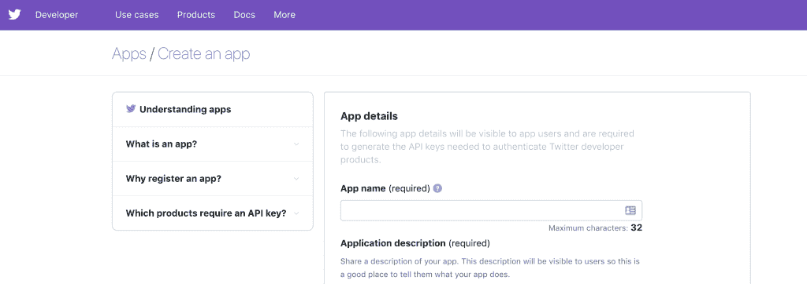
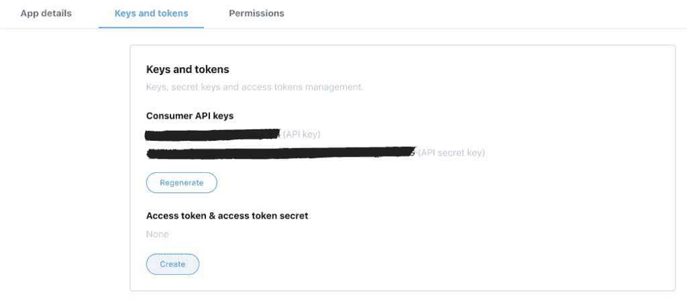

# 如何构建 PostgreSQL 数据库来存储推文

> 原文：<https://dev.to/ugis22/how-to-build-a-postgresql-database-to-store-tweets-5cm8>

#### 学习如何从 Twitter API 流

人们每天都使用 Twitter 来表达他们的感受或想法，尤其是关于此刻正在发生或刚刚发生的事情；由公司推广产品或服务；被记者用来评论事件或撰写新闻，这样的例子不胜枚举。毫无疑问，分析 Twitter 和 tweets 是一个强大的工具，可以让我们了解我们感兴趣的话题的舆论。

但是我们如何进行这种类型的分析呢？幸运的是，Twitter 为我们提供了一个 API(代表“*应用编程接口*”)，我们可以通过它来创建一个应用程序，并以这种方式访问和过滤公共推文。

第*步*是注册我们的 app 为此，我们需要前往 [twitter 开发者网站](https://developer.twitter.com/en.html)，使用我们的 Twitter 账户登录，并以开发者身份请求 Twitter 的批准(*从 2018 年 7 月起，Twitter 改变了他们的政策，任何想要访问 Twitter API 和创建应用程序的人都需要申请一个开发者账户，提供他们打算如何使用它的详细信息，并等待申请获得批准*)。在我们收到批准后，我们可以继续创建一个新的应用程序，填写详细信息: ***Name*** *(没有其他人用作他们的 Twitter 应用程序的唯一名称)*、 ***Description*** 和 ***Website*** (它应该是应用程序的主页，但我们也可以将我们的个人网站或 GitHub 存储库 URL。

 

<figcaption>在 Twitter 开发者账户中创建应用</figcaption>

之后，我们需要创建我们的访问令牌。访问令牌将允许我们的 Twitter 应用程序读取 Twitter 信息，如推文、提及、朋友等:

对于整个分析，我们将使用 [JupyterLab](https://jupyterlab.readthedocs.io/en/stable/getting_started/installation.html) 和 Python。因为任何拥有这些信息的人都可以使用它来授权应用程序连接到 Twitter，所以我们将创建一个 python 文件(。py)，在这里我们可以存储*消费者密钥*、*消费者秘密*、 *OAuth 访问令牌*、 *OAuth 访问令牌秘密*，然后在我们的主 Jupyter 笔记本文件中调用它。

现在我们已经注册了我们的应用程序，获得了我们的令牌/密钥，并将它们存储在一个单独的文件中，第二步*是决定一旦我们获得它们，我们将在哪里存储我们的推文。我们应该将它们存储在一个文件中，一个 [NoSQL 类型的数据库中，还是一个关系数据库](https://www.sisense.com/blog/postgres-vs-mongodb-for-storing-json-data/)？为了回答这个问题，我们需要了解我们从 twitter 应用程序中获得的信息是如何提供给我们的，以及我们想要用这些信息做什么。*

[Twitter API](https://developer.twitter.com/en/docs/tweets/data-dictionary/overview/intro-to-tweet-json)总是返回使用 *JavaScript 对象符号* (JSON)编码的推文，这是一种非结构化的灵活类型，基于具有描述对象的属性和关联值的键值对。每条推文包含作者、消息、唯一 ID、时间戳和发布时的创建日期等；每个用户都有一个姓名、id 和关注者数量。正因为如此，我们会立即想到将 tweets 存储在已构建的数据库管理系统(DBMS)中，如 MongoDB，这是一个被视为原生 JSON 数据库的开源数据库。这种类型的数据库的优点是，它们被设计为在使用动态模式时是敏捷的和可伸缩的，而无需首先定义结构。

另一方面，关系数据库更多的是与标准的一致性和可扩展性相关，因此，在如何存储数据上没有给我们自由。它们使用动态和静态模式，这有助于我们在数据是关系型的时候链接数据。相反，由于非结构化方法，我们不能在 MongoDB 中执行此操作。使用关系数据库的一些其他优点是，我们只需要改变其中一个表中的数据，然后它就会自我更新(*)，并且它们确保没有属性重复( ***数据冗余*** )。如前所述，关系数据库是以列和行的形式组织的，我们可以通过使用键来链接不同表中的信息，这些键唯一地标识表中的任何数据，并被其他表用来指向它们。*

 *尽管 MongoDB 被设计得很快，对非结构化数据有很好的性能，但 PostgreSQL 等关系数据库在处理 JSON 时有很好的性能。这一事实以及结构化数据给我们带来的可能性促使我们使用关系数据库，特别是 [**PostgreSQL 10**](https://www.postgresql.org/) (通常称为 Postgres)，因为它是一个免费、可靠和高效的 SQL 数据库，最重要的是，它有一个非常强大和有用的 python API，称为 [**psycopg2**](http://initd.org/psycopg/) 。为了以更友好的方式管理我们的数据库，我们还将使用 [**pgadmin**](https://dev.to/scottw/pgadmin---postgresql-tools-5ejk) 来创建一个带有用户名和密码的数据库，以保护我们的信息。同样，我们将把这些凭证存储在另一个 python 文件中，这样，一旦我们将主文件推送到 git 存储库，我们就可以对它们保密。

我们需要引入分析的最后一个组件是 [**Tweepy**](http://www.tweepy.org/) ，这是一个 python 库，它将成为我们代码中的主要参与者，将帮助我们访问 Twitter API、处理授权请求、捕获和流式传输推文等，还有 **json** ，它将管理从 API 获得的 json 文件。

因此，我们需要在代码中做的第一件事是导入我们创建的所有库和文件:

之后，我们将定义一个函数，该函数将授权我们的应用程序连接到 Twitter API。OAuth 是一种开放的访问标准，主要由互联网用户用来授权应用程序或网站访问他们在其他网站上的信息，而无需向他们提供密码，而是允许批准的访问令牌访问由资源服务器托管的受保护资源。在 Twitter 的例子中，我们已经请求了令牌和密钥，所以我们将使用 Tweepy，这使得 OAuth 授权很容易用 ***tweepy 来处理。OAuthHandler*T3 类。因此，首先，我们将消费者密钥和消费者秘密传递给这个函数，然后，我们将访问令牌设置为我们的访问令牌和我们从 Twitter 获得的访问令牌秘密。**

正如我们以前讨论过的，关系数据库将信息存储在结构化的表中，所以下一步是决定数据库的模式。这里有一个很重要的概念需要我们考虑: ***归一化。*** 规范化一个数据库需要一个根据某种范式构建关系数据库的过程，这种范式遵循减少数据冗余和提高数据完整性的目标。规范化数据库是这样一种数据库，即表之间的关系与数据之间真实存在的关系相匹配。简而言之，规则规定行中的唯一键和事件应该对此有所说明，与键无关的事实属于不同的表，并且表不应该暗示不存在的关系。

在我们的例子中，我们将创建两个表:第一个表将包含关于 Twitter 用户的信息:用户 id，这将是我们的主键(对于每个记录都是唯一的键)，以及用户名。另一方面，我们将创建第二个表来存储关于 tweet 的信息:创建日期、文本(tweet 本身)、用户 id，这将是我们的外键(唯一标识另一个表的主键的键),将这个表与我们的用户表相关联，以及 retweet 计数。

我们将定义一个函数，一旦调用该函数，它将使用凭证连接到我们的数据库(使用命令 pyscopg2.connect ),并创建一个包含我们要搜索的术语名称的表。对于这最后一步，Postgres 为我们提供了设置一个 ***游标*** 的可能性，该游标封装查询并一次读取几行结果，而不是一次执行整个查询。因此，我们将利用这一点，创建一个游标(使用 *database.cursor()* )，然后执行我们的查询来创建用户表和包含 tweets 的表。这里我们需要考虑几点:在执行查询创建表时使用 IF NOT EXISTS 命令很重要，否则 Postgres 会抛出表已经创建好的错误，并会停止代码执行；我们需要澄清每一列包含哪种类型的变量(VARCHAR、TIMESTAMP 等。)，哪一列是主键和外键，在最后一种情况下，哪一列引用了；在我们执行完查询之后，一定要提交它( *database.commit()* )，否则，不会保存任何更改，并关闭到游标和数据库的连接。

之后，我们需要定义一个函数来帮助我们存储推文。这个函数将遵循我们用来创建表的相同逻辑(连接到数据库、创建游标、执行查询、提交查询、关闭连接)，但是我们将使用 [INSERT INTO](https://www.postgresql.org/docs/10/sql-insert.html) 命令。在创建用户表时，我们声明用户 id 将是我们的主键。因此，当我们存储推文时，我们需要小心如何将它插入表中。如果同一个用户有两条 tweets，那么第二次执行这个函数时，它会产生一个错误，因为它检测到这个特定的用户 id 已经在表中了，因为主键必须是惟一的。因此，我们可以在这里使用 [ON CONFLICT](https://www.postgresql.org/docs/10/sql-insert.html) 命令来告诉 postgres，如果用户 id 已经在表中，它就不必再次插入。相反，tweet 将被插入到 tweets 表中，并引用用户表中的用户 id。

有两种方法可以用 Tweepy 捕捉推文。第一个是使用 REST 搜索 API， *tweepy。API，*，搜索过去 7 天内发布的公共 tweets 样本。第二个是通过使用与 REST api 不同的 *Twitter 流 api* 来传输实时推文，这个 api 从 Twitter 中提取数据，而流 api 将消息推送到持久会话。

为了在 tweepy 中流式传输 Tweepy 中的 Tweepy，创建了类 [***的一个实例。Stream***](https://tweepy.readthedocs.io/en/3.7.0/streaming_how_to.html#summary) 建立流式会话，并向 StreamListener 类的实例发送消息。在这个类中，有几个处理 tweets 的方法。根据我们想要获得的信息类型，我们需要覆盖不同的方法:如果我们只想要状态，那么我们将重载 ***on_status*** 方法。因为我们想要关于 tweet 的详细信息(创建日期、用户 id、用户名、转发次数)，所以我们将重载负责接收所有消息并根据消息类型调用函数的 **on_data** 方法。

因此，我们将创建类 **MyStreamListener** ，它将继承自 ***tweepy。StreamListener*** 类，我们将覆盖 **on_data** 方法。我们将获取包含 tweet 的 json 文件( *json.load(raw_data)* )并解析它以存储不同变量中的值(例如:user_id = data['user']['id_str'])，然后将它们传递给函数以存储我们之前创建的 tweet。

重要是要小心此时可能发生的错误或异常。为此，我们将用一个 try/except 块将代码括起来，以便在发生异常时，它会被打印出来，这样我们就可以知道发生了什么。此外，连接到流式 API 的尝试次数有限，这将显示错误 420。我们可以通过重载 **on_error** 方法来处理这个错误，并在出现这个错误时断开 API。

那么，还剩下什么？我们需要创建一个 api ( *tweepy)。API()* )之后，创建我们的流对象( *tweepy.stream()* )，传递我们已经创建的授权和监听器。我们将使用 ***过滤器*** 功能来流式传输所有包含感兴趣的单词( *track = ['word']* )并用英语编写的推文( *languages = ['en]* )

现在，是时候开始发送推文了！！我特别想知道人们对《复仇者联盟》的感受。因此，我将使用“复仇者联盟”作为我的兴趣术语，并开始捕捉实时推文，以创建一个良好的数据库，这将有助于我稍后的情绪分析，你可以在这里阅读[，以及可视化 Twitter 与 Networkx 的交互，你可以在这里](https://towardsdatascience.com/keras-challenges-the-avengers-541346acb804)找到[。你对什么感兴趣？](https://medium.com/@meinzaugarat/visualizing-twitter-interactions-with-networkx-a391da239af5)

* * **