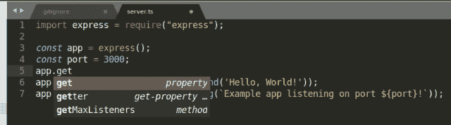
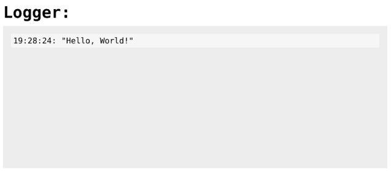

# 带有 TypeScript 的 ExpressJS 服务器——第 2 部分——程序员新手

> 原文：<https://dev.to/tirthbodawala/expressjs-server-with-typescript--part-2--the-novice-programmer-2p98>

让我们从第二天开始，回顾一下:

[看看我们之前的博客第一部分](https://dev.to/tirthbodawala/getting-started-with-typescript--part-1--the-novice-programmer-16jh-temp-slug-8330376)

*   用 TSC 编译 TS 文件
*   设置 tsconfig.json
*   构建我们的代码以输出所有内容来构建文件夹

知道以上是好的，但是当你开始一个真正的项目时不是很有帮助。因此，让我们今天编写一些代码，并提供一个文件，使我们的工作通过 HTTP 服务器可见。此外，在深入研究某些东西之前，我喜欢包含文件的能力，这样我就可以正确地组织我的代码。因此，让我们设置 ExpressJS 服务器并开始导入文件。

* * *

## 设置 Http 服务器–express js

让我用我们都知道的最简单的标准方式安装 express js:

```
npm install express --save 
```

此外，不言而喻，让我们创建拥有我们的服务器代码的`server.ts`。在 ES6 中，我使用一个简单导入来导入 express:

```
import express from "express"; 
```

但不幸的是，对于 CommonJS/AMD/UMD 模块的 typescript，这不起作用，导入 CommonJS 模块的正确方法如下:

```
import express = require("express"); 
```

我还碰到了以下这些:

```
import * as express from "express"; 
```

但显然，这不是正确的做法，因为`import * as`创建了一个标识符，它是一个*模块对象*，强调了一个*对象*。根据 ES6 规范，这个对象是不可调用的，也是不可调用的——它只有属性。根据 ES6 规范，试图使用`import * as express`然后调用`express()`总是非法的。在一些 runtime+transpilation 环境中，这可能会发生工作，但它可能会在未来的任何时候中断，而不会发出警告，这将使您感到难过。

设置 HTTP 服务器后，我们将更详细地了解导入；)

**设置标准*你好，世界！*** “我们的`server` `.js`
中的官方 ExpressJS 文档示例”

```
import express = require("express");

const app = express();
const port = 3000;
app.get('/', (req, res) => res.send('Hello, World!'));
app.listen(port, () => console.log(`Example app listening on port ${port}!`)); 
```

现在从项目根终端运行:

```
./node_modules/.bin/tsc && node build/server.js 
```

一切都很好，访问 http://localhost:3000 我可以看到光荣的“你好，世界！”

但这并不是结束，上面的例子还有更多，我们可以在 TS 项目中为 ExpressJS 指定如下类型，并且实际上可以使用 TypeScript 的好处。

```
npm i @types/express --save-dev 
```

因此，这为开发人员提供了一个很好的自动完成特性，并公开了可用的方法和属性，这很好:

[](https://res.cloudinary.com/practicaldev/image/fetch/s--tYZUs_XU--/c_limit%2Cf_auto%2Cfl_progressive%2Cq_auto%2Cw_880/https://i1.wp.com/www.atyantik.com/wp-content/uploads/2018/12/image-1.png%3Fw%3D640%26ssl%3D1)

从而使我们的`server.js`更具类型化，如下:

```
import express = require("express");

const app: express.Application = express();
const port: number = 3000;
app.get('/', (req: express.Request, res: express.Response): express.Response => {
    return res.send('Hello, World!');
});
app.listen(port, (): void => console.log(`Example app listening on port ${port}!`)); 
```

我可以看到 typescript 真的真的很简单，我自己想出了下面的函数:

```
function (arg1: <type>, arg2: <type>): <function-return-type> {
  // return something of <function-return-type>
} 
```

而 ***字符串*** ， ***数字*** ， ***布尔*** & ***无效*** 都是非常通用的类型，大多在任何编程语言中都可用，但对于 ***表达。应用*、**、**、*表达。请求*** & ***明示。回复*** 类型，自动完成帮助了我！

以上真的很棒。

> 我已经有一种感觉，我的余生都要使用 TypeScript 了！

回到我们的 HTTP 服务器，我们真的不想服务器“你好，世界！”但是我们希望我们的 TS 编译的 javascript 能够在主页上执行，所以我将 server.ts 更新为:

```
import express = require("express");
const path = require("path");

const app: express.Application = express();
const port: number = 3000;

app.use("/static", express.static(path.join(__dirname, '..', 'build')));
app.get('/', (req: express.Request, res: express.Response): express.Response => {
    return res.send(`<!DOCTYPE html>
        <html>
            <head>
                My experiments with TypeScript
                <style>
                  html,body {
                    margin:0;
                    padding:0;
                    font-family: monospace;
                    font-size: 20px;
                  }
                  #logger {
                    background-color: #eee; 
                    padding: 20px; 
                    max-width: 100%; 
                    height: 600px; 
                    max-height: calc( 90vh - 2em - 35px); 
                    margin: 10px;
                    overflow-y: auto;
                  }
                  .log-entry {
                    max-width: 100%;
                    padding: 5px;
                    background-color: #f6f6f6;
                  }
                  .title {
                    margin: 10px;
                  }
                </style>
            </head>
            <body>
                <h1 class="title">Logger:</h1>
                <div id="logger"></div>
                <script src="/static/index.js" async></script>
            </body>
        </html>
    `);
});
app.listen(port, (): void => console.log(`Example app listening on port ${port}!`)); 
```

我在这里没有做什么特别的事情，只是发送带有一点样式的 HTML，并让 express 从构建文件夹中获取静态文件。我知道现在还不理想，因为`server.js`也可以从静态路径提供，但这只是暂时的，供学习用。

### 更新 index.ts 文件

我们有一个简单的 logger 输出，通过 express 提供，可以包含我们编译的 index.js 中的代码，所以让我们将 index.ts 更新为以下内容，使它能够记录 logger 中的内容:

```
let str: string = "Hello, World!";
function log(s: any): void {
    const logger: HTMLElement = document.getElementById("logger");
    const logWrapper: HTMLElement = document.createElement("div");
    logWrapper.className = "log-entry";
    logWrapper.innerHTML = `${(new Date).toLocaleTimeString()}: ${JSON.stringify(s)}`;
    logger.appendChild(logWrapper);
}
log(str); 
```

您可以通过运行以下命令来测试您的服务器:

```
./node_modules/.bin/tsc && node build/server.js 
```

如果您访问 [http://localhost:3000](http://localhost:3000) ，您应该会看到以下屏幕

<figure>[](https://res.cloudinary.com/practicaldev/image/fetch/s--QJhWT-cp--/c_limit%2Cf_auto%2Cfl_progressive%2Cq_auto%2Cw_880/https://i0.wp.com/www.atyantik.com/wp-content/uploads/2018/12/image-2.png%3Fw%3D640%26ssl%3D1) 

<figcaption>
</figcaption>

</figure>

*挺圆滑的吧！*

最后一件事，我们几乎完成了我们最简单的带有 TypeScript 的 ExpressJS 设置。

每当我更新代码库时，我真的不想重启服务器，因此将 [nodemon](https://github.com/remy/nodemon) 添加到我们的 repo 中。此外，我不想一次又一次地编译代码，所以我会启用`--watch`选项来启动 TS 编译器，用 nodemon 启动服务器，并更新启动脚本以同时执行[和](https://github.com/kimmobrunfeldt/concurrently#readme)节点包

```
npm i nodemon concurrently --save 
```

并将我们的启动脚本更新为:

```
"scripts":  {  "start":  "tsc && concurrently -n \"TypeScript,Nodemon\"  \"npm run ts-watch\"  \"npm run server-watch\"",  "ts-watch":  "tsc -w",  "server-watch":  "nodemon --watch build/server.js build/server.js",  "test":  "echo \"Error: no test specified\" && exit 1"  } 
```

我想这应该已经完成了，对我们进一步的学习和研究会有帮助！

在讨论类型和其他细节之前，我想了解更多关于导入和与 CommonJS、AMD、UMD 和 ES6 等的兼容性，所以明天我会更关注这个问题！

本集第二部分的代码库位于:

【https://github.com/Atyantik/typescript-series/tree/part-2 T2】

帖子[express js Server with TypeScript-Part 2-新手程序员](https://www.atyantik.com/expressjs-server-with-typescript-part-2-the-novice-programmer/)最早出现在 [Atyantik Technologies](https://www.atyantik.com) 上。