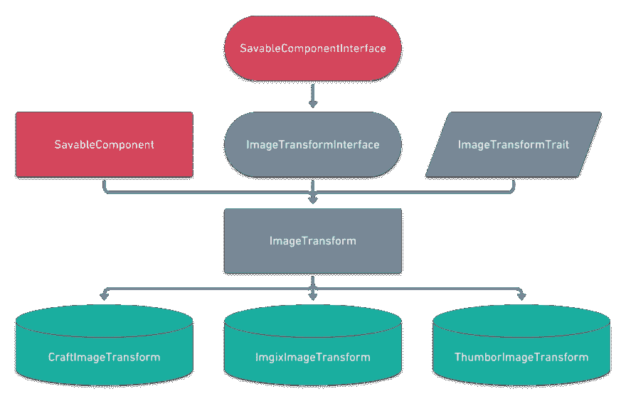

# 用可扩展组件编写插件

> 原文：<https://dev.to/gaijinity/writing-craft-plugins-with-extensible-components-4p6a>

# 用可扩展组件编写工艺插件

### 如何为 Craft CMS 编写一个插件，允许其他人以灵活、组合的方式扩展它

安德鲁·韦尔奇

[](https://res.cloudinary.com/practicaldev/image/fetch/s--BC9ohqli--/c_limit%2Cf_auto%2Cfl_progressive%2Cq_auto%2Cw_880/https://nystudio107-ems2qegf7x6qiqq.netdna-ssl.com/img/blog/_1200x675_crop_center-center_82_line/puzzle-pieces-components.jpg)

在为 Craft CMS 编写插件时，您可能会遇到这样的情况:您的插件希望提供可扩展的功能。你可能想在将来扩展它，或者你可能想让别人扩展它。

例如，我的[Ima geo mize](http://github.com/nystudio107/craft-imageoptimize)plug in 允许你完全替换你的图像转换形式，所以像 [Imgix](http://www.imgix.com/) 或 [Thum bor](http://thumbor.org/) 这样的服务可以用来代替 Craft 的原生转换形式。但是我们如何以一种可扩展的方式来写这个，这样如果任何一个人想要添加另一个图像转换服务，他们就可以了？

<aside>Com­po­nents are pop­u­lar these days, because there are tan­gi­ble ben­e­fits to cod­ing in a mod­u­lar­ized way</aside>

本文将讨论为您的插件添加可扩展功能的具体策略。如果你想了解更多关于职业 CMS plug in general 的发展，请查看[以便你想制作一个职业 3 Plu g in？](https://dev.to/gaijinity/so-you-wanna-make-a-craft-3-plugin-76m-temp-slug-4321262)文章。

## Ima 地质时间:一个具体的例子

所以让我们用[Ima geo timet](http://github.com/nystudio107/craft-imageoptimize)作为一个具体的例子。当我想到完全替换 Craft CMS 中的图像转换时，我决定最好的方法是用一种适度的方式来写。

从 Ima geo mize 1 . 5 . 0 开始，我使用的正是本文中列出的技术。所以我们来看看。

[](https://res.cloudinary.com/practicaldev/image/fetch/s--5fEXfG5b--/c_limit%2Cf_auto%2Cfl_progressive%2Cq_auto%2Cw_880/https://nystudio107-ems2qegf7x6qiqq.netdna-ssl.com/img/blog/_1200x675_crop_center-center_82_line/concrete-craft-cms-plugin-example.jpg)

关注真实世界的例子通常比使用虚构或复杂的例子更有用。因此，让我们深入研究一下，看看我们如何以一种可扩展的方式在图像优化中实现图像转换。

## PHP 界面

事实上，现代 PHP 为我们提供了一些工具来帮助我们做到这一点。PHP 允许你写一个[对象接口](http://php.net/manual/en/language.oop5.interfaces.php)，它定义了一个对象*必须*实现的方法。

为什么要这么做？它本质上让你定义一个 API，所有使用这个接口的对象都必须实现这个 API。所以在我们的例子中，我们有一个`ImageTransformInterface`，看起来像这样:

```
 <?php
/**
 * ImageOptimize plugin for Craft CMS 3.x
 *
 * Automatically optimize images after they've been transformed
 *
 * @link https://nystudio107.com
 * @copyright Copyright (c) 2018 nystudio107
 */

namespace nystudio107\imageoptimize\imagetransforms;

use craft\base\SavableComponentInterface;
use craft\elements\Asset;
use craft\models\AssetTransform;

/**
 * @author nystudio107
 * @package ImageOptimize
 * @since 1.5.0
 */
interface ImageTransformInterface extends SavableComponentInterface
{
    // Static Methods
    // =========================================================================

    /**
     * Return an array that contains the template root and corresponding file
     * system directory for the Image Transform's templates
     *
     * @return array
     * @throws \ReflectionException
     */
    public static function getTemplatesRoot(): array;

    // Public Methods
    // =========================================================================

    /**
     * Return a URL to a transformed images
     *
     * @param Asset $asset
     * @param AssetTransform|null $transform
     * @param array $params
     *
     * @return string|null
     */
    public function getTransformUrl(Asset $asset, $transform, array $params = []);

    /**
     * Return a URL to the webp version of the transformed image
     *
     * @param string $url
     * @param Asset $asset
     * @param AssetTransform|null $transform
     * @param array $params
     *
     * @return string
     */
    public function getWebPUrl(string $url, Asset $asset, $transform, array $params = []): string;

    /**
     * Return the URL that should be used to purge the Asset
     *
     * @param Asset $asset
     * @param array $params
     *
     * @return mixed
     */
    public function getPurgeUrl(Asset $asset, array $params = []);

    /**
     * Purge the URL from the service's cache
     *
     * @param string $url
     * @param array $params
     *
     * @return bool
     */
    public function purgeUrl(string $url, array $params = []): bool;

    /**
     * Return the URI to the asset
     *
     * @param Asset $asset
     *
     * @return mixed
     */
    public function getAssetUri(Asset $asset);

    /**
     * Prefetch the remote file to prime the cache
     *
     * @param string $url
     */
    public function prefetchRemoteFile($url);

    /**
     * Get the parameters needed for this transform
     *
     * @return array
     */
    public function getTransformParams(): array;
} 
```

注意，我们在这里没有写任何实际的代码；我们只是在定义一个想要进行图像转换的对象需要实现的方法。我们定义方法名，以及必须传递给该方法的参数(这通常被称为方法的*签名*)。

把它想象成给你的班级写一份标准文件。

这迫使我们以抽象的方式思考图像变换的问题；图像变换的通用接口是什么样的？

<aside>Even if you’re writ­ing code​for your­self, sit­ting down and think­ing about the prob­lem in an abstract way can be very helpful.</aside>

注意，我们的`ImageTransformInterface`扩展了另一个接口:[可保存的组件接口](http://docs.craftcms.com/api/v3/craft-base-savablecomponentinterface.html)。这是一个手工提供的接口，它定义了具有可保存设置的组件必须实现的方法。

这太棒了，我们可以利用 Pix el & Ton ic 的优秀员工所做的工作，因为我们也希望能够拥有可保存的设置！像田地、田地等工艺品中的许多组件。所有人都使用`SavableComponentInterface`所以我们也可以！

还要注意，接口中没有定义适当的关系；只是方法。

## PHP 特质

PHP 还实现了[特征](http://php.net/manual/en/language.oop5.traits.php)的概念。它们类似于一个 PHP 类，但是它们被设计成避开 PHP 由于缺少实例的多样性而带来的限制。在 PHP 中，一个对象只能从一个对象继承它。

另一种语言允许多个实例；相反，在 PHP 中，我们可以定义一个特征，我们的对象可以`use`这个特征。可以把它看作是像类一样提供属性&方法的一种方式，但是不同类型的多个对象可以`use`它。

下面是`ImageTransformTrait`在 ImageOptimize 中的样子:

```
 <?php
/**
 * ImageOptimize plugin for Craft CMS 3.x
 *
 * Automatically optimize images after they've been transformed
 *
 * @link https://nystudio107.com
 * @copyright Copyright (c) 2018 nystudio107
 */

namespace nystudio107\imageoptimize\imagetransforms;

/**
 * @author nystudio107
 * @package ImageOptimize
 * @since 1.5.0
 */
trait ImageTransformTrait
{
    // Public Properties
    // =========================================================================
} 
```

好像金达用的比较少，对吧？那是因为当前的谎言，它是！我没有在`ImageTransformTrait`中定义任何属性或任何方法，我只是为了将来的扩展而实现它。

事实上，尽管你可以在一个特征中同时拥有属性和方法，我倾向于只在定义属性时使用它们。

我这样做的原因是，想用自己的代码覆盖对象的方法，然后调用 par ent 方法是很常见的，例如:`parent::init()`。这与特征有很大关系。因此，我们使用基本抽象类。

## PHP 基础抽象类

最后，我们要利用的 PHP 的最后一点是[抽象类 es](http://php.net/manual/en/language.oop5.abstract.php) 。抽象类只是 PHP 类，它们实现了一些方法，但是从来没有单独实例化过。它们简单地存在，以便其他类可以扩展它们。

所以他们提供了一些基本功能，但是你从来没有真正创建过。相反，你应该编写另一个类来扩展一个基本抽象类，并覆盖你想覆盖的方法，适当地调用`parent::method`。

下面是 ImageOptimize 中基本抽象图像转换类的样子:

```
 <?php
/**
 * ImageOptimize plugin for Craft CMS 3.x
 *
 * Automatically optimize images after they've been transformed
 *
 * @link https://nystudio107.com
 * @copyright Copyright (c) 2018 nystudio107
 */

namespace nystudio107\imageoptimize\imagetransforms;

use nystudio107\imageoptimize\helpers\UrlHelper;

use craft\base\SavableComponent;
use craft\elements\Asset;
use craft\helpers\FileHelper;
use craft\helpers\StringHelper;
use craft\models\AssetTransform;

/**
 * @author nystudio107
 * @package ImageOptimize
 * @since 1.5.0
 */
abstract class ImageTransform extends SavableComponent implements ImageTransformInterface
{
    // Traits
    // =========================================================================

    use ImageTransformTrait;

    // Static Methods
    // =========================================================================

    /**
     * @inheritdoc
     */
    public static function displayName(): string
    {
        return Craft::t('image-optimize', 'Generic Transform');
    }

    /**
     * @inheritdoc
     */
    public static function getTemplatesRoot(): array
    {
        $reflect = new \ReflectionClass(static::class);
        $classPath = FileHelper::normalizePath(
            dirname($reflect->getFileName())
            . '/../templates'
        )
        . DIRECTORY_SEPARATOR;
        $id = StringHelper::toKebabCase($reflect->getShortName());

        return [$id, $classPath];
    }

    // Public Methods
    // =========================================================================

    /**
     * @inheritdoc
     */
    public function getTransformUrl(Asset $asset, $transform, array $params = [])
    {
        $url = null;

        return $url;
    }

    /**
     * @inheritdoc
     */
    public function getWebPUrl(string $url, Asset $asset, $transform, array $params = []): string
    {
        return $url;
    }

    /**
     * @inheritdoc
     */
    public function getPurgeUrl(Asset $asset, array $params = [])
    {
        $url = null;

        return $url;
    }

    /**
     * @inheritdoc
     */
    public function purgeUrl(string $url, array $params = []): bool
    {
        return true;
    }

    /**
     * @inheritdoc
     */
    public function getAssetUri(Asset $asset)
    {
        $volume = $asset->getVolume();
        $assetPath = $asset->getPath();

        // Account for volume types with a subfolder setting
        // e.g. craftcms/aws-s3, craftcms/google-cloud
        if ($volume->subfolder ?? null) {
            return rtrim($volume->subfolder, '/').'/'.$assetPath;
        }

        return $assetPath;
    }

    /**
     * @param string $url
     */
    public function prefetchRemoteFile($url)
    {
        // Get an absolute URL with protocol that curl will be happy with
        $url = UrlHelper::absoluteUrlWithProtocol($url);
        $ch = curl_init($url);
        curl_setopt_array($ch, [
            CURLOPT_RETURNTRANSFER => 1,
            CURLOPT_FOLLOWLOCATION => 1,
            CURLOPT_SSL_VERIFYPEER => 0,
            CURLOPT_NOBODY => 1,
        ]);
        curl_exec($ch);
        curl_close($ch);
    }

    /**
     * @inheritdoc
     */
    public function getTransformParams(): array
    {
        $params = [
        ];

        return $params;
    }

    /**
     * Append an extension a passed url or path
     *
     * @param $pathOrUrl
     * @param $extension
     *
     * @return string
     */
    public function appendExtension($pathOrUrl, $extension): string
    {
        $path = $this->decomposeUrl($pathOrUrl);
        $path_parts = pathinfo($path['path']);
        $new_path = $path_parts['filename'] . '.' . $path_parts['extension'] . $extension;
        if (!empty($path_parts['dirname']) && $path_parts['dirname'] !== '.') {
            $new_path = $path_parts['dirname'] . DIRECTORY_SEPARATOR . $new_path;
            $new_path = preg_replace('/([^:])(\/{2,})/', '$1/', $new_path);
        }
        $output = $path['prefix'] . $new_path . $path['suffix'];

        return $output;
    }

    // Protected Methods
    // =========================================================================

    /**
     * Decompose a url into a prefix, path, and suffix
     *
     * @param $pathOrUrl
     *
     * @return array
     */
    protected function decomposeUrl($pathOrUrl): array
    {
        $result = array();

        if (filter_var($pathOrUrl, FILTER_VALIDATE_URL)) {
            $url_parts = parse_url($pathOrUrl);
            $result['prefix'] = $url_parts['scheme'] . '://' . $url_parts['host'];
            $result['path'] = $url_parts['path'];
            $result['suffix'] = '';
            $result['suffix'] .= empty($url_parts['query']) ? '' : '?' . $url_parts['query'];
            $result['suffix'] .= empty($url_parts['fragment']) ? '' : '#' . $url_parts['fragment'];
        } else {
            $result['prefix'] = '';
            $result['path'] = $pathOrUrl;
            $result['suffix'] = '';
        }

        return $result;
    }
} 
```

正如您所看到的，它提供了一点基本功能，这对于一个特殊的图像转换来说可能是很好的，但是这些方法中的任何一种都可以根据需要被取消。在基本抽象类中提供一些通用的实用函数也是很常见的。

请注意，`ImageTransform`类也是`extends`工艺基类`SavableComponent`，这样我们就可以得到一个可保存组件的功能！

## 把一切联系在一起

所以我们最后得到的是一个类似这样的层次结构:

[](https://res.cloudinary.com/practicaldev/image/fetch/s--tmXWnu_z--/c_limit%2Cf_auto%2Cfl_progressive%2Cq_auto%2Cw_880/https://nystudio107-ems2qegf7x6qiqq.netdna-ssl.com/img/blog/_1200x769_crop_center-center_100_line/image-transform-hierarchy.png)

手工制作的东西是红色的；我们从未接触过的东西是灰色的，而我们在插件中使用的实际物体是浅绿色的。

我们有:

*   一个**接口**定义了我们的图像转换方法(我们的 API)
*   一个**特征**，它可以定义我们希望我们所有的图像变换所具有的任何属性
*   一个基类**抽象**定义了我们的核心功能，其他类也可以扩展
*   …然后是多个**类**，它们扩展了我们的基本抽象`ImageTransform`类来实现功能

虽然乍一看这似乎很复杂，但实际上我们所做的是将不同的位移动到它们自己包含的文件中，并定义了一组函数。这将导致更清晰、更易维护和可扩展的代码。

## 将我们的组分混合在一起

所以这太棒了！我们已经为图像转换定义了一个很好的接口和基础抽象类。当我们编写代码来实现我们的图像转换时，这将使我们的生活更加轻松。

它也给了其他开发者一个清晰定义的方法来编写他们自己的图像转换，就像 Craft 给了你一个接口和基本抽象类一样。

但是我们如何将图像转换形式混合到插件中呢？

[](https://res.cloudinary.com/practicaldev/image/fetch/s--rdnQ8etq--/c_limit%2Cf_auto%2Cfl_progressive%2Cq_auto%2Cw_880/https://nystudio107-ems2qegf7x6qiqq.netdna-ssl.com/img/blog/_992x558_crop_center-center_82_line/mixing-in-plugin-components.jpg)

我们做的第一件事是在插件的`Settings`模型中有一个属性，它保存了当前选择的图像转换的完全合格的类名:

```
 /**
 * @var string The image transform class to use for image transforms
 */
public $transformClass = CraftImageTransform::class; 
```

我们将它默认为`CraftImageTransform::class`，但是它可以是实现我们的`ImageTransformInterface`的任何类。

接下来，我们利用这样一个事实:我们的插件实际上是一个 [Yii2 模块](http://www.yiiframework.com/doc/guide/2.0/en/structure-modules) …并且所有的 Yii2 模块都可以有 [Yii2 组件](http://www.yiiframework.com/doc/guide/2.0/en/concept-components)。

事实上，您在插件中定义的任何服务类都只是作为插件模块的组件添加的。有关 Craft CMS 模块的更多详细信息，请参见[使用自定义模块增强 Craft CMS 3 网站文章。](https://dev.to/gaijinity/enhancing-a-craft-cms-3-website-with-a-custom-module-33g1-temp-slug-8101978)

因此，我们可以通过在插件的`init()`方法:
中调用这个方法，在插件中设置我们的`transformMethod`组件动态

```
 /**
 * Set the transformMethod component
 */
protected function setImageTransformComponent()
{
    $settings = $this->getSettings();
    $definition = array_merge(
        $settings->imageTransformTypeSettings[$settings->transformClass] ?? [],
        ['class' => $settings->transformClass]
    );
    try {
        $this->set('transformMethod', $definition);
    } catch (InvalidConfigException $e) {
        Craft::error($e->getMessage(), __METHOD__ );
    }
    self::$transformParams = ImageOptimize::$plugin->transformMethod->getTransformParams();
} 
```

所有这些都是从 Yii2 的服务角色类调用我们的 plu g in 它的`set()`方法。您传入了希望将组件称为的别名(在本例中为`transformMethod`)，以及一个配置数组，该数组包含一个`class`键和要实例化的完全限定类名，以及初始化该类应该使用的任何其他键/值属性对。

在我们的例子中，我们传递我们的图像转换可能有的任何设置，以便它可以用任何用户可定义的设置来配置。

有趣的是，当我们在插件的类上`set()`了我们的组件之后，我们就可以像访问任何其他服务一样访问它:`ImageOptimize::$plugin->transformMethod->`来调用我们在`ImageTransformInterface`中定义的任何方法。

plu g in 不知道，也不关心到底是哪个类提供了这个组件，所以通过这种方式，我们可以换入任何实现我们的`ImageTransformInterface`的类，然后就可以开始了！

在引擎盖下，这一切都使用 [Yii2 的 Depen den cy injection container](http://www.yiiframework.com/doc/guide/2.0/en/concept-di-container)(DI)来发挥其魔力。

你可能以前见过这种情况，甚至没有真正使用过。当您调整`config/app.php`中的设置时，比方说，添加 Redis 作为缓存方法，您提供的数组只是 DI 的一个配置，因此它可以找到并实例化要使用的缓存类！

## 使组件可被发现

因此，我们可以利用所有这些好处使我们的生活更轻松，这很好，但我们仍然有一个问题，如何让我们的插件了解我们的组件类。对此，我们可以采取三管齐下的方法。

首先，我们在 plu g in 中简单地定义子一个内置类的数组

```
 const DEFAULT_IMAGE_TRANSFORM_TYPES = [
        CraftImageTransform::class,
        ImgixImageTransform::class,
        ThumborImageTransform::class,
    ]; 
```

然后，我们希望能够让人们使用一个任意的 Com pos er pack age 来实现我们的 T1，并让 Ima geo mize 了解它，而不需要任何额外的代码。例如，查看[craft-IMA geo mize-img IX](http://github.com/nystudio107/craft-imageoptimize-imgix)和[craft-IMA geo mize-thum bor](http://github.com/nystudio107/craft-imageoptimize-thumbor)套餐。

我们可以通过在我们的设置模型中设置一个属性来做到这一点(因此在多环境中也是如此`config/image-optimize.php` ):

```
 // The default Image Transform type classes
'defaultImageTransformTypes' => [
], 
```

这使得人们只需将适当的类添加到他们的`config/image-optimize.php`多环境配置中，我们将其合并到内置的图像转换中:

```
 $imageTransformTypes = array_unique(array_merge(
        ImageOptimize::$plugin->getSettings()->defaultImageTransformTypes ?? [],
        self::DEFAULT_IMAGE_TRANSFORM_TYPES
    ), SORT_REGULAR); 
```

所以这很棒，人们可以把他们自己的图像转换添加到我们的插件中，而不用编写自定义模块或插件来提供它。

但是人们也可能希望将他们的图像转换包装在插件中(使其易于用户从商店的插件中安装)或自定义站点模块中。我们可以通过触发一个事件来做到这一点，模块/插件可以列出这个事件来注册它们提供的图像转换:

```
 use craft\events\RegisterComponentTypesEvent;

...

    const EVENT_REGISTER_IMAGE_TRANSFORM_TYPES = 'registerImageTransformTypes';

...

        $event = new RegisterComponentTypesEvent([
            'types' => $imageTransformTypes
        ]);
        $this->trigger(self::EVENT_REGISTER_IMAGE_TRANSFORM_TYPES, $event); 
```

观察者会注意到，这正是 Craft 用来允许 plu g ins 注册其他字段类型和其他功能属性的方法。在模块/插件方面，他们必须实现的代码应该是这样的:

```
 use vendor\package\imagetransforms\MyImageTransform;

use nystudio107\imageoptimize\services\Optimize;
use craft\events\RegisterComponentTypesEvent;
use yii\base\Event;

Event::on(Optimize::class,
     Optimize::EVENT_REGISTER_IMAGE_TRANSFORM_TYPES,
     function(RegisterComponentTypesEvent $event) {
         $event->types[] = MyImageTransform::class;
     }
); 
```

太棒了！现在，我们可以很容易地编写自己的图像转换，其他开发人员也可以根据自己的需要添加图像转换。

我们还有另外一个主题要讨论，那就是我们允许图像转换呈现它们自己的 GUI 来进行设置，并保存这些设置有多精确？

## 编辑存储组件设置

由于我们的图像转换组件从`SavableComponent`开始扩展，我们得到了我们需要的框架，以便显示一个 GUI 来编辑 plu g in set tings，以及保存我们的设置！

要呈现一个 GUI，我们只需要实现`getSettingsHtml()`方法；这里有一个来自`ImgixImageTransform` :
的例子

```
 /**
 * @inheritdoc
 */
public function getSettingsHtml()
{
    return Craft::$app->getView()->renderTemplate('imgix-image-transform/settings/image-transforms/imgix.twig', [
        'imageTransform' => $this,
    ]);
} 
```

我们只是在`imageTransform`中传入我们的组件，并定义一个小树枝模板:

```
 



<!-- imgixDomain -->
{{ forms.textField({
    label: 'Imgix Source Domain',
    instructions: "The source domain to use for the Imgix transforms."|t('image-optimize'),
    id: 'domain',
    name: 'domain',
    value: imageTransform.domain,
    warning: configWarning('imageTransformTypeSettings', 'image-optimize'),
}) }}
<!-- imgixApiKey -->
{{ forms.textField({
    label: 'Imgix API Key',
    instructions: "The API key to use for the Imgix transforms (needed for auto-purging changed assets)."|t('image-optimize'),
    id: 'apiKey',
    name: 'apiKey',
    value: imageTransform.apiKey,
    warning: configWarning('imageTransformTypeSettings', 'image-optimize'),
}) }}
<!-- imgixSecurityToken -->
{{ forms.textField({
    label: 'Imgix Security Token',
    instructions: "The optional [security token](https://docs.imgix.com/setup/securing-images) used to sign image URLs from Imgix."|t('image-optimize'),
    id: 'securityToken',
    name: 'securityToken',
    value: imageTransform.securityToken,
    warning: configWarning('imageTransformTypeSettings', 'image-optimize'),
}) }} 
```

因为我们的图像转换类上的属性被用作可保存的设置(就像工艺字段和 Wid gets 一样)，所以我们在`ImgixImageTransform.php` :
中只有这些属性

```
 // Public Properties
// =========================================================================

/**
 * @var string
 */
public $domain;

/**
 * @var string
 */
public $apiKey;

/**
 * @var string
 */
public $securityToken; 
```

实际上，我们在 Ima geo mize 的`_settings.twig` :
中完成了 m 设置的图像转换

```
 <!-- transformClass -->
{{ forms.selectField({
    label: "Transform Method"|t('image-optimize'),
    instructions: "Choose from Craft native transforms or an image transform service to handle your image transforms site-wide."|t('image-optimize'),
    id: 'transformClass',
    name: 'transformClass',
    value: settings.transformClass,
    options: imageTransformTypeOptions,
    class: 'io-transform-method',
    warning: configWarning('transformClass', 'image-optimize'),
}) }}


    
    <div id="{{ type|id }}" class="io-method-settings {{ 'io-' ~ type|id ~ '-method' }}"  style="display: none;">
        
            
            {{ _imageTransform.getSettingsHtml()|raw }}
        
    </div>
 
```

这只是一个下拉菜单，用于选择要使用的**转换方法**，然后遍历可用的图像转换组件，并提交它们的设置 HTML。

然后，我们将结果作为一个数组存储在我们的设置模块中(这样它可以很好地与 Craft CMS 3.1 的[项目配置](http://github.com/craftcms/cms/blob/3.1/docs/project-config.md))属性中。关键字是图像转换的完全限定类名，值是包含图像转换提供的所有设置的数组。

这就是类的`settingsHtml()`方法中的`ImageOptimize.php`main plug g g 的样子:

```
 /**
 * @inheritdoc
 */
public function settingsHtml()
{
    // Get only the user-editable settings
    $settings = $this->getSettings();

    // Get the image transform types
    $allImageTransformTypes = ImageOptimize::$plugin->optimize->getAllImageTransformTypes();
    $imageTransformTypeOptions = [];
    /** @var ImageTransformInterface $class */
    foreach ($allImageTransformTypes as $class) {
        if ($class::isSelectable()) {
            $imageTransformTypeOptions[] = [
                'value' => $class,
                'label' => $class::displayName(),
            ];
        }
    }
    // Sort them by name
    ArrayHelper::multisort($imageTransformTypeOptions, 'label');

    // Render the settings template
    try {
        return Craft::$app->getView()->renderTemplate(
            'image-optimize/settings/_settings.twig',
            [
                'settings' => $settings,
                'gdInstalled' => \function_exists('imagecreatefromjpeg'),
                'imageTransformTypeOptions' => $imageTransformTypeOptions,
                'allImageTransformTypes' => $allImageTransformTypes,
                'imageTransform' => ImageOptimize::$plugin->transformMethod,
            ]
        );
    } catch (\Twig_Error_Loader $e) {
        Craft::error($e->getMessage(), __METHOD__ );
    } catch (Exception $e) {
        Craft::error($e->getMessage(), __METHOD__ );
    }

    return '';
} 
```

## 往前走，组件化！

这有点难以理解，但我认为它将有助于以一种非常简单/专业的方式提供扩展能力的插件。有了这些知识，你就可以着手制作一些可扩展的插件了！

[](https://res.cloudinary.com/practicaldev/image/fetch/s--hf6fg4Ue--/c_limit%2Cf_auto%2Cfl_progressive%2Cq_auto%2Cw_880/https://nystudio107-ems2qegf7x6qiqq.netdna-ssl.com/img/blog/_1200x675_crop_center-center_82_line/go-forth-and-explore.jpg)

从长远来看，这比将所有这些都硬编码到您的插件中更可靠(人们的所有关联 pr 都希望添加功能)，并且比要求安装附加插件更容易管理。

它提供的结构将有助于您很好地构建您的插件，并且允许其他人以额外的功能来扩展它，从而具有很大的灵活性。

这项技术也可以很容易地用于依赖相同核心功能的插件套件。不需要安装共享插件，只需编译所需的功能，并将其作为组件包依赖项添加进来。

## 进一步阅读

如果你想获得新文章的通知，请在 Twitter 上关注[纽约时报 107](https://twitter.com/nystudio107) 。

版权所有 2020 nystudio107。由 nystudio107 设计