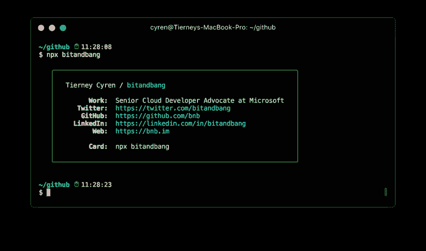
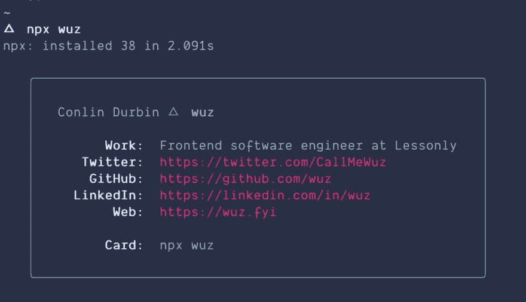

# 设置“npx 用户名”卡！

> 原文：<https://dev.to/wuz/setting-up-a-npx-username-card-1pip>

我最近在 Twitter 上看到了来自 bnb 的一篇很棒的帖子:

> 蒂尔尼昔伦@ bitandbang更新了我的名片😎2018 年 12 月 19 日下午 19:28[](https://twitter.com/intent/tweet?in_reply_to=1075473070368919552)[](https://twitter.com/intent/retweet?tweet_id=1075473070368919552)[](https://twitter.com/intent/like?tweet_id=1075473070368919552)

社区反响非常好，我很快意识到我想制作自己的作品:

> 🧙‍♂️conlin·杜宾@ callmewuz这样一个异想天开的想法由 [@bitandbang](https://twitter.com/bitandbang) ！2018 年 12 月 20 日下午 16:27[](https://twitter.com/intent/tweet?in_reply_to=1075789700898664450)[](https://twitter.com/intent/retweet?tweet_id=1075789700898664450)[](https://twitter.com/intent/like?tweet_id=1075789700898664450)

今天，我想给大家展示一个制作过程。

首先，我们来克隆一下回购:

```
git clone https://github.com/bnb/bitandbang 
```

Enter fullscreen mode Exit fullscreen mode

现在，我们需要编辑一些东西。首先，让我们打开`package.json`并更新一些细节。首先，更改包名:

```
name: <your username> 
```

Enter fullscreen mode Exit fullscreen mode

这将让您发布到 npm，并获得您的卡与`npx <your_username>`。

您还可以更新描述和作者字段以反映您的信息。

如果我们运行`npm run dev`，我们会看到蒂尔尼的信息出现。让它成为你的卡片。

打开`build.js` :

```
'use strict'

// Pull in our modules
const chalk = require('chalk')
const boxen = require('boxen')
const fs = require('fs')
const path = require('path')

// Define options for Boxen
const options = {
  padding: 1,
  margin: 1,
  borderStyle: 'round'
}

// Text + chalk definitions
const data = {
  name: chalk.white(' Tierney Cyren'),
  handle: chalk.white('bitandbang'),
  work: chalk.white('Senior Cloud Developer Advocate at Microsoft'),
  opensource: chalk.white('Node.js Community Committee ') + chalk.green('⬢'),
  twitter: chalk.gray('https://twitter.com/') + chalk.cyan('bitandbang'),
  npm: chalk.gray('https://npmjs.com/') + chalk.red('~bnb'),
  github: chalk.gray('https://github.com/') + chalk.green('bnb'),
  linkedin: chalk.gray('https://linkedin.com/in/') + chalk.blue('bitandbang'),
  web: chalk.cyan('https://bnb.im'),
  npx: chalk.red('npx') + '  ' + chalk.white('bitandbang'),
  labelWork: chalk.white.bold(' Work:'),
  labelOpenSource: chalk.white.bold('Open Source:'),
  labelTwitter: chalk.white.bold(' Twitter:'),
  labelnpm: chalk.white.bold(' npm:'),
  labelGitHub: chalk.white.bold(' GitHub:'),
  labelLinkedIn: chalk.white.bold(' LinkedIn:'),
  labelWeb: chalk.white.bold(' Web:'),
  labelCard: chalk.white.bold(' Card:')
}

// Actual strings we're going to output
const newline = '\n'
const heading = `${data.name} / ${data.handle}`
const working = `${data.labelWork}  ${data.work}`
const opensourcing = `${data.labelOpenSource}  ${data.opensource}`
const twittering = `${data.labelTwitter}  ${data.twitter}`
const npming = `${data.labelnpm}  ${data.npm}`
const githubing = `${data.labelGitHub}  ${data.github}`
const linkedining = `${data.labelLinkedIn}  ${data.linkedin}`
const webing = `${data.labelWeb}  ${data.web}`
const carding = `${data.labelCard}  ${data.npx}`

// Put all our output together into a single variable so we can use boxen effectively
const output = heading + // data.name + data.handle
               newline + newline + // Add one whole blank line
               working + newline + // data.labelWork + data.work
               opensourcing + newline + newline + // data.labelOpenSource + data.opensource
               twittering + newline + // data.labelTwitter + data.twitter
               npming + newline + // data.labelnpm + data.npm
               githubing + newline + // data.labelGitHub + data.github
               linkedining + newline + // data.labelLinkedIn + data.linkedin
               webing + newline + newline + // data.labelWeb + data.web
               carding // data.labelCard + data.npx

fs.writeFileSync(path.join(__dirname, 'bin/output'), chalk.green(boxen(output, options))) 
```

Enter fullscreen mode Exit fullscreen mode

使用`data`常量并添加您的信息。对我来说，它看起来像这样:

```
const data = {
  name: chalk.white('Conlin Durbin'),
  handle: chalk.greenBright.bold('wuz'),
  work: chalk.white('Frontend software engineer at Lessonly'),
  twitter: chalk.redBright('https://twitter.com/CallMeWuz'),
  github: chalk.redBright('https://github.com/wuz'),
  linkedin: chalk.redBright('https://linkedin.com/in/wuz'),
  web: chalk.redBright('https://wuz.fyi'),
  npx: chalk.white('npx wuz'),
  labelWork: chalk.white.bold(' Work:'),
  labelTwitter: chalk.white.bold(' Twitter:'),
  labelGitHub: chalk.white.bold(' GitHub:'),
  labelLinkedIn: chalk.white.bold(' LinkedIn:'),
  labelWeb: chalk.white.bold(' Web:'),
  labelCard: chalk.white.bold(' Card:')
} 
```

Enter fullscreen mode Exit fullscreen mode

你可以随心所欲地使用各种颜色——查看[粉笔](https://npmjs.org/package/chalk)包，了解更多选项。

完成后，再次运行`npm run dev`。如果一切顺利，我们准备向 NPM 发布。

如果你没有 NPM 账户，[去申请一个吧！](https://npmjs.org)设置好帐户后，运行`npm login`并按照提示登录您的帐户。一旦完成，继续运行一个`npm publish`。确保您已经更改了包名。

如果一切设置正确，您应该会看到一条成功消息！尝试运行`npx <your_username>`。

一旦你完成了，截图并发送给我这里或者 Twitter 上的 -我很想看！