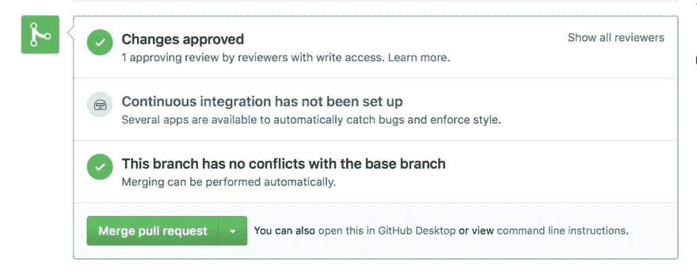
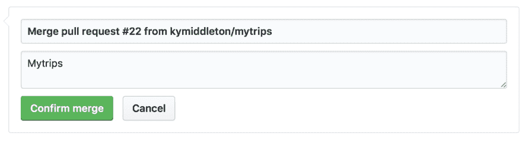

# 参考指南:完成并合并拉式请求

> 原文：<https://dev.to/kymiddleton/reference-guide-complete-and-merge-a-pull-request--12n4>

在我的上一篇文章[参考指南:进行代码评审](https://dev.to/kymiddleton/reference-guide-conducting-a-code-review-k6m)中，概述了代码评审过程的详细步骤。一旦代码评审完成，就该完成这个过程并提出意见，批准已评审的变更或请求在被批准之前进行变更。这是需要记录任何已识别问题的地方。

**完成拉式请求审核:**

选择绿色按钮`Review changes`完成拉动请求

*   将出现一个弹出框，带有`Comment`、`Approve`或`Request changes`选项

代码审查过程非常重要。如果需要更改或修改，只需提供描述性注释并选择`Request changes`。这将向投稿人发回通知。

*   选择适当的动作:`Comment`、`Approve`或`Request changes`
*   点击`Submit review`

提交后，您将被带回到`Pull request`页面。

**合并一个拉取请求:**
如果这个页面上的所有内容都是`green`，那么变更就可以被合并了。

选择`Merge pull request`

选择`Confirm merge`

*   一旦选中此项，文件将被合并，拉取请求下的图标将从显示`Open`的`green`图标切换到显示`Merged`的`purple`图标。

只差几步了！

返回终端并完成以下操作:

*   `git checkout master`
*   `git pull`

这些额外的步骤将从母版中提取更改并更新本地副本。最好确保协作者从当前文件开始工作。

对于完整的参考指南系列:

*   第一部分:参考指南:终端常用命令。
*   第二部分:创建一个 GitHub 存储库
*   第三部分:提交变更
*   [第四部分:](https://dev.to/kymiddleton/reference-guide-committing-changes-with-branches-2f8d)提交分支变更- [第五部分:](https://dev.to/kymiddleton/reference-guide-merge-conflicts-6op)合并冲突
*   第六部分:拉取请求
*   [第七部分:](https://dev.to/kymiddleton/reference-guide-conducting-a-code-review-k6m)进行代码评审- [第八部分:](https://dev.to/kymiddleton/reference-guide-complete-and-merge-a-pull-request--12n4)完成并合并一个拉请求