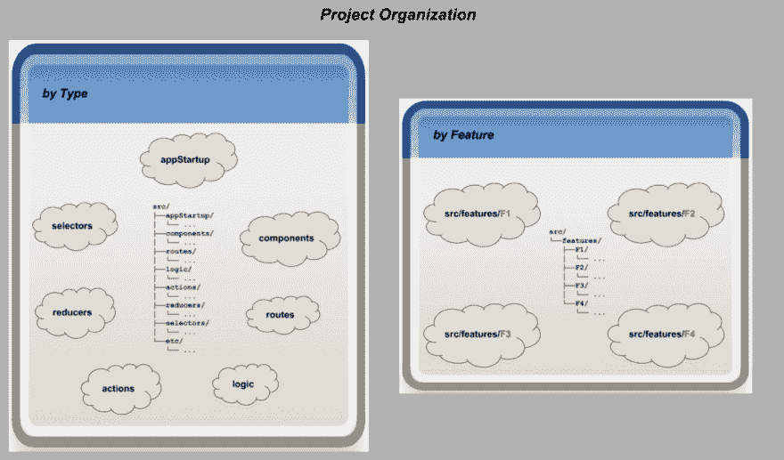
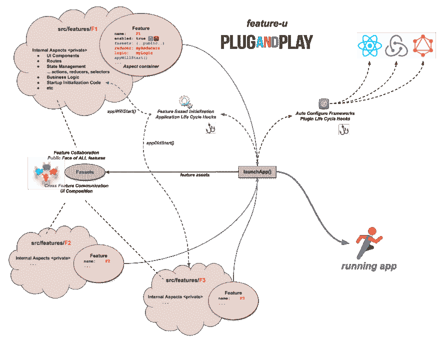

# 你在使用功能吗？

> 原文：<https://dev.to/kevinast/are-you-using-features-7nm>

你的 [React](https://reactjs.org/) 项目是按特性组织的吗？… **没有？**

你知道，特性是你的资源根据它们在你的应用中完成的功能(即特性)来组织的，而不是把所有类似类型的文件都归入一个由组件、路由、逻辑、动作、缩减器、选择器等组成的大块中。

**如果你正在使用功能**、*，那么考虑这个* …

*   你的特性被封装和隔离了吗？
*   你的特性以可扩展的方式协作吗？
*   您的组件是否使用跨特征组合？
*   您的功能会自己初始化吗？
*   你能在运行时禁用特性吗？
*   您的框架是否只自动配置活动特性？

简而言之，你的功能是即插即用的吗？…没有？

我知道，我知道，**你很忙**……这很好，因为团队很忙的项目*不会变得笨拙*……**哦，等等**……*我看错了*……**它们会变得笨拙！** *(我应该戴上眼镜的)*

**让我们开门见山:**

*   如果你没有使用功能- **你应该！**
*   如果你的特征不是基于 [**特征-u**](https://feature-u.js.org/) - **它们应该是！**

[**feature-u**](https://feature-u.js.org/) 是一个实用程序，可以在您的 [React](https://reactjs.org/) 项目中促进基于特性的开发。它为推广单个**即插即用**功能提供了切实的帮助。

使用 [**功能-u**](https://feature-u.js.org/) 有很多好处，但最基本的两个好处是:

1.  一种正式的方式，通过这种方式，功能可以相互协作，使它们真正实现即插即用。
2.  通过自动配置框架和启动初始化，显著减少了样板代码。

下图总结了 **feature-u** 的基本概念:

#### ***功能协同是通过:*** 完成的

*   引入一种正式的方式，通过这种方式，功能可以相互协作([跨功能通信](https://feature-u.js.org/cur/crossCommunication.html))，使它们真正成为**即插即用**。
*   这包括 [UI 组合](https://feature-u.js.org/cur/crossCommunication.html#ui-composition)跨越特性边界的能力。它甚至允许自动注入 UI 内容。*这是不得不看的……****很好的展现了效用*** *。*

#### ***大量减少样板代码是通过*** 完成的

*   框架的自动配置(使用[可插拔扩展](https://feature-u.js.org/cur/extending.html))，以及
*   允许特性自己初始化(通过[应用生命周期钩子](https://feature-u.js.org/cur/appLifeCycle.html))。

#### 功能可以禁用

*   通过[功能启用](https://feature-u.js.org/cur/enablement.html)运行时开关。

*这个基础形成了为什么* ***特性——u****被开发出来的基础，并体现为一个* [*号的好处*](https://feature-u.js.org/cur/why.html) *。*

[**特性-u**](https://feature-u.js.org/) 是你不知道自己需要，但随后又离不开的效用！它为基于特性的开发的激动人心的世界打开了新的大门，让您可以将注意力集中在特性的“业务方面”!

了解更多关于**功能-u** 的信息:

*   [文档](https://feature-u.js.org/) -综合**功能-u** 文档
*   [演示](https://feature-u.js.org/cur/presentation.html) -一个**特色-u** 演示视频让你入门**(必看)**
*   [基本概念](https://feature-u.js.org/cur/concepts.html) -全面介绍**功能-u** 概念和术语**(必读)**
*   [eatery-nod-w](https://github.com/KevinAst/eatery-nod-w) -一个使用**功能的示例 web 应用程序-u**
*   [回购](https://github.com/KevinAst/feature-u) - **特征-u** 来源