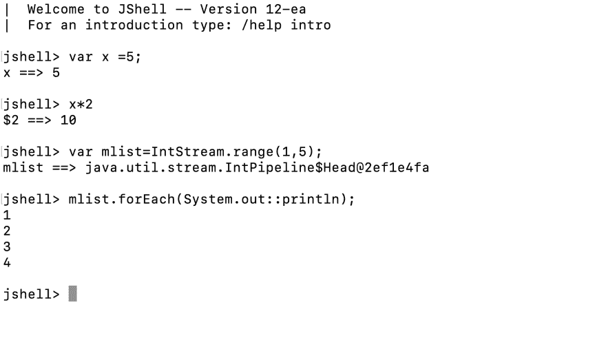

# 2019 年及以后的 Java

> 原文：<https://dev.to/lemuelogbunude/java-in-2019-and-beyond-1hah>

听到 **Java** 这个词你会想到什么？

对于一些人来说，他们记得在计算机科学课上教他们的一种非常冗长的编程语言，对于另一些人来说，他们可能因为它的流行而听说过它。

一些...就是讨厌 Java。

其中，Java 仍然是当今最热门的语言之一，为什么会这样呢？

### 你知道的爪哇

许多人在编程的早期学习了 Java，有些人后来爱上了它，而有些人后来讨厌它。

不幸的是，人们用他们多年前学过的 Java 来评判现代 Java。

引用 Venkat Subramanian 的话，他说*“与过去的 20 年相比，Java 开发在过去的 5 年里是最好的，我敢打赌，在未来的 3 到 4 年里，Java 领域的发展将是我们所见过的最大的”*

我会试着向你展示 Java 改进的一些地方，尽管 Java 的改进比我在这里展示的要多得多。

让我们用一些例子，在这个例子中，我将使用你可能知道的旧 Java，然后我将向你展示如何使用现代 Java 来解决这个问题。

假设你的讲师告诉你创建一个程序，创建一个从 1 到 10 的整数列表，然后通过循环打印出偶数，使用旧的 Java，你的代码可能看起来像这样:

```
 ArrayList<Integer> myList = new ArrayList<Integer>();

        for (int i = 1; i <= 10; i++) {
            myList.add(i);
        }

        for (int num : myList) {
            if (num % 2 == 0)
                System.out.println(num);
        } 
```

如果您使用过其他语言，那么上面的代码可能会让您想要一个更简单、不太复杂的解决方案。

使用现代 Java，我可以通过使用下面的风格来编写上面的代码，使它看起来更容易

```
 rangeClosed(1, 10).boxed().collect(Collectors.toList())
                .stream()
                .filter(integer -> integer % 2 == 0)
                .forEach(System.out::println); 
```

我觉得那样更好看。

众所周知，Java 是这样一种语言，在你完成一件小事之前，你必须陈述每一个细节，所以使用你所知道的的 *Java，创建一个散列表会是这样的:* 

```
HashMap<Integer, String> myMap = new HashMap<Integer, String>(); 
```

嗯，我希望你说得更简洁些。

幸运的是，Java 目前并不需要所有的样板代码:

```
var myMap = new HashMap<Integer, String>(); 
```

我在这里不是要说服你 Java 是最简洁的语言，但是我在这里是要告诉你，Java 可能比你上次见到它的时候要简洁得多。

### 现代 Java

我会列出 Java 的一些改进，请注意，这不是一个详尽的列表，还有很多改进我不会在这里提到。

如果我尝试提及所有的改进，我将有足够的内容来出版一本关于它的书。

#### JShell

Java Shell 工具(JShell)是一个用于学习 Java 编程语言和构建 Java 代码原型的交互式工具。

JShell 是一个读取-评估-打印循环(REPL ),它评估输入的声明、语句和表达式，并立即显示结果。该工具从命令行运行。

[](https://res.cloudinary.com/practicaldev/image/fetch/s--kXRj6E7d--/c_limit%2Cf_auto%2Cfl_progressive%2Cq_auto%2Cw_880/https://thepracticaldev.s3.amazonaws.com/i/1o0kw22bkz3y818ntb15.png)

您可以在 JShell 会话中测试单个语句，尝试方法的不同变体，并尝试不熟悉的 API。

它是在 JDK 9 中添加的，这是一个非常有用的工具，也许有一天会成为救命稻草。

#### 切换表情

Switch 表达式预计将出现在 JDK 12+中，它们简化了我们所知道的传统 switch 语句，例如，代码:

```
switch (day) {
    case MONDAY:
    case FRIDAY:
    case SUNDAY:
        System.out.println(6);
        break;
    case TUESDAY:
        System.out.println(7);
        break;
    case THURSDAY:
    case SATURDAY:
        System.out.println(8);
        break;
    case WEDNESDAY:
        System.out.println(9);
        break;
} 
```

会被写成:

```
switch (day) {
    case MONDAY, FRIDAY, SUNDAY -> System.out.println(6);
    case TUESDAY                -> System.out.println(7);
    case THURSDAY, SATURDAY     -> System.out.println(8);
    case WEDNESDAY              -> System.out.println(9);
} 
```

#### CompletableFuture(Java 的承诺)

CompletableFuture 允许创建和执行异步任务链。

CompletableFuture 的工作方式与 JavaScript 中的承诺工作方式相同。

```
 public static void main(String[] args) throws InterruptedException {

        CompletableFuture.supplyAsync(() -> longProcess()).thenAccept(System.out::println);
        Thread.sleep(4000);
        System.out.println("Done!");
    }

    private static int longProcess() {
        try {
            Thread.sleep(2000);
        } catch (InterruptedException e) {
            e.printStackTrace();
        }
        return 1;
    } 
```

CompletableFuture 是在 JDK 8 中引入的，尽管人们关注的是闪亮的新 Java 流，而没有注意到这个奇妙的工具。

如果你感兴趣，你可以去看看，了解一下:

[https://www.youtube.com/embed/9ueIL0SwEWI](https://www.youtube.com/embed/9ueIL0SwEWI)

#### 项目织机

尚未完全实现的 Project Loom 将引入纤程，作为由 Java 虚拟机管理的轻量级、高效的线程，让开发人员使用相同的简单抽象，但性能更好，占用空间更少。

就内存占用而言，纤程比内核线程要轻量得多，并且它们之间的任务切换开销接近于零。

在一个 JVM 实例中可以产生数百万个纤程，程序员不必犹豫发出同步的阻塞调用，因为阻塞实际上是免费的。

[https://www.youtube.com/embed/vbGbXUjlRyQ](https://www.youtube.com/embed/vbGbXUjlRyQ)

#### 记录(数据类为 Java)

记录也是一个有待实现的特性，它将有助于更容易地创建 POJO 类。例如一个类如:

```
class Point {
    double x;
    double y;

    Point(double x, double y) {
        this.x = x;
        this.y = y;
    }

    public void setX(double x) {
        this.x = x;
    }

    public double getX() {
        return x;
    }

    public void setY(double y) {
        this.y = y;
    }

    public double getY() {
        return y;
    }

    @Override
    public int hashCode() {
        return super.hashCode();
    }

    @Override
    public boolean equals(Object obj) {
        return super.equals(obj);
    }

    @Override
    public String toString() {
        return super.toString();
    }
} 
```

将改写为:

```
record Point(double x, double y); 
```

还有一些其他非常有趣的 Java 特性，我会留给你的好奇心去发现。

### 发布周期

最近，Java 宣布将使用 6 个月的发布周期，所以我们预计每 6 个月发布一次。好消息是，您可以更快地获得新功能。

### Android 上的 Java

谷歌宣布 Kotlin 为官方语言，从那以后，它已经看到了巨大的增长。

我确实喜欢 Kotlin，我使用 Kotlin，但是我认为 Kotlin 不是用来取代 Java 的。

现在，你可能已经听到一些 Android 开发者抱怨 Java。我通常喜欢他们具体一点。

他们真正抱怨的是 Java 7 的冗长，而在撰写本文时最新发布的是 Java 12 的 T2 T3。

Kotlin 在 Android 上看起来很酷，部分原因是 Android 开发人员无法访问最新的 Java 功能，只能使用 *Java 7 ~ Java 8* 。

然而，大多数 Android 应用程序目前仍然是用 Java 编写的。可能很多专业开发人员使用 Java 7 都没问题:)

我们都不应该错误地将*科特林*比作*爪哇*，就像将*斯威夫特*比作*目标 C* 一样。

不幸的是，许多 Android 开发者并没有意识到 Java 作为一门语言已经走了多远，因为他们仍然使用 CS 类的 Java。

顺便说一下，我是一名 Android 开发人员，我也认为 Kotlin 很酷；)

### Java 依然免费

Oracle 最近宣布，他们将对 Oracle JDK 的商业使用和长期支持收费。嗯，它上了头条，人们写了很多与事实不符的文章。

对任何人来说，Java 仍然是免费的。

大多数使用甲骨文 JDK 进行开发的大公司不会对这一变化感到如此困扰。

对于担心的人来说，没必要！

在 JDK 11 中，OpenJDK 的功能与甲骨文的 JDK 相当。因此，它们是可以互换的。

此外，亚马逊最近宣布了亚马逊 Corretto T1，这是一个免费的、多平台的、生产就绪的开放 Java 开发包(OpenJDK)发行版。

Corretto 提供长期支持，包括性能增强和安全修复。

您也可以使用其他 OpenJDK 提供者，比如 AdoptOpenJDK，实际上没有什么好担心的。

Java 还是免费的。

### Java 作为一种语言的当前排名

目前，Java 是 TIOBE index 编程语言排名的第一位语言。也是在 GitHub 的*状态下的**# 2***。

### 这不是推销

这篇文章不是辞职去学习 Java 的文章。相反，我在这里告诉你 Java 已经走了多远，作为一门语言它将走向何方。

Java 不断适应的能力帮助它在很长一段时间内保持了顶级语言的地位。