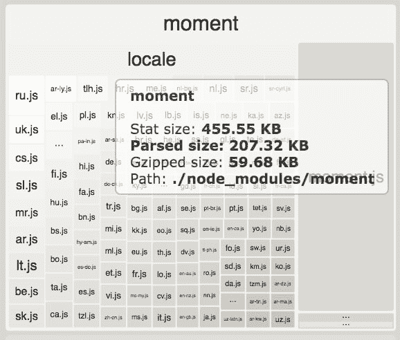
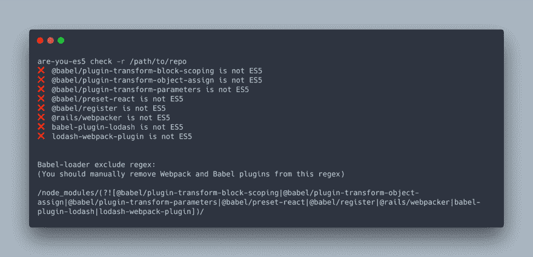
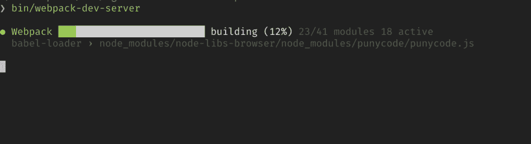

# 与 Webpack 和 Babel 斗争一年的经验教训

> 原文：<https://dev.to/obahareth/lessons-learned-from-a-year-of-fighting-with-webpack-andbabel-1knc>

我使用 React 已经一年多了，很多时候都出了问题，降低了我们的构建速度，并且在我移植的浏览器中无法工作。我决定分享我学到的经验，希望它们能帮助别人。

## 导入大型库时要非常小心

尝试编译大型库(如 react-plotly 或 PDF 库)可能需要几秒到 10 分钟以上的时间来编译 Webpack。如果一个包降低了你的编译速度，考虑使用 CDN 版本。我们简单地使用了脚本标签，但是也有 Webpack 插件可以帮助我们:

*   网页包 cdn 插件。
*   [动态-cdn-web pack-插件](https://www.npmjs.com/package/dynamic-cdn-webpack-plugin)。

## 尝试为你的依赖项找到一个 webpack 插件

仅仅导入像 moment.js 或 lodash 这样的包就会带来很多你可能不需要的膨胀。尝试只导入你需要的东西，或者更好的是找到一个 webpack 插件，从你的包中移除不用的东西，因为[选择性导入并不总是有效](https://github.com/react-bootstrap/react-bootstrap/issues/2683)。举个例子，有一个叫[的 webpack 插件](https://github.com/iamakulov/moment-locales-webpack-plugin)，它消除了 Moment.js 增加的许多不必要的臃肿

谷歌实际上有一个很好的知识库，列出了一些常见的有问题的依赖关系。

## 使用 Webpack bundle analyzer 检查您的捆绑包

[](https://res.cloudinary.com/practicaldev/image/fetch/s--gGdoLm3G--/c_limit%2Cf_auto%2Cfl_progressive%2Cq_auto%2Cw_880/https://thepracticaldev.s3.amazonaws.com/i/uw90hpp9pwc1xq132nl0.png)

[Webpack Bundle Analyzer](https://github.com/webpack-contrib/webpack-bundle-analyzer) 非常有助于了解您的产品包中到底有什么。在上面的截图中，你会注意到 moment.js 有很多你的应用可能不需要的本地化文件。Webpack Bundle Analyzer 可以帮助您轻松发现这些问题。

## 尽早将 es-check 添加到您的 CI 渠道中

es-check 将帮助你发现你的包使用的是哪个 es 版本，这对于发现你是否突然不再生产 ES5 非常有用。即使您使用的是 Babel 和 browserslist，您也可能导入了一个甚至不打算在浏览器中使用的节点模块，或者甚至是一个没有作为 ES5 发布的包。在早期将 es-check 添加到您的持续集成管道中，它将帮助您发现您的包是否停止与 ES5 一起工作，这将帮助您找到哪个包是罪魁祸首，以便您可以传输它。

## 传输节点模块

我们导入了一个非常简单的包，名为 [hex-rgb](https://github.com/sindresorhus/hex-rgb) ，它甚至不是为浏览器设计的，这个小小的包使得我们的包不再兼容 ES5。这样的包裹应该通过巴别塔，然后被运输。

在您的 webpack 配置中，您的 babel loader 的 exclude 字段可能看起来像这样:`/node_modules/`。我们需要创建一个正则表达式，它将 node_modules 排除在外，除了那些应该被传输的特定模块:

```
// Exclude all node modules except hex-rgb and another-package
/node_modules\/(?![hex\-rgb|another\-package])/ 
```

再说一次，这对于大的软件包来说可能不是一个好的解决方案，因为它会大大降低你的构建时间，你可能会想换成 CDN 版本。

关注 babel-loader repo 的本期，了解如何处理此类案件的最新信息。

**更新***(2018 年 2 月 1 日)*
我发布了一个名为 [are-you-es5](https://github.com/obahareth/are-you-es5) 的包来帮助解决这个问题。它让你很容易阅读输出，甚至建立了你需要的正则表达式来传输那些特定的模块，看看吧！

[](https://res.cloudinary.com/practicaldev/image/fetch/s--9B4Rj-tv--/c_limit%2Cf_auto%2Cfl_progressive%2Cq_auto%2Cw_880/https://thepracticaldev.s3.amazonaws.com/i/2g93tl5ilquhwni8fmtw.png)

## 使用浏览器列表指定你的目标浏览器

[Browserslist](https://github.com/browserslist/browserslist) 让您指定为哪些浏览器传输文件。

```
> 1%
ie >= 8 
```

这个简单的配置面向全球使用率超过 1%的浏览器，以及 IE 版本 8 及以上。

## 使用 babel.config.js 结束。babelrc(适用于 Babel ≥ 7.0)

喜欢用`babel.config.js`配置巴别塔而不是`.babelrc`。如果你想传输 node_modules(这在 webapps 中已经很常见了)，那么你应该使用`babel.config.js`。
`.babelrc`可能会被另一个`.babelrc`覆盖，这个【】属于你正在传输的 node_module，这会导致各种奇怪的问题。

## 使您的 webpack-dev-server 日志输出更加友好

将您的 [webpack-dev-server 配置](https://webpack.js.org/configuration/dev-server/)更改为这个

```
devServer: {
  noInfo: true,
  stats: 'minimal'
} 
```

1.  添加 [WebpackBar](https://github.com/nuxt/webpackbar) 以获得更少冗余、更友好、更简洁的输出。

[](https://res.cloudinary.com/practicaldev/image/fetch/s--gdbWeyPq--/c_limit%2Cf_auto%2Cfl_progressive%2Cq_auto%2Cw_880/https://thepracticaldev.s3.amazonaws.com/i/4kjmpngvc7gtkbb6kfk0.png)

注意:第一个配置旨在与 Webpack Bundle Analyzer 结合使用，因为它抑制了 Webpack Bundle Analyzer 已经显示的与您的 Bundle 相关的内容的控制台输出。如果您没有使用 Webpack Bundle Analyzer，请不要应用第一步。

* * *

## 我希望看到什么

围绕这一过程，我们需要对我们的工具进行大量改进。大多数 webpack 和 Babel 配置都不包含`node_modules`文件夹(如果不包含，编译将会花费非常长的时间！)，但我个人觉得这是一个我们需要更智能工具的领域。如果只通过配置 Webpack、Babel 和 browserslist 就能让一切“正常工作”,而不需要挖掘依赖项和它们给我们自己的构建管道带来的独特问题，那就太方便了。package.json 文件可能是实现这一目标的良好起点。如果使用的话，有几样东西可以帮助工具确定一个包是否应该被转移:

*   [浏览器字段](https://docs.npmjs.com/files/package.json#browser)，如果你的包以浏览器为目标，这应该用来代替主字段。这意味着如果我们在 package.json 中指定目标浏览器，并且导入一个在 package.json 中没有 browser 字段的包，我们至少应该得到一个警告。
*   [引擎字段](https://docs.npmjs.com/files/package.json#engines)，这通常用于指定你的包所针对的节点版本，但是老实说，我认为它也应该用于指定 es 版本，因为现在很多 NPM 的用法都是针对浏览器的。如果一个包没有这些字段，并且我们指定我们的目标是浏览器和 ES5，那么我们应该:
    *   导入时收到警告。
    *   让 Webpack 插件检测这些包并取消排除它们，这样它们就会自动传输。

## 期末备注

Webpack 和 Babel 都很棒，这篇文章并不想说别的。如果没有它们，我们将无法使用许多东西，但一起使用它们的体验需要变得更好。在几个月的时间里，我遇到了许多这样的问题，理解它们/找到解决方案是非常困难的(错误消息并不能确切地告诉你哪里出错了，搜索它们并不总是能得到相关的结果)，我希望这篇文章能作为我当时希望找到的指南。