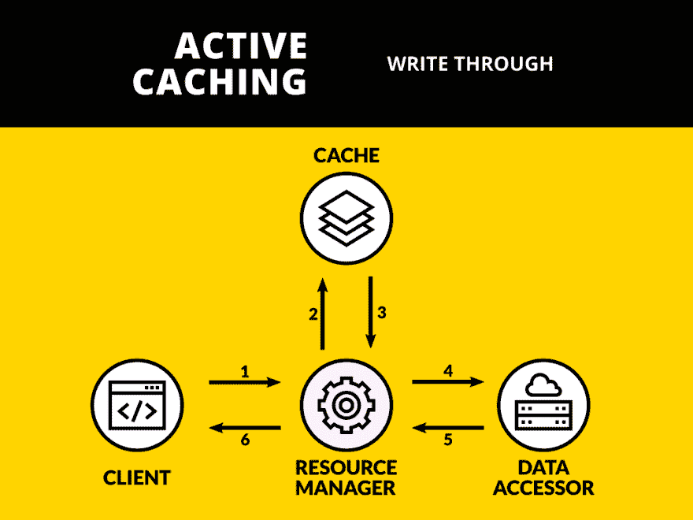
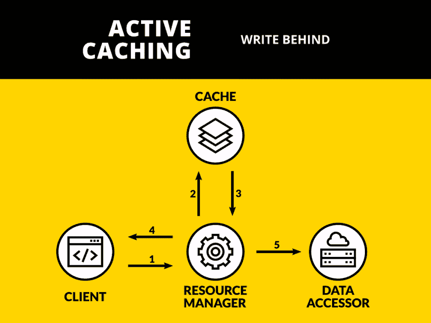
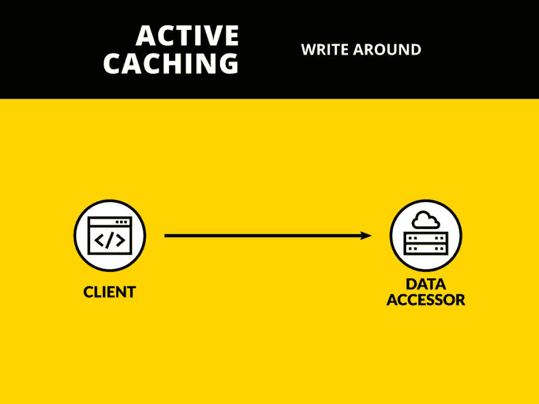

# 我是如何学会停止担忧并爱上缓存写作的

> 原文：<https://dev.to/shikaan/-design-patterns-in-web-development----active-caching-2-37jc>

#### 查看更新版本[此处](https://withbenefits.dev/what-is-cache-part-ii/)

# 简介

这第二集跟随我们在这里开始的[，将是关于缓存写入技术。](https://dev.to/shikaan/-design-patterns-in-web-development----active-caching-1-23e2)

> **请注意**
> 如果你正在寻找关于缓存和阅读技巧的介绍，你可以去[这里](https://dev.to/shikaan/-design-patterns-in-web-development----active-caching-1-23e2)

# 什么？！写作技巧？！

**[我还是食醉。给我代码](#code-examples)**

我完全明白你的惊讶。在阅读技巧中，我们已经提到了如何以及何时写入缓存层，那么为什么我们在这里有一套不同的策略呢？

我们称之为*阅读技巧*那些实际上与阅读行为有关的技巧。例如，**得到**一份交易清单。所以，即使我们已经进行了一些写作，我们实际上只是为了阅读行为的目的而进行写作。

因此，*写技术*基本上是在写操作期间用来填充或更新缓存的策略。你从中获得的最大好处是，当你之后要读取数据的时候。写操作的例子有:**创建**一个新事务，**编辑**用户信息等等。

正如在另一篇文章中提到的[，我们将谈论这些模式:](https://dev.to/shikaan/-design-patterns-in-web-development----active-caching-1-23e2)

*   直写
*   写在后面
*   四处写

和上次一样，这些是参与者:

*   **客户端**:谁需要数据；
*   **缓存**:你存储数据的地方；
*   **资源管理器**:向客户端交付资源；
*   **数据访问器**:从应用程序外部获取数据。

## 直写(又名直写)

对于通读(或内联缓存)，我们让资源管理器位于客户机和数据访问器之间。

此图说明了使用直写的写入操作的生命周期

[](https://res.cloudinary.com/practicaldev/image/fetch/s--0idM8-st--/c_limit%2Cf_auto%2Cfl_progressive%2Cq_auto%2Cw_880/https://thepracticaldev.s3.amazonaws.com/i/3s6w39l9kgew5qh2uc27.png)

这些是步骤:

*   客户端启动调用资源管理器的写操作；
*   资源管理器在缓存上写入；
*   资源管理器编写调用数据访问器；
*   响应被提供给客户端。

### 理

乍一看，这似乎不是最明智的举措:事实上，我们增加了一个额外的步骤，从而降低了请求的速度。那么，我们从这一战略中获得了什么？

正如我们多次说过的，缓存数据的最大问题之一是它们会过时。这个模式正好解决了这个问题。

在另一篇文章中，我们已经看到处理陈旧条目的一种方法是使用 **TTL** s，这仍然适用，但是在这种情况下，过期是解决问题的最佳方法，因为我们没有产生我们正在获取的数据。现在我们控制了想要读取的数据，那么每次写入数据时更新缓存将确保缓存的条目**永远不会**过时。

当然，没有阴影就没有光明，除了写入延迟 [<sup>1</sup>](#note1) 之外，当客户端不需要经常读取数据时，这种技术会变得有害。事实上，在这种情况下，您最终会浪费保持活动和同步缓存所需的资源，而没有获得读取优势。

## 写在后面(又名写回来)

这另一种技术仍然具有内嵌的资源管理器，但是通过数据访问器的写入是异步发生的。

[](https://res.cloudinary.com/practicaldev/image/fetch/s--oyMv2_7s--/c_limit%2Cf_auto%2Cfl_progressive%2Cq_auto%2Cw_880/https://thepracticaldev.s3.amazonaws.com/i/mvdo6l794dxudbo8sws1.png)

以下是行动生命周期中涉及的步骤:

*   客户端启动调用资源管理器的写操作；
*   资源管理器在缓存上写入；
*   向客户端提供响应；
*   最终，资源管理器编写调用数据访问器。

### 理

理解这种缓存技术为什么以及如何有用的最好方法是给出一个例子。

假设我们现在正在开发`TrulyAwesomeBankAPI`，我们想使用缓存实现`Payment`事务创建。支付需要尽可能快地发生，但是支持我们 API 的*真正令人敬畏的银行*仍然在旧的基础设施上，不能很好地处理高峰。

我们决定用后面写。这意味着每次我们执行`Payment`时，我们将事务保存在缓存中，并将响应返回给客户端。然后我们有另一个工作例程(在后台运行，在另一个进程中，基于 CRON 表达式或其他)...)负责将我们缓存的分类账版本与真正的属于*真正令人敬畏的银行*的分类账同步。通过这种方式，我们可以快速提供响应，而不管真正令人敬畏的银行在给定时间能够支持多少请求。

由于我们不需要等待外部数据源，因此我们的性能和稳定性都得到了提高。这使得整个体系结构对外部服务的容错能力更强，从而开启了新的弹性可能性:例如，我们可以实现简单的重试策略，甚至是断路器，而完全不会影响客户端...

但我们付出的代价是一致性:在工作人员完成同步过程之前，真实数据(如存储在真正令人敬畏的银行中的数据)和我们提供的数据(如存储在缓存中的数据)是不同的，如果我们开始考虑如何处理错误情况，事情会变得更加复杂。

## 写写转转

嗯，为了完整起见，我们应该提到写在周围，但对我来说，它看起来不像一个真正的模式。事实上，在下图中你找不到“缓存”这个词的任何痕迹。

[](https://res.cloudinary.com/practicaldev/image/fetch/s--iHfwvfk0--/c_limit%2Cf_auto%2Cfl_progressive%2Cq_auto%2Cw_880/https://thepracticaldev.s3.amazonaws.com/i/nis5pe9abormsp98zs76.png)

基本上，*Write about*是“直接调用数据访问器，只在读取时缓存数据”，对我来说意味着“应用任何读取策略，而不使用写入策略”。

### 理

您使用这种非模式的原因只是因为上面的写作技巧都不适合您:也许您需要超级一致的数据，或者也许您不需要经常读取数据。

在这些情况下，不应用写作技巧(或者使用*围绕*写作，如果你愿意的话)就可以了。

# 你*写了*一些代码吗？

> 你可以在这里找到这些例子的更详细版本
> 
> ## /[图案](https://github.com/shikaan/design-patterns)
> 
> ### 设计模式在实际代码中的使用示例
> 
> <article class="markdown-body entry-content container-lg" itemprop="text">
> 
> # 设计模式
> 
> 设计模式在实际代码中的使用示例
> 
> 这些是本系列文章的参考资料
> 
> </article>
> 
> [View on GitHub](https://github.com/shikaan/design-patterns)

是的，我做到了。这次是 Python。

我在这里提供的例子是使用定时器模拟一个缓慢编写的外部服务。特别是，我们将或多或少地模拟在`TrulyAmazingBankAPI`中发生的事情:我们创建一个想要保存的事务。

启动这个应用程序，几秒钟后你就能看到在*写完*和*写完*的情况下到底发生了什么。

让我们逐个检查输出。

**尽管写**

```
>>> Save transaction
[14:59:17.971960] CacheManager.set
[14:59:17.971977] TrulyAwesomeBankAPIClient.save_transaction
>>> Get transaction
[14:59:19.974781] CacheManager.get 
```

Enter fullscreen mode Exit fullscreen mode

在这里，我们做的第一件事是将条目保存在缓存中，然后我们将它保存在 AwesomeBank 中，当几秒钟后我们想要获取刚刚保存的事务时，我们使用缓存来检索它。

**写在**后面

```
>>> Save transaction
[14:59:24.976378] CacheManager.set
>>> Get transaction
[14:59:21.978355] CacheManager.get

--------------------------------------------
|    AWESOME BANK DATABASE (before sync)   |
--------------------------------------------
{}

[14:59:26.974325] TrulyAwesomeBankAPIClient.save_transaction

--------------------------------------------
|    AWESOME BANK DATABASE (after sync)    |
--------------------------------------------
{
   UUID('0f41f108-0859-11e9-a138-b46bfc6c5cb9'): {
      'id': UUID('0f41f108-0859-11e9-a138-b46bfc6c5cb9'), 
      'transaction': {
         'type': 'PAYMENT', 
         'amount': 100, 
         'currency': 'EUR'
      }
   }
} 
```

Enter fullscreen mode Exit fullscreen mode

如果我们将请求称为“设置事务”和“获取事务”，我们可以从输出中看到，在请求的整个生命周期中，唯一涉及的参与者是 CacheManager。

我们调用 TrulyAwesomeBankAPIClient 的唯一时刻是在请求结束后 5 秒钟，此时我们正在完成同步。

请注意，同步也是一个故意哑和缓慢的过程，因为计时器在这里。在现实世界中，同步过程可能(而且通常)比这要复杂得多，事实上，当数据一致性成为游戏规则改变者时，这应该是一个主要问题。

同步后，如您所见，数据库与缓存中的内容保持一致。从这一点开始，该条目是最新的，并且将一直是最新的，直到发生其他写入操作。

# 最后的话

这就结束了主动缓存部分。

首先，感谢您对上一篇文章的反馈！显然命名不是很清楚，所以我在这里更新了一点。我也借此机会重温了图表，这样它们就不会让你眼睛出血了。至少没有那么多。

请继续反馈❤

下次见！

* * *

[1](#note1ref) 。值得一提的是，用户通常比读取延迟更能容忍写入延迟。不幸的是，我不记得我是从哪里得到这些数据的，所以我无法展示这些数据的真实指标。对此不能全信。

[2](#note2ref) 。这些问题都与通常所说的“最终一致性”有关，这也是我在行动生命周期的最后一步使用“最终”这个词的原因。这个话题足够大，值得单独写一篇文章，但是你真的想了解正在发生的事情[看看这个](https://www.youtube.com/watch?v=6R1WhWkh6pg)。