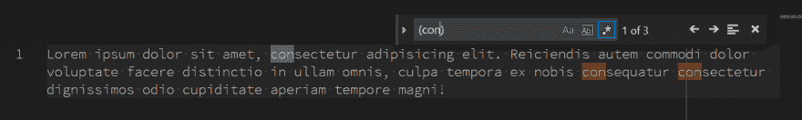

# 正则表达式工具

> 原文：<https://dev.to/pranay_rauthu/regex-tools-538o>

# 正则表达式工具

使用 regex 总是很痛苦。大多数时候，开发人员最终会从 stack-overflow 或其他网站复制粘贴正则表达式。尽管这满足了大多数常见的需求，但是了解正则表达式在做什么和测试它还是很有好处的。

我发现以下工具在处理正则表达式时非常有用。

*   任何文本编辑器或 IDE

大多数现代 ide 和文本编辑器都有很好的正则表达式支持来搜索文本。

*   [Regulex](https://jex.im/regulex/#!flags=&re=%5E(a%7Cb)*%3F%24)

这是我最喜欢的开发工具之一。Regulex 有助于可视化正则表达式

*   [regex101](https://regex101.com/)

如果你想写，测试和玩 regex，这是一个很好的网站。它还有很好的正则表达式文档。