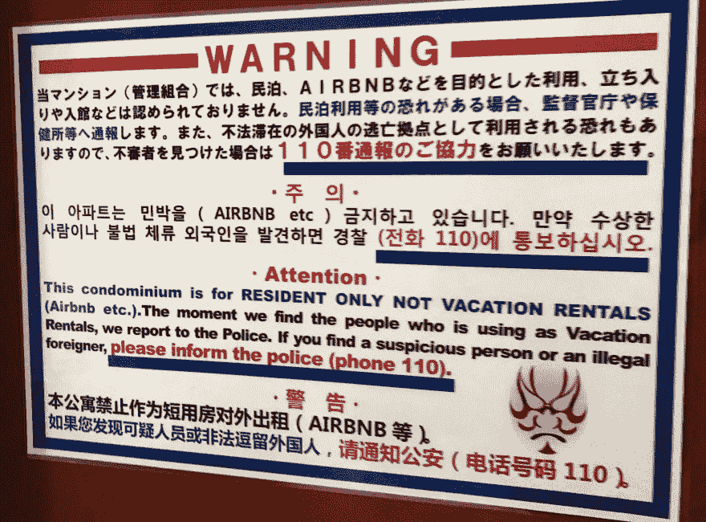

# 游牧发展-实用指南

> 原文：<https://dev.to/anthify/nomadic-development---a-practical-guide-112c>

自从决定离开我在英格兰的家，成为一名数字流浪者，一年已经过去了。在社交媒体时代，我们倾向于分享自己的理想版本，你可能会对数字游牧生活的现实感到疑惑。无休止的旅行，加上各种各样的美食、文化、自然，以及所有赚钱的事情，看起来就像天堂一样。尤其是基于 instagram 上的 200 万张#digitalnomad 照片的田园诗般的描绘，一台笔记本电脑在海滩上，在一家时尚的咖啡馆里，或者在吊床上运行时放射出腹股沟`yarn install`。我对自己分享这种类型的照片感到内疚，尽管带有一点愤世嫉俗。但我确实喜欢在社交媒体上分享一种独特的体验，与我在办公室工作的那些年和之前在家远程工作的两年相比。然而，随着远程工作的兴起，它很快成为许多人的新常态，远程工作可以让人们在工作的同时自由旅行。

我的意图是，这篇文章对于那些对成为数字流浪者感兴趣的人，或者那些对这种生活方式普遍好奇的人来说是有益的。

#### 🌍去哪里？

这将因个人喜好而异，但在购买机票之前，有一些基本的事情值得考虑，例如:

*   互联网有多快？
*   犯罪多吗？
*   我需要学习这门语言吗？
*   当地文化对外国人、你的宗教信仰、性别和性取向是否宽容？
*   空气污染严重吗？
*   贵吗？

我最喜欢的起点是[流浪者名单](https://nomadlist.com/)。这是一个由数据驱动的地方列表，根据数据点进行排名，例如:网速、生活成本和工作地点等。

值得注意的是，对于数字游牧民来说，签证是一个法律上的灰色地带，尽管这种情况在一些国家会有所改变。如果你要去一些国家短期停留 30 天，或者在一些国家停留 90 天，那么你必须获得一个标准的旅游签证。但是，请针对您要去的国家进行调查，因为随着数字游牧民的增加，许多国家可能会出台新的规定。

#### 🏠住处

所以你选择了一个城市，但是你应该住在哪里呢？预算显然是一个很大的因素。你可以在旅馆和 Airbnb 上找到一些不错的交易，但是一定要检查 Airbnb 在你所居住的国家/城市的合法性。随着这种生活方式的增加，出现了越来越多的数字游牧联合工作和共同生活服务。我自己没有用过，但快速搜索“数字游牧屋共享”将是一个很好的起点。

T0】

#### 💻在哪里工作？

你到达了你选择的城市，但是在哪里工作呢？老生常谈是在咖啡店工作，但这会导致因使用所有公司的带宽而产生的过度咖啡因带来的内疚感！因此，共同工作空间是一个很好的选择。一些城市有免费的共同工作空间，而一些地方按小时、天、周或月收费(价格可能相差很大)。我总是从寻找免费的选项开始，然后继续寻找最好的和最实惠的选项。到目前为止，我得到的最划算的办公室租金是 40 美元一个月，而且是在日本大阪，那里的生活成本非常高。最贵的是科罗拉多州的丹佛，每天 20 美元。

我最喜欢的寻找合作空间的资源是[同事](https://www.coworker.com/)。当然，在寻找共同工作空间时，不要忘记优秀的老搜索引擎。

#### 👨🏼‍💻自律

这几乎适用于任何工作场景，但在这种情况下尤其重要。工作和旅行并不总是令人愉快的，把自己放在一个新的有趣的地方可以说是生产力的对立面。飞到一个激动人心的新国家后，您最不想做的事情就是打开笔记本电脑查看一个拉取请求。下面是我在面对大规模注意力分散时保持工作效率的一些方法。

##### 监控工作花费的时间

这可以通过多种方式实现，但我选择的是应用程序 [Rescue Time](https://www.rescuetime.com/) ，它记录了花在应用程序和网站上的时间。

##### 时间拳击和清单

发展有时会涉及非常令人兴奋的事情，会使我们精神疲惫，从而导致我们分心。对人类的实验表明，如果我们刚刚完成了一项困难的认知任务(即命名一个变量)，当面对丰富的巧克力蛋糕和健康的水果沙拉时，我们更有可能选择巧克力蛋糕[1]。对我来说，巧克力蛋糕无疑是社交媒体多巴胺的洪流。我倾向于减轻这种无用的放纵的方法是:

*   把一项任务分成小步骤。
*   设置一个 30 分钟左右的计时器，这样可以让你不分心。
*   至少休息 5 分钟，然后站起来，伸个懒腰，看看推特，泡个茶。

当我在一天中重复这样做的时候，我发现我更有效率了。

#### 🗣通信

如果你要为一家公司和/或一个团队工作，那么良好的沟通对保持信任和有效合作至关重要。在 6 个月的时间里，我已经从提前工作 9 小时，变成比大多数同事晚工作 8 小时。这不是没有挑战，但这些可以通过确保你做好准备和沟通来最小化。在某些情况下，这甚至会带来优势。例如，在同事之前工作意味着他们会醒来，而我所有的工作都完成了——这就像是很早就醒了(但实际上我在 11 点就醒了，吃了寿司，还在涉谷散步)。

对我来说，在我旅行的国家获得一个好的数据 sim 卡是一条很好的生命线。这在没有互联网或者你在移动中需要休息或安装补丁的时候非常方便。

#### 🏃‍♂️健康

软件开发这种久坐不动的工作意味着你必须腾出时间来锻炼。健康饮食也不是开发者文化的核心方面(我指的是你的披萨、啤酒和红牛聚会/黑客马拉松)。旅行时工作意味着你的座位经常不够用，让你弯腰驼背地看着笔记本电脑，随着时间的推移，这会严重损害你的姿势。NextStand 是一个很好的购买，它将笔记本电脑提升到一个更适合姿势的高度。

购买智能手表也改变了我的游戏规则。如果我久坐不动，并且有以下日常目标，我会收到通知:站立、步行和有氧运动。这真的有助于形成健康和持久的习惯。

重要的是，不要忘了购买健康保险和普通旅行保险。

#### 🤑金钱

不管你在哪里，传统银行往往很烂。除了导致全球经济衰退之外，传统银行在客户服务、价值和安全性方面往往表现不佳。我个人推荐的替代方案是 Revolut，理由如下:

*   一个账户中的多种货币(包括加密)。
*   即时自由兑换不同的货币。
*   即时转移到其他 Revolut 帐户，并快速转移到传统帐户。我记得最慢的一次是从一个美元账户转账到一个传统的美国银行账户需要一天时间。
*   24 小时应用内聊天支持。
*   多张卡(包括一个金属卡，如果你想它:D)。
*   虚拟卡！对安全来说太棒了。你可以为网上购物创建一个虚拟卡，也可以随意销毁或创建新卡。
*   旅游保险、电话保险和礼宾服务等额外服务。
*   账户交易的即时通知。旅行时，这是一种很好的内心平静，而且你已经在自动取款机上使用了你的卡，这散发出一种消极的气氛。

Revolut 没有为我的推荐付钱，但他们确实为我提升了银行业务，值得一看。

#### 🧳要带什么

理论上你可以带很多东西，但是我把我的东西减少到大约 9 天的衣服。这可能不适合每个人，但我发现把我所有的东西放进一个随身携带的背包里是令人满意的。甚至有一个关于这一点的运动被称为“极简主义”——虽然我不是这种生活方式的支持者，但我只是出于需要而行动(如果我在一个地方定居，我肯定会买一个大显示器、电视和 PS4)。

我的旅行必备物品:

*   [随身包](http://amzn.eu/d/4Gs03Ql)
*   [袋子隔间](http://amzn.eu/d/ekxm5We)
*   [可折叠笔记本电脑支架](http://amzn.eu/d/je7NufK)
*   笔记本电脑
*   药片
*   [平板电脑支架](http://amzn.eu/d/7ydDRcQ)
*   键盘和鼠标
*   [电动旅行牙刷](http://amzn.eu/d/1HIC20I)

#### 🕵️‍♀️哪里能找到远程工作

首先，你可以随时询问你现在的雇主是否有远程工作的选择。但是如果他们当面嘲笑你，你可以查看一下 RemoteOk。快速搜索“远程工作”也应该会得到相当多的结果。我建议仔细阅读职位描述，因为一些雇主会对工作地点有所限制。例如，我看到许多“仅限美国”的远程工作。

#### 👫社会生活

我必须在这里澄清，我的旅程中有很大一部分我还没有提到，那就是我的女朋友([一位杰出的营养学作家](https://dieteticallyspeaking.com/))。过去一年我们一直在一起旅行和工作，所以幸运的是孤独不是问题。但是，如果你独自开始游牧生活，不要害怕，因为旅游和数字游牧社区都倾向于充满活力和热情。

如果你想认识一些人，Meetup 是一个很好的地方。城市里会有很多专门用于一般社交的聚会，或者以某个行业或某项技术为中心的聚会。

#### 结论

成为一名数字游牧者并不适合所有人，它也远非完美，需要考虑许多不同的事情。因此，如果你的情况不允许这样做，那么不要让理想化的社交媒体帖子给你任何 FOMO(享受你可以拥有超过 7 双袜子的事实，并且不太可能食物中毒)。

然而，这是一种探索世界的奇妙方式，我发现这是激发创造力的好方法。这也是令人兴奋的乘坐一个新兴趋势的浪潮，这是由互联网和全球旅行的可负担性增加。

##### 参考文献

1.  [https://www . gsb . Stanford . edu/faculty-research/publications/heart-mind-conflict-interplay-affect-cognition-consumer-decision](https://www.gsb.stanford.edu/faculty-research/publications/heart-mind-conflict-interplay-affect-cognition-consumer-decision)